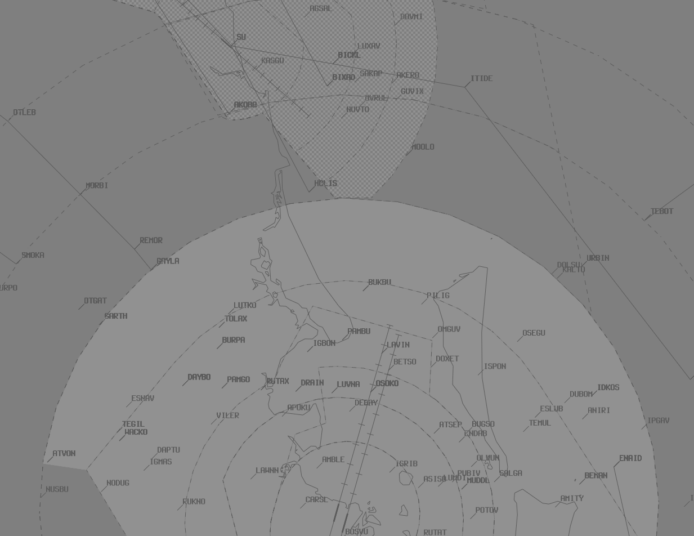

--8<-- "includes/abbreviations.md"

## Positions

| Name               | ID      | Callsign       | Frequency        | Login Identifier              |
| ------------------ | --------------| -------------- | ---------------- | --------------------------------------|
| **Brisbane Approach North**    |**BAN**| **Brisbane Approach**   | **124.400**         | **BN_APP**                                   |
| Brisbane Approach South†   |BAS| Brisbane Approach   | 125.600          | BN-S_APP                                 |
| Brisbane Departures North†    |BDN| Brisbane Departures  | 133.450         | BN_DEP          |
| Brisbane Departures South†   |BDS| Brisbane Departures | 118.450          | BN-S_DEP         |
| Brisbane Finals† |BMN| Brisbane Finals   | 119.250          | BN-F_APP                               |
| Gold Coast Approach† |BAC| Brisbane Approach  | 123.500          | BN-C_APP       |
| Brisbane Flow†        |BFL|                |          | BN-FLW_CTR                               |

† *Non-standard positions* may only be used in accordance with [VATPAC Ratings and Controller Positions Policy](https://vatpac.org/publications/policies)

## Airspace
The Brisbane TMA covers `SFC` to `F180`.

AF CTR reverts to Class G when **AF ADC** is offline, and is administered by the relevant BN TCU controller.  
  
### Airspace Structural Arrangements

Pursuant to Section 3 of the [VATPAC Ratings and Controller Positions Policy](https://cdn.vatpac.org/documents/policy/Controller+Positions+and+Ratings+Policy+v5.2.pdf), **“North”**/**”West”** positions shall assume the airspace of corresponding **“South”**/**”East”** positions when the latter are inactive (e.g. **BAN** assumes **BAS** airspace), and vice versa.

## Parallel Runway Operations - Runway Selection
Aircraft shall be assigned the following runways for arrival when PROPS are in progress:

| Aircraft tracking | Runway  |
| ----------------| --------- |
| via BLAKA   | 01R/19L     |
| via ENLIP | 01L/19R |
| via GOMOL | 01R/19L |
| via MORBI | 01L/19R |
| via SMOKA | 01L/19R |
| via TEBOT | 01R/19L |
| via UGTUG | 01R/19L |
| via WOODY | 01L/19R |
| Other aircraft: |
| From the NORTH and WEST | 01L/19R |
| From the SOUTH and EAST | 01R/19L |

## AF ADC Offline
Due to the low level of CTA (`A015`) in the AF CTR when **AF ADC** is offline, it is best practice to give airways clearance to aircraft at the holding point, to ensure departing aircraft can have uninterrupted climb.

!!! example
    **ABC**: "Brisbane Approach, ABC, PC12, POB 8, IFR, Taxiing YBAF for YBSU, Runway 28R"   
    **BN TCU**: "ABC, Brisbane Approach, Squawk 3601, No Reported IFR Traffic, Call me Ready at the Holding Point for Airways Clearance"  
    **ABC**: "Squawk 3601, Wilco, ABC"  

    **ABC**: "ABC, Ready Runway 28R, Request clearance"  
    **BN TCU**: "ABC, Cleared to YBSU via BN, Flight Planned Route. Make Visual right turn DCT BN, Climb to A030"  
    **ABC**: "Cleared to YBSU via BN, Flight Planned Route. Make Visual right turn DCT BN, Climb to A030, ABC" 
    `AIP GEN 3.4`  
## Airspace Division

The divisions of the airspace between **BAN**, **BAS**, **BDS**, **BDN**, **BAC** and **BMN** change based on the Runway Mode.

!!! note
    The following diagrams do not include non BN TCU areas of responsibility such as AF CTR or CG ADC

### 01 PROPS
<figure markdown>
{ width="700" }
  <figcaption>01 PROPS TCU Structure</figcaption>
</figure>

### 19 PROPS
<figure markdown>
{ width="700" }
  <figcaption>19 PROPS TCU Structure</figcaption>
</figure>

### SODPROPS
<figure markdown>
{ width="700" }
  <figcaption>SODPROPS TCU Structure</figcaption>
</figure>

## Coordination
### BN TCU / ENR
#### Departures
The Standard Assignable level for YBBN departures from BN TCU to **INL(All)** is the lower of `F180` or the `RFL`.  
The Standard Assignable level for YBCG departures from BN TCU to **GOL/SDY** is the lower of `F120` or the `RFL`, and tracking via APAGI.  
The Standard Assignable level for YBCG departures from BN TCU to **NSA/BUR/DOS** is the lower of `F180` or the `RFL`.  
The Standard Assignable level for YBSU arrivals from BN TCU to **NSA** is `F130`, and tracking via ITIDE.  

Any aircraft not meeting the above criteria must be prior coordinated to ENR.

!!! example
    **BN TCU** -> **INL**: "via GOMOL, BNZ123, with your concurrence, will be assigned F150, for my separation with ZYX"  
    **INL** -> **BN TCU**: "BNZ123, concur F150"  

#### Arrivals
The Standard assignable level from INL(All) to BN TCU is:  
`A090` for YBBN arrivals, and assigned a STAR  
`F130` for YBCG arrivals via BERNI, and assigned a STAR  

All other aircraft must be voice coordinated to BN TCU.

### BN TCU / BN ADC
#### Auto Release

Auto Release shall be used for aircraft that are:    
a) Departing from a runway nominated on the ATIS; and  
b) Issued a Procedural SID; and   
c) Assigned the standard assignable level.  

Any aircraft that don't meet these criteria must be coordinated to BN TCU with a "Next" Call.  

"Next" Coordination is a procedure where the BN ADC controller gives a heads-up to the BN TCU controller about an impending departure. The BN TCU controller will respond by assigning a heading to the aircraft, for the BN ADC controller to pass on with their takeoff clearance.

!!! example
    **BN ADC** -> **BN TCU**: "Next, ABC"  
    **BN TCU** -> **BN ADC**: "ABC, Heading 030"  
    **BN ADC** -> **BN TCU**: "Heading 030, ABC"  

    **BN ADC**: "ABC, Assigned heading right 030, Runway 34R, Cleared for Takeoff"  
    **ABC**: "Right heading 030, Runway 34R, Cleared for Takeoff, ABC"  
    `AIP GEN 3.4`

### BN TCU / AF ADC
#### Departures

Aircraft departing YBAF in to BN TCU Class C will be coordinated from **AF ADC** at Taxi. Aircraft will need to be passed airways clearances to **AF ADC** at this point, to be relayed to the aircraft.

The Standard assignable levels for YBAF departures is the lower of `A040` or the `RFL`.

!!! example
    **AF ADC** -> **BN TCU**: "Taxi, DEF, VFR for YCDR via TVT"  
    **BN TCU** -> **AF ADC**: "DEF, AF, TVT, Flight Planned Route, A040, Squawk 3601"  
    **AF ADC** -> **BN TCU**: "AF, TVT, Flight Planned Route, A040, Squawk 3601, DEF"  

    **AF ADC** Will then pass the airways clearance to DEF  
    `AIP GEN 3.4`

#### Arrivals

YBAF arrivals shall be coordinated to **AF ADC** from the relevant BN TCU controller prior to transfer of jurisdiction.

!!! example
    **BN TCU** -> **AF ADC**: "BDF, via HUUGO, Number 1"  
    **AF ADC** -> **BN TCU**: "BDF, Number 1"  

### BN TCU / AMB TCU

#### Departures
Departures from YAMB in to BN TCU Class C will be coordinated at taxi, and will be requesting a level.

!!! example
    **AMB TCU** -> **BN TCU**: "Taxi, FALC22 for YSRI via GOMOL, Requesting F340"  
    **BN TCU** -> **AMB TCU**: "FALC22, F180"  
    **AMB TCU** -> **BN TCU**: "F180, FALC22"  

#### Arrivals/Overfliers
All aircraft transiting from BN TCU to **AMB TCU** must be heads-up coordinated prior to **20nm** from the boundary. Operations within **AMB TCU** are fairly ad-hoc, so there are no standard assignable levels, simply whatever the BN TCU and **AMB TCU** controller agree on.

!!! example
    **BN TCU** -> **AMB TCU**: "via WACKO, STAL13, what level can I assign?"  
    **AMB TCU** -> **BN TCU**: "STAL13, A050"  
    **BN TCU** -> **AMB TCU**: "A050, STAL13"  

### BN TCU / SU ADC

As you may have noticed, BN TCU Class G shares a tiny border with **SU ADC**, however there are no SIDs, STARs, or airways through this gap. The only possible way for an aircraft to directly enter SU ADC airspace from BN TCU's jurisdiction, is from Class G, and as such, no coordination is required to **SU ADC**. However, ensure the aircraft is transferred to the ADC at least **10nm** prior to the boundary, to facilitate their airways clearance.

<figure markdown>
{ width="700" }
  <figcaption>BN TCU / SU ADC Border</figcaption>
</figure>

**SU ADC** coordination for arrivals and departures via the SID/STAR is handled by **INL** (or **NSA** when they are online).
