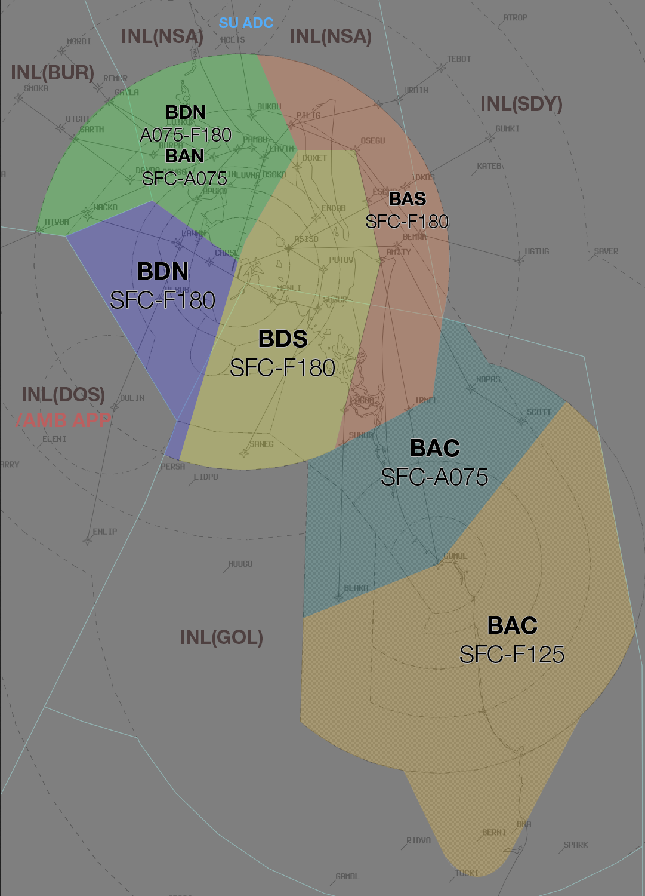

--8<-- "includes/abbreviations.md"

## Positions

| Name               | ID      | Callsign       | Frequency        | Login ID              |
| ------------------ | --------------| -------------- | ---------------- | --------------------------------------|
| **Brisbane Approach North**    |**BAN**| **Brisbane Approach**   | **124.700**         | **BN_APP**                                   |
| Brisbane Approach South†   |BAS| Brisbane Approach   | 125.600          | BN-S_APP                                 |
| Brisbane Departures North†    |BDN| Brisbane Departures  | 133.450         | BN_DEP          |
| Brisbane Departures South†   |BDS| Brisbane Departures | 118.450          | BN-S_DEP         |
| Gold Coast Approach† |BAC| Brisbane Approach  | 123.500          | BN-C_APP       |
| Brisbane Flow†        |BFL|                |          | BN_FMP                              |

† *Non-standard positions* may only be used in accordance with [VATPAC Air Traffic Services Policy](https://vatpac.org/publications/policies){target=new}

## Airspace
The Vertical limits of the BN TCU are `SFC` to `F180`, except in BAC airspace, where it is `SFC` to `A075` in the North West, and `SFC` to `F125` in the South East.

### Reclassifications
#### AF CTR
AF CTR reverts to Class G when **AF ADC** is offline, and is administered by the relevant BN TCU controller.

See also: [AF ADC Offline](#af-adc-offline).

#### CG CTR
If BN TCU elects not to provide top-down to YBCG, The CG CTR Class C airspace `SFC` to `A035` reverts to Class G when **CG ADC** is offline, and is administered by the relevant BN TCU controller.

See also: [CG ADC Offline](#cg-adc-offline).

!!! tip
    If choosing *not* to provide a top down service, consider publishing an **ATIS Zulu** for the aerodrome, to inform pilots about the airspace reclassification. The *More ATIS* plugin has a formatted Zulu ATIS message.
  
### Airspace Structural Arrangements
Pursuant to Section 2 of the [VATPAC Air Traffic Services Policy](https://vatpac.org/publications/policies){target=new}, **“North”**/**”West”** positions shall assume the airspace of corresponding **“South”**/**”East”** positions when the latter are inactive (e.g. **BAN** assumes **BAS** airspace), and vice versa.

### Airspace Division
The divisions of the airspace between **BAN**, **BAS**, **BDS**, **BDN**, and **BAC** change based on the Runway Mode.

!!! note
    The following diagrams do not include non BN TCU areas of responsibility such as AF CTR or CG ADC

#### 01 PROPS
<figure markdown>
{ width="700" }
  <figcaption>01 PROPS TCU Structure</figcaption>
</figure>

#### 19 PROPS
<figure markdown>
{ width="700" }
  <figcaption>19 PROPS TCU Structure</figcaption>
</figure>

#### SODPROPS
<figure markdown>
{ width="700" }
  <figcaption>SODPROPS TCU Structure</figcaption>
</figure>

## Parallel Runway Operations
Refer to [Parallel Runway Separation Standards](../../separation-standards/parallelapps) for more information

### Runway Selection
Aircraft shall be assigned the following runways for arrival when PROPS are in progress:

| FF | Runway |
| ---- | -------- |
| BLAKA | 01R/19L |
| GOMOL | 01R/19L |
| UGTUG | 01R/**19R** |
| TEBOT | 01R/**19R** |
| MORBI | 01L/19R |
| SMOKA | 01L/19R |
| WOODY | 01L/19R |
| ENLIP | 01L/**19L** |
| Other aircraft: |
| From the NORTH and WEST | 01L/19R |
| From the SOUTH and EAST | 01R/19L |

These standard runway assignments may be modified strategically by the BAS or BFL controller.

!!! example
    If during an event, the vast majority of traffic is coming from **BLAKA** and **GOMOL** feeder fixes, BAS/BFL may elect to assign 19L to **BLAKA** arrivals and 19R to **GOMOL** arrivals, to keep them separated at all times.

    **BFL** -> **INL**: "All arrivals via GOMOL to be assigned 19R until further notice"  
    **INL** -> **BFL**: "Roger, Arrivals via GOMOL to be assigned 19R" 

### Independent Visual Approach Phraseology at Night
*"CLEARED INDEPENDENT VISUAL APPROACH RUNWAY (number), NOT BELOW (altitude) UNTIL ESTABLISHED ON THE PAPI (or GLIDEPATH)"*

!!! example
    **BAS:** “QFA660, Turn left heading 040, join final Runway 01L, from that heading Cleared Independent Visual Approach Runway 01L, not below 2400 until established on the PAPI”    

## Offline Towers
### AF ADC Offline
Due to the low level of CTA (`A015`) in the AF CTR when **AF ADC** is offline, it is best practice to give airways clearance to aircraft at the holding point, to ensure departing aircraft can have uninterrupted climb.

!!! example
    **ABC**: "Brisbane Approach, ABC, PC12, POB 8, IFR, Taxiing YBAF for YBSU, Runway 28R"   
    **BN TCU**: "ABC, Brisbane Approach, Squawk 3601, No Reported IFR Traffic, Report Ready at the Holding Point for Airways Clearance"  
    **ABC**: "Squawk 3601, Wilco, ABC"  

    **ABC**: "ABC, Ready Runway 28R, Request clearance"  
    **BN TCU**: "ABC, Cleared to YBSU via BN, Flight Planned Route. Make Visual right turn DCT BN, Climb to A030"  
    **ABC**: "Cleared to YBSU via BN, Flight Planned Route. Make Visual right turn DCT BN, Climb to A030, ABC"

### CG ADC Offline
Due to the low level of CTA (`A035`) in the CG CTR when **CG ADC** is offline, it is best practice to give airways clearance to aircraft at the holding point, to ensure departing aircraft can have uninterrupted climb.

!!! example
    **JST446**: "Brisbane Approach, JST446, A320, IFR, Taxiing YBCG for YSSY, Runway 214"   
    **BN TCU**: "JST446, Brisbane Approach, Squawk 3601, No Reported IFR Traffic, Report Ready at the Holding Point for Airways Clearance"  
    **JST446**: "Squawk 3601, Wilco, JST446"  

    **JST446**: "JST446, Ready Runway 14, Request clearance"  
    **BN TCU**: "JST446, Cleared to YSSY via APAGI, Flight Planned Route. Climb to A060"  
    **JST446**: "Cleared to YSSY via APAGI, Flight Planned Route. Climb to A060, JST446"

## Coordination
### Enroute
#### Departures
Voiceless for aircraft:

- With ADEP **YBBN**  
    - Tracking via a Procedural SID terminus^; and  
    - Assigned the lower of `F180` or the `RFL`  
- With ADEP **YBCG**  
    - Tracking via **APAGI** and assigned the lower of `F120` or the `RFL`; or    
    - Tracking via **BN** and assigned the lower of `F180` or the `RFL`  
- With ADES **YBSU**  
    - Assigned the **ITIDE** STAR; and  
    - Assigned `F130`

!!! note
    ^Aircraft are *not required* to be tracking via the **SID procedure**, simply tracking via any of the terminus waypoints (Regardless of *departure airport* or *assigned SID*) is sufficient to meet the criteria for **voiceless coordination**

All other aircraft going to INL CTA must be **Heads-up** Coordinated by BN TCU prior to the boundary. This includes YBCG departures to the North that clip INL(GOL) airspace before re-entering BN TCU airspace

!!! example
    **BAC** -> **GOL**: "Departing YBCG, X4C, do you have any Restrictions or Requirements?"  
    **GOL** -> **BAC**: "X4C, No Restrictions or Requirements"  

#### Arrivals
Voiceless for all aircraft:

- With ADES **YBBN** or **YBCG**; and  
- Assigned a STAR; and  
- Assigned `A090` for **YBBN** arrivals; or  
- Assigned `F130` for **YBCG** arrivals

Additionally, Voiceless coordination may be used for **YBCG** arrivals tracking via **BN** and assigned `F190`.

All other aircraft coming from INL CTA will be **Heads-up** Coordinated to BN TCU.

### BN ADC
#### Auto Release
'Next' coordination is **not** required from BN ADC for aircraft that are:   

- Departing from a runway nominated on the ATIS (except during SODPROPS^); and  
- Assigned the standard assignable level; and  
- Assigned a **Procedural** SID; or
- Assigned the **Radar** SID with a [Standard Assignable Heading](#standard-assignable-departure-headings)

^Auto Release is not available during SODPROPS runway mode. All aircraft will be coordinated from BN ADC to BN TCU.

!!! example
    **BN ADC** -> **BN TCU**: "Next, ABC, runway 19L"  
    **BN TCU** -> **BN ADC**: "ABC, Heading 030, Unrestricted"  
    **BN ADC** -> **BN TCU**: "Heading 030, ABC"

The Standard Assignable level from BN ADC to BN TCU is:  
For Jets: `A060`  
For Non-Jets: The lower of `A040` or the `RFL`

#### Standard Assignable Departure Headings
Aircraft that have been cleared the **BN (RADAR) SID** will receive an assigned heading with their line up or takeoff clearance. 'Next' coordination is not required (excluding during SODPROPS) from the BN ADC controller when the departing aircraft has been assigned the standard assignable level and assigned one of the headings listed below:

| Runway | Assigned Heading 
| ----------------- | -------------- |
| 01L | H340 |
| 01R | H120 |
| 19L | H110 |
| 19R | H270 |

!!! tip
    If strong winds are present at altitude, ADC/DEP should discuss slight changes to these headings (+/- 5 degrees) to compensate for large crosswind components.

### CG ADC
#### Airspace
CG ADC is responsible for the Class C Airspace within the CG CTR `SFC` to `A015`.

Refer to [Reclassifications](#cg-ctr) for operations when CG ADC is offline.

#### Auto Release
'Next' coordination is **not** required from CG ADC for aircraft that are:   
  a) Departing from a runway nominated on the ATIS; and  
  b) Assigned the standard assignable level; and  
  c) Assigned a **Procedural** SID

!!! example
    **CG ADC** -> **BAC**: "Next, CBN, runway 14"  
    **BAC** -> **CG ADC**: "CBN, heading 030, unrestricted"  
    **CG ADC** -> **BAC**: "Heading 030, CBN"  

The BN TCU controller can suspend/resume Auto Release at any time, with the concurrence of **CG ADC**.

The Standard Assignable level from CG ADC to BN TCU is:  
For Jets: `A060`  
For Non-Jets: The lower of `A060` or the `RFL`

### AF ADC
#### Airspace
AF ADC is responsible for the Class D Airspace within the AF CTR `SFC` to `A015`.

Refer to [Reclassifications](#af-ctr) for operations when AF ADC is offline.

### Departures
When aircraft planned via a CTA departure are ready for takeoff and expected to depart imminently, **AF ADC** shall seek release of the aircraft through a 'Next' call.

!!! example
    **AF ADC** -> **BN TCU**: "Next, XMM, Runway 10L"  
    **BN TCU** -> **AF ADC**: "XMM, Unrestricted"  
    **AF ADC** -> **BN TCU**: "XMM"

The Standard Assignable level from AF ADC to BN TCU is the lower of `A040` or the `RFL`, any other level must be prior coordinated.

### Arrivals/Overfliers
BN TCU will heads-up coordinate arrivals/overfliers from Class C to AF ADC prior to **5 mins** from the boundary.  
IFR aircraft will be cleared for the coordinated approach (Instrument or Visual) prior to handoff to AF ADC, unless AF ADC nominates a restriction.  
VFR aircraft require a level readback.

!!! example
    **BN TCU** -> **AF ADC**: "via TVT for the visual approach, UJE"  
    **AF ADC** -> **BN TCU**: "UJE, visual approach"

### AMB TCU
All aircraft transiting from **BN TCU** to **AMB TCU** and vice versa must be heads-up coordinated prior to the boundary. 

!!! example
    **AMB TCU** -> **BN TCU**: "via BN, DRGN02"  
    **BN TCU** -> **AMB TCU**: "DRGN02, `F140`"  

For aircraft arriving into AMB TCU there is no standard assignable level and simply is what ever the controllers agree upon.

!!! example
    **BN TCU** -> **AMB TCU**: "via WACKO, STAL13, what level can I assign?"  
    **AMB TCU** -> **BN TCU**: "STAL13, `A090`"  
    **BN TCU** -> **AMB TCU**: "`A090`, STAL13"  

### SU ADC
BN TCU Class G shares a tiny border with **SU ADC**, however there are no SIDs, STARs, or airways through this gap. The only possible way for an aircraft to directly enter SU ADC airspace from BN TCU's jurisdiction, is from Class G, and as such, no coordination is required to **SU ADC**. However, ensure the aircraft is transferred to the ADC at least **10nm** prior to the boundary, to facilitate their airways clearance.

<figure markdown>
{ width="700" }
  <figcaption>BN TCU / SU ADC Border</figcaption>
</figure>

**SU ADC** coordination for arrivals and departures via the SID/STAR is handled by INL(NSA).
