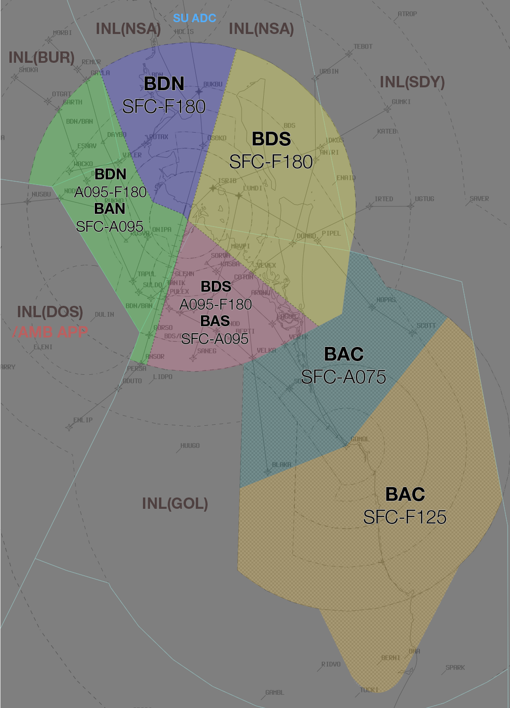

--8<-- "includes/abbreviations.md"

## Positions

| Name                          | ID      | Callsign                | Frequency   | Login ID      |
| ----------------------------- | ------- | ----------------------- | ----------- | ------------- |
| **Brisbane Approach North**   | **BAN** | **Brisbane Approach**   | **124.700** | **BN_APP**    |
| Brisbane Approach South :material-information-outline:{ title="Non-standard position"}   | BAS | Brisbane Approach   | 125.600 | BN-S_APP |
| Brisbane Departures North :material-information-outline:{ title="Non-standard position"} | BDN | Brisbane Departures | 133.450 | BN_DEP   |
| Brisbane Departures South :material-information-outline:{ title="Non-standard position"} | BDS | Brisbane Departures | 118.450 | BN-S_DEP |
| Gold Coast Approach :material-information-outline:{ title="Non-standard position"}       | BAC | Brisbane Approach   | 123.500 | BN-C_APP |
| Brisbane Radar :material-information-outline:{ title="Non-standard position"}            | SHN | Brisbane Centre     | 119.500 | BN-R_DEP |
| Brisbane Flow :material-information-outline:{ title="Non-standard position"}             | BFL |                     |         | BN_FMP   |

!!! abstract "Non-Standard Positions"
    :material-information-outline: Non-standard positions may only be used in accordance with [VATPAC Air Traffic Services Policy](https://vatpac.org/publications/policies){target=new}.  
    Approval must be sought from the **bolded parent position** prior to opening a Non-Standard Position, unless [NOTAMs](https://vatpac.org/publications/notam){target=new} indicate otherwise (eg, for events).

## Airspace
The Vertical limits of the BN TCU are `SFC` to `F180`, except in BAC airspace, where it is `SFC` to `A075` in the North West, and `SFC` to `F125` in the South East.

### Reclassifications
#### AF CTR
AF CTR reverts to Class G when **AF ADC** is offline, and is administered by the relevant BN TCU controller.

See also: [AF ADC Offline](#af-adc-offline).

#### CG CTR
If BN TCU elects not to provide top-down to YBCG, The CG CTR Class C airspace `SFC` to `A035` reverts to Class G when **CG ADC** is offline, and is administered by the relevant BN TCU controller.

See also: [CG ADC Offline](#cg-adc-offline).

!!! tip
    If choosing *not* to provide a top down service, consider publishing an **ATIS Zulu** for the aerodrome, to inform pilots about the airspace reclassification. The *More ATIS* plugin has a formatted Zulu ATIS message.

### Airspace Division
The divisions of the airspace between **BAN**, **BAS**, **BDS**, **BDN**, and **BAC** change based on the Runway Mode.

!!! note
    The following diagrams do not include non BN TCU areas of responsibility such as AF CTR or CG ADC

=== "01 PROPS"
	<figure markdown>
	{ width="700" }
	  <figcaption>01 PROPS TCU Structure</figcaption>
	</figure>

=== "19 PROPS"
	<figure markdown>
	{ width="700" }
	  <figcaption>19 PROPS TCU Structure</figcaption>
	</figure>

=== "SODPROPS"
	<figure markdown>
	{ width="700" }
	  <figcaption>SODPROPS TCU Structure</figcaption>
	</figure>
	
#### Brisbane Radar (SHN)
SHN is responsible for the provision of FIS in Class G airspace within the BN TMA. The position is designed to reduce the workload of other TMA positions by identifing and issuing clearance (where available) to aircraft OCTA, then transferring them to the relevant TMA controller.

#### Airspace Structural Arrangements
Pursuant to Section 2 of the [VATPAC Air Traffic Services Policy](https://vatpac.org/publications/policies){target=new}, **"North"**/**"West"** positions shall assume the airspace of corresponding **"South"**/**"East"** positions when the latter are inactive (e.g. **BAN** assumes **BAS** airspace), and vice versa.

## Separation
### Parallel Runway Operations
Refer to [Parallel Runway Separation Standards](../../separation-standards/parallelapps) for more information

## Departure/Arrival Procedures
### STAR and Runway Assignment
Sequencing of arrivals into YBBN is the responsibility of INL, with input from BN TCU.

Aircraft from the north/west are assigned 01L/19R and aircraft from the south/east assigned 01R/19L. These standard runway assignments may be modified strategically by the BAS or BFL controller.

!!! example
    If during an event, the vast majority of traffic is coming from **BLAKA** and **GOMOL** feeder fixes, BAS/BFL may elect to assign 19L to **BLAKA** arrivals and 19R to **GOMOL** arrivals, to keep them separated at all times.

    **BFL** -> **INL**: "All arrivals via GOMOL to be assigned 19R until further notice"  
    **INL** -> **BFL**: "Roger, Arrivals via GOMOL to be assigned 19R" 

### Gold Coast Arrivals
Visual approaches are preferred into YBCG. If due to operational requirements, an aircraft is unable to accept a visual approach, coordination with CG ADC may be required.

There is no STAR available to facilitate aircraft arriving from the north west. These aircraft should be instructed to track `BN Y177 IDRIL NOPAS GOMOL`. Aircraft will then be given further instructions by BAC according to the runway in use.

| Runway | Routing      |
| ------ | ------------ |
| 14     | Not below `A050` until established over water, and then instructed to join final/track to an instrument IAF. |
| 32     | Radar vectors to join 10NM/instrument IAF. |

!!! note
    Aircraft tracking via the above routing does **not** constitute a voiceless coordination route between BAN/BDS and BAC. Aircraft should still be heads-up coordinated to BAC prior to **5 minutes** to the boundary, unless coordinated otherwise.

## Tower Offline
### AF ADC Offline
Due to the low level of CTA (`A015`) in the AF CTR when **AF ADC** is offline, it is best practice to give airways clearance to aircraft at the holding point, to ensure departing aircraft can have uninterrupted climb.

!!! phraseology
    **ABC**: "Brisbane Approach, ABC, PC12, POB 8, IFR, Taxiing YBAF for YBSU, Runway 28R"   
    **BN TCU**: "ABC, Brisbane Approach, Squawk 3601, No Reported IFR Traffic, Report Ready at the Holding Point for Airways Clearance"  
    **ABC**: "Squawk 3601, Wilco, ABC"  

    **ABC**: "ABC, Ready Runway 28R, Request clearance"  
    **BN TCU**: "ABC, Cleared to YBSU via BN, Flight Planned Route. Make Visual right turn DCT BN, Climb to A030"  
    **ABC**: "Cleared to YBSU via BN, Flight Planned Route. Make Visual right turn DCT BN, Climb to A030, ABC"

### CG ADC Offline
Due to the low level of CTA (`A035`) in the CG CTR when **CG ADC** is offline, it is best practice to give airways clearance to aircraft at the holding point, to ensure departing aircraft can have uninterrupted climb.

!!! phraseology
    **JST446**: "Brisbane Approach, JST446, A320, IFR, taxiing YBCG for YSSY, runway 14"   
    **BN TCU**: "JST446, Brisbane Approach, squawk 3601, no reported IFR traffic, report ready at the holding point for airways clearance"  
    **JST446**: "Squawk 3601, wilco, JST446"  

    **JST446**: "JST446, ready runway 14, request clearance"  
    **BN TCU**: "JST446, cleared to YSSY via APAGI, flight planned route, climb to A060"  
    **JST446**: "Cleared to YSSY via APAGI, flight planned route, climb to A060, JST446"

## Runway Modes
### Parallel Runway Operations
Unless operationally required, aircraft arriving YBBN shall be assigned the following runways for arrival when PROPS are in progress:

| Aircraft tracking | Runway |
| --------- | ------- |
| via BLAKA | 01R/19L |
| via GOMOL | 01R/19L |
| via UGTUG | 01R/**19R** |
| via TEBOT | 01R/**19R** |
| via MORBI | 01L/19R |
| via SMOKA | 01L/19R |
| via WOODY | 01L/19R |
| via ENLIP | 01L/**19L** |
| Other aircraft: |
| From the NORTH and WEST | 01L/19R |
| From the SOUTH and EAST | 01R/19L |
	
### SODPROPS
Arriving aircraft must be established on final and transferred to the tower frequency no later than 10NM from touchdown.

## Helicopter Operations
In VMC, helicopters inbound to or outbound from YBBN shall be processed via two visual waypoints (outlined below) positioned north and south of the field. Where VMC does not exist, IFR helicopters will conform to fixed wing ops.

| Direction of Flight | Inbound/Outbound Tracking Point |
| ------------------- | -------------- |
| North      | BLHS   |
| South      | MBHM   |
| East       | MBHM   |
| West       | BLHS   |

### Departures
BN ADC will clear outbound helicopters via the [appropriate waypoint](#helicopter-operations) and transfer the aircraft to TCU. Where VMC does not exist, IFR helicopters will be assigned the **BN (RADAR) SID** and processed as per fixed wing ops.

### Arrivals
Helicopters arriving to YBBN during VMC shall be cleared by **BN TCU** via the appropriate [inbound waypoint](#helicopter-operations), with that waypoint issued as the clearance limit. TCU shall coordinate the arrival with ADC and transfer the aircraft approaching the clearance limit.

!!! phraseology
    **X6G**: "Brisbane Approach, helicopter X6G, 14nm north of Brisbane, A010, inbound, received Bravo, request clearance"  
    **BN TCU**: "X6G, Brisbane Approach, remain outside Class C airspace, squawk 0445"  
    **X6G**: "Remain OCTA, squawk 0445, X6G"  

    **TCU** -> **ADC**: "North, helicopter X6G, inbound at A010, clearance limit BLHS"  
    **ADC** -> **TCU**: "X6G"  

    **BN TCU**: "X6G, identified, cleared to YBBN via BLHS, maintain A010, clearance limit BLHS"  
    **X6G**: "Cleared to YBBN via BLHS, maintain A010, clearance limit BLHS, X6G"  

    **BN TCU**: "X6G, contact Brisbane Tower, 120.5" 

**BN ADC** will assess the traffic situation and clear the aircraft for a visual approach to their nominated landing site.

### City Scenic Flights
Helicopters conducting scenic flights around the city require access to the Brisbane CTA to operate. These flights typically involve low-level operations inside controlled airspace and in proximity to landmarks within the city area.

Aircraft must track via Class G airspace to UQLD and contact BN TCU prior to reaching UQLD requesting airways clearance. Attempt to identify the aircraft, and if a clearance cannot be given immediately, instruct the pilot to remain clear of Class C airspace.

!!! phraseology 
    **FHK**: "Departures, helicopter FHK, 2 miles south UQLD `A010`, for city scenic, request airways clearance"  
    **BN TCU**: "FHK, Departures, squawk 1562, remain outside Class C airspace"  
    **FHK**: "Squawk 1562, remain OCTA, FHK"  

    **BN TCU**: "FHK, identified, cleared to enter controlled airspace remaining west of SBD, not above `A010`, Brisbane QNH 1026"  
    **FHK**: "Cleared to enter controlled airspace remaining west of SBD, not above `A010`, QNH 1026, FHK"

Due to the close proximity to YBBN, it may be necessary to instruct helicopters to maintain visual separation with arriving or departing aircraft.

!!! phraseology 
    **BN TCU**: "FHK, report sighting an Embraer E190 departing runway 19R, through `A008` on climb."  
    **FHK**: Traffic in sight, FHK"  
    **BN TCU**: "FHK, maintain own seperation with the E190"  
    **FHK**: "Maintain own seperation, FHK"  

    **BN TCU**: "QFA1864, traffic is a helicopter operating over the CBD not above `A010`, maintaining own separation with you"  
    **QFA1864:** "QFA1864"

Once the aircraft exits the CTA, cancel their identification and control services.

!!! phraseology 
    **FHK**: "FHK, excited the zone"  
    **BN TCU**: "FHK, identification and control service terminated, frequency change approved"  
    **FHK**: "Frequency change approved, FHK"  

## Flow
### Local Knowledge
- Aircraft inbound to YBBN from the south may be split between the GOMOL/BLAKA and ENLIP STARs, and assigned different runways, to reduce overall delay (most effective during 01 PROPS)
- Aircraft inbound to YBBN may be issued the appropriate Xray or Victor STAR to reduce track miles
- Aircraft inbound to YBBN from the north for RWY 01R may be issued the SMOKA M STAR to reduce track miles
- Aircraft inbound to YBCG may be assigned the Yankee or Victor STAR to reduce track miles

### Flow Tables
#### YBBN
The tables below give an estimated time **in minutes** from the **Feeder Fix** to the **Threshold**.

=== "Jets & DH8D"
    | STAR     | RWY 01L | RWY 01R | RWY 19L | RWY 19R |
    | -------- | ------- | ------- | ------- | ------- |
    | **BLAKA A**  | 13      | 13      | 19      | 21      |
    | **BLAKA X**  | -       | 12      | 16      | -       |
    | **ENLIP A**  | 11^     | 11^     | 20      | 18      |
    | **ENLIP X**  | -       | -       | 16      | 16      |
    | **GOMOL A**  | 14      | 14      | 18      | 20      |
    | **GOMOL V**  | -       | 13      | 15      | -       |
    | **GOMOL X**  | -       | 12      | 16      | -       |
    | **ISPON** *ENLIP transition* *BLAKA transition* *GOMOL transition* *UGTUG transition* |  - - - - |  - - - - |  - - - - |  20 19 19 14  |
    | **MORBI A**  | 16      | 15      | 13      | 12      |
    | **MORBI V**  | 13      | -       | -       | 11^     |
    | **SMOKA A**  | 15      | 14      | 13      | 13      |
    | **SMOKA M**  | -       | 12^     | -       | -       |
    | **SMOKA X**  | 13      | -       | -       | 11^     |
    | **TEBOT A**  | 18      | 18      | 11^     | 11^     |
    | **TEBOT X**  | -       | 15      | -       | -       |
    | **UGTUG A**  | 15      | 15      | 13      | 14      |
    | **UGTUG X**  | -       | 13      | 12^     | -       |
    | **WOODY A**  | 14      | 13      | 15      | 15      |
    | **WOODY V**  | 11^     | -       | -       | 12^     |

=== "Non-Jets"
    | STAR     | RWY 01L | RWY 01R | RWY 19L | RWY 19R |
    | -------- | ------- | ------- | ------- | ------- |
    | **BLAKA A**  | 15      | 15      | 22      | 24      |
    | **BLAKA X**  | -       | 14      | 18      | -       |
    | **ENLIP A**  | 13^     | 13^     | 23      | 20      |
    | **ENLIP X**  | -       | -       | 19      | 18      |
    | **GOMOL A**  | 16      | 15      | 21      | 23      |
    | **GOMOL V**  | -       | 14      | 17      | -       |
    | **GOMOL X**  | -       | 14      | 18      | -       |
    | **ISPON** *ENLIP transition* *BLAKA transition* *GOMOL transition* *UGTUG transition* |  - - - - |  - - - - |  - - - - |  23 22 21 15  |
    | **MORBI A**  | 18      | 17      | 14      | 14      |
    | **MORBI V**  | 14      | -       | -       | 12^     |
    | **SMOKA A**  | 17      | 16      | 15      | 15      |
    | **SMOKA M**  | -       | 13^     | -       | -       |
    | **SMOKA X**  | 14      | -       | -       | 13^     |
    | **TEBOT A**  | 20      | 21      | 12^     | 13^     |
    | **TEBOT X**  | -       | 17      | -       | -       |
    | **UGTUG A**  | 17      | 17      | 15      | 16      |
    | **UGTUG X**  | -       | 14      | 13^     | -       |
    | **WOODY A**  | 16      | 15      | 17      | 16      |
    | **WOODY V**  | 13^     | -       | -       | 14^     |

#### YBCG
The tables below give an estimated time **in minutes** from the **Feeder Fix** to the **Threshold**.

=== "Jets & DH8D"
    | Arrival | RWY 14 | RWY 32 |
    | ------- | ------ | ------ |
    | **BERNI A STAR** | 15  | 11^  |
    | **BERNI V STAR** | 14  | 12^  |
    | **BERNI Y STAR** | 14  | - |
    | **LAMSI A STAR** | 13  | 11^  |
    | **LAMSI Y STAR** | 12^  | 10^  |
    | **BN Y177 IDRIL CG2SA** | -  | 16  |
    | **BN Y177 IDRIL CG2NC** | 12^ | - |

=== "Non-Jets"
    | Arrival | RWY 14 | RWY 32 |
    | ------- | ------ | ------ |
    | **BERNI A STAR** | 17  | 13^  |
    | **BERNI V STAR** | 16  | 13^  |
    | **BERNI Y STAR** | 16  | - |
    | **LAMSI A STAR** | 15  | 13^  |
    | **LAMSI Y STAR** | 14^  | 12^  |
    | **BN Y177 IDRIL CG2SA** | -  | 18  |
    | **BN Y177 IDRIL CG2NC** | 13^ | - |

#### Corrections

| Situation | Correction |
| ----- | ----- |
| Assigned a reduced speed | +1 min, *except ^* | 
| Over 40kt of head/tailwind component | +1 min for headwind -1 min for tailwind |

#### Assumptions
- Nil wind
- The feeder fix for all STARs is the assigned STAR transition waypoint (if applicable), otherwise the waypoint coinciding with the STAR title
- Aircraft inbound to YBCG from the north will track from IDRIL to the IAF for their assigned approach
- Aircraft inbound to YBCG on a STAR ending at FIKUL or KEGAN will conduct the RNP Z approach

### YBBN Calculator

The following calculator will generate a landing time from a feeder fix ETA, or the reverse.

=== "Landing Time"
    

=== "Feeder Fix Time"
    

### YBCG Calculator

The following calculator will generate a landing time from a feeder fix ETA, or the reverse.

=== "Landing Time"
    

=== "Feeder Fix Time"
    

## Coordination
### Enroute
#### Departures
Voiceless for aircraft:

- With ADEP **YBBN**  
    - Tracking via a Procedural SID terminus^; and  
    - Assigned the lower of `F180` or the `RFL`
- With ADEP **YBCG**  
    - Tracking via **APAGI** and assigned the lower of `F120` or the `RFL`; or    
    - Tracking via **BN** and assigned the lower of `F180` or the `RFL`  
- With ADES **YBSU**  
    - Assigned the **ITIDE** STAR; and  
    - Assigned `F130`

!!! note
    ^Aircraft are *not required* to be tracking via the **SID procedure**, simply tracking via any of the terminus waypoints (Regardless of *departure airport* or *assigned SID*) is sufficient to meet the criteria for **voiceless coordination**

All other aircraft going to INL CTA must be **Heads-up** Coordinated by BN TCU prior to the boundary. This includes YBCG departures to the North that clip INL(GOL) airspace before re-entering BN TCU airspace

!!! phraseology
    **BAC** -> **GOL**: "Departing YBCG, X4C, do you have any Restrictions or Requirements?"  
    **GOL** -> **BAC**: "X4C, No Restrictions or Requirements"  

#### Arrivals
Voiceless for all aircraft:
- With ADES **YBBN**:
    - Assigned a STAR; and
	- Assigned `A090`.
- With ADES **YBCG**:
	- Assigned a STAR, and assigned `F130`; or
	- Tracking via **BN**, and assigned `F190`.

All other aircraft coming from INL CTA will be **Heads-up** Coordinated to BN TCU.

### BN ADC
#### Auto Release
[Next](../controller-skills/coordination.md#next) coordination is **not** required to BN TCU for aircraft that are:

- Departing from a runway nominated on the ATIS (except during SODPROPS^); and  
- Assigned the standard assignable level; and  
- Assigned a **Procedural** SID; or
- Assigned the **Radar** SID with a [Standard Assignable Heading](#standard-assignable-departure-headings)

^*Auto Release is not available during SODPROPS runway mode. All aircraft must be coordinated from BN ADC to BN TCU.*

All other aircraft require a 'Next' call to BN TCU.

The Standard Assignable level from BN ADC to BN TCU is:  

| Aircraft | Level |
| -------- | ----- |
| Jets | `A060` |
| Non-Jets | The lower of `A040` and `RFL` |

#### Standard Assignable Departure Headings
Aircraft that have been cleared the **BN (RADAR) SID** will receive an assigned heading with their line up or takeoff clearance. 'Next' coordination is not required (excluding during SODPROPS) from the BN ADC controller when the departing aircraft has been assigned the standard assignable level and assigned one of the headings listed below:

| Runway | Assigned Heading |
| ---- | -------------- |
| 01L | H340 |
| 01R | H120 |
| 19L | H110 |
| 19R | H270 |

!!! tip
    If strong winds are present at altitude, ADC/DEP should discuss slight changes to these headings (+/- 5 degrees) to compensate for large crosswind components.

### BN TCU Internal
#### Departures
Voiceless Coordination is in place for departures transiting between BN TCU positions, provided the aircraft is:

- ADEP **YBBN** or **YBCG**; and
- Assigned a SID; and
- Climbing via SID to `A100` or higher

#### Arrivals
Voiceless Coordination is in place for arrivals transiting between BN TCU positions, provided the aircraft is:

- ADES **YBBN** or **YBCG**; and
- Assigned a STAR; and
- Descending via STAR to `A080`

#### Others (Heads-up)
All other aircraft not meeting the Departures/Arrivals criteria that transit between internal BN TCU boundaries must be heads-up coordinated.

!!! phraseology
    **BDS** -> **BAS**: "via MAKRU, QFA904"  
    **BAS** -> **BDS**: "QFA904, A050"

### CG ADC
#### Airspace
CG ADC is responsible for the Class C Airspace within the CG CTR `SFC` to `A015`.

Refer to [Reclassifications](#cg-ctr) for operations when CG ADC is offline.

#### Auto Release
[Next](../controller-skills/coordination.md#next) coordination is **not** required to BN TCU for aircraft that are:   
  
  - Departing from a runway nominated on the ATIS; and  
  - Assigned the standard assignable level; and  
  - Assigned a **Procedural** SID

All other aircraft require a 'Next' call to CG TCU.

The Standard Assignable level from CG ADC to BN TCU is:  

| Aircraft | Level |
| -------- | ----- |
| Jets | `A060` |
| Non-Jets | The lower of `A060` and `RFL` |

### AF ADC
#### Airspace
AF ADC is responsible for the Class D Airspace within the AF CTR `SFC` to `A015`.

Refer to [Reclassifications](#af-ctr) for operations when AF ADC is offline.

#### Departures
[Next](../controller-skills/coordination.md#next) coordination is required from AF ADC to BN TCU for all aircraft **entering BN TCU CTA**.

The Standard Assignable level from **AF ADC** to **BN TCU** is:

| Aircraft | Level |
| ------- | ----- |
| All | The lower of `A040` and `RFL` |

#### Arrivals/Overfliers
BN TCU will heads-up coordinate arrivals/overfliers from Class C to AF ADC prior to **5 mins** from the boundary.  
IFR aircraft will be cleared for the coordinated approach (Instrument or Visual) prior to handoff to AF ADC, unless AF ADC nominates a restriction.  
VFR aircraft require a level readback.

!!! phraseology
    **BN TCU** -> **AF ADC**: "via TVT for the visual approach, UJE"  
    **AF ADC** -> **BN TCU**: "UJE, visual approach"

### AMB TCU
All aircraft transiting from **BN TCU** to **AMB TCU** and vice versa must be [Heads-up](../controller-skills/coordination.md#heads-up) coordinated prior to the boundary. 

!!! phraseology
    **AMA** -> **BDN**: "via BN, DRGN02"  
    **BDN** -> **AMA**: "DRGN02, `F140`"  

For aircraft arriving into AMB TCU there is no standard assignable level.

!!! phraseology
    **BDN** -> **AMA**: "via WACKO, STAL13, what level can I assign?"  
    **AMA** -> **BDN**: "STAL13, `A100`"  
    **BDN** -> **AMA**: "`A100`, STAL13"  

### SU ADC
BN TCU Class G shares a tiny border with **SU ADC**, however there are no SIDs, STARs, or airways through this gap. The only possible way for an aircraft to directly enter SU ADC airspace from BN TCU's jurisdiction, is from Class G, and as such, no coordination is required to **SU ADC**. However, ensure the aircraft is transferred to the ADC at least **10nm** prior to the boundary, to facilitate their airways clearance.

<figure markdown>
{ width="700" }
  <figcaption>BN TCU / SU ADC Border</figcaption>
</figure>

**SU ADC** coordination for arrivals and departures via the SID/STAR is handled by INL(NSA).
