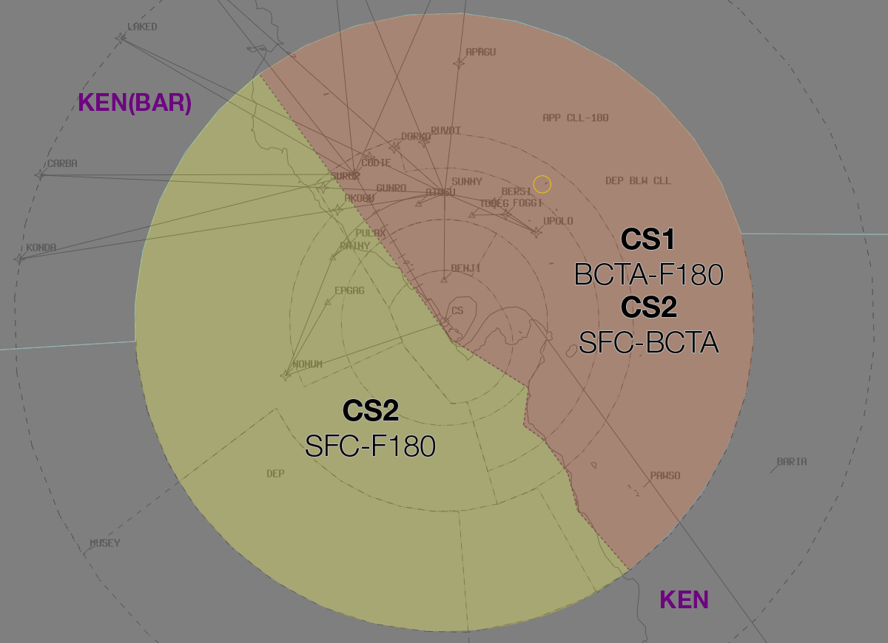

--8<-- "includes/abbreviations.md"

## Positions

| Name               | ID      | Callsign       | Frequency        | Login Identifier              |
| ------------------ | --------------| -------------- | ---------------- | --------------------------------------|
| **Cairns Approach**    |**CS1**| **Cairns Approach**   | **118.400**         | **CS_APP**          |
| Cairns Approach†    |CS2| Cairns Departures  | 126.100         | CS_DEP          |
| Cairns Flow†        |  |                |          | CS-FLW_CTR                               |

† *Non-standard positions* may only be used in accordance with [VATPAC Ratings and Controller Positions Policy](https://vatpac.org/publications/policies)

## Airspace

Cairns TCU airspace is divided between Approach and Departure, and is dependent on the Cairns Duty Runway.  
Approach is responsible for Class C airspace east of the boundary.  
Departures is responsible for Class C airspace west of the boundary and Class G airspace within the Cairns TMA.

### Airspace Division

The divisions of the airspace between **CS1** and **CS2** change based on the Runway Mode.

#### Runway 15
<figure markdown>
{ width="700" }
  <figcaption>15 TCU Structure</figcaption>
</figure>

#### Runway 33
<figure markdown>
{ width="700" }
  <figcaption>33 TCU Structure</figcaption>
</figure>

!!! note
    Due to terrain shielding, Radar Coverage may be limited below `A025` southwest of the Aerodrome

### Trinity Release

During **Daytime Hours Only** CS ADC assumes the resposibility of the Trinity Airspace

Departing aircraft shall be transferred to TCU after ADC no longer has separation requirements.  

<figure markdown>
{ width="700" }
  <figcaption>Trinity Airspace Release</figcaption>
</figure>

## Departure Procedures

### IFR Departures

IFR aircraft shall be processed via one of the following SIDs:

a) RWY 15, Jets via SWIFT: SWIFT SID. Non-Jets via NONUM: NONUM SID  
b) RWY 33, All Jets: EAZEE SID, Radar Transition  
c) All others: CS (RADAR) SID  

!!! Note
    Non-jet aircraft may be issued a Visual Departure.

### Assignable Heading Range

| Runway | Heading |
| ----------------- | ---------------|
| 15                | 350° to 030°   |
| 33                | 330° to 070° |

### Minimum IMC Levels
Lowest assignable level in IMC for assigned heading is:

| Runway | Jet | Non-Jet|
| ------ | -------- | -------|
| 15     | `A030` | `A020`, between 350° to 030° |
| 33     | `A040`, between 330° to 009°. `A030`, all other headings | `A040`, between 330° to 009°.  `A020`, between 010° to 060°. `A024`, between 061° to 070° |

<figure markdown>
{ width="700" }
  <figcaption>Minimum IMC Levels</figcaption>
</figure>

## Arrival Procedures
### Level Assignment
Inbound aircraft will be handed from Enroute to Approach assigned the [standard assignable level](#arrivals).  This section refers to further descent issued by the Approach controller.

### Flow Control

It is the responsibility of the Flow to sequence all Cairns inbound traffic requiring the Runway. This includes aircraft arriving through the Class G airspace and released to ADC, unless ADC agrees to take the aircraft un-sequenced.  
The minimum Flow spacing to the same runway shall be 3 minutes. Sight-and-follow or Flow spacing of less than **3 minutes** must be approved by ADC.  
TCU shall ensure changes to the sequence inside 36 Miles CS are coordinated with ADC. This responsibility may be delegated to Flow.  
  
Flow instructions shall be based on Feeder Fix times. The following points are the FF to be used:  
        a) KONDA, CABRA, LAKED, DREWS, LOCKA, ZANEY, BARIA, FISHY, NORMA, BULOK  
        b) 40 Miles CS for all other tracks.  
          
The following speeds apply from the Feeder Fix:  
        a) Jets – Maintain 250 KT  
        b) Others – Resume Normal Speed  
        c) As directed by Flow – Maintain ... KT  
### Approach Types

**Approach Expectation shall be `Expect Instrument Approach` when:**

| Time           | Runway 15     | Runway 33                             |
| ------| -------------- | -------------------------------------|
| Day   | Conditions do not meet requirements for CS 360-R Creek Corridor Procedure – NAP2 (VMC conditions do not exist below `A030`)        | Conditions do not meet the requirements for KEEWI arrival visual procedure (VMC conditions do not exist below `A030`) |
| Night | All conditions        | All conditions |

## Coordination

### CS ADC / CS TCU
#### Departures

Auto Release is not Available in Cairns  

All Departing Aircraft must be coordinated to CS TCU with a "Next" Call

!!! example
    **CS ADC** -> **CS TCU**: "Next, ABC, runway 15"  
    **CS TCU** -> **CS ADC**: "ABC, Heading 030, Unrestricted"  
    **CS ADC** -> **CS TCU**: "Heading 030, Unrestriced, ABC"   
    `AIP GEN 3.4`

#### Seperation
CS ADC shall notify Approach and Departure when:  
a) ADC is unable to visually separate traffic;  
b) When ADC is able to resume visually separating traffic.   

#### Missed Approach

When weather conditions prevent the application of visual separation between a departure and a missed approach by tower:  
a) ADC must advise TCU  
b) Approach must limit departure headings to the following:  

| Runway | Jet | Non-Jet
| ----------- | ------ | ---------|
| 15          | 030°  | 030°  |
| 33          | - | 330°  |

### CS ACD / CS TCU

The controller assuming responsibility of **CS ACD** shall give heads-up coordination to the relevant CS TCU controller prior to the issue of the following clearances:  
a) VFR Departures  
b) Aircraft using a runway not on the ATIS

!!! example
    **CS ACD** -> **CS TCU**: "ABC, Requesting clearance for a Northbound VFR Coastal departure at A035"  
    **CS TCU** -> **CS ACD**: "ABC, Cleared for a Northbound VFR Coastal departure, A035"  
    **CS ACD** -> **CS TCU**: "Cleared for a Northbound VFR Coastal departure, A035, ABC"  

    **CS ACD**: "ABC, Cleared for a Northbound VFR Coastal departure, A035, Squawk 3601"  
    **ABC**: "Cleared for a Northbound VFR Coastal departure, A035, 3601, ABC"  
    `AIP GEN 3.4`

### CS FLW / CS ADC

FLW must advise ADC of any sequence changes within 36 Miles CS.  
FLW must advise ADC of aircraft sequenced for Runway 30.  
All requests for non-duty runway arrivals must be approved by ADC.

### CS TCU / ENR
#### Departures

Standard assignable levels from ENR to CS TCU are as follows:  
All routes: `F180` or the `RFL`  

Voiceless coordination is in place for any route (including SID and random direct tracks) to SWIFT, provided that the aircraft is:
- Assigned the standard assignable level;  
- Departed Cairns; and  
- Is a Jet aircraft 

Any aircraft **not** assigned the standard assignable level, must be **Heads-up** Coordinated to the relevant ENR sector as soon as practical.

!!! example
    **CS TCU** -> **KEN**: "JST789, with your concurrence, will be assigned F160, for my separation with ANZ12"  
    **KEN** -> **CS TCU**: "JST789, concur F160"  

#### Arrivals
Standard assignable levels from ENR to CS TCU are as follows:  
055° clockwise to 355° inbound CS: `A070` or the `RFL`  
355° clockwise to 055°: `A090` or the `RFL`   
## Class G arrivals

Aircraft entering CS TCU from Class G shall be coordinated. CS TCU will issue airways clearance, therefore transfer of communications should be effected such that CS TCU will have sufficient time to issue such Clearance.