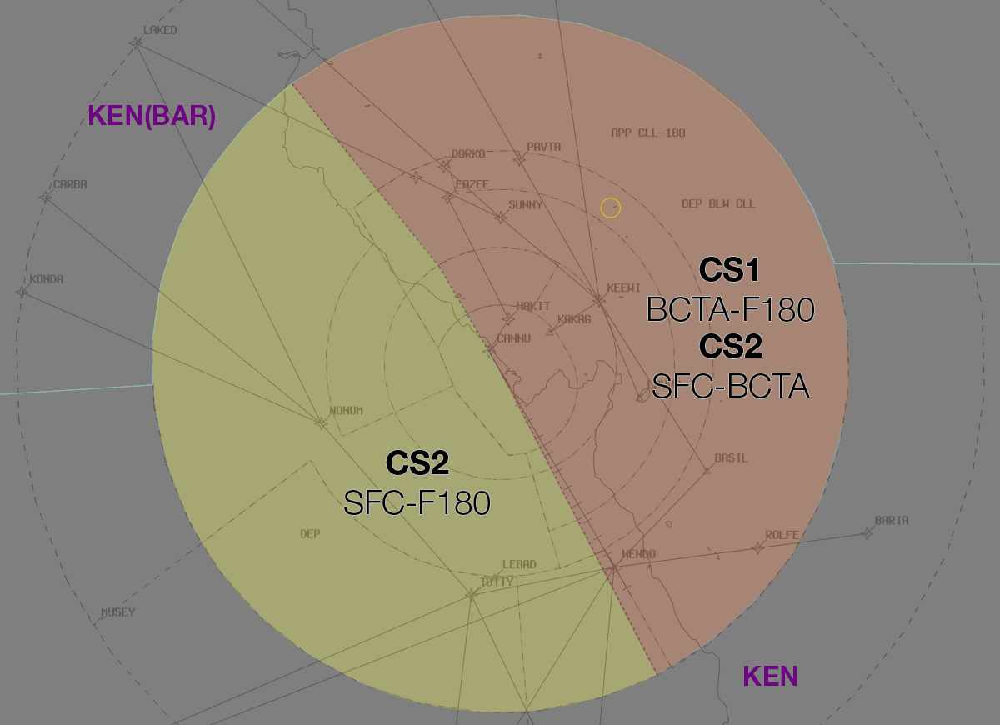
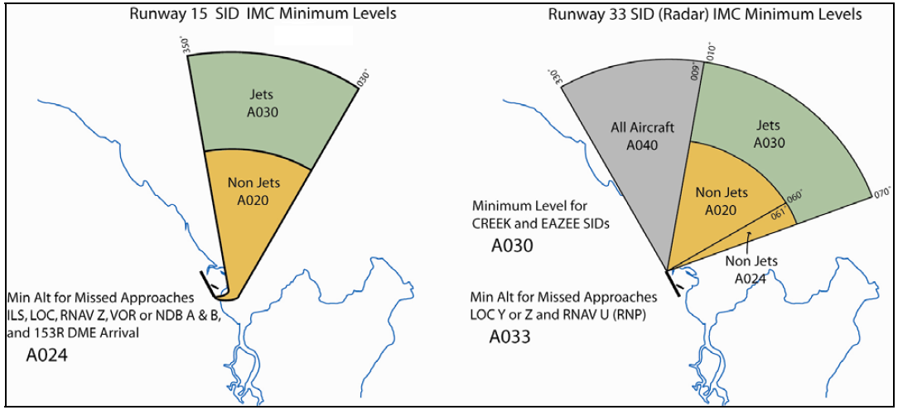

--8<-- "includes/abbreviations.md"

## Positions

| Name               | ID      | Callsign       | Frequency        | Login ID              |
| ------------------ | --------------| -------------- | ---------------- | --------------------------------------|
| **Cairns Approach 1**    |**CS1**| **Cairns Approach**   | **118.400**         | **CS_APP**          |
| Cairns Approach 2 :material-information-outline:{ title="Non-standard position"}    |CS2| Cairns Approach  | 126.100         | CS-W_APP          |
| Cairns Flow :material-information-outline:{ title="Non-standard position"}        |CSF|                |          | CS_FMP                              |

!!! abstract "Non-Standard Positions"
    :material-information-outline: Non-standard positions may only be used in accordance with [VATPAC Air Traffic Services Policy](https://vatpac.org/publications/policies){target=new}.  
    Approval must be sought from the **bolded parent position** prior to opening a Non-Standard Position, unless [NOTAMs](https://vatpac.org/publications/notam){target=new} indicate otherwise (eg, for events).

## Airspace
The vertical limits of the CS TCU are `SFC` to `F180`. **CS ADC** is responsible for the airspace within the CS CTR from `SFC` to `A010`.

!!! note
    Due to terrain shielding, radar coverage may be limited below `A025` southwest of the aerodrome.

### Airspace Division
The divisions of the airspace between **CS1** and **CS2** change based on the runway mode. In either case, CS2 is responsible for the Class G airspace within the Cairns TMA.

#### Runway 15
<figure markdown>
{ width="700" }
  <figcaption>15 TCU Structure</figcaption>
</figure>

#### Runway 33
<figure markdown>
{ width="700" }
  <figcaption>33 TCU Structure</figcaption>
</figure>

## Departure Procedures
### IFR Departures
IFR aircraft shall be processed via one of the following SIDs:

a) RWY 15, Jets via AKROM: AKROM SID. Non-Jets via NONUM: NONUM SID  
b) RWY 33, All Jets: EAZEE SID, Radar Transition  
c) All others: CS (RADAR) SID  

!!! Note
    Non-jet aircraft may be issued a Visual Departure.

### Standard Assignable Headings
Any aircraft departing via the **radar SID** shall be issued an assigned heading from the table below.

| Runway | VMC below A030 | Otherwise |
| ----------------- | --------------- | -------- |
| 15                | 350° to 030°   | 030° |
| 33                | 330° to 070° | 330° |

### Minimum IMC Levels
The lowest assignable levels in IMC for the following assigned headings are:

| Runway | Jet | Non-Jet|
| ------ | -------- | -------|
| 15     | `A030` | `A020`, between 350° to 030° |
| 33     | `A040`, between 330° to 009°. `A030`, all other headings | `A040`, between 330° to 009°.  `A020`, between 010° to 060°. `A024`, between 061° to 070° |

<figure markdown>
{ width="700" }
  <figcaption>Minimum IMC Levels</figcaption>
</figure>

## Arrival Procedures
### Visual Approaches
When VMC exists below `A030`, aircraft of light & medium weight categories (B737/A320 and below) may be processed via a visual approach to either runway 15 or 33. 

#### Creek Corridor
Aircraft for runway 15 will be cleared via the Victor STAR by enroute, which terminates on the Creek Corridor visual procedure (see YBCS DAP Noise Abatement Procedures chart). These aircraft should be cleared for a visual approach *"via the Creek Corridor"* and transferred to ADC prior to reaching the coastline.

!!! phraseology
    *RXA5474 is tracking via the NONUM Victor STAR for runway 15.*  
    **RXA5474**: "RXA5474, visual"  
    **CS TCU**: "RXA5474, cleared visual approach tracking via the Creek Corridor"  
    **RXA5474**: "Cleared visual approach via the Creek Corridor, RXA5474"

#### Visual Base Runway 33
Aircraft for runway 33 may be cleared for a visual approach tracking via the STAR or localiser, or navigating visually through the valley to the south of the aerodrome. 

Aircraft cleared via the KEEWI Victor STAR or otherwise approaching from the north shall be instructed to track for a visual right base and, once clear of departing traffic, assigned `A020 visual`. These aircraft will pass over the top of the CS CTR (owned by ADC), so further descent is not available. CS TCU must coordinate with ADC, then transfer them to ADC, who will issue visual approach clearance.

!!! phraseology
    *JCI is tracking inbound from the north at `A050` and has reported visual.*  
    **TCU** -> **ADC**: "Via right base, JCI, will be assigned A020 visual"  
    **ADC** -> **TCU**: "A020 visual, JCI" 

    **CS TCU**: "JCI, track for a right base runway 33, descend to A020 visual"  
    **VH-JCI**: "Track for right base runway 33, descend A020 visual, JCI"  
    **CS TCU**: "JCI, contact Cairns Tower on 124.9"  
    **VH-JCI**: "124.9, JCI"

### Flow Control
It is the responsibility of Flow to sequence all Cairns inbound traffic requiring the runway. This includes aircraft arriving through the Class G airspace, unless ADC agrees to take the aircraft un-sequenced.  

The minimum flow spacing to the same runway shall be 3 minutes. Sight-and-follow or flow spacing of less than **3 minutes** must be approved by ADC. TCU shall ensure changes to the sequence inside 36nm of CS are coordinated with ADC. This responsibility may be delegated to Flow.  
  
Flow instructions shall be based on Feeder Fix times. The following points are the FF to be used:  
- KONDA, CABRA, LAKED, DREWS, LOCKA, ZANEY, BARIA, FISHY, NORMA, BULOK  
- 40 Miles CS for all other tracks.

## Coordination
### ADC
#### Departures
[Next](../controller-skills/coordination.md#next) coordination is **not** required for aircraft that are:   

  - Departing from a runway nominated on the ATIS; and  
  - Assigned the standard assignable level; and  
  - Assigned a **Procedural** SID

All other aircraft require a 'Next' call to CS TCU.

The Standard Assignable level from CS ADC to CS TCU is:

| Aircraft | Level |
| -------- | ----- |
| All | The lower of `A060` and `RFL` |

See [Standard Assignable Headings](#standard-assignable-headings) for the range of assignable headings available to aircraft on the **radar SID**.

#### Arrivals
Aircraft tracking via a visual right base to runway 33 must be coordinated with ADC (see [Visual Base Runway 33](#visual-base-runway-33)). All other arriving aircraft do not require coordination.

### ACD
The controller assuming responsibility of **CS ACD** shall give [heads-up](../controller-skills/coordination.md#airways-clearance) coordination to the relevant CS TCU controller prior to the issue of the following clearances:  

- VFR departures entering CS TCU CTA
- Aircraft using a runway not on the ATIS

### Enroute
#### Departures
Voiceless for all aircraft:

- Tracking via a Procedural SID terminus; and  
- Assigned the lower of `F180` or the `RFL`

!!! note
    Aircraft are *not required* to be tracking via the **SID procedure**, simply tracking via any of the terminus waypoints (Regardless of *departure airport* or *assigned SID*) is sufficient to meet the criteria for **voiceless coordination**

All other aircraft going to KEN CTA must be **Heads-up** Coordinated by CS TCU prior to the boundary.

!!! phraseology
    **CS TCU** -> **KEN**: "JST789, with your concurrence, will be assigned F160, for my separation with ANZ12"  
    **KEN** -> **CS TCU**: "JST789, concur F160"  

#### Arrivals
Voiceless for all aircraft:

- With ADES **YBCS**; and  
- Assigned a STAR; and  
- Assigned the Standard Assignable level of:  
  - Radials 055° clockwise through to 355°: `A070`  
  - Radials 355° clockwise to 055°: `A090`

All other aircraft coming from KEN CTA will be **Heads-up** Coordinated to CS TCU.

### CS TCU Internal
All aircraft transiting between internal CS TCU boundaries must be heads-up coordinated.

!!! phraseology
    **CS1** -> **CS2**: "via CS, ESQ"  
    **CS2** -> **CS1**: "ESQ, A025"   

Boundary coordination is not required between CS1 and CS2 for aircraft arriving or departing tracking via the 15/33 extended centreline.