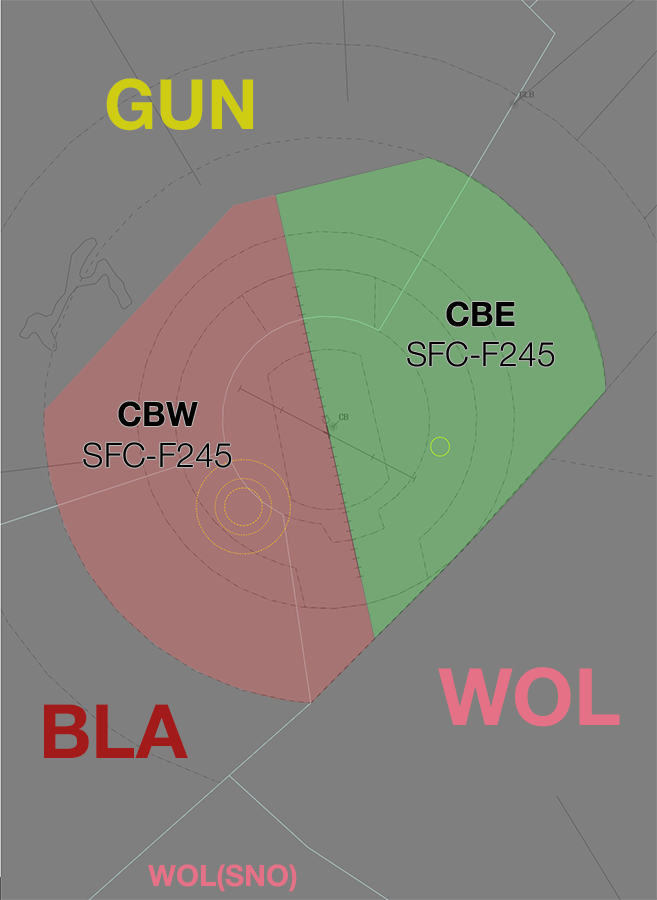

--8<-- "includes/abbreviations.md"

## Positions

| Name               | ID      | Callsign       | Frequency        | Login ID              |
| ------------------ | --------------| -------------- | ---------------- | --------------------------------------|
| **Canberra Approach East**    |**CBE**| **Canberra Approach**   | **124.500**         | **CB_APP**     |
| Canberra Approach West :material-information-outline:{ title="Non-standard position"}   |CBW| Canberra Approach   | 125.900          | CB-W_APP    |
| Canberra Flow :material-information-outline:{ title="Non-standard position"}        |CBF|                |          | CB_FMP                              |

!!! abstract "Non-Standard Positions"
    :material-information-outline: Non-standard positions may only be used in accordance with [VATPAC Air Traffic Services Policy](https://vatpac.org/publications/policies){target=new}.  
    Approval must be sought from the **bolded parent position** prior to opening a Non-Standard Position, unless [NOTAMs](https://vatpac.org/publications/notam){target=new} indicate otherwise (eg, for events).

## Airspace
The Vertical limits of the CB TCU are `SFC` to `F245`.

### CB ADC
**CB ADC** is responsible for the Class C Airspace within the CB CTR `SFC` to `A035`.

### Airspace Division

<figure markdown>
{ width="700" }
  <figcaption>CB TCU Structure</figcaption>
</figure>

## Flow
### Local Knowledge
- By Day VMC, aircraft from the NE can be issued the BUNGO/LEECE Victor STAR to reduce track miles
- In lieu of a STAR, non-jet aircraft may be processed direct to the IAF of the RNP RWY 30 to reduce track miles

### Flow Tables
The tables below give an estimated time **in minutes** from the **Feeder Fix** to the **Threshold**.

=== "Jets"
                       
    | STAR    | RWY 17 | RWY 35 |
    | ------- | ------ | ------ |
    | AVBEG   | 8^ | 16 |
    | LEECE A | 13 | 15 |
    | LEECE V | - | 13 |
    | LEECE W | - | 14 |
    | LEECE Y | 12^ | 13 |
    | MANDA A | 12^ | - |
    | MANDA X | 11^ | - |
    | POLLI A | - | 11^ |
    | POLLI X | - | 11^ |

=== "Non-Jets"

    | STAR    | RWY 17 | RWY 30 | RWY 35 |
    | ------- | ------ | ------ | ------ |
    | AVBEG   | 9^ | - | 18 |
    | BUNGO A | 13^ | - | 17 |
    | BUNGO V | - | 12^ | 16^ |
    | BUNGO W | - | - | 17 |
    | BUNGO Y | - | - | 15 |
    | MANDA A | 13^ | - | - |
    | MANDA X | 12^ | - | - |
    | POLLI A | - | - | 13^ |
    | POLLI X | - | - | 12^ |

#### Corrections
| Situation | Correction |
| ----- | ----- |
| Assigned a reduced speed | +1 min, *except ^* | 
| Over 40kt of head/tailwind component | +1 min for headwind -1 min for tailwind |

#### Assumptions
- Nil wind
- The feeder fix for all STARs is the waypoint coinciding with the title of the STAR, regardless of transition

### Calculator

The following calculator will generate a landing time from a feeder fix ETA, or the reverse.

=== "Landing Time"
    

=== "Feeder Fix Time"
    

## Coordination
### Enroute
#### Departures
Voiceless for all aircraft:
 
- Tracking via a Procedural SID terminus; and  
- Assigned the lower of `F240` or the `RFL`

!!! note
    Aircraft are *not required* to be tracking via the **SID procedure**, simply tracking via any of the terminus waypoints (Regardless of *departure airport* or *assigned SID*) is sufficient to meet the criteria for **voiceless coordination**

All other aircraft going to BLA/GUN CTA must be **Heads-up** Coordinated by CB TCU prior to the boundary.

!!! phraseology
    **CB TCU** -> **GUN**: "EVY113, with your concurrence, will be assigned F180, for my separation with QLK165D"  
    **GUN** -> **CB TCU**: "EVY113, concur F180"  

#### Arrivals
Voiceless for all aircraft:

- With ADES **YSCB**; and  
- Assigned a STAR; and  
- Assigned `F130`

All other aircraft coming from BLA/GUN CTA will be **Heads-up** Coordinated to CB TCU prior to **20nm** from the boundary.

### ADC
#### Departures
[Next](../controller-skills/coordination.md#next) coordination is not required to CB TCU for aircraft that are:   
  
  - Departing from a runway nominated on the ATIS; and  
  - Assigned the standard assignable level; and  
  - Assigned a **Procedural** SID

All other aircraft require a 'Next' call to CB TCU.

The Standard Assignable level from CB ADC to CB TCU is:  

| Flight Rules | Level |
| ------------ | ----- |
| IFR | `A100` |
| VFR | The lower of `A040` and `RFL` |

#### Helipads in the CB CTR
The Canberra CTR contains the Southcare Helicopter Base (YXSB) as well as two hospitals (Calvary Hospital and Canberra Hospital). Helicopters inbound to these helipads should be coordinated with **CB ADC** who can use a visual separation techniques as required. ADC and the TMA controller should work together to determine the most appropriate clearance limit (if required due traffic) for the helicopter, before frequency transfer is issued. ADC will issue a visual approach clearance when it is available.

!!! phraseology
    *RSCU201 is an IFR AW139 helicopter tracking from the east for Southcare Base (YXSB).*  
    **CBE** -> **CB ADC**: "To the east, RSCU201, for Southcare Base, are you able to separate with the arrival path to runway 35?"  
    **CB ADC** -> **CBE**: "Affirm, RSCU201 clearance limit Queanbeyan"  
    **CBE** -> **CB ADC**: "Clearance limit Queanbeyan, RSCU201"  

    **CBE**: "RSCU201, clearance limit Queanbeyan, contact Tower 118.7"

Departing helicopters may transit the CTR to Class G (under the direction of ADC) or be coordinated with the TCU to determine the availability of an airways clearance in CTA.

### CB TCU Internal
All aircraft transiting between internal CB TCU boundaries must be heads-up coordinated.

!!! phraseology
    **CBW** -> **CBE**: "via CB, FD123"  
    **CBE** -> **CBW**: "FD123, A090"   

Boundary coordination is not required between CBW and CBE for aircraft arriving or departing tracking via the 17/35 extended centreline.