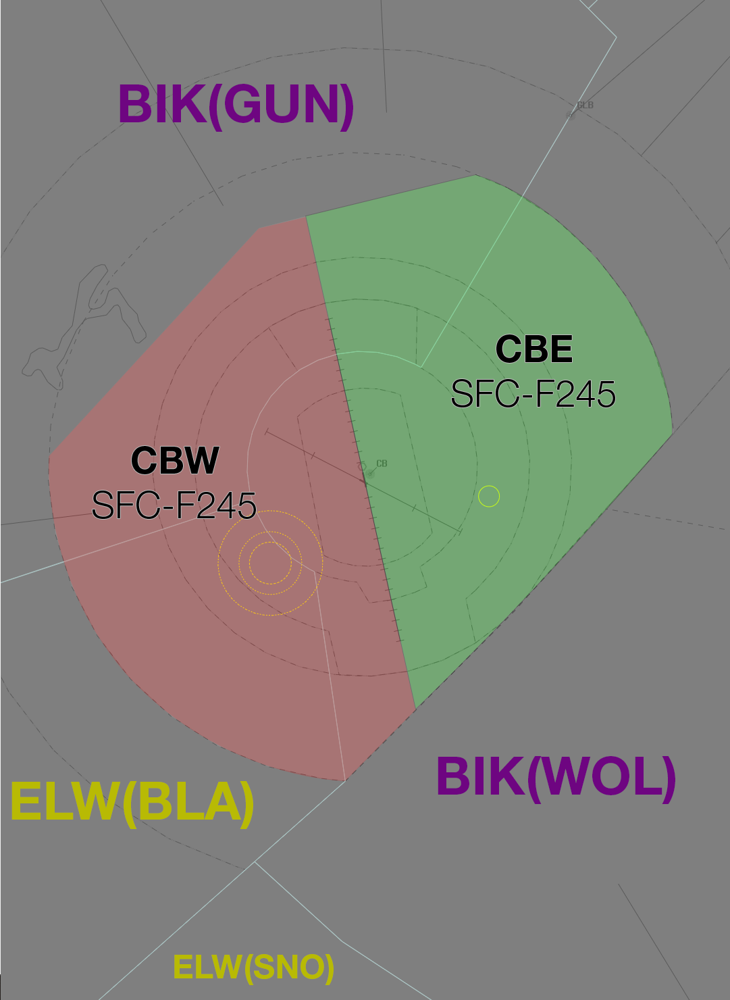

--8<-- "includes/abbreviations.md"

## Positions

| Name               | ID      | Callsign       | Frequency        | Login Identifier              |
| ------------------ | --------------| -------------- | ---------------- | --------------------------------------|
| **Canberra Approach East**    |**CBE**| **Canberra Approach**   | **124.500**         | **CB_APP**     |
| Canberra Approach West†   |CBW| Canberra Approach   | 125.900          | CB-W_APP    |

† *Non-standard positions* may only be used in accordance with [VATPAC Ratings and Controller Positions Policy](https://vatpac.org/publications/policies)

## Airspace
Canberra TCU owns the airspace within a 30 nm radius of CB DME, except for the CB CTR and the “clipped” portion in the North, South-Eastern, and North-Western arc, and from `SFC` to `F245`.  

### Airspace Division

<figure markdown>
{ width="700" }
  <figcaption>CB TCU Structure</figcaption>
</figure>

## Coordination
### CB TCU / ENR
#### Departures
Voiceless coordination is in place from CB TCU to ENR for aircraft:  
Planned at or above `F240`: `Assigned F240`  
Planned below `F240`: `Assigned the RFL`  

Any aircraft not meeting the above criteria must be prior coordinated to ENR.

!!! example
    **CB TCU** -> **BIK**: "EVY113, with your concurrence, will be assigned F180, for my separation with QLK165D"  
    **BIK** -> **CB TCU**: "EVY113, concur F180"  

#### Arrivals
The Standard assignable level from ENR to CB TCU is `F130`. All other levels must be prior coordinated

### CB TCU / CB ADC
#### Auto Release

Auto Release shall be used for aircraft that are:    
a) Departing from a runway nominated on the ATIS; and  
b) Issued a Procedural SID; and   
c) Assigned `A100`.

Any aircraft that don't meet these criteria must be coordinated to CB TCU with a "Next" Call.

"Next" Coordination is a procedure where the **CB ADC** controller gives a heads-up to the CB TCU controller about an impending departure. The CB TCU controller will respond by assigning a heading to the aircraft, for the **CB ADC** controller to pass on with their takeoff clearance.

!!! example
    **CB ADC** -> **CB TCU**: "Next, ABC, runway 35"  
    **CB TCU** -> **CB ADC**: "ABC, Track Extended Centreline, unrestricted"  
    **CB ADC** -> **CB TCU**: "Track Extended Centreline, unrestricted, ABC"   
    `AIP GEN 3.4`

### CB TCU Internal

All aircraft transiting between internal CB TCU boundaries must be heads-up coordinated.

!!! example
    **CBW** -> **CBE**: "via CB, FD123"  
    **CBE** -> **CBW**: "FD123, A090"   