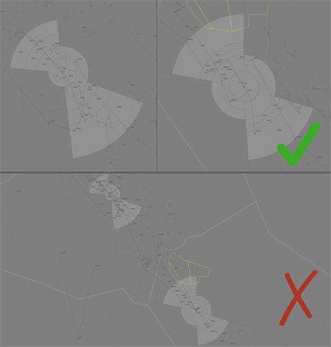

--8<-- "includes/abbreviations.md"

## Positions

| Name               | ID      | Callsign       | Frequency        | Login Identifier              |
| ------------------ | --------------| -------------- | ---------------- | ---------------------|
| Mackay Approach  | MKA | Coral Approach  | 125.650       | MK_APP    |
| Rockhampton Approach  | RKA | Coral Approach   | 123.750        | RK_APP                 |

## Airspace
The Coral TCU includes the airspace `SFC` to `F150` within the Mackay and Rockhampton keyholes (shown below).  
MK ADC own the Class D airspace within MK CTR `SFC` to `A010`.  
RK ADC own the Class D airspace within RK CTR `SFC` to `A010`.  

## Extending
MKA may extend to RKA and vice versa, callsigns remain the same. See [Controller Skills](../controller-skills/extending.md) for details.

!!! tip
    When setting up vatSys while providing coverage to RKA and MKA, it is recommended that you have seperate air displays open for MKA and RKA.
    <figure markdown>
    { width="1000" }
    </figure>
## Coordination

### Enroute
#### Departures
Voiceless coordination is in place from MKA/RKA to ENR for aircraft:  

**Departing All Ports** - Assigned the lower of `F150` or `RFL`  

Any aircraft not meeting the above criteria must be prior coordinated to ENR.

!!! example
    **RKA** -> **KPL**: "QFA114, with your concurrence, will be assigned F130, for my separation with ZYX"  
    **KPL** -> **RKA**: "QFA114, concur F130"  

#### Arrivals
The Standard assignable level from INL(KPL) to RKA is `A070`, and assigned a STAR. All other aircraft must be prior coordinated.  
The Standard assignable level from KEN(SWY) to MKA is `A070`, and assigned a STAR. All other aircraft must be prior coordinated

### MK/RK ADC
#### Auto Release
"Next" Coordination to TCU is required for all deps not assigned a SID.

"Next" Coordination is a procedure where the **ADC** controller gives a heads-up to the TCU controller about an impending departure not on a SID. The TCU controller will respond by assigning a visual heading to the aircraft, for the **ADC** controller to pass on with their takeoff clearance.

!!! example
    **MK ADC** -> **MKA**: "Next, ABC, runway 14"  
    **MKA** -> **MK ADC**: "ABC, Heading 150 Visual, unrestricted"  
    **MK ADC** -> **MKA**: "Heading 150 Visual unrestricted, ABC"

The TCU controller can suspend/resume Auto Release at any time, with the concurrence of **ADC**.

!!! Note
    "Next" Coordination to TCU is not required for aircraft assigned a **Procedural SID** and the Standard Assignable Level.

The controller assuming responsibility of **SMC** shall give heads-up coordination to TCU controller prior to the issue of the following clearances:  

- VFR Departures  
- Aircraft using a runway not on the ATIS

#### Arrivals
COR TCU will coordinate all YBMK and YBRK arrivals to ADC prior to **5 mins** from the boundary. This coordination shall be as per [Standard Heads-up format](../../controller-skills/coordination/#heads-up), with the addition of:

- Runway, if other than duty runway  
- Approach type, unless specifically nominated on the ATIS  
- IFR Circuit joining instructions, if not on Straight-in instrument approach

!!! example
    **RKA** -> **RK ADC**: "via ABVAS, DJU, for the VOR-A”  
    **RK ADC** -> **RKA**: "DJU, VOR-A"