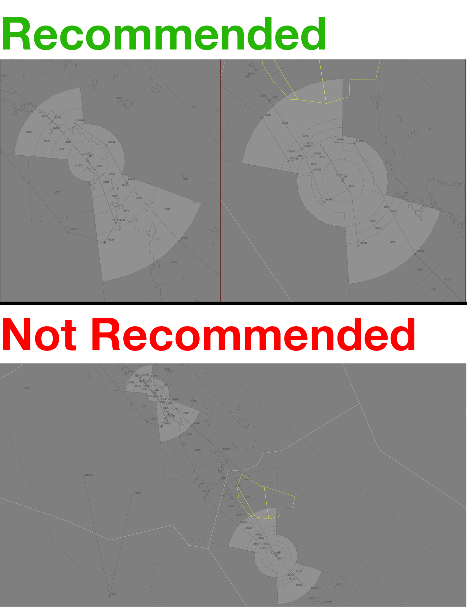

--8<-- "includes/abbreviations.md"

## Positions

| Name               | ID      | Callsign       | Frequency        | Login Identifier              |
| ------------------ | --------------| -------------- | ---------------- | ---------------------|
| Mackay Approach  | MKA | Coral Approach  | 125.650       | MK_APP    |
| Rockhampton Approach  | RKA | Coral Approach   | 123.750        | RK_APP                 |

## Airspace
The Coral TCU includes the airspace `SFC` to `F150` within the Mackay and Rockhampton keyholes (shown below).  
MK ADC own the Class D airspace within MK CTR `SFC` to `A010`.  
RK ADC own the Class D airspace within RK CTR `SFC` to `A010`.  

## Extending
MKA may extend to RKA and vice versa, callsigns remain the same. See [Controller Skills](../controller-skills/extending.md) for details.

!!! tip
    When setting up vatSys while providing coverage to RKA and MKA, it is recommended that you have seperate air displays open for MKA and RKA.
    <figure markdown>
    { width="1000" }
    </figure>

!!! tip
    If choosing *not* to extend to the adjacent TMA, consider publishing an **ATIS Zulu** for the aerodrome, to inform pilots about the airspace reclassification. The *More ATIS* plugin has a formatted Zulu ATIS message.

## Coordination

### Enroute
#### Departures
Voiceless for all aircraft:

- With ADEP **YBMK**  
  - Tracking via **CLIFT** or **MUNAR**; and  
  - Assigned the lower of `F150` or the `RFL`  
- With ADEP **YBRK**  
  - Tracking via **BUDGI** or **TARES**; and  
  - Assigned the lower of `F150` or the `RFL`

All other aircraft going to SWY/KPL CTA must be **Heads-up** Coordinated by MKA/RKA.

!!! example
    **RKA** -> **KPL**: "QFA114, with your concurrence, will be assigned F130, for my separation with ZYX"  
    **KPL** -> **RKA**: "QFA114, concur F130"  

#### Arrivals
Voiceless for all aircraft:

- With ADES **YBMK**    
  - Assigned the **DAGSI** or **WELKE** STAR; and  
  - Assigned `A070`  
- With ADES **YBRK**; and  
  - Assigned the **ABVAS** or **DADBO** STAR; and  
  - Assigned `A070`

All other aircraft coming from SWY/KPL CTA will be **Heads-up** Coordinated to MKA/RKA.

### MK/RK ADC
#### Airspace
MK ADC is responsible for the Class D airspace in the MK CTR `SFC` to `A010`.

RK ADC is responsible for the Class D airspace in the RK CTR `SFC` to `A010`.

#### Auto Release
'Next' coordination is **not** required from MK/RK ADC for aircraft that are:   
  a) Departing from a runway nominated on the ATIS; and  
  b) Assigned the standard assignable level; and  
  c) Assigned a **Procedural** SID

!!! example
    **MK ADC** -> **MKA**: "Next, ABC, runway 14"  
    **MKA** -> **MK ADC**: "ABC, Heading 150 Visual, unrestricted"  
    **MK ADC** -> **MKA**: "Heading 150 Visual unrestricted, ABC"

The TCU controller can suspend/resume Auto Release at any time, with the concurrence of **ADC**.

The Standard Assignable level from MK/RK ADC to MKA/RKA is the lower of `A060` or the `RFL`.

#### MK/RK SMC
The controller assuming responsibility of **SMC** shall give heads-up coordination to TCU controller prior to the issue of the following clearances:  

- VFR Departures  
- Aircraft using a runway not on the ATIS

#### Arrivals
COR TCU will coordinate all YBMK and YBRK arrivals to ADC prior to **5 mins** from the boundary. This coordination shall be as per [Standard Heads-up format](../../controller-skills/coordination/#heads-up), with the addition of:

- Runway, if other than duty runway  
- Approach type, unless specifically nominated on the ATIS  
- IFR Circuit joining instructions, if not on Straight-in instrument approach

!!! example
    **RKA** -> **RK ADC**: "via ABVAS, DJU, for the VOR-A”  
    **RK ADC** -> **RKA**: "DJU, VOR-A"