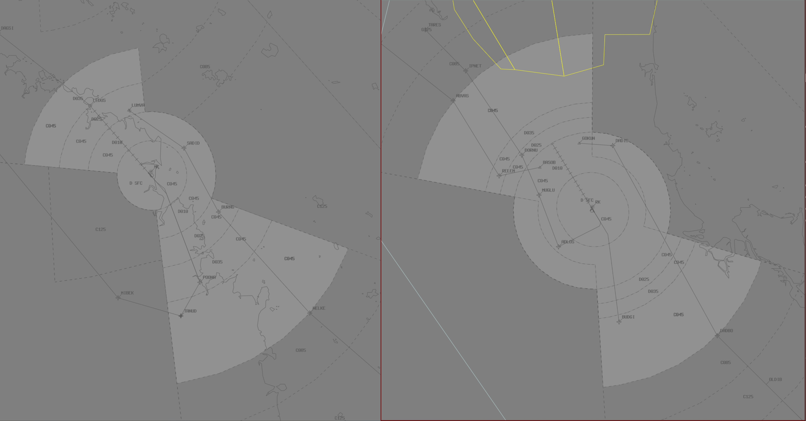

--8<-- "includes/abbreviations.md"

## Positions

| Name               | ID      | Callsign       | Frequency        | Login Identifier              |
| ------------------ | --------------| -------------- | ---------------- | ---------------------|
| Mackay Approach  | MKA | Coral Approach  | 125.650       | MK_APP    |
| Rockhampton Approach  | RKA | Coral Approach   | 123.750        | RK_APP                 |

Upper Limit of the Coral TCU is `F150`

!!! Note
    Mackay Approach may extend to Rockhampton Approach and vice versa, callsigns remain the same.

!!! tip
    When setting up vatSys, it is recommended that you have seperate air displays open for MKA and RKA.
    <figure markdown>
    { width="1000" }
    </figure>
## Coordination

### COR TCU / ENR
#### Departures
Voiceless coordination is in place from COR TCU to ENR for aircraft:  

**Departing All Ports** - Assigned the lower of `F150` or `RFL`  

Any aircraft not meeting the above criteria must be prior coordinated to ENR.

!!! example
    **COR TCU** -> **ENR**: "QFA114, with your concurrence, will be assigned F130, for my separation with ZYX"  
    **ENR** -> **COR TCU**: "QFA114, concur F130"  

#### Arrivals
The Standard assignable levels from **ENR** to COR TCU are as follows:  
YBMK Arrivals: `A070`  
YBRK Arrivals: `A070`

### ADC / TCU
#### Auto Release

"Next" Coordination to TCU is required for all deps not assigned a SID.

"Next" Coordination is a procedure where the **ADC** controller gives a heads-up to the TCU controller about an impending departure not on a SID. The TCU controller will respond by assigning a visual heading to the aircraft, for the **ADC** controller to pass on with their takeoff clearance.

!!! example
    **MK ADC** -> **MK TCU**: "Next, ABC, runway 14"  
    **MK TCU** -> **MK ADC**: "ABC, Heading 150 Visual, unrestricted"  
    **MK ADC** -> **MK TCU**: "Heading 150 Visual unrestricted, ABC"    
    `AIP GEN 3.4`

The TCU controller can suspend/resume Auto Release at any time, with the concurrence of **ADC**.

!!! Note
    "Next" Coordination to TCU is not required for aircraft assigned a **Procedural SID** and the Standard Assignable Level.

The controller assuming responsibility of **SMC** shall give heads-up coordination to TCU controller prior to the issue of the following clearances:  

- VFR Departures  
- Aircraft using a runway not on the ATIS

#### Arrival Coordination
TCU will coordinate all **non-STAR** arrivals 5min from IAF or 5min from CTA boundary prior to handing over to tower in the following format:

- Callsign & Aircraft Type
- Estimate
- Inbound Radial/Procedure
- Assigned Level
- Sequence Number (if applicable)

!!! example
    **TCU** -> **ADC**: "JST420, A320, estimates Mackay 52, RNP 14 via BMKNA, A047, number 1”  
    **ADC** -> **TCU**: "JST420"