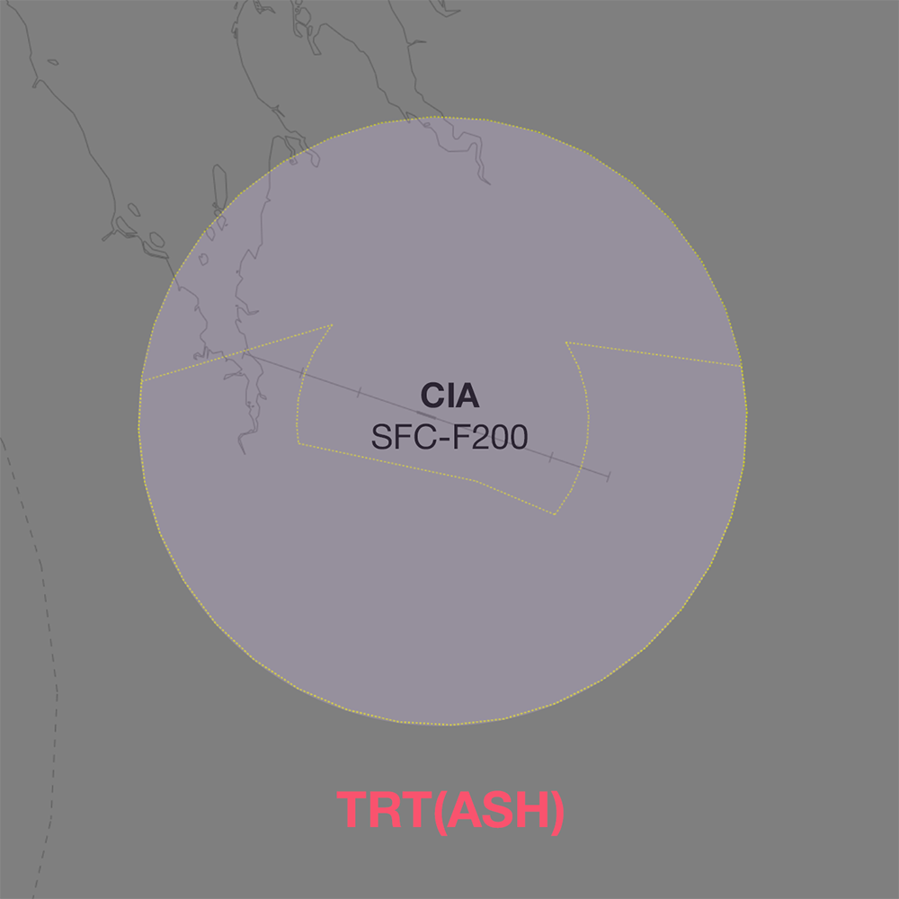
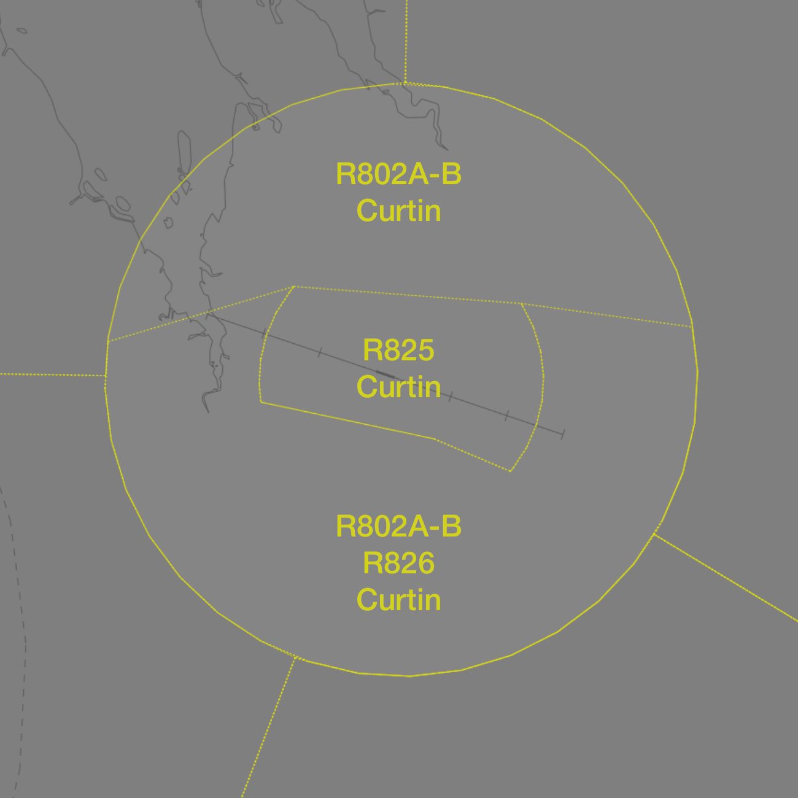

--8<-- "includes/abbreviations.md"

## Positions

| Name                          | ID      | Callsign                | Frequency   | Login ID      |
| ----------------------------- | ------- | ----------------------- | ----------- | ------------- |
| **Curtin Approach**           | **CIA** | **Curtin Approach**     | **121.000** | **CIN_APP**   |

!!! note
    Curtin TCU is a [joint military/civil TCU](../../controller-skills/military/#military-aerodromes) and procedures can differ significantly to those in a civil TCU. Ensure you are familiar with the [military controller skills](../../controller-skills/military) necessary to provide a quality service.

## Airspace
CIN APP owns the Class C and G airspace within 25 DME CIN from `SFC` to `F200`

<figure markdown>
{ width="700" }
  <figcaption>CIN TCU Structure</figcaption>
</figure>

### CIN ADC
CIN ADC owns the Class C airspace within the R825 [restricted area](../../../controller-skills/sua/#restricted-areas), `SFC` to `A035`.

### Restricted Area Activations
When **CIA** is online, the following [restricted areas](../../controller-skills/sua/#restricted-areas) are [activated](../../controller-skills/sua/#activation-of-sua) by default, and reclassified as Class C airspace.

- R802A `A035`-`F200`
- R826 `A015`-`A035`

#### SUA in Enroute Airspace
Military operations taking place in SUA in enroute airspace are outside the jurisdiction of CIN TCU.

Upon receiving [airways clearance coordination from ACD](#acd-to-cin-tcu) of an aircraft intending to operate in a currently inactive SUA in enroute airspace, CIN TCU must give **heads up** coordination to relevant enroute controllers.

This gives the enroute controller sufficient time to assess the request, make necessary adjustments to any aircraft in the area currently, and activate the SUA; or alternately to refuse the activation request before the aircraft is in the air.

!!! phraseology
    *OBAK11 is requesting clearance to operate in the M823A restricted area.*  
    **CIN ACD** -> **CIA**: "OBAK11 requests clearance to R806A”  
    **CIA** -> **CIN ACD**: "Standby, call you back."  
     
    **CIA** -> **ASH**: "On the groud YCIN, OBAK11, requests activation of R806A `F125-F200`, from 0300 until 0500.”  
    **ASH** -> **CIA**: "OBAK11, expect activation of R806A `F125-F200` at 0300 until 0500."   
    **CIA** -> **ASH**: "OBAK11."   
      
    **CIA** -> **CIN ACD**: "OBAK11, clearance approved."   
    **CIN ACD** -> **CIA**: "Clearance approved, OBAK11"  
	
!!! note
    The requirement to coordinate activation of an SUA is in **addition** to existing coordination requirements. [**Heads-up** coordination](#departures) is still required for these aircraft if they do not meet the voiceless coordination criteria.

## Local Procedures
### Initial and Pitch
The [intial points](../../../controller-skills/military/#initial-and-pitch) are aligned with Taxiway A at the following locations.

| RWY  | Initial Point | Altitude |
| ---- | ------------- | -------- |
| 11   | 5NM downwind, over Derby Highway  | `A020`   |
| 29   | 4.3NM downwind, over the Defence land perimeter boundary  | `A020`   |

### Military Gates
There are numerous [military gates](../../../controller-skills/military/#military-gates) established throughout the CIN TMA to facilitate entry and exit to adjoining SUA.

<figure markdown>
{ width="700" }
  <figcaption>CIN SUA Gates</figcaption>
</figure> 

If the pilot **does not** nominate a gate, or nominates a gate that does not provide access to their intended SUA, CIN ACD should clear the aircraft to depart via the **appropriate gate**.

| Intended SUA    | TCU Exit Gate       |
| --------------- | ------------------- |
| R803A-B         | 2 or 4  |
| R804A-B         | 6       |
| R805A-B         | 8       |
| R806A-B         | 10 or 12 |

!!! tip
    [Coordination requirements](#acd-to-cin-tcu) exist between ACD and TCU when aircraft are requesting clearance to operate in an SUA that has not been activated. Controllers performing the role of ACD should ensure they coordinate with TCU before providing clearance.
    
### Special Use Airspace
<figure markdown>
{ width="700" }
  <figcaption>Notable SUA in the CIN TMA</figcaption>
</figure>

#### R802A-B Curtin
The R802A and R802B Curtin [restricted areas](../../controller-skills/sua/#restricted-areas) are located in the northern half of the CIN TMA, and are not activated by default when CIA is online.

##### Affected Civil Operations
When activated, the restricted areas disrupt aircraft operating at Derby (YDBY). Civil aircraft may be given clearance to transit the SUA, or rerouted manually to avoid the area.

!!! phraseology
	*The R802A restricted area has been activated `A035-F200`.*   
    **FD623**: "Curtin Approach, FD623, PC-24, 4 POB, IFR, taxiing YDY for YBRM, runway 29."   
    **CIA**: "FD623, Curtin Approach. Squawk 5136, no reported IFR traffic. report lined up for airways clearance."   
    **FD623**: "Squawk 5136, wilco, FD623"   
    ...
    **FD623**: "FD623, lined up"   
    **CIA**: "FD623, cleared to YBRM direct, climb to `F190`"    
    **FD623**: "Climb YBRM direct, climb to `F190`, FD623."  

## Coordination
### Enroute
#### Departures
Voiceless coordination is in place from CIN TCU to TST(ASH) for aircraft assigned the lower of `F190` and `RFL`. 

Any aircraft not meeting the above criteria must be prior coordinated to ENR.

!!! phraseology
    **CIA** -> **ASH**: "ASY404, with your concurrence, will be assigned F180, for my separation with JTE654"  
    **ASH** -> **CIA**: "ASY404, concur F160"  

#### Arrivals
The standard assignable level from TST(ASH) to CIN TCU is `F130`, and tracking via CIN VOR. All other aircraft must be prior coordinated.

### CIN ADC
#### Departures
[Next](../controller-skills/coordination.md#next) coordination is required from CIN ADC to CIN TCU for all aircraft.

The Standard Assignable Level from  **CIN ADC** to **CIN TCU** is:

| Aircraft | Level |
| -------- | ----- |
| All | The lower of `F190` and `RFL` |

### ACD to CIN TCU
The controller assuming responsibility of **ACD** shall give [heads-up](../../../controller-skills/coordination/#airways-clearance) coordination to CIA (or the enroute controller responsible for the CIN TCU) prior to the issue of a clearance to an aircraft intending to operate in an SUA that **has not** been activated. 

!!! phraseology
    **CIN ACD** -> **CIA**: "OBAK11 requests clearance to R806A”  
    **CIA** -> **CIN ACD**: "OBAK11, clearance approved."  

## Charts
!!! abstract "Reference"
    In addition to the civilian `ERSA` and `AIP` publications, [the RAAF AIP website](https://ais-af.airforce.gov.au/australian-aip){target=new} contains the necessary charts (available in the TERMA) and description of procedures (in each airports' FIHA).