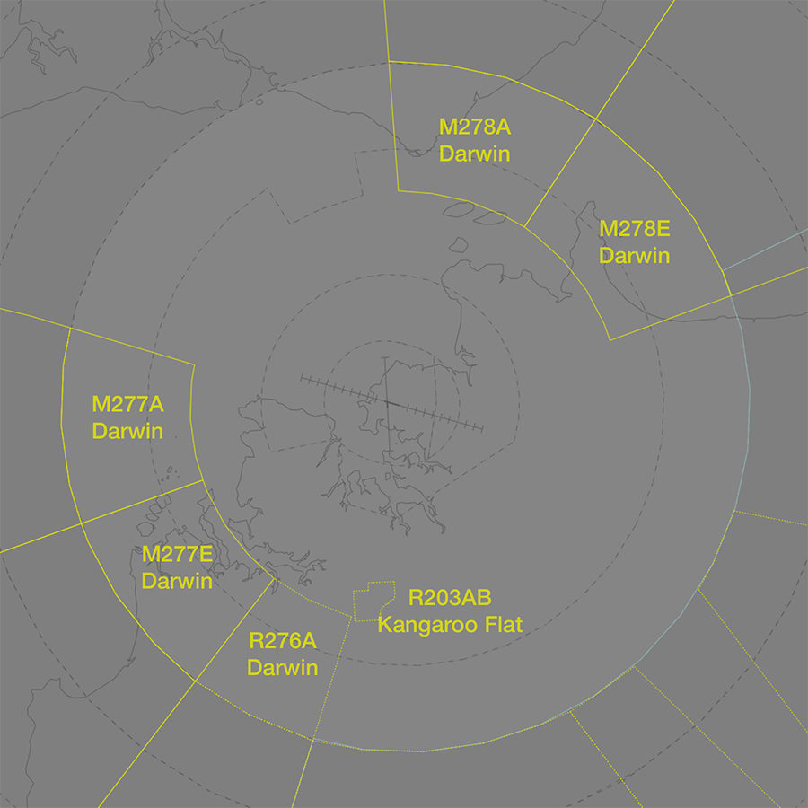

--8<-- "includes/abbreviations.md"

## Positions

| Name                          | ID      | Callsign                | Frequency   | Login ID      |
| ----------------------------- | ------- | ----------------------- | ----------- | ------------- |
| **Darwin Approach East**      | **DAE** | **Darwin Approach**     | **125.200** | **DN_APP**    |
| Darwin Approach West :material-information-outline:{ title="Non-standard position"} | DAW | Darwin Approach | 134.100 | DN-W_APP |

!!! abstract "Non-Standard Positions"
    :material-information-outline: Non-standard positions may only be used in accordance with [VATPAC Air Traffic Services Policy](https://vatpac.org/publications/policies){target=new}.  
    Approval must be sought from the **bolded parent position** prior to opening a Non-Standard Position, unless [NOTAMs](https://vatpac.org/publications/notam){target=new} indicate otherwise (eg, for events).
    
!!! note
    Darwin TCU is a [joint military/civil TCU](../../controller-skills/military/#military-aerodromes) and procedures can differ significantly to those in a civil TCU. Ensure you are familiar with the [military controller skills](../../controller-skills/military) necessary to provide a quality service.

## Airspace
DN TCU owns the Class C and G airspace within 40NM DME DN from `SFC`to `F180`.

### DN ADC
**DN ADC** owns the Class C airspace in the DN MIL CTR `SFC` to `A010`. 

### Airspace Division

<figure markdown>
{ width="700" }
  <figcaption>DN TCU Structure</figcaption>
</figure>

!!! warning "Important"
	Separation between aircraft tracking along the runway 18/36 extended centreline is a **joint responsibility** of DAE and DAW. Aircraft will be assigned the appropriate departure frequency according to their direction of travel, and each controller will apply separation from the other departure controllers' traffic.
    
### Restricted Area Activations
There are no [restricted areas or MOAs](../../controller-skills/sua) activated by default when DN TCU is online.

#### SUA in Enroute Airspace
Military operations taking place in SUA in enroute airspace are outside the jurisdiction of TL TCU.

Upon receiving [airways clearance coordination from ACD](#acd-to-dn-tcu) of an aircraft intending to operate in a currently inactive SUA in enroute airspace, TL TCU must give **heads up** coordination to relevant enroute controllers.

This gives the enroute controller sufficient time to assess the request, make necessary adjustments to any aircraft in the area currently, and activate the SUA; or alternately to refuse the activation request before the aircraft is in the air.

!!! phraseology
    *GRFN11 is requesting clearance to operate in the M278A-D restricted area.*  
    **DN ACD** -> **DAE**: "GRFN11 requests clearance to M278A-D”  
    **DAE** -> **DN ACD**: "Standby, call you back."  
     
    **DAE** -> **TRT**: "On the groud YBTL, GRFN11, requests activation of M278A-D `A050-F600`, from 0300 until 0500.”  
    **TRT** -> **DAE**: "GRFN11, expect activation of M278A-D `A050-F600` at 0300 until 0500."   
    **DAE** -> **TRT**: "GRFN11."   
      
    **DAE** -> **DN ACD**: "GRFN11, clearance approved."   
    **DN ACD** -> **DAE**: "Clearance approved, GRFN11"  

!!! note
    The requirement to coordinate activation of an SUA is in **addition** to existing coordination requirements. [**Heads-up** coordination](#departures) is still required for these aircraft if they do not meet the voiceless coordination criteria.

## Local Procedures
### Initial and Pitch
The [intial points](../../../controller-skills/military/#initial-and-pitch) are at 5 TAC, aligned with Runway 11 and 29. Aircraft will arrive via a straight initial.

### Military Gates
There are numerous [military gates](../../../controller-skills/military/#military-gates) established throughout the TMA to facilitate entry and exit to adjoining SUA.

<figure markdown>
{ width="700" }
  <figcaption>DN SUA Gates</figcaption>
</figure>

If the pilot **does not** nominate a gate, or nominates a gate that does not provide access to their intended SUA, DN ACD should clear the aircraft to depart via the **appropriate gate**.

| Intended SUA    | TCU Exit Gate        |
| --------------- | -------------------- |
| M277A-D         | Gates 6-8            |
| M277E-H         | Gates 5-6            |
| M278A           | Gates A25-C25        |
| M278B-D         | Gates A40-C40        |
| M278E           | Gates C25-E25        |
| M278F-H         | Gates A40-C40        |
| R245            | Gates 2-3            |
| R251            | Gate 1               |
| R276A-D         | Gate 4               |

!!! tip
    [Coordination requirements](#acd-to-dn-tcu) exist between ACD and TCU when aircraft are requesting clearance to operate in an SUA that has not been activated. Controllers performing the role of ACD should ensure they coordinate with TCU **before** providing clearance.

### North Eastern Training Area
IFR aircraft requiring an area for training shall be cleared to operate in the North Eastern Training Area (NETA)  
The NETA is defined as the area between DN 360R-060R from 15NM-30NM DN DME.  
Aircraft are to be cleared to the NETA via the 030R outbound. Vertical limits are to be specified by DAW prior to issuing airways clearance  

### Special Use Airspace
<figure markdown>
{ width="700" }
  <figcaption>Notable SUA in the DN TMA</figcaption>
</figure>

#### M277A-H Darwin
The M277A-H Darwin [MOAs](../../controller-skills/sua/#military-operating-areas) are located southwest of YPDN, `NOTAM-NOTAM`. M277A and M277E are entirely within DN TCU airspace, while M277B-D and M277F-H are in TRT airspace.

Aircraft will generally enter and exit the MOA via the appropriate [military gate](#military-gates).

##### Affected Civil Operations
Activation of the MOA disrupts traffic on the **J151** high altitude airway, and aircraft departing via the HELLI SID. Aircraft may be given an additional requirement to climb above the vertical limits of the activation, or rerouted manually to avoid the area.

!!! phraseology
	*QFA849 has departed YPDN Runway 11 on the HELLI SID, bound for YPPH. The M277E restricted area has been activated `SFC-F150`.*   
    **DAE**: "QFA849, Darwin Approach, identified. Climb via SID to `F180`, requirement to reach `A160` by UTTOX."   
    **QFA849**: "Climb via SID to `F180`, requirement to reach `A160` by UTTOX, QFA849."  

#### M278A-H Darwin
The M278A-H Darwin [MOAs](../../controller-skills/sua/#military-operating-areas) are located northeast of YPDN, `NOTAM-NOTAM`. M278A and M278E are entirely within DN TCU airspace, while M278B-D and M278F-H are in TRT and TRS airspace.

Aircraft will generally enter and exit the MOA via the appropriate [military gate](#military-gates).

#### R203A-B Mount Bundey
The R203A-B Mount Bundey [restricted area](../../controller-skills/sua/#restricted-areas) is located south of YPDN, `SFC-NOTAM`. The restricted area is generally used for low-level military helicopter training operations based out of Robertson Barracks (YRBK).

#### R276A Darwin
The R276A Darwin [restricted areas](../../controller-skills/sua/#restricted-areas) are located southwest of YPDN, `NOTAM-NOTAM`. 

Aircraft will generally enter and exit the restricted areas via the appropriate [military gate](#military-gates).

##### Affected Civil Operations
Activation of the restricted areas disrupts traffic on the **J72** high altitude airway, and aircraft arriving via the WANGI STAR. Aircraft may be given an additional requirement to remain above the vertical limits of the activation, or rerouted manually to avoid the area.

### VFR Arrivals/Departures
VFR aircraft generally track via designated VFR routes, as shown on the Darwin VTC. Inbound aircraft tracking via the DN CTA shall be cleared for a VFR route based on their inbound direction.

| Inbound Radial | Route | Waypoints | 
| --------------- | ----- | ------------ |
| 270-044 | VFR Route 1 | `CGR JAC LPT`  |
| 045-104 | VFR Route 2 | `ADRM JAC LPT` |
| 105-133 | VFR Route 3 | `ADB LAD CHI`  |
| 134-179 | VFR Route 4 | `MTD LAD CHI`  |
| 180-269 | VFR Route 5 | `BYNO CHI`     |

!!! phraseology
    **DAE**: "LKU, cleared to YPDN via VFR Route 3, maintain `A035`"

VFR fixed wing aircraft entering the CTR directly from Class G and helicopters tracking via the [Talc Head](../../aerodromes/classc/Darwin/#departures) coded clearance shall contact **DN ADC** for clearance.

## Runway Modes
### LAHSO
!!! warning "Important"
    Due to its operational complexity, LAHSO **must be authorised by a senior VATPAC staff member or a nominated event coordinator**.

Detailed procedures exist to ensure that controllers are aware of their responsibilities when performing LAHSO. See [Controller Skills](../controller-skills/runwaymanagement.md#lahso) for more information.

## Flow
### Local Knowledge
- Aircraft may be assigned the Whiskey STAR to reduce track miles
- Non-jet aircraft may be assigned runway 18/36 (when suitable) to increase arrival rate
- LAHSO runway mode will increase arrival rate when aircraft of different categories are inbound (see [activation prerequisites](#lahso) for specific LAHSO approvals required)

### Flow Tables
The tables below give an estimated time **in minutes** from the **Feeder Fix** to the **Threshold**.

=== "Jets & DH8D"
    | STAR       | RWY 11 | RWY 29 |
    | ---------- | :------: | :------: |
    | **ANUPA A/X** *Feeder Fix: SUDAG*  |  12^    |  18     |
    | **GATOR A/X**  | 17     | 13     |
    | **VEGPU A/X**  | 13     | 8^     |
    | **VEGPU W**    | 11^    | -      |
    | **WANGI A/X**  | 15     | 17     |
    | **WANGI W**    | 14     | 15     |

=== "Non-Jets"
    | STAR       | RWY 11 | RWY 29 |
    | ---------- | :------: | :------: |
    | **ANUPA A/X** *Feeder Fix: SUDAG*  |  13^    |  21     |
    | **GATOR A/X**  | 19     | 14     |
    | **VEGPU A/X**  | 15     | 9^     |
    | **VEGPU W**    | 13^    | -      |
    | **WANGI A/X**  | 17     | 19     |
    | **WANGI W**    | 16     | 17     |

#### Corrections

| Situation | Correction |
| ----- | ----- |
| Assigned a reduced speed | +1 min, *except ^* | 
| Over 40kt of head/tailwind component | +1 min for headwind -1 min for tailwind |

#### Assumptions
- Nil wind
- The feeder fix for all STARs is the waypoint coinciding with the title of the STAR, except:
    - The feeder fix for the ANUPA STAR is **SUDAG**

### Calculator

The following calculator will generate a landing time from a feeder fix ETA, or the reverse.

=== "Landing Time"
    

=== "Feeder Fix Time"
    

## Coordination
### Enroute
#### Departures
Voiceless for all aircraft:

- Tracking via a Procedural SID terminus; and  
- Assigned the lower of `F180` or the `RFL`

!!! note
    Aircraft are *not required* to be tracking via the **SID procedure**, simply tracking via any of the terminus waypoints (regardless of *departure airport* or *assigned SID*) is sufficient to meet the criteria for **voiceless coordination**.

All other aircraft going to TRT CTA must be **Heads-up** coordinated by DN TCU prior to the boundary.

!!! phraseology
    **DAW** -> **TRT**: "PFY1234, with your concurrence, will be assigned F160, for my separation with JTE654"  
    **TRT** -> **DAW**: "PFY1234, concur F160"  

#### Arrivals
Voiceless for all aircraft:

- With ADES **YPDN**; and  
- Assigned a STAR; and  
- Assigned `F120`

!!! note
    When QNH falls below 980 hPa, **DN TCU** and **TRT**  shall coordinate a suitable level as `F120` is unavailable.

All other aircraft coming from TRT CTA will be **Heads-up** coordinated to DN TCU. 

### DN ADC
#### Auto Release
[Next](../controller-skills/coordination.md#next) coordination is required from DN ADC to DN TCU for all aircraft.

The Standard Assignable Level from  **DN ADC** to **DN TCU** is:

| Aircraft | Level |
| -------- | ----- |
| IFR aircraft assigned a **Procedural** SID | The lower of `F180` and `RFL` |
| IFR aircraft **not** assigned a **Procedural** SID | The lower of `A030` and `RFL` |
| VFR aircraft | The lower of `A020` and `RFL` |

#### ACD to DN TCU
The controller assuming responsibility of **ACD** shall give [heads-up](../../../controller-skills/coordination/#airways-clearance) coordination to DN TCU (or the enroute controller responsible for the DN TCU) prior to the issue of a clearance to an aircraft intending to operate in an SUA that **has not** been activated. 

!!! phraseology
    **DN ACD** -> **DAE**: "GRFN11 requests clearance to M278A”  
    **DAE** -> **DN ACD**: "GRFN11, clearance approved."  

 
### DN TCU Internal
Heads-up coordination is not required between DAW and DAE for:

- Departures on a Procedural SID and assigned `F180`  
- Arrivals on a STAR assigned `A060`  

All other aircraft must be heads-up coordinated prior to the airspace boundary  

!!! phraseology
    **DAW** -> **DAE**: "via DN, CFH23"  
    **DAE** -> **DAW**: "CFH23, A090"   

## Charts
!!! abstract "Reference"
     In addition to the civilian `ERSA` and `AIP` publications, [the RAAF AIP website](https://ais-af.airforce.gov.au/australian-aip){target=new} contains the necessary charts (available in the TERMA) and description of procedures (in each airports' FIHA).