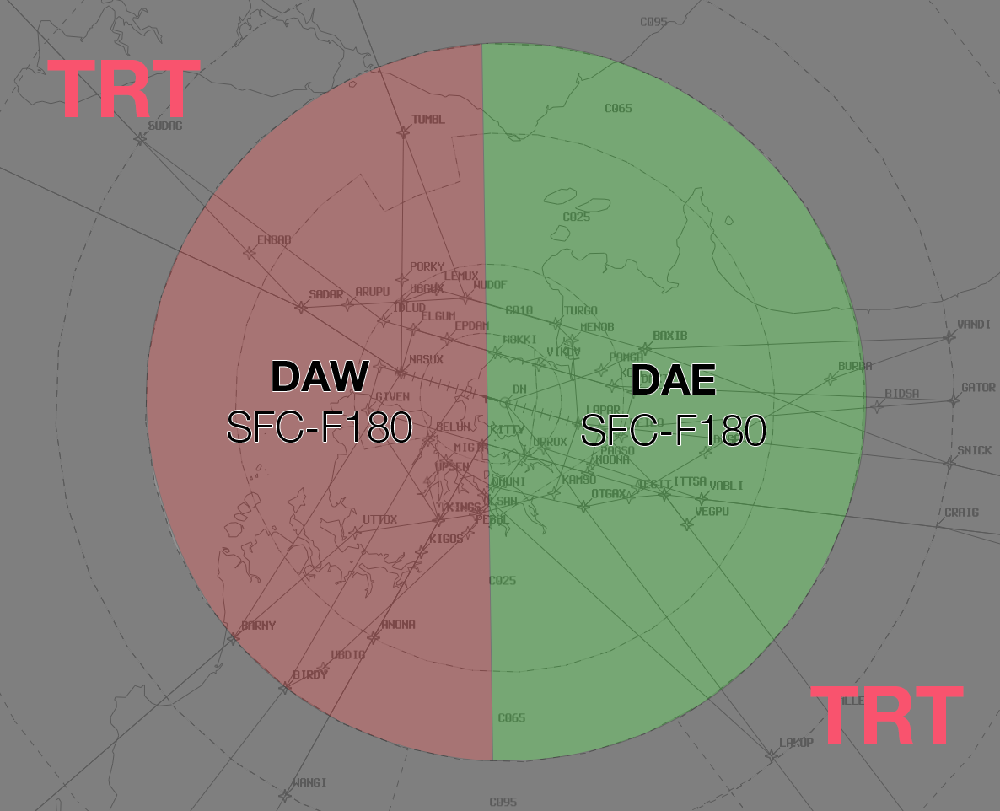

--8<-- "includes/abbreviations.md"

## Positions

| Name               | ID      | Callsign       | Frequency        | Login ID              |
| ------------------ | --------------| -------------- | ---------------- | --------------------------------------|
| **Darwin Approach East**    |**DAE**| **Darwin Approach**  | **125.200**         | **DN_APP**          |
| Darwin Approach West†   |DAW| Darwin Approach   | 134.100         | DN-W_APP                                  |

† *Non-standard positions* may only be used in accordance with [VATPAC Air Traffic Services Policy](https://vatpac.org/publications/policies){target=new}

## Airspace
### TCU
DN TCU owns the airspace within a 40NM radius of the DN DME from `SFC`–`FL180`  

DN TCU is also responsible for Active Restricted Area R264 A-K and R230 A-F  

DAW may request DN TCU (`SFC`–`F240`) from TRT to facilitate military transits to/from R264 A-K and R230 A-F  

### Airspace Division
When both DN TCU positions are opened, DN TCU is split east and west along the runway 18/36 extended centreline. DAW owns the airspace to the west of the line and DAE owns the airspace to the east of the line  

<figure markdown>
{ width="700" }
  <figcaption>DN TCU Airspace</figcaption>
</figure>

### ADC
ADC owns the airspace within the DN CTR (`SFC`–`A010`). This airspace is designed to facilitate the processing of helicopter scenic flights and low-level helicopter circuits.  
The CTR extends 7NM from the thresholds of runways 11 and 29 but does not including the Robertson Barracks transit zone.  

ADC may request DN TCU (`SFC`–`A020`) from DN TCU to facilitate fixed-wing circuit operations:  
a) Fixed-wing circuit operations are typically conducted at Delissaville (YDLV) due to high traffic density at Darwin  
b) ADC may deny requests for circuits if IFR traffic may be unduly delayed  

<figure markdown>
{ width="700" }
  <figcaption>DN ADC Airspace</figcaption>
</figure>

### Surveillance
DN ADC is permitted to use Surveillance standards for separation. Surveillance coverage can be expected to be available at all levels in the DN ADC airspace.  
For simulation purposes, visual separation is assumed to exist below the cloud base, and within 7nm of the aerodrome. Visual separation can still be used to separate from aircraft on an instrument approach, below the cloud base.

## Aerodrome

### Runway Modes
Runway selection shall be coordinated by DN ADC. In any case, a change of runway mode shall not be broadcast on the ATIS until DAW accepts the change.  

The Runway Mode options available are:

a) Runway 29 and Runway 36;  
b) Runway 29 and Runway 18;  
c) Runway 29 only;  
d) Runway 11 and Runway 36;  
e) Runway 11 and Runway 18;  
f) Runway 11 only.  

#### Non-RNAV Departures
For non-RNAV approved IFR aircraft with a wake turbulence category of medium or greater, issue a Radar SID  
For non-RNAV approved IFR aircraft with a wake turbulence category of light, issue a visual departure or Radar SID  

## Charts
!!! note
    Additional charts to the AIP may be found in the RAAF TERMA document, available towards the bottom of [RAAF AIP page](https://ais-af.airforce.gov.au/australian-aip){target=new}

## Miscellaneous

### IFR Training Area
IFR aircraft requiring an area for training shall be cleared to operate in the North Eastern Training Area (NETA)  
The NETA is defined as the area between DN 360R–060R from 15NM–30NM DN DME.  
Aircraft are to be cleared to the NETA via the 030R outbound. Vertical limits are to be specified by DAW prior to issuing airways clearance  

### Designated Fuel Dumping Area
Other than in an emergency, the designated fuel jettison area is:  
a) Over water in the Beagle Gulf  
b) Between the 320 and 020 TACAN radials  
c) `A060` or above  
### Robertson Barracks
Darwin TCU is not responsible for traffic or separation services within the A005 step to the east of Darwin. This step is designed for low-level VFR MIL helos to transit in/out of Robertson Barracks without the need for communication with Darwin TCU.

## Coordination
### Enroute
#### Departures
Voiceless for all aircraft:

- Tracking via a Procedural SID terminus; and  
- Assigned the lower of `F180` or the `RFL`

!!! note
    Aircraft are *not required* to be tracking via the **SID procedure**, simply tracking via any of the terminus waypoints (Regardless of *departure airport* or *assigned SID*) is sufficient to meet the criteria for **voiceless coordination**

All other aircraft going to TRT CTA must be **Heads-up** Coordinated by DN TCU prior to the boundary.

!!! example
    **DN TCU** -> **TRT**: "PFY1234, with your concurrence, will be assigned F160, for my separation with JTE654"  
    **TRT** -> **DN TCU**: "PFY1234, concur F160"  

#### Arrivals
Voiceless for all aircraft:

- With ADES **YPDN**; and  
- Assigned a STAR; and  
- Assigned `A100`

All other aircraft coming from TRT CTA will be **Heads-up** Coordinated to DN TCU.

### ADC
#### Airspace
DN ADC owns the airspace within the DN CTR `SFC`–`A010`.

#### Auto Release
"Next" Coordination is a procedure where the **DN ADC** controller gives a heads-up to the DN TCU controller about an impending departure. The DN TCU controller will respond by assigning a heading to the aircraft, for the **DN ADC** controller to pass on with their takeoff clearance.

!!! example
    **DN ADC** -> **DN TCU**: "Next, ABC, runway 18"  
    **DN TCU** -> **DN ADC**: "ABC, Track Extended Centreline, unrestricted"  
    **DN ADC** -> **DN TCU**: "Track Extended Centreline, unrestricted, ABC"  

All departures from 18/36 require departure coordination with **DN TCU**

#### IFR Departures
The Standard Assignable level from **DN ADC** to **DN TCU** is the lower of `F180` or the `RFL`.  
If the aircraft is **not** planned via an RNAV SID and has a light wake turbulance cateogry, they are to be assigned the lower of `A030` or the `RFL`.

#### VFR Departures
`A020` or the planned level; whichever is lower, to all VFR aircraft.  

VFR aircraft are required to track via one of the published VFR Routes.  

VFR routes shall be assigned based on the destination radial from Darwin.  

Assign VFR routes in accordance with the following radial chart:  

|Outbound Radial |Assigned VFR Route|
|---|---|
|360 – 040 |VFR Route 1|
|041 – 084 |VFR Route 2|
|085 – 124 |VFR Route 3|
|125 – 180 |VFR Route 4|
|181 – 224 |VFR Route 5|
|225 – 359| Direct|

!!! tip
    If a VFR aircraft has not planned via a VFR route as above, use the phraseology: “ABC, cleared amended route VFR route 1, maintain A020, squawk 4512”

#### Auto-Release Wedge

The Darwin auto-release wedges extend from the departure end runway threshold, 30 degrees splayed from the centreline, to 7nm  

Auto-release at Darwin is only available for VFR aircraft and low-level IFR aircraft.

Tower may depart aircraft that conform with the above conditions within the auto-release wedge using the following headings:

|Departure Type| Runway 11| Runway 29|
|---|---|----|
|VFR |H070V, H106V or H140V| H260V, H286V or H320V|
|IFR (Visual Dep)| H070V, H106V, or H140V |H260V, H286V or H320V|
|IFR (Radar)| H070, H106 or H140 |H260, H286 or H320|

!!! tip
    Tower shall provide visual separation between aircraft in the auto-release wedge and subsequent departures until the preceding departure has been maneuvered by TCU
 
### DN TCU Internal
Heads-up coordination is not required between DAW and DAE for:

- Departures on a Procedural SID and assigned `F180`  
- Arrivals on a STAR assigned `A060`  

All other aircraft must be heads-up coordinated prior to the airspace boundary  

!!! example
    **DAW** -> **DAE**: "via DN, CFH23"  
    **DAE** -> **DAW**: "CFH23, A090"   