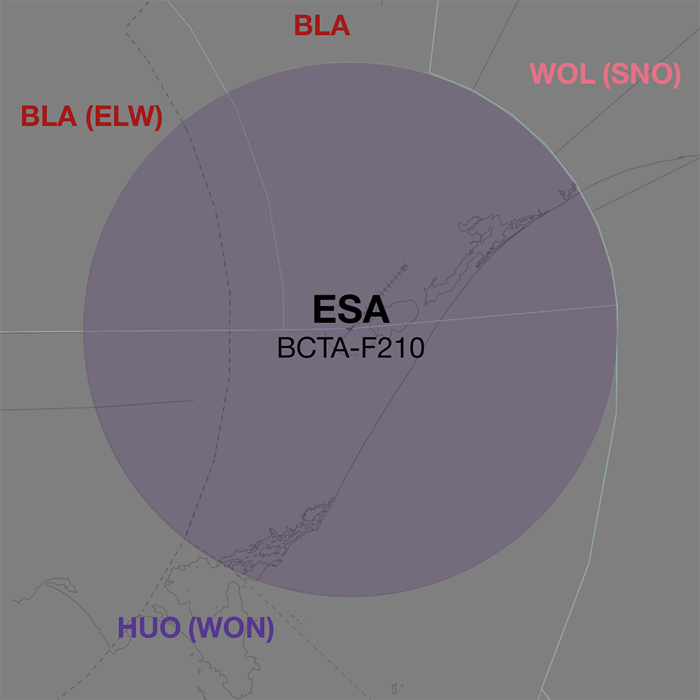

--8<-- "includes/abbreviations.md"

## Positions

| Name                          | ID      | Callsign                | Frequency   | Login ID      |
| ----------------------------- | ------- | ----------------------- | ----------- | ------------- |
| **East Sale Approach**        | **ESA** | **Sale Approach**       | **123.300** | **ES_APP**    |

!!! note
    East Sale TCU is a [military TCU](../../controller-skills/military/#military-aerodromes) and procedures can differ significantly to those in a civil TCU. Ensure you are familiar with the [military controller skills](../../controller-skills/military) necessary to provide a quality service.

## Airspace
TL TCU owns the Class C and G airspace within 50 DME YMES ARP, `SFC` to `F210`.

<figure markdown>
{ width="700" }
  <figcaption>ES TCU Structure</figcaption>
</figure>

### Restricted Area Activations
When **TNA** is online, the following [restricted areas](../../controller-skills/sua/#restricted-areas) are [activated](../../controller-skills/sua/#activation-of-sua) by default, and reclassified as Class C airspace.

- M301A `A040 - F210`
- R360A `SFC - A060`
- R360B `A010 - A060`
- R360C `A060 - F210`
- R360D `A040 - F210`
- R360EF `A060 - F210`

#### SUA in Enroute Airspace
Military operations taking place in SUA in enroute airspace are outside the jurisdiction of ES TCU.

Upon receiving [airways clearance coordination from ACD](#acd-to-es-tcu) of an aircraft intending to operate in a currently inactive SUA in enroute airspace, ES TCU must give **heads up** coordination to relevant enroute controllers.

This gives the enroute controller sufficient time to assess the request, make necessary adjustments to any aircraft in the area currently, and activate the SUA; or alternately to refuse the activation request before the aircraft is in the air.

!!! phraseology
    *HRTG11 is requesting clearance to operate in the M301B restricted area.*  
    **ES ACD** -> **ESA**: "HRTG11 requests clearance to M301B”  
    **ESA** -> **ES ACD**: "Standby, call you back."  
     
    **ESA** -> **HUO**: "On the groud YMES, HRTG11, requests activation of M301B `F210-F450`, from 0300 until 0500. [My onwards](../../controller-skills/coordination/#onwards-coordination) with BLA”  
    **HUO** -> **ESA**: "HRTG11, expect activation of R225D `A095-F600` at 0300 until 0500, your onwards with BLA."   
    **ESA** -> **HUO**: "HRTG11."   
      
    **ESA** -> **ES ACD**: "HRTG11, clearance approved."   
    **ES ACD** -> **ESA**: "Clearance approved, HRTG11"  
	
!!! note
    The requirement to coordinate activation of an SUA is in **addition** to existing coordination requirements. [**Heads-up** coordination](#departures) is still required for these aircraft if they do not meet the voiceless coordination criteria.

## Local Procedures
### Initial and Pitch
The [intial points](../../../controller-skills/military/#initial-and-pitch) are aligned with Taxiway A at the following locations.

| RWY  | Initial Point | Altitude |
| ---- | ------------- | -------- |
| 04   | Longford Road overpass | `A015` |
| 09   | Comfort Inn Motel      | `A015` |
| 22   | Lake 2NM west of Lake Wellington Yacht Club | `A015` |
| 27   | Western edge of Lake Wellington | `A015` |

### Coded Clearances
Aircraft departing to certain specified training areas may be cleared a coded clearance.

<figure markdown>
{ width="600" }
  <figcaption>Specified Training Areas within ES TMA</figcaption>
</figure>

!!! tip
    [Coordination requirements](#acd-to-es-tcu) exist between ACD and TCU when aircraft are requesting clearance to operate in an SUA that has not been activated. Controllers performing the role of ACD should ensure they coordinate with TCU **before** providing clearance.

#### Low Flying Area
The **Low Flying Area** is located in the south-west of the ES TMA `SFC-A020`, entirely within the R360A restricted area.

Aircraft requesting clearance to operate in the area will be cleared a 'LOW FLYING AREA' clearance by ACD. This clearance gives aircraft permission to track to, and operate within, the area.

!!! note
    ACD will write the coded clearance in the **global ops field** prior to issuing clearance, for the awareness of other controllers.
    
When the area is active the [ATIS will be updated](../../aerodromes/classc/EastSale/#specified-training-area-activations) to reflect the activation.
    
#### Roulette Training Area
The **Roulette Training Areas** are located in the north-east of the ES TMA `SFC-A060`, entirely within the R360A restricted area. There are two training areas: 

- Training Area North
-  Training Area South

Training Area South may be activated in isolation, whereas Training Area North can only be activated in conjunction with Training Area South.

Aircraft requesting clearance to operate in the area will be cleared a 'ROULETTE TRAINING AREA' clearance by ACD. This clearance gives aircraft permission to track to, and operate within, the area.  

!!! note
    ACD will write the coded clearance in the **global ops field** prior to issuing clearance, for the awareness of other controllers.
    
When the area is active the [ATIS should be updated](../../aerodromes/classc/EastSale/#specified-training-area-activations) to reflect the activation.

### Training Areas
The ES TMA is divided into sixteen individual training areas to facilitate local training operations. 

<figure markdown>
{ width="700" }
  <figcaption>ES Training Areas</figcaption>
</figure>

The inner training areas (designated 'A-H') extend from 12NM to 35NM YMES ARP, and the outer training areas (designated 'S-Z') extend from 35NM to 50NM YMES ARP.

Aircraft requesting clearance to operate in a training area will be cleared via the appropriate [military gate or lane](#military-gates).

### Military Gates
There are numerous [military lanes](../../../controller-skills/military/#military-gates) established throughout the ES TMA to facilitate entry and exit to [training areas](#training-areas) and SUA.

<figure markdown>
{ width="700" }
  <figcaption>ES SUA Gates</figcaption>
</figure>

| Intended [Training Area](#training-areas) | TCU Outbound Lane  |
| ----------------------------------------- | ------------------ |
| A, H, S, Z | NORTHERN Lane |
| B, C, T, U | EASTERN Lane  |
| D, E, V, W | SOUTHERN Lane |
| F, G, X, Y | WESTERN Lane  |

!!! tip
    [Coordination requirements](#acd-to-es-tcu) exist between ACD and TCU when aircraft are requesting clearance to operate in an SUA that has not been activated.
    
### VFR Routes
There are several VFR routes established in the ES TMA to faciliate the movement of civil VFR traffic.

<figure markdown>
{ width="700" }
<figcaption>VFR Routes in the ES TMA</figcaption>
</figure>

#### D354 VFR Transit Lane
The D354 VFR Transit Lane is available following the disused Gippsland Railway, allowing aircraft to transit underneath the [R360A restricted area](#r360a-f-east-sale) from east to west (or vice versa). It follows the Gippsland Railway southwest from COWR to LOWS and is wholly contained within the [D353 danger area](../../controller-skills/sua/#danger-areas) `SFC-A010`. A clearance is **not** required to track via the corridor and aircraft are not required to monitor the ESA frequency.

#### Longford Lane
The Longford Lane facilitates movements between Longford Helipad (YUOF) and off-shore platforms in the Bass Strait. The lane is defined as the area between 1NM south of Longford-Golden Beach Rd and Longford-Loch Sport Rd, 1NM east of Longford Seaspray Rd, and the coastline, `SFC - A020`.

Helicopters arriving and departing YUOF may transit the line without clearance. All other aircraft intending to transit the lane require a clearance from **ESA** prior to entering controlled airspace.

!!! phraseology
    *ABC intends to transit the ES TMA along the coast, northbound. This course will require them to pass through the Longford Lane*
    **ABC**: "Sale Approach, ABC, Bonanza, 5 miles south of WELS, `A015`, for LKEE, request clearance"  
    **ESA**: "ABC, Sale Approach, squawk 0153, remain outside controlled airspace"  
    **ABC**: "Remain outside controlled airspace, squawk 0153, ABC"  
    ...   
    **ESA**: "ABC, identified, cleared LKEE via WELS, MGBH, LSR. Maintain `A015`."  
    **ABC**: "Cleared LKEE via WELS, MGBH, LSR, maintain `A015`, ABC." 

Aircraft transiting the TMA that will pass through the Longford Lane should be provided with a traffic statement of all traffic observed within the lane.

!!! phraseology
    **ESA**: "ABC, traffic is EXH, a AW139, inbound to YUOF, currently 15 north east of MGBH, indicating `A012` unverified."  
    **ABC**: "Copy traffic, ABC"  

#### Princes Route
A lane of entry is available in the east of the TMA following the Princes Highway, allowing aircraft to transit through the [R360A restricted area](#r360a-f-east-sale) between FYN and YWSL. A clearance is required from **ESA** prior to entering controlled airspace. Aircraft should be cleared not above `A015`.

!!! phraseology
    **HM3**: "Sale Approach, helicopter HM3, FYN, `A015`, for the Princes Route, request clearance"  
    **ESA**: "HM3, squawk 0366, remain outside controlled airspace"  
    **HM3**: "Squawk 0366, remain outside controlled airspace, HM3"  
    ...   
    **ESA**: "HM3, identified, cleared Princes Route, not above `A015`"  
    **HM3**: "Cleared Princes Route not above `A015`, HM3"  

### West Sale (YWSL)
West Sale (YWSL) is a certified civilian aerodrome 9NM west of YMES. When the [R360A restricted area](#r360a-f-east-sale) is activated, Class C airspace extends to `SFC` over the aerodrome, and clearance from **ESA** is required for all operations.

!!! note
    While ESA is responsible for the airspace from `SFC` above YWSL, they have **no jurisdiction** over the runways, taxiways, or apron areas on the aerodrome itself.

##### Departures
Outbound aircraft will report when taxiing for departure to **ES TCU**. Controllers shall issue the aircraft with a squawk code and a traffic statement regarding any aircraft operating on, or shortly to land at, the aerodrome.

!!! note
    Both VFR and IFR aircraft require a clearance to operate in Class C airspace. The examples below show an IFR aircraft departing.

!!! phraseology
    **AM301**: "Sale Approach, AM301, King Air, IFR, taxiing YWSL for YMEN, runway 27"  
    **ESA**: "AM301, squawk 4432, no reported traffic, report lined up for airways clearance"  
    **AM301**: "Squawk 4432, wilco, AM301"

When the aircraft reports ready, and where no conflict exists, issue airways clearance.

!!! phraseology
    **AM301**: "AM301, lined up"  
    **ESA**: "AM301, cleared to YMEN via DUNNE, flight plan route, climb to `F150`, make right turn, report airborne"  
    **AM301**: "Cleared to YMEN via DUNNE, flight plan route, climb to `F150`, make right turn, AM301" 

All surface areas at YWSL are **outside TCU's jurisdiction**. Takeoff clearances are not given.

!!! phraseology
    **AM301**: "AM301, passing `A012`, climbing to `F150`"  
    **ESA**: "AM301, identified"

Where a delay is required, withhold clearance until a suitable separation standard exists.

!!! phraseology
    **AM301**: "AM301, lined up"  
    **ESA**: "AM301, short delay due to traffic inbound to YMES"  
    **AM301**: "AM301"

##### Arrivals
Inbound aircraft should be given an airways clearance by ES TCU (if not entering from ENR CTA). Aircraft may be cleared for a visual approach or one of Weipa's instrument approaches.

As a **landing clearance is not given**, aircraft should instead be informed of any traffic operating on the aerodrome and instructed to *'report clear of the runway'*, when their SARWATCH (for IFR aircraft) should be terminated.

!!! phraseology
    **AM301**: "AM301, visual"  
    **ESA**: "AM301, cleared visual approach, no reported IFR traffic, report clear of the runway"  
    **AM301**: "Cleared visual approach, AM301"  
    ...
    **AM301**: "AM301, clear of the runway, YWSL, cancel SARWATCH"  
    **ESA**: "AM301, YWSL SARWATCH terminated"

### Special Use Airspace
<figure markdown>
{ width="700" }
  <figcaption>Notable SUA in the ES TMA</figcaption>
</figure>

#### R360A-F East Sale
The R360A-F East Sale [restricted areas](../../controller-skills/sua/#restricted-areas) are located in the western half of the ES TMA and are activated by default when ESA is online.

## Runway Modes
### Circuits
The ESL and YWSL CIRA overlap overhead Sale township. To avoid conflict between aircraft conducting circuits, a line north-south through the Sale Racecourse marks the boundary between ESL and WSL circuit patterns. Pilots must report if extension beyond the racecourse is required.

#### Circuit Directions

| Runway | Direction |
| ------ | ----------|
| 05     | Right     |
| 09     | Right     |
| 14     | Right     |
| 23     | Left      |
| 27     | Left      |
| 32     | Left      |

## Coordination
### Enroute
#### Departures
Voiceless for all aircraft:

- Tracking via a Procedural SID terminus; and  
- Assigned the lower of `F200` or the `RFL`

All other aircraft going to Enroute CTA must be **Heads-up** coordinated by ESA prior to the boundary. 

#### Arrivals
Voiceless for all aircraft:

- With ADES **YMES**; 
- Assigned a STAR; and 
- Assigned `A100`

All other aircraft coming from Enroute CTA will be **Heads-up** coordinated to ESA.

### ES ADC
#### Departures
[Next](../../../controller-skills/coordination/#next) coordination is required from ES ADC to ESA for all aircraft.

The Standard Assignable Level from  **ES ADC** to **ESA** is:

| Aircraft | Level |
| -------- | ----- |
| All | The lower of `A060` and `RFL` |

#### ACD to ES TCU
The controller assuming responsibility of **ACD** shall give [heads-up](../../../controller-skills/coordination/#airways-clearance) coordination to ESA (or the enroute controller responsible for the ES TCU) prior to the issue of a clearance to an aircraft intending to operate in an SUA that **has not** been activated. 

!!! phraseology
    **ES ACD** -> **ESA**: "HDSN11 requests clearance to R360D"  
    **ESA** -> **ES ACD**: "HDSN11, clearance approved."  
    
## Charts
!!! abstract "Reference"
    In addition to the civilian `ERSA` and `AIP` publications, [the RAAF AIP website](https://ais-af.airforce.gov.au/australian-aip){target=new} contains the necessary charts (available in the TERMA) and description of procedures (in each airports' FIHA).