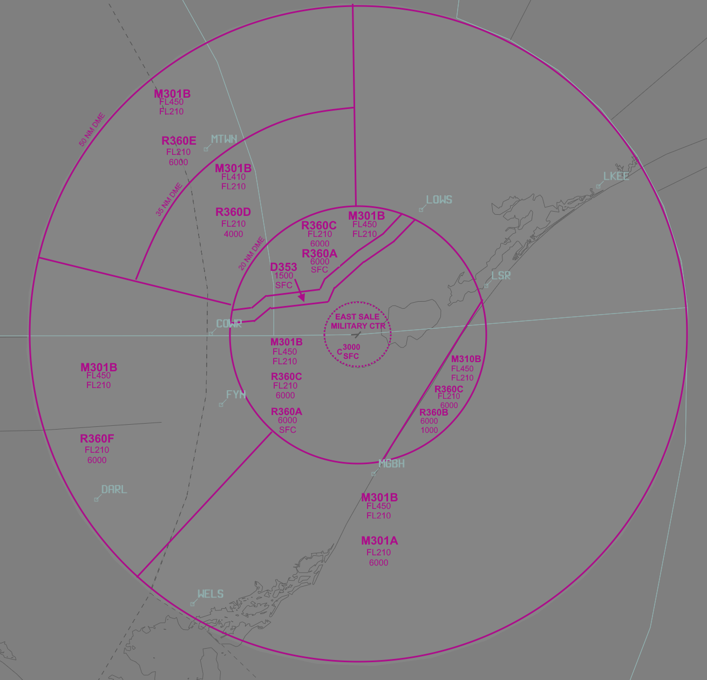
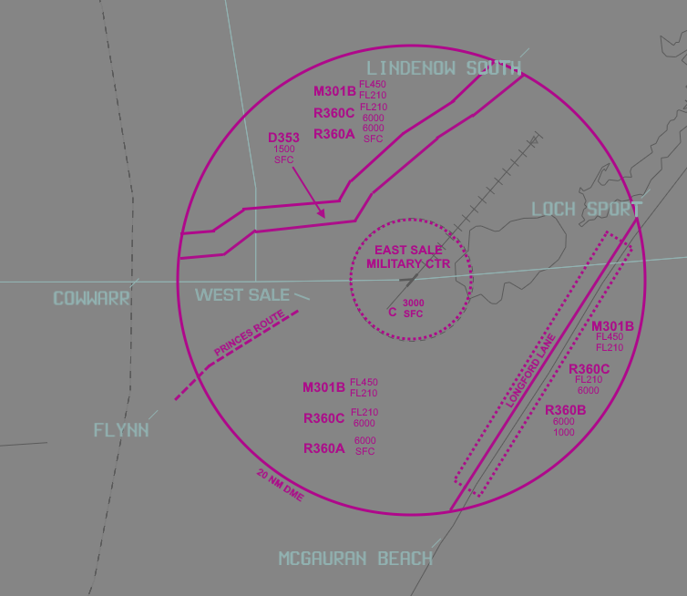
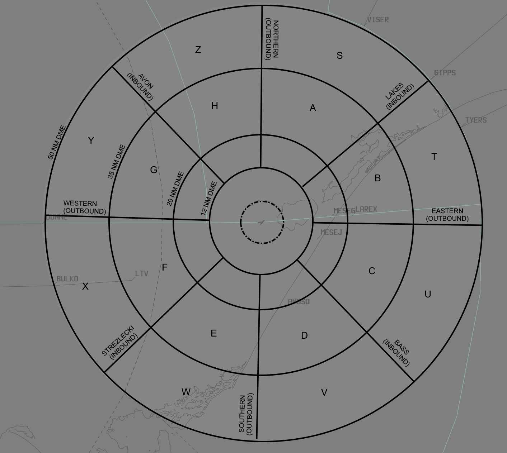

--8<-- "includes/abbreviations.md"

## Positions

| Name                          | ID      | Callsign                | Frequency   | Login ID      |
| ----------------------------- | ------- | ----------------------- | ----------- | ------------- |
| **East Sale Approach**        | **ESA** | **Sale Approach**       | **123.300** | **ES_APP**    |

## Airspace
The vertical limits of the East Sale TCU is `BCTA` to `F210`. 

<figure markdown>
{ width="700" }
  <figcaption>ES TCU Structure</figcaption>
</figure>

The enroute controllers manage the airspace beneath the active R360 sectors, with HUO(WON) controlling the southern section and BLA controlling the northern section. Coordination with both enroute controllers is needed if online.

### Airspace Division
ESA is responsible for the restricted airspace within R360. Typically, sectors R360A through R360F are active.

R393 is reserved and is activated only for special events.

If operationally necessary, ESA may also request the activation of M301 airspace segments for military exercises up to `F450`.

<figure markdown>
{ width="700" }
<figcaption>ESL TMA</figcaption>
</figure>

## Logon Process
Given the specific nature of the East Sale TCU airspace, surrounding controllers may not be fully aware of its boundaries. Upon logging on as East Sale TCU, it is essential to announce the activation status of R360/M301.

!!! phraseology
    **ESA** -> **BLA**: "Request activation of R360 from SFC to F210"

## Local Procedures
### VFR Transit

<figure markdown>
{ width="700" }
<figcaption>ESL VFR ROUTE</figcaption>
</figure>

### Transit Lane (D353)

#### The VFR Transit Lane (D353)
VFR D353 transit lane allows VFR aircraft to transit the TCU airspace. The lateral limits are approximately 1NM either side of the railway line from Cowwarr to Lindenow South, passing through Heyfield, Maffra, and Stratford.
The vertical limit is from `SFC` to `A015`.
Clearance is not required for transit through R360A via D353.
Aircraft must monitor ESA on 123.300, and broadcast at Cowwarr and Lindenow South compulsory en route reporting points. No air traffic services are provided within D353.

#### Princes Route
Aircraft using the Princes Route should expect a clearance not above 1,500FT. Other levels may be available upon request.

#### Longford Lane (UOFL)

The Longford Lane is active at all times when R360A is active. It is an airspace reservation within R360A to allow ESSO helicopters to operate between Longford Heliport and offshore oil platforms and other aircraft to transit to the north east.
The Longford Lane extends from the `SFC` to `A020`.
Upon pilot request, clear aircraft to transit through the Longford Lane.

*RCR is a VFR Archer 10 miles to the north west of McGauran beach*  

!!! phraseology
    **RCR**: "East Sale Approach, RCR, Archer, 10 miles north west McGauran beach, 3500, request clearance Loch Sport"  
    **ESA**: "RCR, East Sale Approach, squawk 1234, remain outside charlie airspace"  
    **RCR**: "Remain OCTA, squawk 1234, RCR"  
    **ESA**: "RCR, identified, cleared McGauran Beach, Loch Sport, not above 1500"  
    **RCR**: "cleared McGauran Beach, Lock Sport, not above 1500, RCR"  

### Lanes and Training Areas

<figure markdown>
{ width="700" }
<figcaption>ESL LANES AND TRAINING AREAS</figcaption>
</figure>

#### Outbound Lanes

The outbound lanes are used by aircraft transiting to/from exterior training areas or for entry and exit of ESL military airspace. These lanes are defined by GNSS waypoints situated at 12, 35, and 50 NM from YMES AD.

Lanes extend from `SFC` or the base of restricted airspace to `F160`.

| Lane Direction | 12NM GNSS Waypoint | 35NM GNSS Waypoint | 50NM GNSS Waypoint | Bearing |
| -------------- | ------------------ | ------------------ | ------------------ | ------- |
| Northern       | LEKEM              | GONEB              | LANOS              | 359     |
| Eastern        | VEMDA              | KADRU              | TAVET              | 090     |
| Southern       | SABAX              | LUTUK              | NOLOX              | 180     |
| Western        | DUGAD              | LERKO              | DUNNE              | 270     |

#### Inbound Lanes

The inbound lanes are used to guide aircraft into the East Sale airspace from exterior areas. These lanes also rely on GNSS waypoints at 12, 35, and 50 NM from YMES AD.

| Lane Name      | 12NM GNSS Waypoint | 35NM GNSS Waypoint | 50NM GNSS Waypoint | Bearing |
| -------------- | ------------------ | ------------------ | ------------------ | ------- |
| Lakes Lane     | OMBOR              | TODIV              | GIPPS              | 049     |
| Bass Lane      | KIGAG              | REMOT              | PUKIM              | 135     |
| Strezlecki Ln  | TEBUM              | PARNVU             | RUPOD              | 224     |
| Avon Lane      | AKVIN              | UPSAL              | ENBUD              | 315     |

#### Training Areas

The training areas around East Sale are crucial for military operations. Each area is defined by specific lateral and vertical limits to ensure safe and coordinated use.

| Training Area | Location                                   | Distance        | Vertical Dimensions                                   | LSALT  |
| ------------- | ------------------------------------------ | --------------- | ----------------------------------------------------- | ------- |
| Alpha         | Northern Lane and Lakes Lane               | 12 NM to 35 NM   | SFC to F430 (12 NM to 20 NM); A050 FT to F430 (20 NM to 35 NM) | A059 FT |
| Bravo         | Lakes Lane and Eastern Lane                | 12 NM to 35 NM   | SFC to F430 (12 NM to 20 NM); A050 FT to F430 (20 NM to 35 NM) | A030 FT |
| Charlie       | Eastern Lane and Bass Lane (ESL NDB)       | 12 NM to 35 NM   | SFC to F430 (12 NM to 20 NM); A050 FT to F430 (20 NM to 35 NM) | A019 FT |
| Delta         | Bass Lane and Southern Lane                | 12 NM to 35 NM   | SFC to F430 (12 NM to 20 NM); A050 FT to F430 (20 NM to 35 NM) | A024 FT |
| Echo          | Southern Lane and Strezlecki Lane          | 12 NM to 35 NM   | SFC to F430 (12 NM to 20 NM); A050 FT to F430 (20 NM to 35 NM) | A039 FT |
| Foxtrot       | Strezlecki Lane and Western Lane           | 12 NM to 35 NM   | SFC to F430 (12 NM to 20 NM); A070 FT to F430 (20 NM to 35 NM) | A066 FT |
| Golf          | Western Lane and Avon Lane                 | 12 NM to 35 NM   | SFC to F430 (12 NM to 20 NM); A050 FT to F430 (20 NM to 35 NM); 7000 FT to FL430 (20 NM to 35 NM) | A070 FT |
| Hotel         | Avon Lane and Northern Lane                | 12 NM to 35 NM   | SFC to F430 (12 NM to 20 NM); A050 FT to F430 (20 NM to 35 NM) | A070 FT |
| Sierra        | Northern Lane and Lakes Lane               | 35 NM to 50 NM   | A050 FT to FL430                                      | A065 FT |
| Tango         | Lakes Lane and Eastern Lane                | 35 NM to 50 NM   | A050 FT to FL430                                      | A035 FT |
| Uniform       | Eastern Lane and Bass Lane                 | 35 NM to 50 NM   | A050 FT to FL430                                      | A015 FT |
| Victor        | Bass Lane and Southern Lane                | 35 NM to 50 NM   | A050 FT to FL430                                      | A017 FT |
| Whiskey       | Southern Lane and Strezlecki Lane          | 35 NM to 50 NM   | A050 FT to FL430                                      | A039 FT |
| X-ray         | Strezlecki Lane and Western Lane           | 35 NM to 50 NM   | A070 FT to FL430                                      | A066 FT |
| Yankee        | Western Lane and Avon Lane                 | 35 NM to 50 NM   | A070 FT to FL430                                      | A071 FT |
| Zulu          | Avon Lane and Northern Lane                | 35 NM to 50 NM   | A070 FT to FL430                                      | A071 FT |

## Departure and Arrivals Procedure
### Arrival Procedures

Aircraft arriving from any Training Area (TA) will remain in the TA until direct entry into an IAP is possible. ATC should anticipate the sequence to allow for efficient tracking and sequencing.

#### Visual Approach
When expect visual approach is advertised on the ATIS:

- Aircraft shall be instructed to maintain `A070`
- Track to intercept an inbound lane prior to exiting the TRA (20 NM)
- Sequence aircraft for a Visual Approach via Initial Point (IP) for the duty runway

#### Instrument 

When expect instrument approach is advertised on the ATIS:

- Aircraft shall be instructed to maintain `A070`
- Track to intercept an inbound lane prior to exiting the TRA (20 NM)
- Sequence aircraft for an Instrument Approach Procedure in accordance with the table below

| Runway   | Lane          | IAP   | IAF    | LSALT   |
| -------- | ------------- | ----- | ------ | ------- |
| RWY 09   | Lakes Lane    | TAC   | BRONY  | A044    |
| RWY 09   | Bass Lane     | TAC   | JOSSO  | A034    |
| RWY 09   | Strezlecki Ln | RNP   | MESWO  | A034    |
| RWY 09   | Avon Lane     | RNP   | MESWO  | A044    |
| RWY 22   | Lakes Lane    | RNP   | MESND  | A035    |
| RWY 22   | Bass Lane     | TAC   | WEIRD  | A019    |
| RWY 22   | Strezlecki Ln | TAC   | ENRIK/WEIRD | A044/A034 |
| RWY 22   | Avon Lane     | TAC   | ENKIL  | A044    |
| RWY 27   | Lakes Lane    | ILS-Y/RNAV | LIDVU/MESEE | A035    |
| RWY 27   | Bass Lane     | ILS-Y/RNAV | LIDVU/MESEJ | A035/A019 |
| RWY 27   | Strezlecki Ln | ILS-Y/TAC | JOSSO | A034    |
| RWY 27   | Avon Lane     | ILS-Y/TAC | BRONY | A044    |

## Runway Modes
### Circuit Procedures 
#### East Sale Circuit Area (ESL CIRA)

The East Sale Circuit Area (ESL CIRA) is active at all times when R360A is active. The ESL CIRA may be released to ADC on request to the ES ADC.

#### West Sale Circuit Area (WSL CIRA)

The West Sale Circuit Area (WSL CIRA) is active at all times when R360A is active. It is defined as airspace within a `5NM` radius centered on the YWSL ARP, from the `SFC` to `A020`.

Separation on the movement area at West Sale is not provided by ESA due to geographical displacement. Pilots are responsible for separation during ground operations.

The WSL CIRA remains north of the Latrobe River and within 12 TAC ESL.

#### Circuit Directions

| Runway | Direction |
| ------ | ----------|
| 05     | Right     |
| 09     | Right     |
| 14     | Right     |
| 23     | Left      |
| 27     | Left      |
| 32     | Left      |

#### Standard Circuit Altitudes

| Type         | Normal Altitude | Low Level Altitude (Day) | Low Level Altitude (Night) |
| ------------ | --------------- | ----------------------- | -------------------------- |
| All Aircraft | A011            | A005                    | Circling Minima             |

### Coordination Between ESL and WSL CIRA

The ESL and WSL CIRA overlap overhead Sale Township. To avoid conflict between aircraft conducting circuits, a line north-south through the Sale Racecourse marks the boundary between ESL and WSL circuit patterns. Pilots must report if extension beyond the racecourse is required.

## Coordination
### Enroute
#### Departures
Voiceless for all aircraft:

- Tracking via a Procedural SID terminus; and  
- Assigned the lower of `F200` or the `RFL`

All other aircraft going to ELW/HUO(WON) CTA must be **Heads-up** Coordinated by ESA prior to the boundary. 

#### Arrivals
Voiceless for all aircraft:

- With ADES **YMES**; and
- Assigned `A100`

All other aircraft coming from ELW/HUO(WON) CTA will be **Heads-up** Coordinated to ESA.

### Auto Release
[Next](../controller-skills/coordination.md#next) coordination is required from ES ADC to ESA for all aircraft.

The Standard Assignable Level from  **ES ADC** to **ESA** is:

| Aircraft | Level |
| -------- | ----- |
| Fixed-wing | The lower of `F160` and `RFL` |
| Rotary-wing | The lower of `A040` and `RFL` |

Helicopters departing from helicopter spots will be treated as if departing from the duty runway.

!!! phraseology
    *PSDN14 is a VFR helicopter departing from the threshold of RWY04 (in the direction of runway 27)*  
    **ES ADC** -> **ESA**: "Next, PSDN14, runway 27"  
    **ESA** -> **ES ADC**: "PSDN14, right turn, unrestricted"  
    **ES ADC** -> **ESA**: "Right turn, PSDN14" 

### Transfer to Tower
Transfer to tower frequency at the following points:

- **Visual approach:** 10NM
- **Visual approach via Hi-Key:** Passing 5000FT or 5NM, whichever occurs first
- **Instrument approach (unless radar vectored):**
  - **ILS, NDB, TACAN:** Turning inbound
  - **ILS via LIDVU:** 10NM
  - **RNP:** Intermediate fix
  - **DME:** 10NM

## Charts
Aerodrome and instrument approach charts are available in the AIP. Additionally, refer to the RAAF TERMA document, available towards the bottom of [RAAF AIP page](https://ais-af.airforce.gov.au/australian-aip).