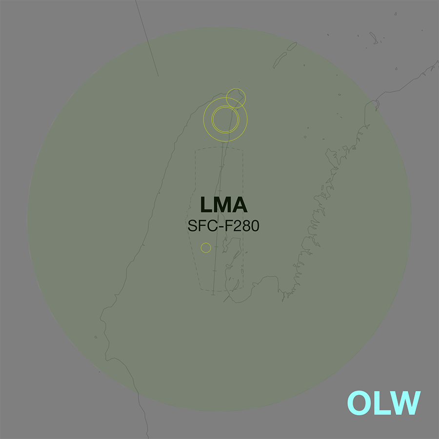
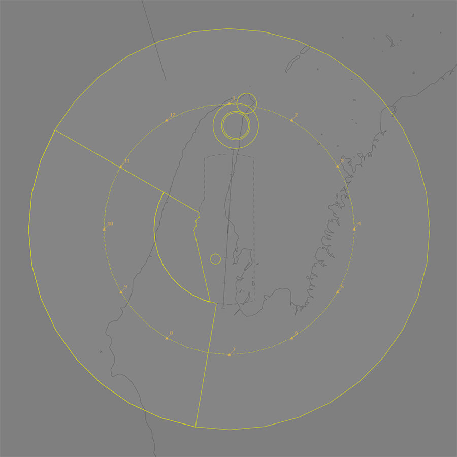
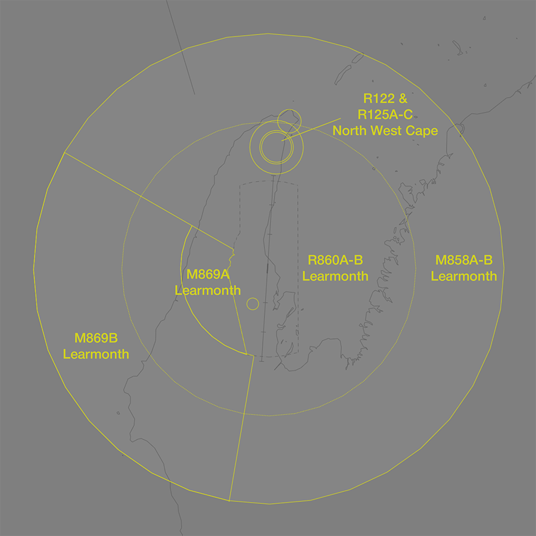

--8<-- "includes/abbreviations.md"

## Positions

| Name                          | ID      | Callsign                | Frequency   | Login ID      |
| ----------------------------- | ------- | ----------------------- | ----------- | ------------- |
| **Learmonth Approach**        | **LMA** | **Learmonth Approach**  | **120.500** | **LM_APP**    |

!!! note
    Learmonth TCU is a [joint military/civil TCU](../../controller-skills/military/#military-aerodromes) and procedures can differ significantly to those in a civil TCU. Ensure you are familiar with the [military controller skills](../../controller-skills/military) necessary to provide a quality service.

## Airspace
**LM TCU** owns the Class C and G airspace within 40 DME LM from `SFC` to `F280`.

<figure markdown>
{ width="700" }
  <figcaption>LM TCU Structure</figcaption>
</figure>

### LM ADC
LM ADC owns the Class C airspace within the LM MIL CTR, `SFC` to `A015`.

### Restricted Area Activations
When **LMA** is online, the following [restricted areas](../../controller-skills/sua/#restricted-areas) are [activated](../../controller-skills/sua/#activation-of-sua) by default, and reclassified as Class C airspace.

- M858A `A045`-`A100`  
- M858B `A100`-`F280`
- M869B `A100`-`F250`
- R860A `A015`-`A025`  
- R860B `A025`-`F280`  

#### SUA in Enroute Airspace
Military operations taking place in SUA in enroute airspace are outside the jurisdiction of LM TCU.

Upon receiving [airways clearance coordination from SMC](#smc-to-lm-tcu) of an aircraft intending to operate in a currently inactive SUA in enroute airspace, LM TCU must give **heads up** coordination to relevant enroute controllers.

This gives the enroute controller sufficient time to assess the request, make necessary adjustments to any aircraft in the area currently, and activate the SUA; or alternately to refuse the activation request before the aircraft is in the air.

!!! phraseology
    *PHNX11 is requesting clearance to operate in the M855A restricted areas.*  
    **LM SMC** -> **LMA**: "PHNX11 requests clearance to M855A”  
    **LMA** -> **LM SMC**: "Standby, call you back."  
     
    **LMA** -> **OLW**: "On the groud YPLM, PHNX11, requests activation of M855A `F100-F280`, from 0300 until 0500.”  
    **OLW** -> **LMA**: "PHNX11, expect activation of M855A `F100-F280` at 0300 until 0500."   
    **LMA** -> **OLW**: "PHNX11."   
      
    **LMA** -> **LM SMC**: "PHNX11, clearance approved."   
    **LM SMC** -> **LMA**: "Clearance approved, PHNX11"  
	
!!! note
    The requirement to coordinate activation of an SUA is in **addition** to existing coordination requirements. [**Heads-up** coordination](#departures) is still required for these aircraft if they do not meet the voiceless coordination criteria.
    
## Local Procedures
### Initial and Pitch 
The [intial points](../../../controller-skills/military/#initial-and-pitch) are aligned with Taxiway A at the following locations.

| RWY  | Initial Point | Altitude |
| ---- | ------------- | --------------------------- |
| 18   | 5.5 DME LM, at the creek mouth south of Charles Knife Road | `A015` |
| 36   | 5.5DME LM, abeam the bend in Minilya-Exxmouth Road | `A015` |

### Military Gates
There are numerous [military gates](../../../controller-skills/military/#military-gates) established throughout the LM TMA to facilitate entry and exit to adjoining SUA.

<figure markdown>
{ width="700" }
  <figcaption>LM SUA Gates</figcaption>
</figure> 

If the pilot **does not** nominate a gate, or nominates a gate that does not provide access to their intended SUA, LM SMC should clear the aircraft to depart via the **appropriate gate**.

| Intended SUA    | TCU Exit Gate       |
| --------------- | ------------------- |
| M855            | Gate 2              |
| M856            | Gate 12             |
| M865            | Gate 10 or 12       |
| M866            | Gate 8              |
| M867            | Gate 8              |
| R850            | Gate 6              |
| R851            | Gate 4              |

!!! tip
    [Coordination requirements](#smc-to-lm-tcu) exist between SMC and TCU when aircraft are requesting clearance to operate in an SUA that has not been activated.
    
### Special Use Airspace
<figure markdown>
{ width="700" }
  <figcaption>Notable SUA in the CIN TMA</figcaption>
</figure>

#### M869A Learmonth
The M869A Learmonth [MOA](../../controller-skills/sua/#military-operating-areas) forms part of the Learmonth Air Weapons Range, and is not activated by default when LMA is online.

When activated, non participating aircraft for SUA to the west may be recleared via an alternate [gate](#military-gates).

## Coordination
### Enroute
#### Departures
Voiceless coordination is in place from LM TCU to OLW for aircraft assigned the lower of `F270` and `RFL`. 

Any aircraft not meeting the above criteria must be prior coordinated to ENR.

!!! phraseology
    **LMA** -> **OLW**: "QFA1601, with your concurrence, will be assigned F160, for my separation with JTE654"  
    **OLW** -> **LMA**: "QFA1601, concur F160"  

#### Arrivals
The Standard assignable level from OLW to LM TCU is `F130`, and tracking via LM VOR. All other aircraft must be prior coordinated.

### LM ADC
#### Departures
[Next](../../controller-skills/coordination/#next) coordination is required from LM ADC to LM TCU for all aircraft.

The Standard Assignable Level from **LM ADC** to **LM TCU** is:

| Aircraft | Level |
| -------- | ----- |
| All | The lower of `F190` and `RFL` | 

### SMC to LM TCU
The controller assuming responsibility of **SMC** shall give [heads-up](../../../controller-skills/coordination/#airways-clearance) coordination to LMA (or the enroute controller responsible for the LM TCU) prior to the issue of a clearance to an aircraft intending to operate in an SUA that **has not** been activated. 

!!! phraseology
    **LM SMC** -> **LMA**: "PHNX11 requests clearance to M855A”  
    **LMA** -> **LM SMC**: "PHNX11, clearance approved."  

!!! abstract "Reference"
    Additional charts to the AIP may be found in the RAAF TERMA document, available towards the bottom of [RAAF AIP page](https://ais-af.airforce.gov.au/australian-aip){target=new}

