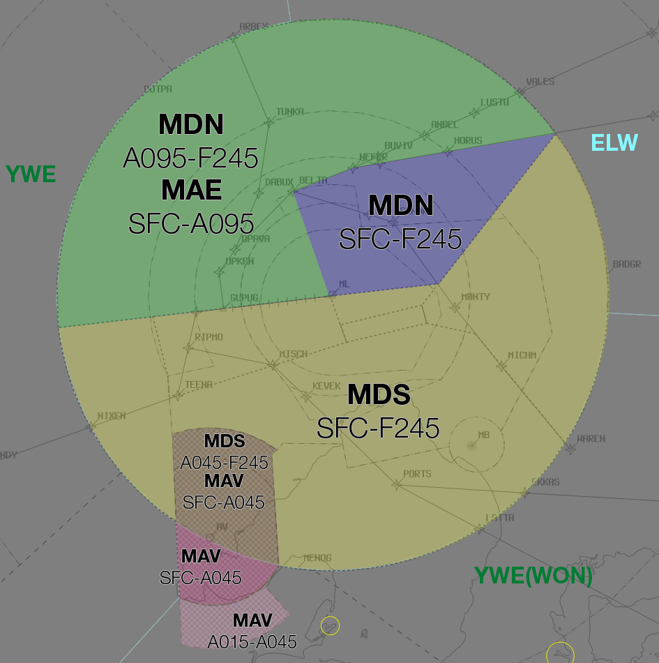
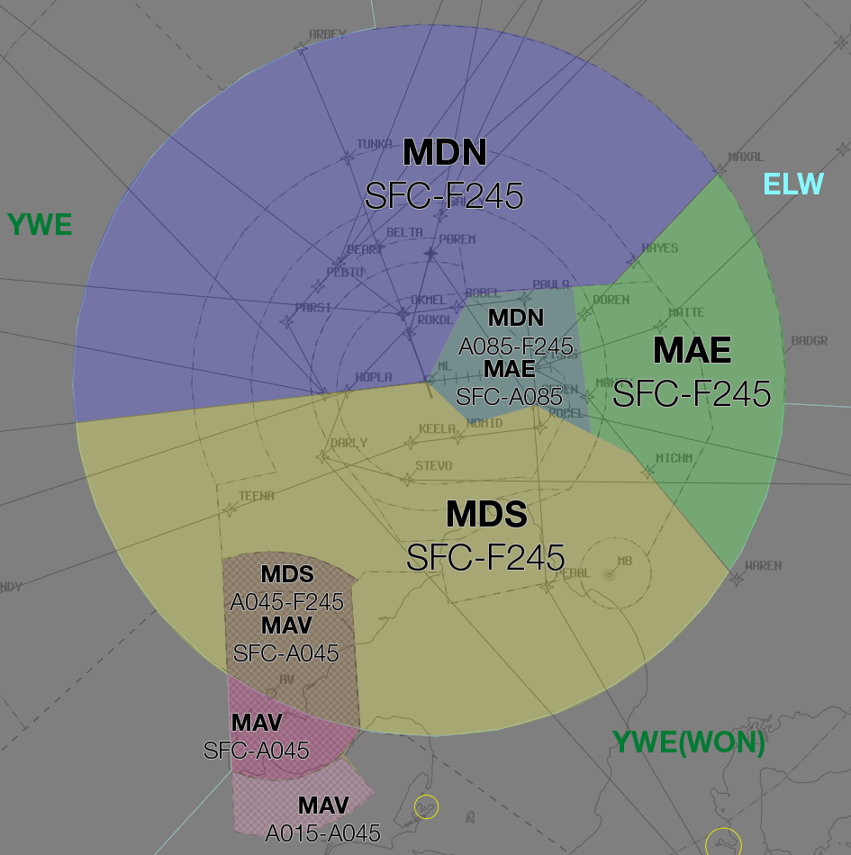
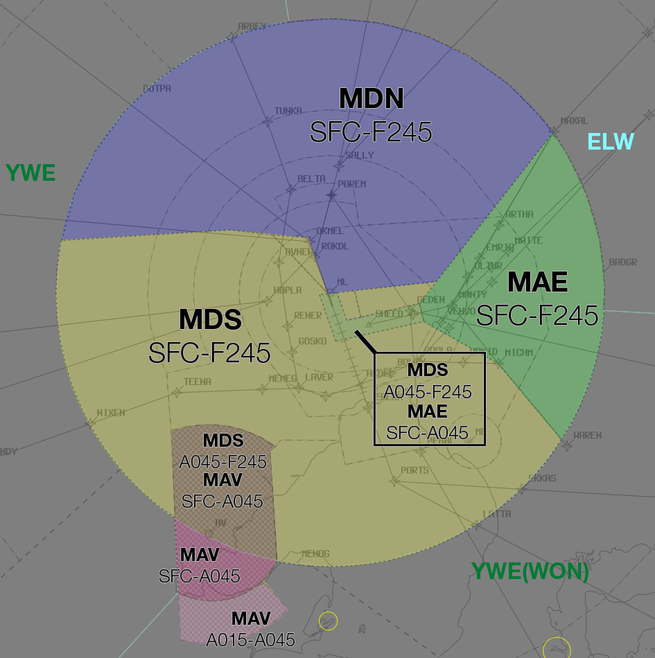
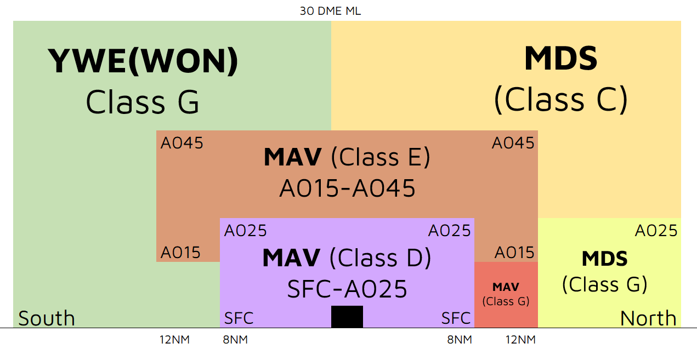

--8<-- "includes/abbreviations.md"

## Positions

| Name                          | ID      | Callsign                | Frequency   | Login ID      |
| ----------------------------- | ------- | ----------------------- | ----------- | ------------- |
| **Melbourne Approach East**   | **MAE** | **Melbourne Approach**  | **132.000** | **ML_APP**    |
| Melbourne Departures North :material-information-outline:{ title="Non-standard position"}  | MDN | Melbourne Departures | 118.900 | ML_DEP   |
| Melbourne Departures South :material-information-outline:{ title="Non-standard position"}  | MDS | Melbourne Departures | 129.400 | ML-S_DEP |
| Melbourne (Avalon) Approach :material-information-outline:{ title="Non-standard position"} | MAV | Avalon Approach      | 133.550 | AV_APP   |
| Melbourne Radar :material-information-outline:{ title="Non-standard position"}             | MAW | Melbourne Centre     | 135.700 | ML-R_DEP  |
| Melbourne Flow :material-information-outline:{ title="Non-standard position"}              | MFL |                      |         | ML_FMP   |

!!! abstract "Non-Standard Positions"
    :material-information-outline: Non-standard positions may only be used in accordance with [VATPAC Air Traffic Services Policy](https://vatpac.org/publications/policies){target=new}.  
    Approval must be sought from the **bolded parent position** prior to opening a Non-Standard Position, unless [NOTAMs](https://vatpac.org/publications/notam){target=new} indicate otherwise (eg, for events).

## Airspace
The vertical limits of the ML TCU are `SFC` to `F245`.

### Reclassifications
#### MB CTR
MB CTR reverts to Class G when **MB ADC** is offline, and is administered by the relevant ML TCU controller.

See also: [MB ADC Offline](#mb-adc-offline).

#### AV CTR
AV CTR Class D `SFC` to `A007` reverts to Class G and `A007` to `A025` to Class E when **AV ADC** is offline, and is administered by the relevant ML TCU controller.

See also: [AV ADC Offline](#av-adc-offline).

!!! tip
    When AV ADC is not online, consider publishing an **ATIS Zulu** for the aerodrome, to inform pilots about the airspace reclassification. The *More ATIS* plugin has a formatted Zulu ATIS message.

### Airspace Division
The divisions of the airspace between **MAE**, **MDN**, **MDS**, and **MAV** change based on the Runway Mode.

!!! note
    The following diagrams do not include non ML TCU areas of responsibility such as MB ADC or EN ADC

=== "09AD"
	<figure markdown>
	{ width="700" }
	  <figcaption>09 TCU Structure</figcaption>
	</figure>

=== "09A16D"
	<figure markdown>
	{ width="700" }
	  <figcaption>09A16D TCU Structure</figcaption>
	</figure>

=== "16AD"
	<figure markdown>
	{ width="700" }
	  <figcaption>16 TCU Structure</figcaption>
	</figure>	

=== "16A2D"
	<figure markdown>
	{ width="700" }
	  <figcaption>16A27D TCU Structure</figcaption>
	</figure>

=== "27AD"
	<figure markdown>
	{ width="700" }
	  <figcaption>27 TCU Structure</figcaption>
	</figure>
	
=== "27AD34D"
	<figure markdown>
	{ width="700" }
	  <figcaption>27AD34D TCU Structure</figcaption>
	</figure>

=== "34AD"
	<figure markdown>
	{ width="700" }
	  <figcaption>34 TCU Structure</figcaption>
	</figure>
	
=== "27A34AD (LAHSO)"
	<figure markdown>
	{ width="700" }
	  <figcaption>27AD34D TCU Structure</figcaption>
	</figure>

#### Avalon Approach (MAV)
MAV is responsible for the Class D and E airspace in the AV CTR, `SFC`-`A045`. 

They are responsible for the same portion of airspace when it is [reclassified](#av-ctr) due to AV ADC being offline.

MAV extends south outside of **30nm ML**, in to HUO(WON) airspace. The Southern portion of this extension (shown below) is Class E `A015`-`A045`, and HUO(WON) is responsible for the airspace **above and below** it.

<figure markdown>
{ width="700" }
  <figcaption>MAV Airspace Side Profile</figcaption>
</figure>

#### Melbourne Radar (MAW)
MAW is responsible for the provision of FIS in Class G airspace within the ML TMA. It is a role normally performed by the controller responsible for **MAV**. The position is designed to reduce the workload of other TMA positions by identifing and issuing clearance (where available) to aircraft OCTA, then transferring them to the relevant TMA controller. [Explicit coordination requirements](#between-maw-and-appdep) exist between MAW and other ML TCU positions.

!!! tip
    It is **not recommended** that the MAV and MAW positions are held by 2 separate controllers, due to the low traffic levels at Avalon. MAV should be opened in preference to MAW, unless traffic levels at Avalon require the role to be split.

## Departure and Arrival Procedures
### Departure Procedures
#### ML (RADAR) SID
The **ML (RADAR) SID** is used for all non-jet IFR departures (and certain jet aircraft) from YMML. Unlike at other aerodromes, **ML ADC** does *not* need to coordinate these departures with a 'Next' call, provided they are assigned the standard assignable level and a [Standard Assignable Heading](#standard-assignable-departure-headings).

### Arrival Procedures
#### Level Assignment
When assigning levels on descent to aircraft, remember that you will not receive "Next" Coordination on aircraft assigned Standard Assignable Levels (`A050` for most aircraft), meaning an aircraft could depart at any time without prior warning and climb to `A050`. To maintain separation assurance between arrivals and departures, do not assign below `A060` to arriving aircraft until they are clear of the active runway's departure path.

!!! example
    With RWY 34 in use for arrivals and RWY 27 in use for departures, aircraft inbound on the ARBEY STAR should be assigned no lower than `A060` until established south of the RWY 27 departure track.

To avoid conflicting with published departure procedures, aircraft not cleared via a STAR should be issued a requirement to reach `A090` by 20DME.

### YMEN Arrivals
IFR YMEN Arrivals shall be cleared via the following arrival gates:  
Runway 26: `MOSVO`  
Runway 35: `MOSVO`  
Runway 17: `5NM FINAL`  
Runway 08: `5NM FINAL`  

VFR YMEN Arrivals from ML TCU shall be cleared via any of the following arrival gates:  

- KAO
- YYN
- DSN 
- APL 
- SNP
- WES

## Offline Towers
### EN ADC Offline
!!! tip
    When EN ADC is offline, consider publishing an **ATIS Zulu** for the aerodrome, to inform pilots about the airspace reclassification. The *More ATIS* plugin has a formatted Zulu ATIS message.

#### Departures
Essendon has unique procedures due to its position in the ML CTR, with controlled airspace to the ground. Departing aircraft will request airways clearance and engine start while on the bay and ML TCU will provide current weather conditions, expected runway for departure, and clearance. On completion of the readback, aircraft should be instructed to *'report taxiing to runway XX'*.

!!! phraseology
    **FDK**: "Melbourne Approach, FDK, YMEN for YSHT, request clearance and engine start"  
    **ML TCU**: "FDK, Melbourne Approach, wind 290 degrees 4 knots, QNH 1017, cleared to YSHT via MNG, flight planned route, visual departure, climb to A040, squawk 4423, expect runway 35"  
    **FDK**: "QNH 1017, cleared to YSHT via MNG, flight planned route, visual departure, climb to A040, squawk 4423, FDK"  
    **ML TCU**: "FDK, start approved, report taxiing for runway 35"  
    **FDK**: "Start approved, FDK"

When the aircraft reports taxiing, issue a traffic statement and instruct them to report at the holding point for departure instructions.
!!! phraseology
    **FDK**: "FDK, taxiing runway 35"  
    **ML TCU**: "FDK, traffic is CBN, a Cherokee, 5nm final runway 35, report at the holding point for departure instructions"  
    **FDK**: "Copy CBN, wilco, FDK"

Once the aircraft is ready for departure and no conflict exists in your airspace, issue any relevant departure instructions (assigned heading, visual turns, etc). If a departure is not yet available, instruct the pilot to hold on the ground and indicate the reason for the delay.
!!! phraseology
    **FDK**: "FDK, ready runway 35"  
    **ML TCU**: "FDK, hold at the holding point, short delay due inbound aircraft"  
    **FDK**: "Hold at the holding point, FDK"  

    **ML TCU**: "FDK, make right turn, report airborne"  
    **FDK**: "Make right turn, FDK"

#### Arrivals
The class C airspace surrounding YMEN extends to `SFC`. This means that aircraft conducting approaches will remain inside controlled airspace until they land (and in the event of a go around). These aircraft should be cleared for an appropriate approach, advised of any traffic taxiing at YMEN, and instructed to *'report clear of the runway'*. The missed approach path must be protected until the aircraft reports clear.

!!! phraseology
    **ML TCU:** "SH490, cleared ILS Runway 26 approach, traffic taxiing for the holding point is UJA, an Aero Commander, report clear of the runway"  
    **SH490:** "Cleared ILS Runway 26, copy UJA, SH490"  

    **SH490:** "SH490, clear of the runway, Essendon, cancel SARWATCH"  
    **ML TCU:** "SH490, Essendon SARWATCH terminated"

### AV ADC Offline
#### Departures
Departing aircraft will require an airways clearance on the ground, due to the low level of CTA. Aircraft should report taxiing to the TCU controller, who will issue a squawk code and traffic statement. These aircraft should be instructed to report at the holding point, where airways clearance will be issued.

!!! phraseology
    **AM318**: "Melbourne Approach, AM318, King Air, POB 2, IFR, taxiing YMAV runway 18 for YMEN"  
    **ML TCU**: "AM318, Melbourne Approach, squawk 3542, no reported IFR traffic, report ready at the holding point for airways clearance"  
    **AM318**: "Squawk 3542, wilco, AM318"  
    
    **AM318**: "AM318, ready runway 18"  
    **ML TCU**: "AM318, cleared to YMEN direct. Enter controlled airspace on the AV5 departure, climb via SID to A040"  
    **AM318**: "Cleared to YMEN direct. Enter controlled airspace on the AV5 departure, climb via SID to A040, AM318"  
    **ML TCU**: "AM318, assigned heading left 020, report airborne"  
    **AM318**: "Assigned left 020, wilco, AM318"

#### Arrivals
Due to the low level of CTA above Avalon, aircraft conducting approaches will commence the approach inside controlled airspace and leave CTA on descent. If the aircraft goes around, they will re-enter controlled airspace. These aircraft should be cleared to leave controlled airspace descending via an appropriate approach and instructed to *'report clear of the runway'*. The missed approach path must be protected until the aircraft reports clear.

!!! note
    A clearance to conduct an instrument approach constitutes a clearance to carry out the published missed approach. As a result, there is no need to issue a clearance to re-enter controlled airspace in the event the aircraft goes around.

!!! phraseology
    **ML TCU:** "JST607, leave controlled airspace descending via the ILS Runway 18 approach, no reported IFR traffic, report clear of the runway"  
    **JST607:** "Leave controlled airspace descending via the ILS Runway 18 approach, JST607"  

    **JST607:** "JST607, clear of the runway, Avalon, cancel SARWATCH"  
    **ML TCU:** "JST607, Avalon SARWATCH terminated"

### MB ADC Offline
#### Departures
Due to the low level of CTA surrounding YMMB, it is best practice to give airways clearance to aircraft at the holding point, to ensure departing aircraft can have uninterrupted climb.

!!! phraseology
    **AAC:** "Melbourne Approach, AAC, PC12, POB 7, IFR, taxiing YMMB for YBLT, runway 35L"  
    **ML TCU:** "AAC, Melbourne Approach, squawk 4301, no reported IFR traffic, report ready at the holding point for airways clearance"  
    **AAC:** "Squawk 4301, wilco, AAC" 

    **AAC:** "AAC, ready runway 35L"  
    **ML TCU:** "AAC, cleared to YBLT via SAMIG, flight planned route, climb to A040"  
    **AAC:** "Cleared to YBLT via SAMIG, flight planned route, climb to A040, AAC"

#### Arrivals
IFR aircraft cruising inside CTA will generally commence an instrument approach from within controlled airspace and leave CTA on descent. The missed approach procedure will keep these aircraft outside controlled airspace, so does not need to be protected by the TCU controller. Clear these aircraft to leave CTA descending via an appropriate approach.

When MAW is online, aircraft should be transferred to them once established on the RNP approach.

!!! phraseology
    **ML TCU:** "OFX, Leave controlled airspace descending via the RNP Runway 17L approach, no reported IFR traffic"  
    **OFX:** "Leave controlled airspace descending via the RNP Runway 17L approach, OFX"

***If MAW is online:***

!!! phraseology
    **MDN:** "OFX, Leave Controlled Airspace descending via the RNP Approach Runway 17L, established contact Melbourne Centre 135.7"  
    **OFX:** "Leave controlled airspace descending via the RNP Runway 17L approach, contact Melbourne Centre 135.7 established, OFX"  

    **OFX:** "Melbourne Centre, OFX Established RNP Runway 17L"  
    **MAW:** "OFX, Melbourne Centre no reported IFR traffic"  
    **OFX:** "OFX" 

## Runway Modes
### LAHSO
!!! warning "Important"
    Due to its operational complexity, LAHSO **must be authorised by a senior VATPAC staff member or a nominated event coordinator**.

Detailed procedures exist to ensure that controllers are aware of their responsibilities when performing LAHSO. See [Controller Skills](../controller-skills/runwaymanagement.md#lahso) for more information.

## Flow
### Local Knowledge
- Aircraft from the south may be issued the PORTS STAR in lieu of the RAZZI STAR to reduce track miles to runways 09 and 34
- In lieu of a STAR, aircraft from the west may be radar vectored via a right circuit to runway 16 to reduce track miles
- Aircraft via RAZZI or ALAXO may be issued the Mike/Papa STAR to reduce track miles to runway 16
- Aircraft from the northeast may be issued RWY 27 or direct to the IAF of the RNP-M RWY 16 to reduce track miles *(coordination required)*
- LAHSO runway mode will increase arrival rate (see [activation prerequisites](#lahso) for specific LAHSO approvals required)

### Flow Tables
The tables below give an estimated time **in minutes** from the **Feeder Fix** to the **Threshold**.

=== "Jets & DH8D"
    | STAR | RWY 09 | RWY 16 | RWY 27 | RWY 34 |
    | ---------- | :---: | :--: | :--: | :---: |
    | **ARBEY**      | 11^ | 9^  | 12 | 13 |
    | **BOYSE A**    | 16 | 13 | 11 | 14 |
    | **BOYSE V**    | -  | -  | -  | 13 |
    | **BOOIN A**    | 15 | 12 | 10^ | 13 |
    | **BOOIN V**    | -  | -  | -  | 12 |
    | **RAZZI A/V**  | 16 | 13 | 9^  | 10^ |
    | **RAZZI M**    | -  | 11 | -  | -  |
    | **PORTS**      | 11 | -  | -  | 7^  |
    | **ALAXO A**    | 11^ | 17 | 15 | 12 |
    | **ALAXO P**    | -  | 15 | -  | -  |

=== "Non-Jets"
    | STAR | RWY 09 | RWY 16 | RWY 27 | RWY 34 |
    | ---------- | :---: | :--: | :--: | :---: |
    | **ARBEY**      | 12^ | 10^ | 14 | 15 |
    | **BOYSE A**    | 18 | 15 | 13 | 16 |
    | **BOYSE V**    | -  | -  | -  | 15 |
    | **BOOIN A**    | 17 | 14 | 11^ | 15 |
    | **BOOIN V**    | -  | -  | -  | 14 |
    | **RAZZI A/V**  | 18 | 15 | 10^ | 11^ |
    | **RAZZI M**    | -  | 13 | -  | -  |
    | **PORTS**      | 12 | -  | -  | 8^  |
    | **ALAXO A**    | 12^ | 19 | 17 | 14 |
    | **ALAXO P**    | -  | 17 | -  | -  |

#### Corrections

| Situation | Correction |
| ----- | ----- |
| Assigned a reduced speed | +1 min, *except ^* | 
| Over 40kt of head/tailwind component | +1 min for headwind -1 min for tailwind |

#### Assumptions
- Nil wind
- The feeder fix for all STARs is the waypoint coinciding with the title of the STAR

### Calculator

The following calculator will generate a landing time from a feeder fix ETA, or the reverse.

=== "Landing Time"
    

=== "Feeder Fix Time"
    

## Coordination
### Enroute
#### Departures
Voiceless to all surrounding Enroute sectors for all aircraft:
 
- Assigned the lower of `F240` or the `RFL`; and
- Tracking via any of the following:
    - a Procedural SID terminus
    - **MENOG**
    - **DOTPA**
    - **OMKON**
    - **AV**

!!! note
    Aircraft are *not required* to be tracking via the **SID procedure**, simply tracking via any of the terminus waypoints (Regardless of *departure airport* or *assigned SID*) is sufficient to meet the criteria for **voiceless coordination**

All other aircraft going to Enroute CTA must be **Heads-up** Coordinated by ML TCU prior to the boundary.

!!! phraseology
    **ML TCU** -> **YWE**: "QFA420, with your concurrence, will be assigned F190, for my separation with QLK52D"  
    **YWE** -> **ML TCU**: "QFA420, concur F190"  

#### Arrivals
Voiceless for all aircraft:

- With ADES **YMML**; and  
- Assigned a STAR; and  
- Assigned `A090`

All other aircraft coming from Enroute CTA will be **Heads-up** Coordinated to ML TCU.

### ML ADC
#### Auto Release
!!! warning "Important"
    Melbourne utilises auto release for all **Procedural** SIDs and the **ML (RADAR)** SID provided aircraft are assigned the Standard Assignable Level and a [Standard Assignable Heading](#standard-assignable-departure-headings).

[Next](../controller-skills/coordination.md#next) coordination is **not** required for aircraft that are:  

- Assigned a **Procedural** SID  
    - Departing from a runway nominated on the ATIS; and  
    - Assigned `A050`  
- Assigned the **ML (RADAR)** SID  
    - Departing from a runway nominated on the ATIS; and  
    - Assigned `A050`; and  
    - Assigned a [Standard Assignable Heading](#standard-assignable-departure-headings)  
- Assigned the **ISPEG** SID  
    - Departing from Runway 16 during the 16A27D Runway Mode; and  
    - Assigned `A050`; and  
    - Tracking via **MNG**, **NONIX**, **DOSEL**, **KEPPA**, **PEDNI** or **ESDIG**

All other aircraft require a 'Next' call to ML TCU.

The Standard Assignable level from **ML ADC** to **ML TCU** is:

| Aircraft | Level |
| -------- | ----- |
| All | The lower of `A050` and `RFL` |

##### Standard Assignable Departure Headings
The following Standard Assignable Headings may be used for aircraft assigned the ML (RADAR) SID, depending on their direction of travel.

| Runway | W | NE | SE | S |
| ---- | :----: | :----: | :----: | :----: |
| RWY 09* | - | - | - | - |
| RWY 16** | H290 | H290 | H160 | H260 |
| RWY 27 | H320 | H290 | H260 | H260 |
| RWY 34 | H340 | H340 | H340 | H260 |

*When Runway 09 is in use for departures, ML TCU shall nominate a heading to ML ADC for use as a standard assignable heading.

**When Runway 09 is in use for arrivals, all Runway 16 departures shall be assigned heading 160.

### ML TCU Internal
#### APP / DEP
Voiceless Coordination is in place for aircraft transiting between ML TCU positions, provided the aircraft is:

- With ADEP **YMML**:
  - Assigned a SID; and
  - Climbing via SID to `A100` or higher, or

- With ADES **YMML**:
  - Assigned a STAR; and
  - Descending via STAR to `A070`

All other aircraft, including aircraft that transit between internal ML TCU boundaries, must be heads-up coordinated.

!!! phraseology
    **MDS** -> **MAV**: "via JAYBI, JST603"  
    **MAV** -> **MDS**: "JST603, A030"

#### Between MAV and APP/DEP
YMAV arrivals and departures **do not** meet the voiceless criteria between APP/DEP and MAV, and must be heads-up coordinated.

!!! tip
    When MAV is conducting Heads-up Coordination to MDS on a YMAV departure, it is good practice for MDS to coordinate back a higher level (`F240` or the `RFL`, if no restrictions), so that the aircraft does not have interrupted climb

!!! phraseology
    **MAV** -> **MDS**: "via JUSTY, JST616"  
    **MDS** -> **MAV**: "JST616, F240"  
    **MAV** -> **MDS**: "F240, JST616"

#### Between MAW and APP/DEP
##### Entering CTA
Heads up coordination is required for **all aircraft** entering ML TCU Class C from MAW Class G. Heads-up coordination must be completed prior to handoff, however, best practice is to complete coordination as soon as possible.

!!! phraseology
    **MAW** -> **MDN**: “Departed YLIL, OXP”  
    **MDN** -> **MAW**: "OXP, A080"  
    **MAW** -> **MDN**: “A080, OXP”

    **MAW:** "OXP cleared to YMTG via ML, flight planned route. Climb to A080"  
    **OXP:** "Cleared to YMTG via ML, flight planned route. Climb to A080, OXP"  
    **MAW:** "OXP Contact Melbourne Departures 118.9"  
    **OXP:** "118.9, OXP" 

##### Leaving CTA
Heads-up coordination is not required from a ML TCU position to MAW for aircraft:

**Leaving CTA *vertically*:**
- Assigned 500ft above BCTA as the CFL; and
- Handed off to MAW

!!! phraseology
    *KDJ is intending on leaving Class C airspace on descent into YMMB. The lower limit of CTA is `A045`.*

    **MDN:** "KDJ descend to A050, contact Melbourne Centre 135.7"  
    **KDJ:** "Descend to A050, 135.7, KDJ"  

    **KDJ:** "Melbourne Centre, KDJ descending A050"  
    **MAW:** "KDJ, Melbourne Centre, leave controlled airspace descending, no reported IFR traffic"  
    **KDJ:** "Leave controlled airspace descending KDJ" 

**Leaving CTA laterally**
- Handed off to MAW upon termination of control services

!!! phraseology
    *BSV is an IFR C172 leaving CTA to the south at `A040`.*  
    **MDS:** "BSV at 19 DME ML, control service terminates, contact Melbourne Centre 135.7"  
    **BSV:** "135.7, BSV"  

    **BSV:** "Melbourne Centre, BSV maintaing A040"  
    **MAW:** "BSV, Melbourne Centre, no reported IFR traffic, area QNH 1016 

### EN ADC
#### Airspace
EN ADC is responsible for the Class C airspace shown below, `SFC` to `A020`.

<figure markdown>
{ width="700" }
  <figcaption>EN ADC Airspace</figcaption>
</figure>

#### Start Clearance
When an aircraft requests start clearance, the EN SMC controller shall coordinate with ML TCU to obtain the start clearance.

#### VFR Clearance
When an aircraft requests a VFR outbound departure to the north or west, the EN SMC controller shall coordinate with ML TCU to obtain approval to provide such clearance.

!!! phraseology
    **EN SMC** -> **ML TCU**: "XYZ requests clearance via ROK."  
    **ML TCU** -> **EN SMC**: "XYZ, clearance approved, not above `A025`."

When a clearance cannot be given (for example, due to conflicting traffic at YMML), EN SMC shall instead provide clearance to depart to the south or east.

#### Departures
[Next](../controller-skills/coordination.md#next) coordination is required from EN ADC to ML TCU for all aircraft **entering ML TCU CTA**.

The Standard Assignable level from EN ADC to ML TCU is:

| Aircraft | Level |
| -------- | ----- |
| All | The lower of `A030` and `RFL` |

#### Arrivals/Overfliers
ML TCU will heads-up coordinate arrivals/overfliers from Class C to EN ADC prior to **5 mins** from the boundary.  
IFR aircraft will be cleared for the coordinated approach (Instrument or Visual) prior to handoff to EN ADC, unless EN ADC nominates a restriction.

!!! phraseology 
    **ML TCU** -> **EN ADC**: "via KAO, KHU"  
    **EN ADC** -> **ML TCU**: "KHU, A015"

!!! Note
    For aircraft not tracking via an Arrival Gate, ML TCU is required to coordinate descent of aircraft into EN ADC airspace.

When "The Coffin" is released, ML TCU is required to coordinate any use of Runway 27 to EN ADC prior to use.

### AV ADC
#### Departures
[Next](../controller-skills/coordination.md#next) coordination is **not** required to ML TCU for aircraft that are:  

- Departing from a runway nominated on the ATIS; and  
- Assigned the standard assignable level; and  
- Assigned a **Procedural** SID

All other aircraft require a 'Next' call to ML TCU.

The Standard Assignable level from **AV ADC** to **ML TCU** is:

| Aircraft | Level |
| ----- | -------| 
| All | The lower of `A040` and `RFL` |

#### Arrivals
Heads-up Coordination is not required to AV ADC for YMAV arrivals, due to MAV owning the surrounding airspace. Aircraft shall be instructed to contact AV ADC on final, as per Class C Tower handoffs.

### MB ADC
#### Airspace
MB ADC is responsible for the Class D airspace in the MB CTR `SFC` to `A025`.

Refer to [Reclassifications](#mb-ctr) for operations when MB ADC is offline.

#### Departures
**MB ADC** will issue airways clearances for all departures planned into the overlying Class C airspace. Aircraft who will transit Class G airspace on climb into CTA will be cleared to leave and re-enter controlled airspace by **MB ADC**.

[Next](../controller-skills/coordination.md#next) coordination is required from MB ADC to ML TCU for all aircraft **entering ML TCU CTA**.

The Standard Assignable level from **MB ADC** to **ML TCU** is:

| Aircraft | Level |
| ----- | ---- |
| All | The lower of `A050` and `RFL` |

#### Arrivals/Overfliers
ML TCU will heads-up coordinate arrivals/overfliers from Class C to MB ADC prior to **5 mins** from the boundary.  
IFR aircraft will be cleared to **leave and re-enter controlled airspace** via the coordinated approach (Instrument or Visual) prior to handoff to MB ADC, unless MB ADC nominates a restriction.  
VFR aircraft will have their control services terminated passing `A025` on descent, and instructed to contact MB ADC for onwards clearance.

!!! phraseology
    **MDS** -> **MB ADC**: "To the west, PLE, for the NDB-A"  
    **MB ADC** -> **MDS**: "PLE, NDB-A"

!!! tip
    Ensure the aircraft's FDR is up-to-date in order to give **MB ADC** maximum situational awareness of the traffic picture. (eg. if the aircraft is doing the RNP approach, ensure the FDR has been rerouted via the appropriate points)
