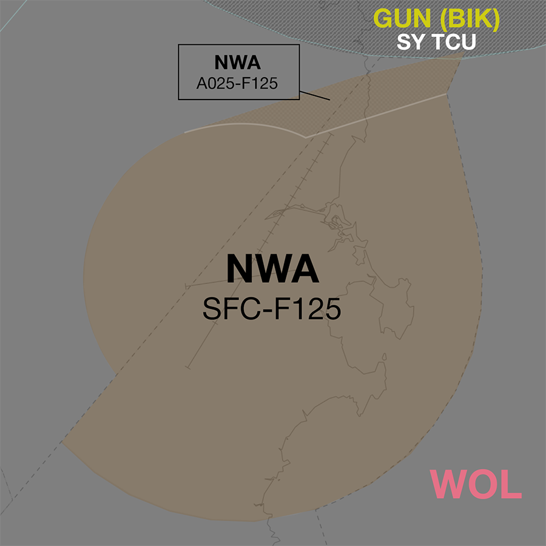
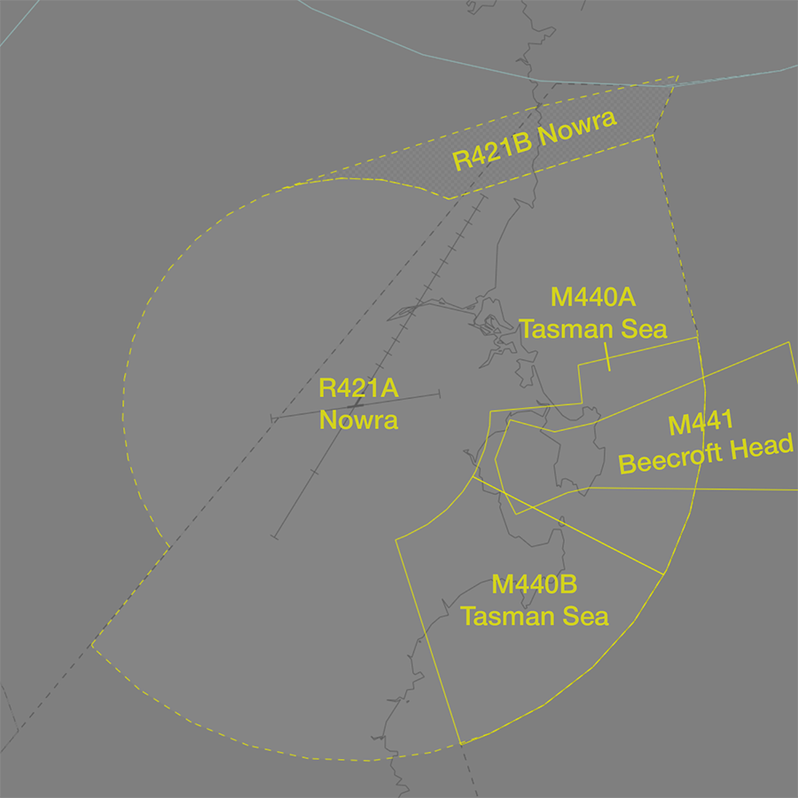
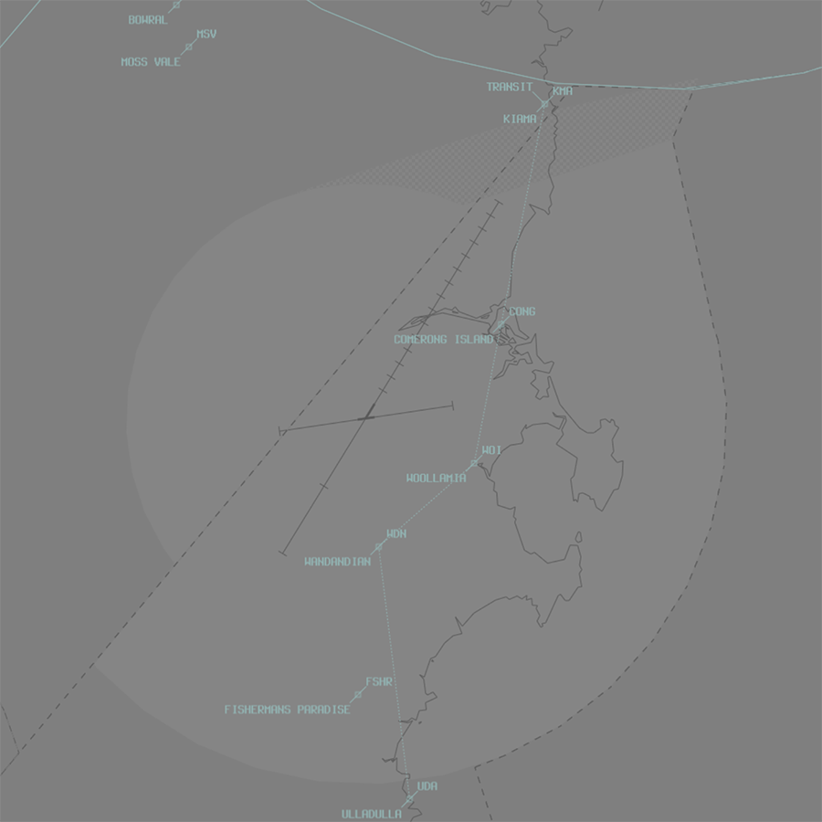

--8<-- "includes/abbreviations.md"

## Positions
| Name                          | ID      | Callsign                | Frequency   | Login ID      |
| ----------------------------- | ------- | ----------------------- | ----------- | ------------- |
| **Nowra Approach**            | **NWA** | **Nowra Approach**      | **123.500** | **NW_APP**    |

!!! note
    Nowra TCU is a [military TCU](../../controller-skills/military/#military-aerodromes) and procedures can differ significantly to those in a civil TCU. Ensure you are familiar with the [military controller skills](../../controller-skills/military) necessary to provide a quality service.

## Airspace
NW TCU owns the Class C & Class G airspace within the R421A and R421B restricted areas `SFC` to `F125`.

<figure markdown>
{ width="952" }
  <figcaption>NW TCU Structure</figcaption>
</figure>

### Restricted Area Activations
When **NWA** is online, the following [restricted areas](../../controller-skills/sua/#restricted-areas) are [activated](../../controller-skills/sua/#activation-of-sua) by default, and reclassified as Class C airspace.

- R421A `SFC`-`F125`
- R421B `A025`-`F125`

#### SUA in Enroute Airspace
Most military operations will take place in SUA nearby the TCU in enroute airspace, outside the jurisdiction of NW TCU.

Upon receiving [airways clearance coordination from ACD](#acd-to-nw-tcu) of an aircraft intending to operate in a currently inactive SUA, NW TCU must give **heads-up** coordination to relevant enroute controllers.

This gives the enroute controller sufficient time to assess the request, make necessary adjustments to any aircraft in the area currently, and activate the SUA; or alternately to refuse the activation request before the aircraft is in the air.

!!! phraseology
    *SWFH12 is requesting clearance to operate in the R420F restricted area.*  
    **NW ACD** -> **NWA**: "SWFH12 requests clearance to R420F.”  
    **NWA** -> **NW ACD**: "Standby, call you back."  
    
    **NWA** -> **WOL**: "On the groud YSNW, SWFH12, requests activation of R420F `F125-F300`, from 0300 until 0500.”  
    **WOL** -> **NWA**: "SWFH12, expect activation of R420F `F125-F300` at 0300 until 0500."   
    **NWA** -> **WOL**: "SWFH12."  
    
    **NWA** -> **NW ACD**: "SWFH12, clearance approved."   
    **NW ACD** -> **NWA**: "Clearance approved, SWFH12"  

!!! note
    The requirement to coordinate activation of an SUA is in **addition** to existing coordination requirements. [**Heads-up** coordination](#departures) is still required for these aircraft if they do not meet the voiceless coordination criteria.

## Local Procedures
#### Chopper Areas
Helicopters performing operations within 5nm YSNW ARP may be assigned one of four '**Choppers**' areas.

<figure markdown>
{ width="600" }
  <figcaption>Helicopter Operating Areas within NW TMA</figcaption>
</figure>

| Choppers Area  | Dimensions                             | Altitude         |
| -------------- | -------------------------------------- | ---------------- |
| Choppers North | North of Runway 08/26, within 5nm YSNW | Not above `A015` |
| Choppers South | South of Runway 08/26, within 5nm YSNW | Not above `A015` |
| Choppers East  | East of Runway 03/21, within 5nm YSNW  | Not above `A015` |
| Choppers West  | West of Runway 03/21, within 5nm YSNW  | Not above `A015` |
    
!!! note
	Choppers East/West and North/South should not be used simultaneously.
    
### Initial and Pitch
The [intial points](../../controller-skills/military/#initial-and-pitch) are on the dead side of each runway at the following locations.

| RWY  | Initial Point | Altitude |
| ---- | ------------- | -------- |
| 03   | 5NM downwind  | `A020`   |
| 08   | 5NM downwind  | `A020`   |
| 21   | 5NM downwind  | `A020`   |
| 26   | 5NM downwind  | `A020`   |

### Jervis Bay (YJBY)
Jervis Bay (YJBY) is an certified aerodome located south-east of YSNW, within the R421A restricted area. The aerodrome is frequently used for [PJE](../../controller-skills/airwork/#parachute-operations) and circuit training.

Aircraft intending to operate at YJBY require explicit clearance from NWA. NWA will facilitate clearance and provide traffic information about aircraft already operating in the area, where relevant.

!!! phraseology
    *EMYU43 on the ground YJBY and is requesting clearance to perform training circuits within the CIRA.*  
    **EMYU43**: "Nowra Approach, EMYU43, YJBY, for circuits, request clearance.”  
    **NWA**: "EMYU43, Nowra Approach. Cleared to operate within YJBY CIRA, not above `A015`. No reported traffic, report airborne."  

!!! note
    While NW TCU is responsible for the airspace from `SFC` to `F125` above YJBY, they have **no jurisdiction** over the runways, taxiways, or apron areas on the aerodrome itself.
    
#### Parachute Operations
When PJE is being conducted within the YJBY CIRA, [start approval](../../../aerodromes/classc/Nowra/#start-approval) is required for all aircraft. The [ATIS OPR INFO](../../aerodromes/classc/Nowra/#operational-info) field should be updated accordingly.

PJE operations are generally not conducted while the [M440B Tasman Sea MOA](#m440a-b-tasman-sea) has been activated.
    
### Special Use Airspace
<figure markdown>
{ width="700" }
  <figcaption>Notable SUA in the NW TMA</figcaption>
</figure>

#### M440A-B Tasman Sea 
The M440A-B Tasman Sea [MOAs](../../controller-skills/sua/#military-operating-areas) are located in the eastern half of the NW TCU airspace, `NOTAM`-`NOTAM`, and connect the TMA to an extensive network of SUA within WOL airspace.

When activated below `A020`, these MOAs disrupt operations at [YJBY](#jervis-bay-yjby) and generally preclude PJE operations.

#### M441 Beecroft Head 
The M441 Beecroft Head [MOA](../../controller-skills/sua/#military-operating-areas) is located in the east YSNW `NOTAM`-`NOTAM` over the Beecroft Peninsula. 

The SUA is associated with activities within the Beecroft Weapons Range, and is predominantly used for a variety of live-fire and combat simulation activities.

### VFR Lane of Entry
A lane of entry is available near the coastline, allowing aircraft to transit the zone from north to south (or vice versa). A clearance is required from **NW TCU** prior to entering CTA.

<figure markdown>
{ width="700" }
<figcaption>VFR Lane of Entry</figcaption>
</figure>

| Direction  | Routing | Altitude |
| ---------- | ------- | -------- |
| Northbound | UDA WDN WOI CONG KMA | Not above `A020` |
| Southbound | KMA CONG WOI WDN UDA | Not above `A020` |

!!! phraseology
    **FWC**: "Nowra Approach, FWC, Cessna 172, 4nm south of UDA, `A015`, received Bravo, for the transit route, request clearance"  
    **NWA**: "FWC, Nowra Approach, squawk 0366, remain outside controlled airspace"  
    **FWC**: "Squawk 0366, remain outside controlled airspace, FWC"  

    **NWA**: "FWC, identified, cleared transit route southbound, not above `A020`"  
    **FWC**: "Cleared transit route southbound, not above `A020`, FWC"  

## Coordination
### Enroute
#### Departures
Voiceless for aircraft:

- Tracking via a Procedural SID terminus; and
- Assigned the lower of `A100` or the `RFL`

!!! note
    Aircraft are *not required* to be tracking via the **SID procedure**, simply tracking via any of the terminus waypoints (regardless of *departure airport* or *assigned SID*) is sufficient to meet the criteria for **voiceless coordination**.

All other aircraft going to WOL CTA must be **heads-up** coordinated by NW TCU prior to the boundary.

!!! phraseology
    **NWA** -> **WOL**: "EMYU43, request DCT YSHW"  
    **WOL** -> **NWA**: "EMYU43, concur DCT YSHW" 

#### Arrivals
Voiceless for aircraft:

- With ADES **YSNW**; and 
- Tracking via **NWA** or **NWR**; and  
- Assigned `F130`

All other aircraft coming from WOL CTA will be **heads-up** coordinated to NW TCU.

### NW ADC
#### Departures
[Next](../../controller-skills/coordination/#next) coordination is required from NW ADC to NW TCU for all aircraft.

The standard assignable level from **NW ADC** to **NW TCU** is:

| Aircraft | Level |
| -------- | ----- |
| All | The lower of `A100` and `RFL` | 

#### ACD to NW TCU
The controller assuming responsibility of **ACD** shall give [heads-up coordination](../../controller-skills/coordination/#airways-clearance) to NWA (or the enroute controller responsible for the NW TCU) prior to the issue of a clearance to an aircraft intending to operate in an SUA that **has not** been activated. 

!!! phraseology
    **NW ACD** -> **NWA**: "SWFH12 requests clearance to R420F”  
    **NWA** -> **NW ACD**: "SWFH12, clearance approved."  
    
#### SMC to NW TCU
When [start approvals](../../aerodromes/classc/Nowra/#start-approval) are nominated as required on the ATIS, when an aircraft requests start approval, the NW SMC controller shall coordinate with NW TCU to obtain the start approval.

### SY TCU
All aircraft transiting between SY TCU and NW TCU require [Heads-up coordination](../../controller-skills/coordination/#heads-up) prior to the boundary; however, as soon as practical (when the aircraft becomes airborne) is preferred. 

## Charts
!!! abstract "Reference"
     In addition to the civilian `ERSA` and `AIP` publications, [the RAAF AIP website](https://ais-af.airforce.gov.au/australian-aip){target=new} contains the necessary charts (available in the TERMA) and description of procedures (in each airports' FIHA).