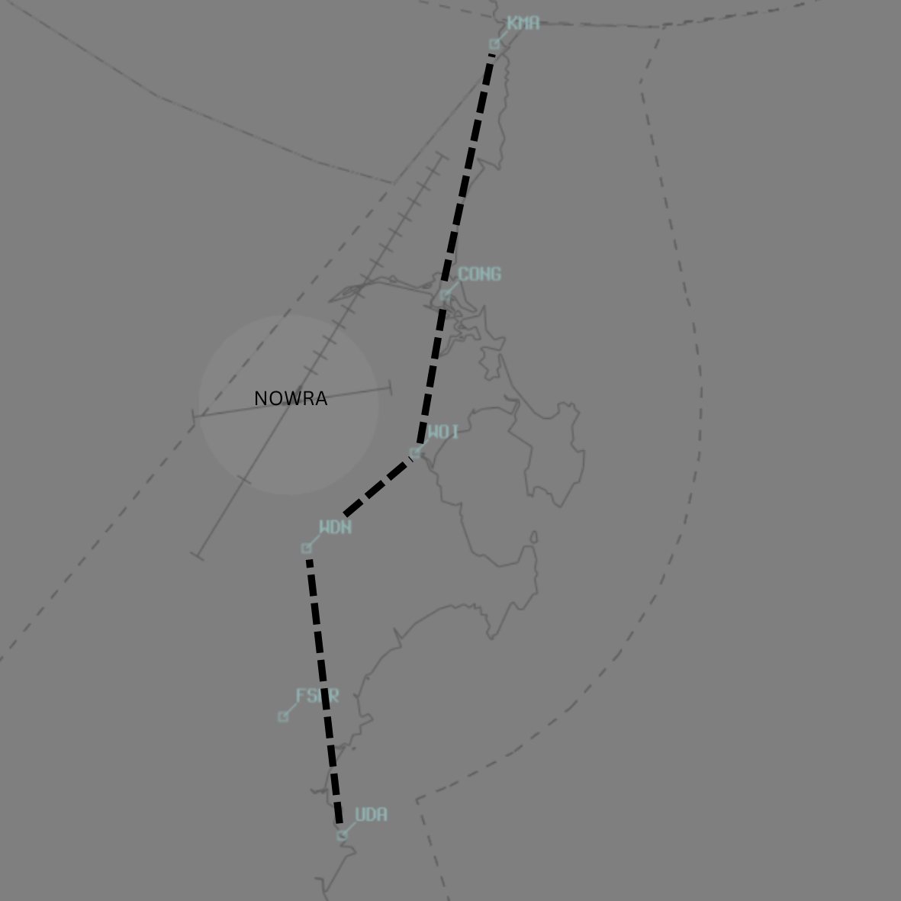

--8<-- "includes/abbreviations.md"

Reserved.

!!! note
    Additional charts to the AIP may be found in the RAAF TERMA document, available towards the bottom of [RAAF AIP page](https://ais-af.airforce.gov.au/australian-aip){target=new}

## Positions

| Name               | ID      | Callsign       | Frequency        | Login Identifier              |
| ------------------ | --------------| -------------- | ---------------- | --------------------------------------|
| Nowra TMA    | | Nowra Approach | 123.500          |NW_APP        |

## Airspace

### TMA Ownership

The Terminal Control Area (TMA) owns the airspace within R421 up to `F125`; optionally R420F extends from `F125` to `F300`.
This airspace is for facilitating military aircraft and low-level helicopter operations.

### Activation of Restricted Areas

When a controller logs in as Nowra TMA for R421:

1. **Announce Activation**: Announce that R421 and other applicable PRDs are active.
2. **Activate Surrounding Areas**: Notify surround controllers to activate the restricted areas to get the outlines visible.
3. **Issue Clearances**: Treat restricted areas like R421 as Class C airspace and issue clearances accordingly.
4. **Service Level**: Class C while R421 is active.

To activate R420:
1. Get an airspace release from BIK. Voiceless coord of all aircraft on published air routes via the NWA TACAN above `F125`.

### Airspace Details

<figure markdown>
{ width="700" }
<figcaption>NW ADC Airspace</figcaption>
</figure>

- **R421**: Extends up to FL125 and is used for military and low-level helicopter operations.
- **R420F**: Extends from FL125 to FL300.

## VFR corridor (DAY ONLY)
<figure markdown>
{ width="700" }
<figcaption>NW VFR CRD</figcaption>
</figure>
- All VFR aircraft passing through R421 must request clearance and be assigned a squawk code.
- If clearance is not immediately available, instruct the aircraft to remain in Class G airspace.
- VFR traffic must not pass through the corridor above `A020` AMSL.
- Separation must be maintained between IFR and VFR traffic including providing necessary traffic advisories.
