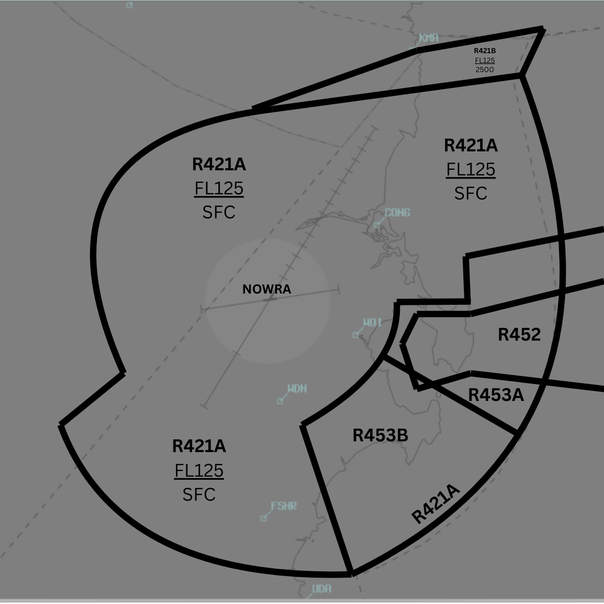

--8<-- "includes/abbreviations.md"

## Positions
| Name               | ID      | Callsign       | Frequency        | Login Identifier              |
| ------------------ | --------------| -------------- | ---------------- | --------------------------------------|
| **Nowra TMA**    | **NWA** | **Nowra Approach** | **123.500**          | **NW_APP**        |

## Airspace
NW TCU owns the airspace within R421, `SFC` to `F125`. Where traffic levels (primarily preplanned military operations) warrant, NW TCU may request a release of R420F from `F125` to `F300` from BIK(WOL), if online.

<figure markdown>
{ width="700" }
<figcaption>NW TMA</figcaption>
</figure>

## Logon Process
Due to the temporary nature of the airspace, surrounding controllers may not be aware of the lateral or vertical boundaries of the TMA. Therefore, when a controller logs on as Nowra TMA, it is important to announce that R421 is activated from SFC to F125.

### Activating R420F
Where it is deemed operationally beneficial to activate R420F, this should be requested from the overlying enroute controller.

!!! example
    **NW TCU** -> **WOL**: "There's a preplanned military exercise about to commence, request release of R420F up to F300"  
    **WOL** -> **NW TCU**: "R420F released to you F125 to F300"  
    **NW TCU** -> **WOL**: "R420F released F125 to F300"   

As per [Coordination](#enroute), with R420F active, all transiting aircraft will be coordinated by BIK(WOL). Where possible, facilitate the transit of these aircraft. In exceptional circumstances where the level of military aircraft movements prohibit transiting civil aircraft, inform BIK(WOL) that no transiting aircraft can be accommodated, and that they will need to be rerouted to remain clear of the TCU.

!!! important
    Activating R420F increases the workload of the overlying enroute controller by altering the airspace normally available to them for civil aircraft. Only activate this airspace if operationally necessary, primarily for preplanned military exercises.

## VFR Lane of Entry
A lane of entry exists allowing VFR aircraft to transit the TMA in a north-south orientiation. A clearance is required to operate along the lane. Where the adjacent M440A/B airspace is activated, alternate tracking is required to remain clear. Aircraft should generally be cleared along the lane at an altitude not exceeding `A020`.

<figure markdown>
{ width="700" }
<figcaption>VFR Lane of Entry</figcaption>
</figure>

## Charts
Aerodrome and instrument approach charts are available in the AIP, or otherwise in the RAAF TERMA document, available towards the bottom of [RAAF AIP page](https://ais-af.airforce.gov.au/australian-aip){target=new}.

## Coordination
### Enroute
#### Departures
Voiceless for aircraft:
 
- Tracking via a published airway; and  
- Assigned the lower of `F120` or the `RFL`

All other aircraft going to BIK(WOL) CTA must be **Heads-up** Coordinated by NW TCU prior to the boundary. 

#### Arrivals
Voiceless for aircraft:

- With ADES **YSNW**; and   
- Tracking direct to the NWA TACAN or YSWN; and  
- Assigned `F130`

All other aircraft coming from BIK(WOL) CTA will be **Heads-up** Coordinated to NW TCU.

### NW ADC
#### Airspace
NW ADC owns the Class C airspace from `SFC` to `A020`, within a 5nm radius of the NWA TACAN. This airspace is designed to facilitate helicopter and circuit traffic.

#### Auto Release
'Next' coordination is required from NW ADC to NW TCU for all aircraft.

!!! example
    **NW ADC** -> **NW TCU**: "Next, ASY01, runway 08"  
    **NW TCU** -> **NW ADC**: "ASY01, Assigned Heading Left 030, unrestricted"  
    **NW ADC** -> **NW TCU**: "Assigned Heading Heading Left 030, ASY01" 

To Do
- BIK section (coord, reclassification when closed, activation process and airspace release)