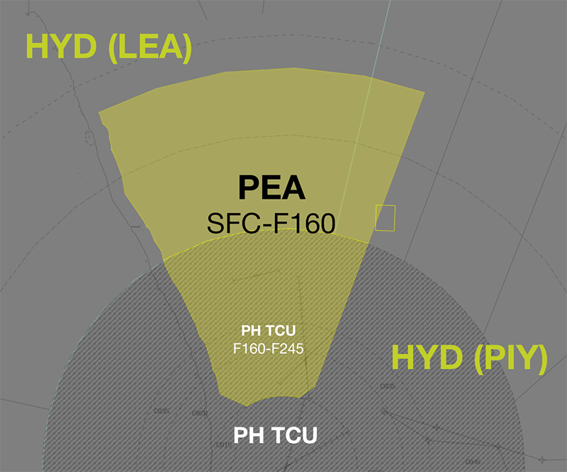
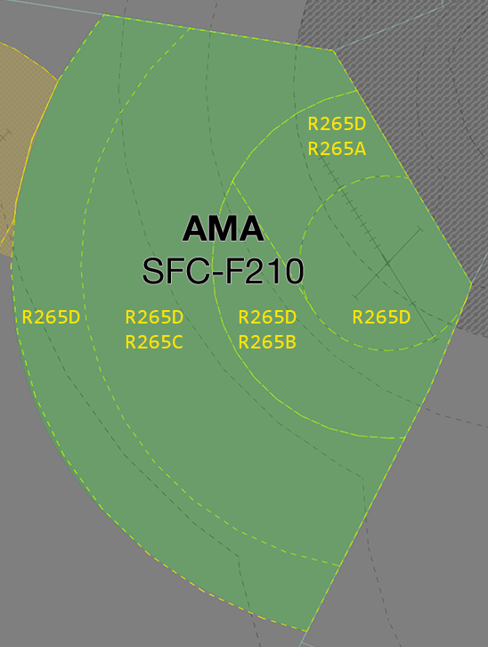

--8<-- "includes/abbreviations.md"

## Positions

| Name                          | ID      | Callsign                | Frequency   | Login ID      |
| ----------------------------- | ------- | ----------------------- | ----------- | ------------- |
| **Pearce Approach**           | **PEA** |  **Pearce Approach**    | **130.200** | **PE_APP**    |

## Airspace
The vertical limits of the Pearce TCU is `SFC` to `F160`. 

<figure markdown>
{ width="700" }
  <figcaption>PE TCU Structure</figcaption>
</figure>

### Airspace Division
PEA is responsible for the restricted airspace within R155A and R155B. This airspace is reclassified to **Class C** when PEA is online.

<figure markdown>
{ width="952" }
  <figcaption>AMB TCU Restricted Areas</figcaption>
</figure>.

PE ADC owns the airspace within the Pearce CIRA (**5nm** Radius of YPEA ARP, located entirely within **R155A**) from `SFC` to `A035.

### Airspace Division
Additional airspace may be released by NOTAM, or coordinated between PEA, PH TCU, and LEA/PIY to facilitate military operations.

!!! phraseology
    **PEA** -> **PH TCU**: "Request release of M166, SFC to F160, for Military Operations. My onwards with LEA"   
    **PH TCU** -> **PEA**: "M166, SFC to F160, released to you. Your onwards with LEA"  

    **PEA** -> **LEA**: "Request release of M166, SFC to F160, for Military Operations. My onwards with PH TCU"   
    **LEA** -> **PEA**: "M166, SFC to F160, released to you. Your onwards with PH TCU"  

## Coordination
### Enroute
#### Departures
All aircraft from PE TCU to HYD require [Heads-up](../controller-skills/coordination.md#heads-up) coordination prior to the boundary, however, as soon as practical (when is the aircraft becomes airborne) is preferred. 

#### Arrivals/Overfliers
All aircraft transiting from HYD to **PE TCU** must be [Heads-up](../controller-skills/coordination.md#heads-up) coordinated prior to **20nm** from the boundary. There are no standard assignable levels; HYD and **PEA** controller must agree on a suitable level during coordination.

!!! phraseology
    **LEA** -> **PEA**: "via AVNEX, EGLE9, will be assigned A090"  
    **PEA** -> **LEA**: "EGLE9, A090"

### PE ADC
[Next](../controller-skills/coordination.md#next) coordination is required from PE ADC to PE TCU for all aircraft.

The Standard Assignable Level from **PE ADC** to **PE TCU** is:

| Departure Procedure | Level |
| ------------------- | ----- |
| **GUNOK** SID | `A030` |
| A **Procedural** SID | `F130` |
| All others | The lower of `F130` and `RFL` |

### GIG ADC
[Next](../controller-skills/coordination.md#next) coordination is required from GIG ADC to PE TCU for all aircraft.

The Standard Assignable Level from **GIG ADC** to **PE TCU** is:

| Aircraft | Level |
| -------- | ----- |
| All | The lower of `A050` and `RFL` |

### PH TCU
**All aircraft** transiting between PE TCU and PH TCU must be heads-up coordinated prior to the boundary.

!!! phraseology
    **PEA** -> **PH TCU**: "Airborne YPEA, PHNX11"   
    **PH TCU** -> **PEA**: "PHNX11, F180"  

## Charts
!!! abstract "Reference"
    Additional charts to the AIP may be found in the RAAF TERMA document, available towards the bottom of [RAAF AIP page](https://ais-af.airforce.gov.au/australian-aip){target=new}