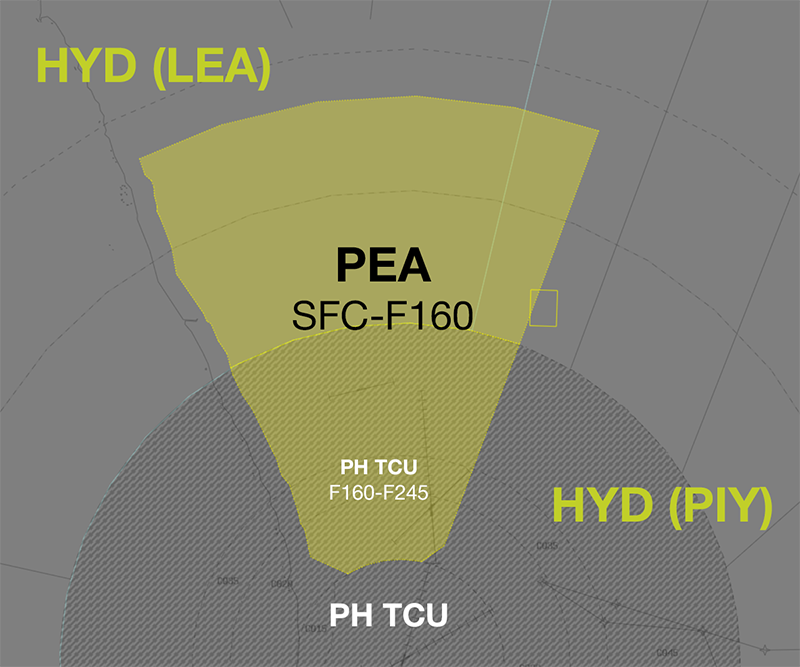
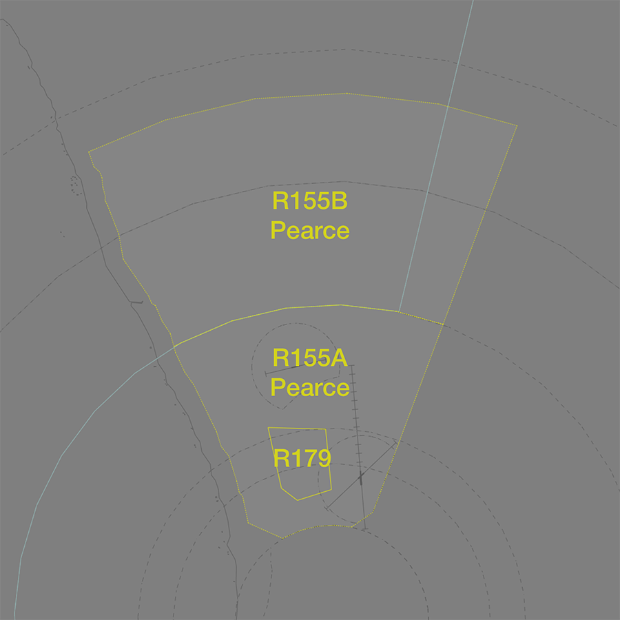

--8<-- "includes/abbreviations.md"

## Positions

| Name                          | ID      | Callsign                | Frequency   | Login ID      |
| ----------------------------- | ------- | ----------------------- | ----------- | ------------- |
| **Pearce Approach**           | **PEA** | **Pearce Approach**     | **130.200** | **PE_APP**    |

!!! note
    Pearce TCU is a [military TCU](../../controller-skills/military/#military-aerodromes) and procedures can differ significantly to those in a civil TCU. Ensure you are familiar with the [military controller skills](../../controller-skills/military) necessary to provide a quality service.
    
## Airspace
The vertical limits of the Pearce TCU is `SFC` to `F160`. 

<figure markdown>
{ width="700" }
  <figcaption>PE TCU Structure</figcaption>
</figure>

### PE ADC
PE ADC owns the airspace within the Pearce CIRA (**5nm** Radius of YPEA ARP, located entirely within **R155A**), `SFC` to `A035`.

### GIG ADC
GIG ADC owns the airspace within the Gingin CIRA (**5nm** of the YGIG ARP, *excluding* the area south of **12 TACAN PEA**), `SFC` to `A035`.

### Reclassification
=== "GIG ADC"
	When **GIG ADC** is offline the aerodrome is uncontrolled, but PEA remains responsibile for controlled airspace down to `SFC`.

	!!! tip
        Consider publishing a pre-formatted **ATIS Zulu** for the aerodrome, to inform pilots about the airspace reclassification.

### Restricted Area Activations
When **PEA** is online, the following [restricted areas](../../controller-skills/sua/#restricted-areas) are [activated](../../controller-skills/sua/#activation-of-sua) by default, and reclassified as Class C airspace.

- R155A Pearce `SFC-F160`
- R155B Pearce `SFC-F160`

#### SUA in Enroute Airspace
Military operations taking place in SUA in enroute airspace are outside the jurisdiction of PE TCU.

Upon receiving [airways clearance coordination from ACD](#acd-to-tcu) of an aircraft intending to operate in a currently inactive SUA in enroute airspace, PE TCU must give **heads up** coordination to relevant enroute controllers.

This gives the enroute controller sufficient time to assess the request, make necessary adjustments to any aircraft in the area currently, and activate the SUA; or alternately to refuse the activation request before the aircraft is in the air.

!!! phraseology
    *DUGT19 is requesting clearance to operate in the M166 restricted area.*  
    **PE ACD** -> **PEA**: "DUGT19 requests clearance to M166”  
    **PEA** -> **PE ACD**: "Standby, call you back."  
     
    **PEA** -> **LEA**: "On the groud YPEA, DUGT19, requests activation of M166 `A020-F160`, from 0300 until 0500.”  
    **LEA** -> **PEA**: "DUGT19, expect activation of M166 `A020-F160` at 0300 until 0500."   
    **PEA** -> **LEA**: "DUGT19."   
      
    **PEA** -> **PE ACD**: "DUGT19, clearance approved."   
    **PE ACD** -> **PEA**: "Clearance approved, DUGT19"  

!!! note
    The requirement to coordinate activation of an SUA is in **addition** to existing coordination requirements. [**Heads-up** coordination](#departures) is still required for these aircraft if they do not meet the voiceless coordination criteria.

## Local Procedures
### Initial and Pitch
=== "YPEA"
    The [initial](../../../../controller-skills/military/#initial-and-pitch) points changes according to both runway, and direction.

    | RWY  | Initial Point | Altitude |
    | ---- | ------------- | ------------------------ |
    | 18s  | 4NM north at Quarry | `A015` |
    | 36s  | 3.5NM south, at Ellenbrook Speedway | `A015` (Right Initial) `A010` (Left Initial) |
    | 05   | 5nm west, where Warbrook Road leaves the pines | `A015` |
    | 23   | 4.5NM east, at Quarry | `A010` |
    
=== "YGIG"
    The [initial points](../../../controller-skills/military/#initial-and-pitch) are offset from the runway at the following locations.

    | RWY  | Initial Point | Altitude |
    | ---- | ------------- | -------- |
    | 08   | Corner of the pine plantation  | `A015`   |
    | 26   | Paddock divided by the creek   | `A015`   |

### Military Gates
There are four [military lanes](../../../controller-skills/military/#military-gates) established throughout the PEA TMA to facilitate entry and exit to adjoining SUA.

<figure markdown>
{ width="700" }
  <figcaption>PE SUA Gates</figcaption>
</figure>

| Intended SUA    | TCU Exit Lane        |
| --------------- | -------------------- |
| M161            | MULLALOO or [QUOKKA](#quokka-lane) |
| M166            | ALKIMOS              |
| M170A-B         | MULLALOO             |
| M180            | MULLALOO             |
| M182A-G         | MULLALOO             |
| M195            | ALKIMOS              |
| R156            | WANNAMAL             |
| R163            | MULLALOO             |

!!! tip
    [Coordination requirements](#acd-to-tcu) exist between ACD and TCU when aircraft are requesting clearance to operate in an SUA that has not been activated.
    
There are four Departure/Arrival Lanes established in the PE TCU to facilitate military aircraft movements between adjacent SUAs.

#### Alkimos Lane
The **Alkimos Lane** is centred on the PEA 304 radial, `A050`-`F120`. The lane facilitates transit to/from the M147 restricted areas.

#### Mullaloo Lane
The **Mullalloo Lane** is between the 248 and 233 radials, `A050`-`F120`. The lane facilitates transit to/from the R163 restricted area. 

#### Wannamal Lane
The **Wannamal Lane** is centered on the PEA 356 radial, `A050`-`F120`. The lane facilitates transit to/from SUAs to the north.

#### Quokka Lane
The **Quokka Lane** is defined as the AZZAR-FENDA track in the south-west of the TCU, `A090`-`F140`. It facilitates transit to/from the [M161 MOA](../../enroute/HYD/#m161-pearce) on the southern side of the PH TCU, and offers shorter track miles for military aircraft that would otherwise transit via the Wannamal Lane.

Aircraft may be cleared to via the Quokka Lane in lieu of the Wannamal Lane following coordination with PEA.

!!! phraseology
    **PE ACD** -> **PEA**: "VIPR21 requests clearance to M161."  
    **PEA** -> **PE ACD**: "VIPR21, clearance approved via Quokka Lane. 
    
Aircraft cleared via the Quokka Lane will be issued a requirement to reach `A090` by the 250° PEA TAC radial by PE ACD.

!!! important
    Aircraft transiting on the Quokka Lane must be [**heads-up** coordinated](#ph-tcu) to PH TCU prior to the boundary.
    
### Special Use Airspace
<figure markdown>
{ width="700" }
  <figcaption>Notable SUA in the PE TMA</figcaption>
</figure>

#### Muchea Air Weapons Range SUA
The Muchea Air Weapons Range is located within the PE TMA, and is used for air-surface gunnery and bombing practice. It is entirely contained within the R179 Pearce [restricted area](../../controller-skills/sua/#restricted-areas).

When the R179 Pearce restricted area is active all airspace within the SUA is managed by **PEA**, and the [ATIS should be updated](../../aerodromes/classc/Pearce/#sua-activations) to reflect the activation.

### Training Areas
The PE TMA and adjoining SUAs contain multiple segmented training areas to facilitate local training operations. 

<figure markdown>
{ width="700" }
  <figcaption>PE Training Areas</figcaption>
</figure>

The 'A' inner training areas (with designator ending in 'I') extend from 15NM to 30NM PEA TAC, and the 'A' outer training areas (with designator ending in 'O') extend from 30NM to 45NM PEA TAC. The 'B', 'C', and 'D' training areas extend beyond 45NM PEA TAC, and the 'G' training area extends from 40NM PEA TAC to 70NM PH VOR, within the [M161 MOA](../../terminal/pearce/#m161-pearce).

PEA is not responsible for assigning training areas, or ensuring separation between aircraft operations between areas.

When an aircraft has declared an intention to operate within a training areas, PEA may provide a traffic statement to help provide situational awareness to the departing aircraft.

!!! phraseology 
    **PEA**: "CYGT11, cleared operating, number 2 in A32 Outer, report [ops normal](../../controller-skills/airwork/#ops-normal) time 30.
    
## Coordination
### Enroute
#### Departures
All aircraft from PE TCU to HYD require [Heads-up](../../controller-skills/coordination/#heads-up) coordination prior to the boundary, however, as soon as practical (when is the aircraft becomes airborne) is preferred. 

#### Arrivals/Overfliers
All aircraft transiting from HYD to **PE TCU** must be [Heads-up](../../controller-skills/coordination/#heads-up) coordinated prior to **20nm** from the boundary. There are no standard assignable levels; HYD and **PEA** controller must agree on a suitable level during coordination.

!!! phraseology
    **LEA** -> **PEA**: "via AVNEX, EGLE9, will be assigned A090"  
    **PEA** -> **LEA**: "EGLE9, A090"

### PE ADC
[Next](../../controller-skills/coordination/#next) coordination is required from PE ADC to PE TCU for all aircraft.

The Standard Assignable Level from **PE ADC** to **PE TCU** is:

| Departure Procedure | Level |
| ------------------- | ----- |
| **GUNOK** SID | `A030` |
| A **Procedural** SID | `F130` |
| All others | The lower of `F130` and `RFL` |

#### ACD to TCU
The controller assuming responsibility of **ACD** shall give [heads-up](../../../controller-skills/coordination/#airways-clearance) coordination to PEA (or the enroute controller responsible for the PEA TCU) prior to the issue of a clearance to an aircraft intending to operate in an SUA that **has not** been activated. 

!!! phraseology
    **PE ACD** -> **PEA**: "DUGT19DUGT19 requests clearance to M166"  
    **PEA** -> **PE ACD**: "DUGT19, clearance approved."  

### GIG ADC
[Next](../controller-skills/coordination.md#next) coordination is required from GIG ADC to PE TCU for all aircraft.

The Standard Assignable Level from **GIG ADC** to **PE TCU** is:

| Aircraft | Level |
| -------- | ----- |
| All | The lower of `A050` and `RFL` |

#### SMC to PE TCU
The controller assuming responsibility of **SMC** shall give [heads-up](../../../controller-skills/coordination/#airways-clearance) coordination to PEA (or the enroute controller responsible for the PE TCU) prior to the issue of a clearance to an aircraft intending to operate in an SUA that **has not** been activated. 

!!! phraseology
    **GIG SMC** -> **PEA**: "SIRA31 requests clearance to M171A"  
    **PEA** -> **GIG SMC**: "SIRA31, clearance approved."  

### PH TCU
**All aircraft** transiting between PE TCU and PH TCU must be heads-up coordinated prior to the boundary.

!!! phraseology
    **PEA** -> **PH TCU**: "Airborne YPEA, PHNX11"   
    **PH TCU** -> **PEA**: "PHNX11, F180"  

## Charts
!!! abstract "Reference"
    In addition to the civilian `ERSA` and `AIP` publications, [the RAAF AIP website](https://ais-af.airforce.gov.au/australian-aip){target=new} contains the necessary charts (available in the TERMA) and description of procedures (in each airports' FIHA).