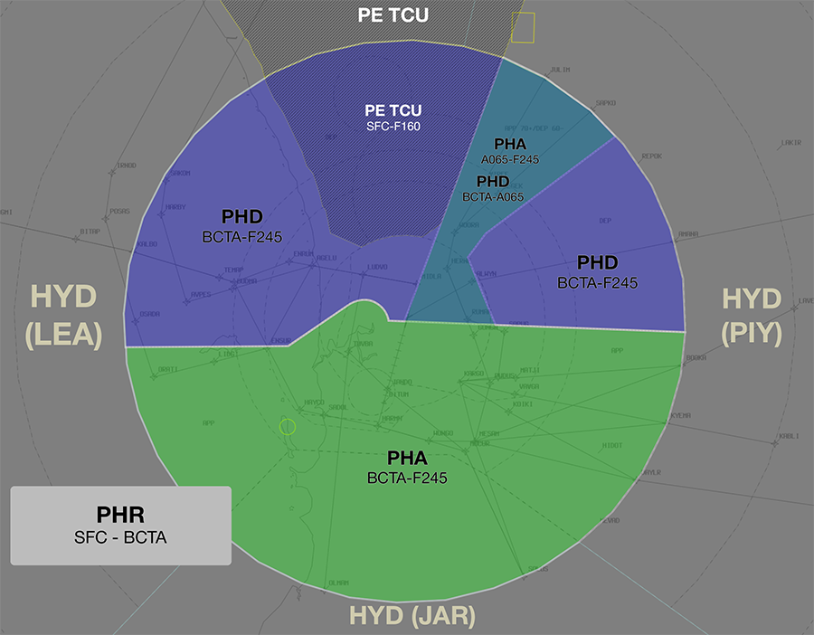
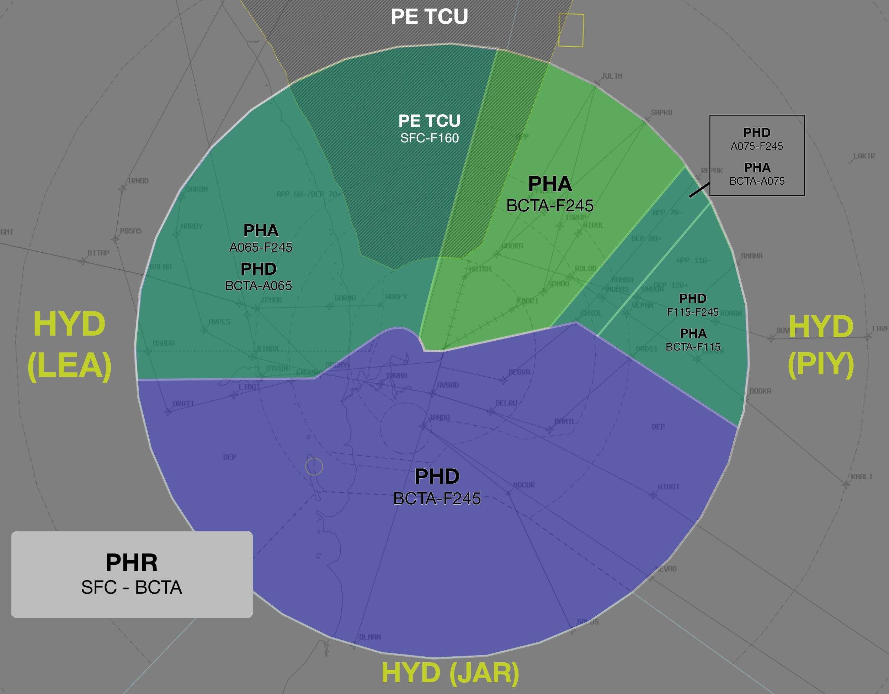

--8<-- "includes/abbreviations.md"

| Name | ID | Callsign | Frequency | Login ID |
| -----| -- | -------- | --------- | ---------------- |
| **Perth Approach** |**PHA**| **Perth Approach**  | **123.600** | **PH_APP**| 
| Perth Departures†  |PHD| Perth Departures  | 118.700 | PH_DEP |
| Perth Flow† | PFL |   |    | PH_FMP  |

† *Non-standard positions* may only be used in accordance with [VATPAC Air Traffic Services Policy](https://vatpac.org/publications/policies){target=new}

## Airspace
The PH TCU is responsible for the airspace within 36 DME of the PH VOR, `SFC` to `F245`.  

!!! note
    A significant portion of the TMA airspace south of the PH VOR (roughly 20 DME onwards) is classified Class E with a lower limit of `F125`. RPT aircraft frequently enter/exit the TMA via this airspace, see [Departure Procedures](#departure-procedures) for more info.

When **PEA TCU** is online R155A & B is released to them from `A020` to `F160`. When R155A is active to `F160`, PH TCU airspace above R155A shall be released to **PEA TCU**.

### Reclassifications
#### JT CTR
JT CTR reverts to Class G when **JT ADC** is offline, and is administered by the relevant PH TCU controller.

See also: [JT ADC Offline](#jtpea-adc-offline).

### Airspace Division
The divisions of the airspace between **PHA**, and **PHD** change based on the Runway Mode.

!!! note
    The following diagrams do not include non PH TCU areas of responsibility such as JT CTR or PEA APP

#### 03/06
<figure markdown>
{ width="700" }
  <figcaption>03/06 TCU Structure</figcaption>
</figure>

#### 21/24
<figure markdown>
{ width="700" }
  <figcaption>21/24 TCU Structure</figcaption>
</figure>

## Runway Modes
Generally, YPPH operates on either the Southwest or Northeast runway plan, as below. Where strong winds dictate the use of only a single runway, this shall be nominated in the ATIS.

### Southwest Plan
With the Southwest Plan active, all departures shall be assigned runway 21 by **PH ACD**. Arrivals shall be processed to either runway 21 or 24 based on their feeder fix, as per the table below:

| Feeder Fix | Assigned Runway |
| --- | --- |
| JULIM | 21 |
| SAPKO | 21 |
| IPMOR | 21 |
| KABLI | 24 (or 21 if operationally required) |
| LAVEX | 24 |
| SOLUS | 24 |

### Northeast Plan
With the Northeast Plan active, departures via `AVNEX`, `OTLED`, `OLMAM`, `SOLUS`, and `OPEGA` shall be assigned runway 03 by **PH ACD**. All other departures shall be assigned runway 06. All arrivals shall be processed to runway 03.

## Scenic Flights
VFR aircraft may plan to conduct scenic flights within CTA in the PH TMA. A number of VFR routes exist to facilitate this, including:

| Name | Route | Preferred Altitude |
| --- | --- | --- |
| Victor 65 | `CTE-PCTY-HKE` | At or below `A015` |
| Victor 66 | `TLMI-HRR-CDM` | At or below `A035` |

Other levels are available at the discretion of the TCU controller but coordination may be required if adjacent TMA sectors are online. See [TCU Internal](#ph-tcu-internal) for coordination requirements.

Aircraft wishing to conduct a scenic flight over the Perth CBD should be cleared via the Victor 65 route. **No lateral separation standard exists between Victor 65 and the extended centreline of runway 06/24**, so controllers must ensure that an alternative form of separation assurance exists.

!!! phraseology
    **VH-CYF:** "Perth Approach, CYF, Cessna 172, overhead FREM, 1,500ft, received Bravo, request Victor 65"  
    **PHA:** "CYF, squawk 0542, remain clear of class C airspace"  
    **VH-CYF:** "Squawk 0542, remain OCTA, CYF"  

    *When clearance (reference traffic into/out of YPPH) is available:*  
    **PHA:** "CYF, cleared Victor 65, maintain 1,500ft"  
    **VH-CYF:** "Cleared Victor 65, maintain 1,500ft, CYF"

Aircraft departing YPPH and intending to conduct the Victor 65 route will be coordinated by **PH ACD**. See [Airways Clearances](#airways-clearances).

## Offline Towers
### JT/PEA ADC Offline
Due to the low level of CTA at these aerodromes, it is best practice to give airways clearance to aircraft at the holding point, to ensure departing aircraft can have uninterrupted climb.

!!! phraseology
    **AAC**: "Perth Approach, AAC, PC12, POB 8, IFR, Taxiing YPJT for YPKG, Runway 06L"  
    **PHA**: "AAC, Perth Approach, Squawk 3601, No Reported IFR Traffic, Report Ready at the Holding Point for Airways Clearance"  
    **AAC**: "Squawk 3601, Wilco, AAC"   

    **AAC**: "AAC, Ready Runway 06L, Request clearance"  
    **PHA**: "AAC, Cleared to YPKG via PH, Flight Planned Route. Make Visual Right turn DCT PH, Climb to A040"  
    **AAC**: "Cleared to YPKG via PH, Flight Planned Route. Make Visual Right turn DCT PH, Climb to A040, AAC"

### Departure Procedures
Aircraft departing the TMA to the south planned at `F130` or above will likely leave and re-enter CTA on climb. These aircraft should be instructed to leave and re-enter on climb to the standard assignable level (or other level as appropriate).

!!! phraseology
    **PHD**: "RXA2125, leave and re-enter controlled airspace on climb to F180, no reported IFR traffic"  
    **RXA2125**: "Leave and re-enter controlled airspace on climb to F180, RXA2125"

## Coordination
### Enroute
#### Departures
Voiceless for all aircraft:
 
- Tracking via a Procedural SID terminus; and  
- Assigned the lower of `F180` or the `RFL`

!!! note
    Aircraft are *not required* to be tracking via the **SID procedure**, simply tracking via any of the terminus waypoints (Regardless of *departure airport* or *assigned SID*) is sufficient to meet the criteria for **voiceless coordination**

All other aircraft going to PIY CTA must be **Heads-up** Coordinated by PH TCU prior to the boundary.

!!! phraseology
    **PH TCU** -> **PIY**: "PFY9916, with your concurrence, will be assigned F130, for my separation with JTE654"  
    **PIY** -> **PH TCU**: "PFY9916, concur F130"  

#### Arrivals
Voiceless for all aircraft:

- With ADES **YPPH**; and  
- Assigned a STAR; and  
- Assigned `A090`

All other aircraft coming from PIY CTA will be **Heads-up** Coordinated to PH TCU.

### PH ADC
#### Auto Release
'Next' coordination is **not** required for aircraft that are:   
    a) Departing from a runway nominated on the ATIS; and  
    b) Assigned the standard assignable level; and  
    c) Assigned a **Procedural SID**

All other aircraft require a 'Next' call to PH TCU.

!!! phraseology
    **PH ADC** -> **PH TCU**: "Next, ABC, runway 03"  
    **PH TCU** -> **PH ADC**: "ABC, Heading 010, unrestricted"  
    **PH ADC** -> **PH TCU**: "Heading 010, ABC"  

    **PH ADC**: "ABC, Assigned heading left 010, Runway 03, Cleared for Takeoff"  
    **ABC**: "Left heading 010, Runway 010, Cleared for Takeoff, ABC"

The PH TCU controller can suspend/resume Auto Release at any time, with the concurrence of PH ADC.

The Standard Assignable level from PH ADC to PH TCU is the lower of `A050` or the `RFL`.

#### Airways Clearances
The controller assuming responsibility of ACD shall give heads-up coordination to the relevant PH TCU controller prior to the issue of the following clearances:  
a) VFR Departures  
b) Aircraft using a runway not on the ATIS

!!! phraseology
    **PH ACD** -> **PH TCU**: "ABC, requesting Victor 65"  
    **PH TCU** -> **PH ACD**: "ABC, cleared Victor 65, 1,500ft"  
    **PH ACD** -> **PH TCU**: "Cleared Victor 65, 1,500ft, ABC"

### PH TCU Internal
Voiceless coordination is in place for all aircraft processed by the Victor 65 and 66 routes in accordance with the table below.

| Route | Non-Coordination Levels | Label Data |
| --- | --- | --- |
| Victor 65 | At or below `A015` | `V65` |
| Victor 66 | At or below `A035` | `V66` |

Other levels are available at the discretion of the TCU controller but coordination may be required if adjacent TMA sectors are online.

All other aircraft transiting between internal PH TCU boundaries must be heads-up coordinated.

!!! phraseology
    **PHA** -> **PHD**: "via PH, FD123"  
    **PHD** -> **PHA**: "FD123, A090"    

### JT ADC
#### Airspace
JT ADC is responsible for the Class D airspace in the JT CTR `SFC` to `A015`.

Refer to [Reclassifications](#jt-ctr) for operations when JT ADC is offline.

#### Departures
When the aircraft is ready for departure, JT ADC will coordinate with the relevant PH TCU controller above them for permission to release the aircraft into their CTA.

!!! phraseology
    **JT ADC** -> **PH TCU**: "Next, FD420, runway 24R"  
    **PH TCU** -> **JT ADC**: "FD420, Unrestricted"  
    **JT ADC** -> **PH TCU**: "FD420"  

The Standard Assignable level from JT ADC to PH TCU is the lower of `A030` or the `RFL`, any other level must be prior coordinated.

#### Arrivals/Overfliers
PH TCU will heads-up coordinate arrivals/overfliers from Class C to JT ADC prior to **5 mins** from the boundary.  
IFR aircraft will be cleared for the coordinated approach (Instrument or Visual) prior to handoff to JT ADC, unless JT ADC nominates a restriction.  
VFR aircraft require a level readback.

!!! phraseology
    **PH TCU** -> **JT ADC**: "via RNAV-Z RWY 06L, FD416, circling to land RWY 24R"  
    **JT ADC** -> **PH TCU**: "FD416, RNAV-Z RWY 06L with a circle to land RWY 24R"  

### PE TCU
**All aircraft** transiting between PE TCU and PH TCU must be heads-up coordinated prior to the boundary.

!!! phraseology
    **PH TCU** -> **PE TCU**: "via PH, VIPR22, Requesting DCT PEA for ILS-Z 18L"   
    **PE TCU** -> **PH TCU**: "VIPR22, DCT PEA, A035"  
    **PH TCU** -> **PE TCU**: "A035, VIPR22"   