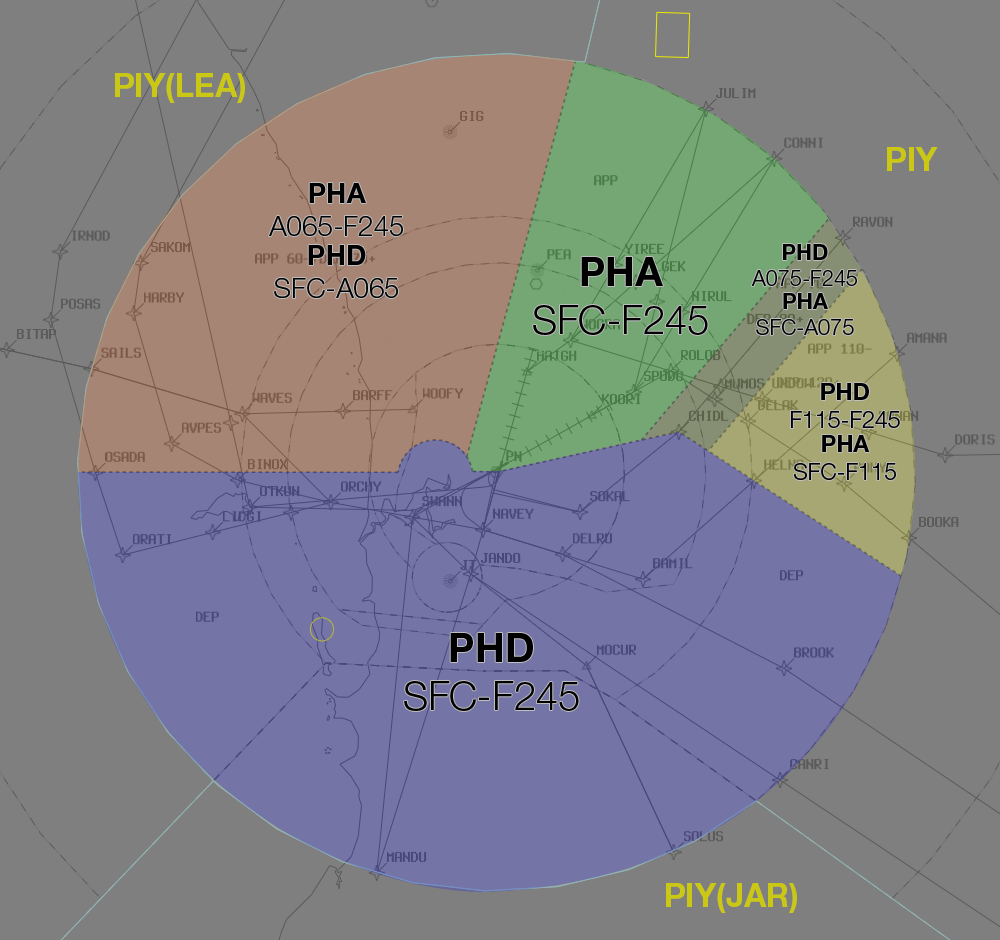

--8<-- "includes/abbreviations.md"

| Name | ID | Callsign | Frequency | Login Identifier |
| -----| -- | -------- | --------- | ---------------- |
| **Perth Approach** |**PHA**| **Perth Approach**  | **123.600** | **PH_APP**| 
| Perth Departures†  |PHD| Perth Departures  | 118.700 | PH_DEP |
| Perth Flow† | PHF |   |    | PH-FLW_CTR  |

† *Non-standard positions* may only be used in accordance with [VATPAC Ratings and Controller Positions Policy](https://vatpac.org/publications/policies)

## Airspace
The PH TCU is responsible for the airspace within 36 DME of the PH VOR, `SFC` to `F245`. 

When **PEA TCU** is online R155A & B is released to them from `A020` to `F160`.  When R155A is active to `F160`, PH TCU airspace above R155A shall be released to **PEA TCU**.

JT CTR reverts to Class G when **JT ADC** is offline, and is administered by the relevant PH TCU controller.      

## Runway Modes
### Southwest Plan
With the Southwest Plan active, all departures shall be assigned runway 21 by **PH ACD**. Arrivals shall be processed to either runway 21 or 24 based on their feeder fix, as per the table below:

| Feeder Fix | Assigned Runway |
| --- | --- |
| JULIM | 21 |
| CONNI | 21 |
| WAVES | 21 |
| BEVLY | 24 (or 21 if operationally required) |
| GRENE | 24 |
| SOLUS | 24 |

### Northeast Plan
With the Northeast Plan active, departures via `AVNEX`, `OTLED`, `MANDU`, `SOLUS`, and `KEELS` shall be assigned runway 03 by **PH ACD**. All other departures shall be assigned runway 06. All arrivals shall be processed to runway 03.

## Scenic Flights
VFR aircraft may plan to conduct scenic flights within CTA in the PH TMA. A number of VFR routes exist to facilitate this, including:

| Name | Route |
| --- | --- |
| Victor 65 | `CTE-PCTY-HKE` |
| Victor 66 | `TLMI-HRR-CDM` |

Aircraft wishing to conduct a scenic flight over the Perth CBD should be cleared via the Victor 65 route. **No lateral separation standard exists between Victor 65 and the extended centreline of runway 06/24**, so controllers must ensure that an alternative form of separation assurance exists.

Aircraft departing YPPH and intending to conduct the Victor 65 route will be coordinated by **PH ACD**. See [Airways Clearances](#airways-clearances).

## Arrival Procedures
### YPJT Arrivals
IFR RNAV equipped arrivals to Jandakot planned via a fix listed shall be cleared via STAR dependent on Perth active runway:

| Perth Active Runway | 03/06 | 21/24 |
| ------------------- | ----- | ----- |
| **North** JULIM (Jet) CONNI (Non-Jet) |  JT 2G / WOORA |  DCT JT |
| **East** BEVLY (Jet) GRENE (Non-Jet) HAMTN (Non-Jet) |  JT 2G / BEVLY JT 2G / GRENE JT 2W / HAMTN |  JT 2R / BEVLY JT 2R / GRENE N/A 

### YPEA Arrivals

Reserved

## JT/PEA ADC Offline
Due to the low level of CTA at these aerodromes, it is best practice to give airways clearance to aircraft at the holding point, to ensure departing aircraft can have uninterrupted climb.

!!! example
    **AAC**: "Perth Approach, AAC, PC12, POB 8, IFR, Taxiing YPJT for YPKG, Runway 06L"  
    **PH TCU**: "AAC, Perth Approach, Squawk 3601, No Reported IFR Traffic, Report Ready at the Holding Point for Airways Clearance"  
    **AAC**: "Squawk 3601, Wilco, AAC"   

    **AAC**: "AAC, Ready Runway 06L, Request clearance"  
    **PH TCU**: "AAC, Cleared to YPKG via PH, Flight Planned Route. Make Visual Right turn DCT PH, Climb to A040"  
    **AAC**: "Cleared to YPKG via PH, Flight Planned Route. Make Visual Right turn DCT PH, Climb to A040, AAC"

## Airspace Division

The divisions of the airspace between **PHA**, and **PHD** change based on the Runway Mode.

!!! note
    The following diagrams do not include non PH TCU areas of responsibility such as JT CTR or PEA APP

### 03/06
<figure markdown>
{ width="700" }
  <figcaption>03/06 TCU Structure</figcaption>
</figure>

### 21/24
<figure markdown>
{ width="700" }
  <figcaption>21/24 TCU Structure</figcaption>
</figure>

## Coordination

### Enroute
#### Departures
Voiceless coordination is in place from PH TCU to PIY (and subsectors) for aircraft assigned the lower of `F180` or the `RFL`, and tracking via a Procedural SID terminus.

Any aircraft not meeting the above criteria must be prior coordinated to ENR.

!!! example
    **PH TCU** -> **PIY**: "PFY9916, with your concurrence, will be assigned F130, for my separation with JTE654"  
    **PIY** -> **PH TCU**: "PFY9916, concur F130"  

#### Arrivals
The Standard assignable level from ENR to PH TCU is `A090`. All other levels must be prior coordinated

### PH ADC
#### Auto Release

"Next" Coordination is a procedure where the PH ADC controller gives a heads-up to the PH TCU controller about an impending departure. The PH TCU controller will respond by assigning a heading to the aircraft, for the PH ADC controller to pass on with their takeoff clearance.

!!! example
    **PH ADC** -> **PH TCU**: "Next, ABC, runway 03"  
    **PH TCU** -> **PH ADC**: "ABC, Heading 010, unrestricted"  
    **PH ADC** -> **PH TCU**: "Heading 010, unrestricted, ABC"

"Next" Coordination to PH TCU is not required for aircraft assigned a **Procedural SID** and the Standard Assignable Level.

"Next" Coordination to PH TCU is additionally required for:   
    a) Aircraft on a non-standard level.  
    b) Aircraft departing from a runway not nominated in the ATIS.  

The PH TCU controller can suspend/resume Auto Release at any time, with the concurrence of PH ADC.

#### Airways Clearances
The controller assuming responsibility of ACD shall give heads-up coordination to the relevant PH TCU controller prior to the issue of the following clearances:  
a) VFR Departures  
b) Aircraft using a runway not on the ATIS

!!! example
    **ABC**: "Perth Delivery, ABC, request Victor 65 scenic."  
    **PH ACD**: "ABC, Perth Delivery, standby"  

    **PH ACD** -> **PH TCU**: "ABC, requesting Victor 65 scenic"  
    **PH TCU** -> **PH ACD**: "ABC, cleared Victor 65 scenic, not above 1,500ft"  
    **PH ACD** -> **PH TCU**: "Cleared Victor 65 scenic not above 1,500ft, ABC"   
     
    **PH ACD**: "ABC, cleared victor 65 scenic not above 1,500ft, squawk 0442"  
    **ABC**: "Cleared for a victor 65 scenic, not above 1,500ft, squawk 0442, ABC"  

### PH TCU Internal

All aircraft transiting between internal PH TCU boundaries must be heads-up coordinated.

!!! example
    **PHA** -> **PHD**: "via PH, FD123"  
    **PHD** -> **PHA**: "FD123, A090"   

### JT ADC

### Next Call
When the aircraft is ready for departure, JT ADC will coordinate with the relevant PH TCU controller above them for permission to release the aircraft into their CTA.

!!! example
    **JT ADC** -> **PH TCU**: "Next, FD420, runway 24R"  
    **PH TCU** -> **JT ADC**: "FD420, Unrestricted"  
    **JT ADC** -> **PH TCU**: "FD420"  

The Standard Assignable level from JT ADC to PH TCU is the lower of `A030` or the `RFL`, any other level must be prior coordinated.

### Arrivals/Overfliers
PH TCU will heads-up coordinate arrivals/overfliers from Class C to JT ADC prior to **5 mins** from the boundary.  
IFR aircraft will be cleared for the coordinated approach (Instrument or Visual) prior to handoff to JT ADC, unless JT ADC nominates a restriction.  
VFR aircraft require a level readback.

!!! example
    **PH TCU** -> **JT ADC**: "via RNAV-Z RWY 06L, FD416, circling to land RWY 24R"  
    **JT ADC** -> **PH TCU**: "FD416, RNAV-Z RWY 06L with a circle to land RWY 24R"  

### PEA ADC
Reserved.

