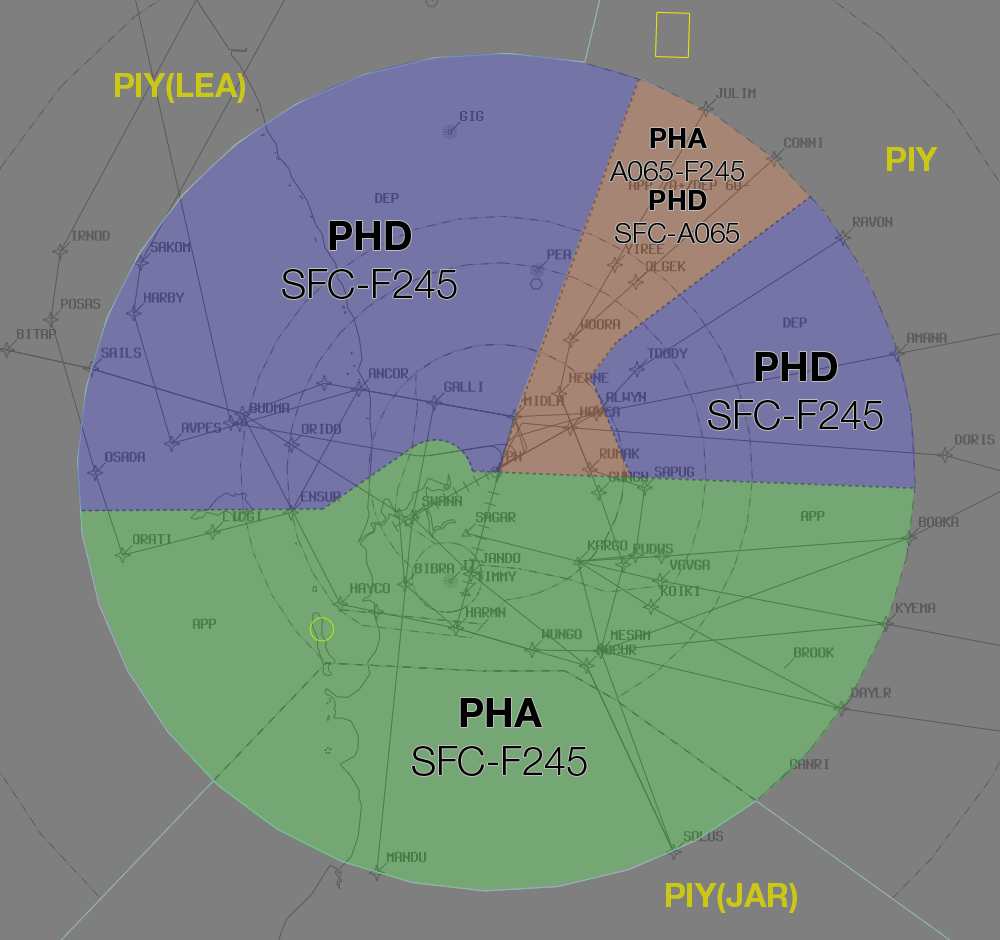

--8<-- "includes/abbreviations.md"

## Positions

| Name | ID | Callsign | Frequency | Login Identifier |
| -----| -- | -------- | --------- | ---------------- |
| **Perth Approach** |**PHA**| **Perth Approach**  | **123.600** | **PH_APP**| 
| Perth Departures†  |PHD| Perth Departures  | 118.700 | PH_DEP |
| Perth Flow† | PHF |   |    | PH-FLW_CTR  |

† **Non-standard position** – may only be used in accordance with [VATPAC Ratings and Controller Positions Policy](https://cdn.vatpac.org/documents/policy/Controller+Positions+and+Ratings+Policy+v5.2.pdf){target=new}

## Airspace
The Perth TMA spans a 36nm Radius around PH from SFC-FL245.   
PH TCU is responsible for the Perth TMA, except:    
a) Class G cut out to the south  
b) JT CTR when **JT TWR** is online.
c) R155A & B when **PEA APP** is online from `A020` to `FL160`. When R155A is active to Fl160, PH TMA airspace above R155A shall be released to **PEA APP**
d) Any airspace released to an external unit (e.g. tower) either by NOTAM or as negotiated.
JT CTR reverts to Class G when **JT TWR** is offline, and is administered by the relevant PH TCU controller.     
In the absence of a **PHD** controller, **PHA** shall asssume the **PHD** airspace.  
PH TCU is responsible for the provision of ADC, SMC and ACD responsibilities when **PH TWR** is offline.

## Arrival Procedures
#### YPJT Arrivals
IFR RNAV equipped arrivals to Jandakot planned via a fix listed shall be cleared via STAR dependent on Perth active runway:

| Perth Active Runway | 03/06 | 21/24 |
| ------------------- | ----- | ----- |
| **North** JULIM (Jet) CONNI (Non-Jet) |  JT 2G / WOORA |  DCT JT |
| **East** BEVLY (Jet) GRENE (Non-Jet) HAMTN (Non-Jet) |  JT 2G / BEVLY JT 2G / GRENE JT 2W / HAMTN |  JT 2R / BEVLY JT 2R / GRENE N/A 

## JT/PEA TWR Offline
Due to the low level of CTA at these aerodromes, it is best practice to give airways clearance to aircraft at the holding point, to ensure departing aircraft can have uninterrupted climb.

!!! example
    **ABC** -> **PH TCU**: "Perth Approach, ABC, PC12, POB 8, IFR, Taxiing YPJT for YPKG, Runway 06L" `AIP GEN 3.4`  
    **PH TCU** -> **ABC**: "ABC, Perth Approach, Squawk 3601, No Reported IFR Traffic, Call me Ready at the Holding Point for Airways Clearance"  
    **ABC** -> **PH TCU**: "Squawk 3601, Wilco, ABC"  
    **ABC** -> **PH TCU**: "ABC, Ready Runway 06L, Request clearance"  
    **PH TCU** -> **ABC**: "ABC, Cleared to YPKG via PH, Flight Planned Route. Make Visual Right turn DCT PH, Climb to A040"  
    **ABC** -> **PH TCU**: "Cleared to YPKG via PH, Flight Planned Route. Make Visual Right turn DCT PH, Climb to A040, ABC" 
## Airspace Division

The divisions of the airspace between **PHA**, and **PHD** change based on the Runway Mode.

!!! note
    The following diagrams do not include non PH TCU areas of responsibility such as JT CTR or PEA APP

### 03/06
<figure markdown>
{ width="700" }
  <figcaption>03/06 TCU Structure</figcaption>
</figure>

### 21/24
<figure markdown>
{ width="700" }
  <figcaption>21/24 TCU Structure</figcaption>
</figure>

## Coordination

### PH TCU / ENR
#### Departures
Voiceless coordination is in place from AD TCU to PIY (and subsectors) for aircraft:  
Planned at or above F180: `Assigned F180`  
Planned below F180: `Assigned the RFL`  

Any aircraft not meeting the above criteria must be prior coordinated to ENR.

!!! example
    **PH TCU** -> **PIY**: "PFY1234, with your concurrence, will be assigned F130, for my separation with JTE654"  
    **PIY** -> **PH TCU**: "PFY1234, concur F130"  

#### Arrivals
The Standard assignable level from ENR to PH TCU is `A090`. All other levels must be prior coordinated

### PH ADC / PH TCU
#### Auto Release

"Next" Coordination is a procedure where the PH TWR controller gives a heads-up to the PH TCU controller about an impending departure. The PH TCU controller will respond by assigning a heading to the aircraft, for the PH TWR controller to pass on with their takeoff clearance.

!!! example
    PH ADC -> PH TCU: "Next, ABC"  
    PH TCU -> PH ADC: "ABC, Heading 010"  
    PH ADC -> PH TCU: "Heading 010, ABC"  
    PH ADC -> ABC: "ABC, Assigned heading left 010, Runway 03, Cleared for Takeoff"  
    ABC -> PH ADC: "Left heading 010, Runway 010, Cleared for Takeoff, ABC"  
    `AIP GEN 3.4`

"Next" Coordination to PH TCU is additionally required for:  
    a) Aircraft on a non-standard level. 
    b) Aircraft departing from a runway not nominated in the ATIS. 

The PH TCU controller can suspend/resume Auto Release at any time, with the concurrence of PH TWR.

"Next" Coordination to PH TCU is not required for aircraft assigned a **Procedural SID** and the Standard Assignable Level.

### PH TCU Internal

All aircraft transiting between internal PH TCU boundaries must be heads-up coordinated.

!!! example
    **PHA** -> **PHD**: "via PH, FD123"  
    **PHD** -> **PHA**: "FD123, A090"   

### PH TCU / JT TWR
#### Departures

Aircraft departing YPJT in to PH TCU Class C will be coordinated from **JT TWR** at Taxi.

!!! example
    **PF TWR** -> **AD TCU**: "Taxi, ABC for YKSC, Runway 03L, via AD"  
    **AD TCU** -> **PF TWR**: "ABC for YKSC, Runway 03L, Cleared Parafield 1, A030"  
    **PF TWR** -> **AD TCU**: "Parafield 1, A030, ABC"  

#### Arrivals
YPPF arrivals shall be coordinated to **PF TWR** from the relevant AD TCU controller prior to transfer of jurisdiction.

!!! example
    **AD TCU** -> **PF TWR**: "ZYX, via DOLVU, Number 1" 
    **PF TWR** -> **AD TCU**: "ZYX, Number 1"  
