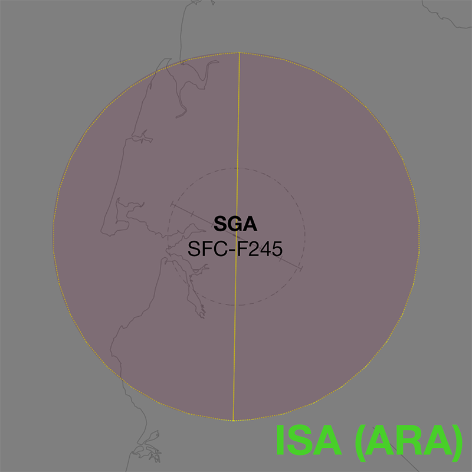
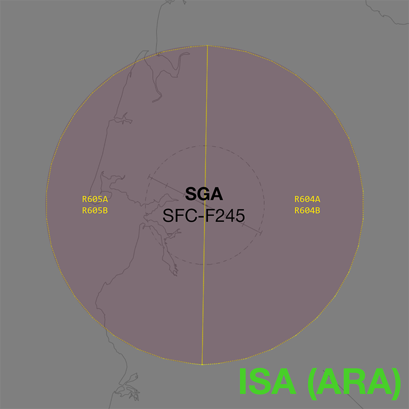

--8<-- "includes/abbreviations.md"

## Positions

| Name                          | ID      | Callsign                | Frequency   | Login ID      |
| ----------------------------- | ------- | ----------------------- | ----------- | ------------- |
| **Scherger Approach**         | **SGA** | **Scherger Approach**   | **124.200** | **SG_APP**    |

## Airspace
The limits of the **SG TCU** are `SFC` to `F245` within 40 NM of the YBSG ARP. This may be amended by NOTAM.

**SG ADC** owns the airspace within the SG CTR from `SFC` to `A015` with a **5nm radius** around YBSG.

<figure markdown>
{ width="700" }
  <figcaption>SG TCU Structure</figcaption>
</figure>

### Airspace Division
By default, SG APP owns the Class C airspace within the SG MIL CTR `A015`-`A040`, as well as the following Restricted Areas, as detailed below:

- R604A (`A040`-`F125`)  
- R604B (`F125`-`F245`)  
- R605A (`A040`-`F125`)   
- R604B (`F125`-`F245`)  

The above Restricted Areas are classified as Class C when SG APP is active.

<figure markdown>
{ width="700" }
  <figcaption>SG TCU Restricted Areas</figcaption>
</figure>

!!! note
    See [VATPAC NOTAMs](https://vatpac.org/publications/notam){target=new} for active NOTAMs which may affect military operations.

## Local Procedures
### Weipa (YBWP)
SG TCU is responsible for clearances into and out of Weipa (YBWP), which sits inside the Scherger Class C control zone when active.

!!! note
    While SG TCU is responsible for the airspace from `SFC` to `F245` above YBWP, they have **no jurisdiction** over the runways, taxiways, or apron areas on the aerodrome itself.

### SUA Gates

#### Departures
Outbound aircraft will report when taxiing for departure to **SG TCU**. Controllers shall issue the aircraft with a squawk code and a traffic statement regarding any aircraft operating on, or shortly to land at, the aerodrome.

!!! note
    Both VFR and IFR aircraft require a clearance to operate in Class C airspace.  The examples below show an IFR aircraft departing.

!!! phraseology
    **QLK479D:** "Scherger Approach, QLK479D, Dash 8, IFR, taxiing YBWP for YBCS, runway 12"  
    **SG TCU:** "QLK479D, squawk 4432, no reported traffic, report lined up for airways clearance"  
    **QLK479D:** "Squawk 4432, wilco, QLK479D"

When the aircraft reports ready, and where no conflict exists, issue airways clearance.

!!! phraseology
    **QLK479D:** "QLK479D, lined up"  
    **SG TCU:** "QLK479D, cleared to YBCS via GUPDA, flight plan route, climb to F230, make right turn, report airborne"  
    **QLK479D:** "Cleared to YBCS via GUPDA, flight plan route, climb to F230, make right turn, QLK479D" 

All surface areas at YBWP are **outside TCU's jurisdiction**. Takeoff clearances are not given.

!!! phraseology
    **QLK479D:** "QLK479D, passing `A012`, climbing to `F230`"  
    **SG TCU:** "QLK479D, identified"

Where a delay is required, withhold clearance until a suitable separation standard exists.

!!! phraseology
    **QLK479D:** "QLK479D, lined up"  
    **SG TCU:** "QLK479D, short delay due to traffic inbound to YBSG"  
    **QLK479D:** "QLK479D"

#### Arrivals
Inbound aircraft should be given an airways clearance by SG TCU (if not entering from ENR CTA). Aircraft may be cleared for a visual approach or one of Weipa's instrument approaches.

As a **landing clearance is not given**, aircraft should instead be informed of any traffic operating on the aerodrome and instructed to *'report clear of the runway'*, when their SARWATCH (for IFR aircraft) should be terminated.

!!! phraseology
    **FD491:** "FD491, visual"  
    **SG TCU:** "FD491, cleared visual approach, no reported traffic, report clear of the runway"  
    **FD491:** "Cleared visual approach, FD491"  

    **FD491**: "FD491, clear of the runway, YBWP, cancel SARWATCH"  
    **SG TCU**: "FD491, YBWP SARWATCH terminated"

## Coordination
### Enroute
#### Departures
Voiceless coordination is in place from SG TCU to ARA for aircraft assigned the lower of `F240` or the `RFL`.

Any aircraft not meeting the above criteria must be prior coordinated to ENR.

!!! phraseology
    **SGA** -> **ARA**: "ASY219, with your concurrence, will be assigned F200, for my separation with ASY404"  
    **ARA** -> **SGA**: "ASY219, concur F200"  

#### Arrivals
The Standard assignable level from ARA to SG TCU is `F130`, and tracking via WP VOR. All other aircraft must be prior coordinated.

!!! abstract "Reference"
    Additional charts to the AIP may be found in the RAAF TERMA document, available towards the bottom of [RAAF AIP page](https://ais-af.airforce.gov.au/australian-aip){target=new}
	
### SG ADC
#### Airspace
SG ADC owns the Class C airspace within the SG CTR from `SFC` to `A015`.

#### Departures
[Next](../controller-skills/coordination.md#next) coordination is required from SG ADC to SG TCU for all aircraft.

The Standard Assignable Level from  **SG ADC** to **SG TCU** is:

| Aircraft | Level |
| ------- | ------- |
| All | The lower of `F240` and `RFL` | 

