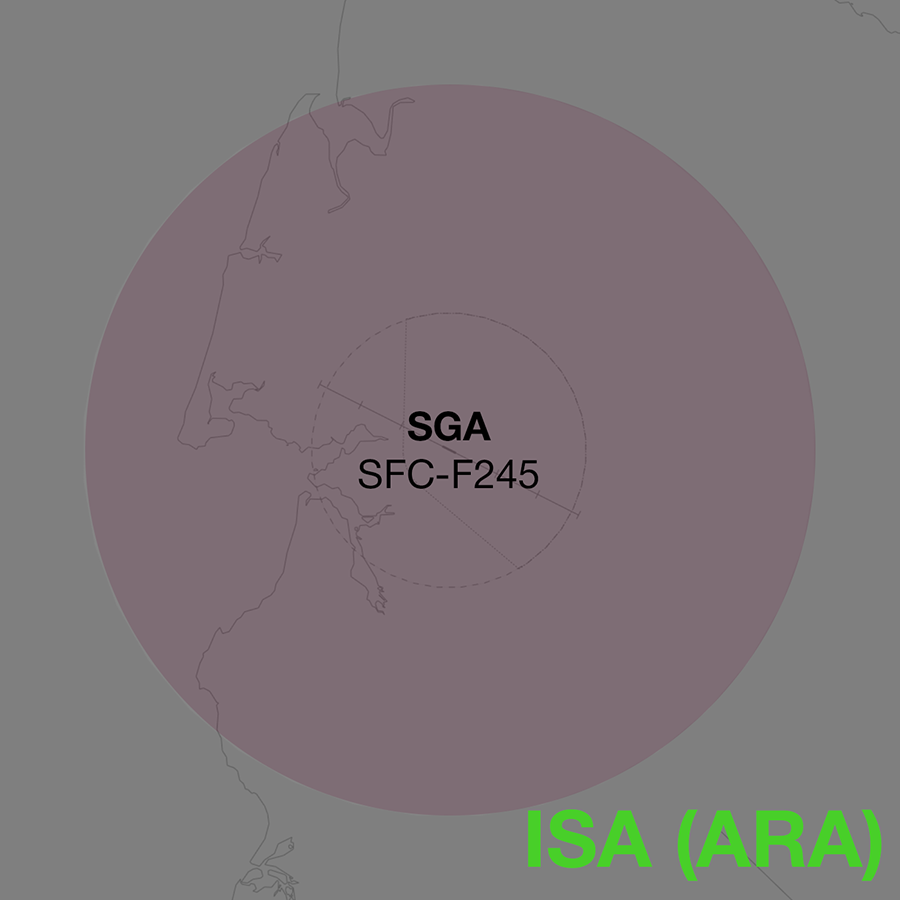
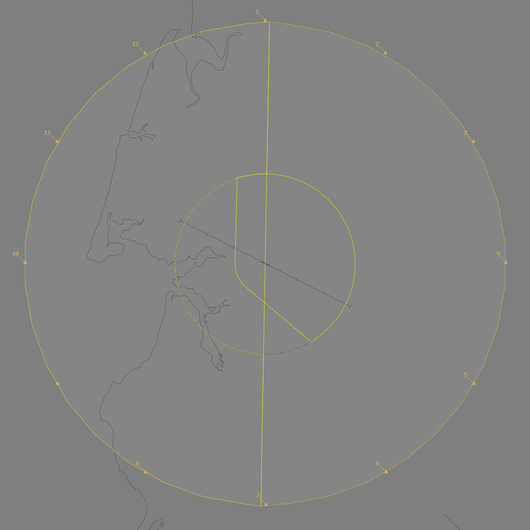
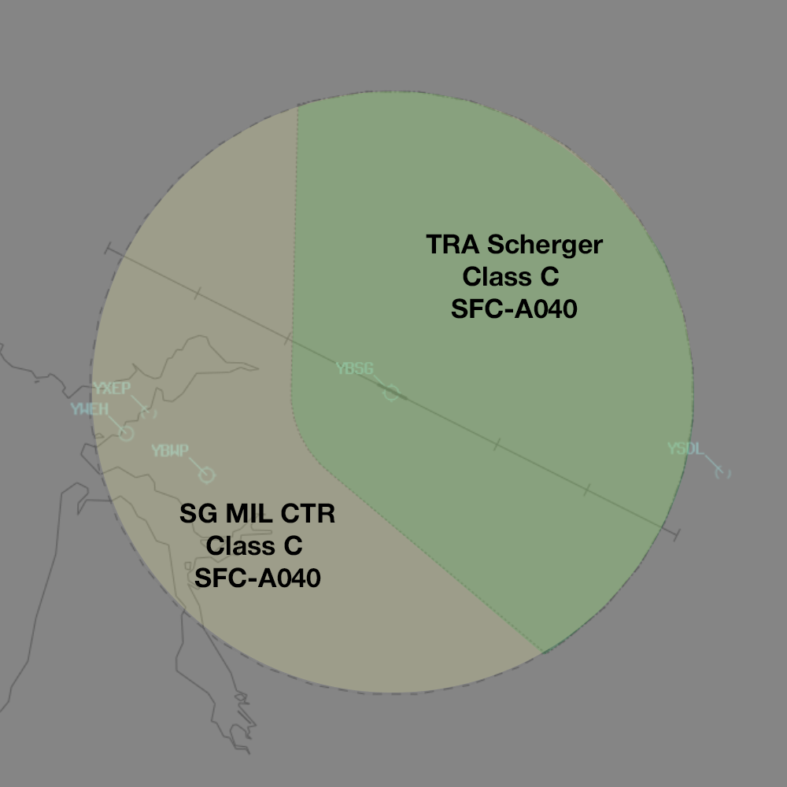
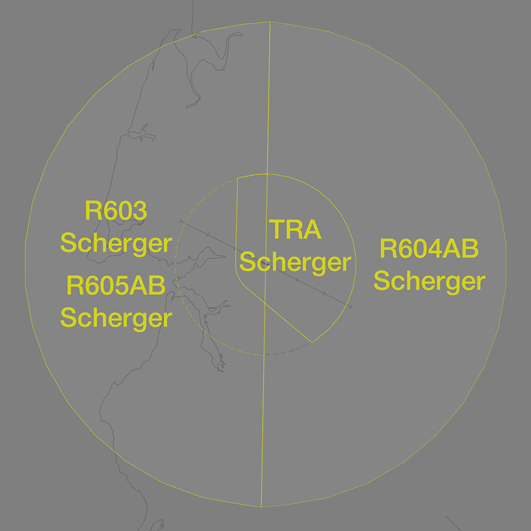

--8<-- "includes/abbreviations.md"

## Positions

| Name                          | ID      | Callsign                | Frequency   | Login ID      |
| ----------------------------- | ------- | ----------------------- | ----------- | ------------- |
| **Scherger Approach**         | **SGA** | **Scherger Approach**   | **124.200** | **SG_APP**    |

!!! note
    Scherger TCU is a [military TCU](../../controller-skills/military/#military-aerodromes) and procedures can differ significantly to those in a civil TCU. Ensure you are familiar with the [military controller skills](../../controller-skills/military) necessary to provide a quality service.

## Airspace
**SG TCU** owns the Class C and G airspace within 40 DME YBSG from `SFC` to `F245`.

<figure markdown>
{ width="700" }
  <figcaption>SG TCU Structure</figcaption>
</figure>

The extent of Class C within the TMA varies according to the activation status of the [SG MIL CTR](#sg-mil-ctr)

### Restricted Area Activations
When **SGA** is online, the following [restricted areas](../../controller-skills/sua/#restricted-areas) are [activated](../../controller-skills/sua/#activation-of-sua) by default, and reclassified as Class C airspace.

- TRA Scherger `SFC-A040`
- R604AB Scherger `A040-F125`
- R605AB Scherger `A040-F125`

The [SG MIL CTR](#sg-mil-ctr) **is not** activated by default.

#### SUA in Enroute Airspace
Military operations taking place in SUA in enroute airspace are outside the jurisdiction of TN TCU.

Upon receiving [airways clearance coordination from SMC](#smc-to-sg-tcu) of an aircraft intending to operate in a currently inactive SUA in enroute airspace, TN TCU must give **heads up** coordination to relevant enroute controllers.

This gives the enroute controller sufficient time to assess the request, make necessary adjustments to any aircraft in the area currently, and activate the SUA; or alternately to refuse the activation request before the aircraft is in the air.

!!! phraseology
    *FBED14 is requesting clearance to operate in the M610A restricted area.*  
    **SG SMC** -> **SGA**: "FBED14 requests clearance to M610A”  
    **SGA** -> **SG SMC**: "Standby, call you back."  
     
    **SGA** -> **ARA**: "On the groud YBSG, FBED14, requests activation of M610A `F125-F245`, from 0300 until 0500.”  
    **ARA** -> **SGA**: "FBED14, expect activation of M610A `F125-F245` at 0300 until 0500."   
    **SGA** -> **ARA**: "FBED14."   
      
    **SGA** -> **SG SMC**: "FBED14, clearance approved."   
    **SG SMC** -> **SGA**: "Clearance approved, FBED14"  
	
!!! note
    The requirement to coordinate activation of an SUA is in **addition** to existing coordination requirements. [**Heads-up** coordination](#departures) is still required for these aircraft if they do not meet the voiceless coordination criteria.

## Local Procedures
### Initial and Pitch 
The [intial points](../../../controller-skills/military/#initial-and-pitch) are aligned with Taxiway A at the following locations.

| RWY  | Initial Point | Altitude |
| ---- | ------------- | --------------------------- |
| 12   | Bend in Mission River at 4.5 TAC SGR | `A025` |
| 30   | Intersection of Marmoss Creek and easterly estuary | `A025` |

### Military Gates
There are numerous [military gates](../../../controller-skills/military/#military-gates) established throughout the SG TMA to facilitate entry and exit to adjoining SUA.

<figure markdown>
{ width="700" }
  <figcaption>SG SUA Gates</figcaption>
</figure>

If the pilot **does not** nominate a gate, or nominates a gate that does not provide access to their intended SUA, SG SMC should clear the aircraft to depart via the **appropriate gate**.

| Intended SUA    | TCU Exit Gate       |
| --------------- | ------------------- |
| N/A (Deps East) | Gate 2, 4, and 6    |
| M601A           | Gate 8, 10, and 12  |

!!! tip
    [Coordination requirements](#smc-to-sg-tcu) exist between SMC and TCU when aircraft are requesting clearance to operate in an SUA that has not been activated. Controllers performing the role of SMC should ensure they coordinate with TCU before providing clearance.

### SG MIL CTR
The **SG MIL CTR** is defined as airspace within 15NM DME YBSG, `SFC-A040`. The SG TMA is unique in that the associated MIL CTR is not necessarily activated by default when **SGA** is online. When the SG MIL CTR is activated the entire area is reclassified as Class C airspace.

The activation status of the SG MIL CTR must be reflected through the [ATIS operational field](../../aerodromes/class-c/Scherger/#operational-info).

<figure markdown>
{ width="700" }
  <figcaption>CTA differences between SG MIL CTR and TRA Scherger</figcaption>
</figure>

!!! note
	The SG MIL CTR profoundly disrupts civilian operations in the area, particularly [Weipa (YBWP)](#weipa-ybwp). Unless the airspace is operationally required for [special operations compliant with the VATSIM Code of Conduct](../../controller-skills/military), the SG MIL CTR **should not** be activated.

#### Weipa (YBWP)
Weipa (YBWP) is a certified civilian aerodrome 10NM west south-west of YBSG. When the SG MIL CTR is activated, Class C airspace extends to `SFC` over the aerodrome, and clearance from **SGA** is required for all operations.

!!! note
    While SG TCU is responsible for the airspace from `SFC` above YBWP, they have **no jurisdiction** over the runways, taxiways, or apron areas on the aerodrome itself.

##### Departures
Outbound aircraft will report when taxiing for departure to **SG TCU**. Controllers shall issue the aircraft with a squawk code and a traffic statement regarding any aircraft operating on, or shortly to land at, the aerodrome.

!!! note
    Both VFR and IFR aircraft require a clearance to operate in Class C airspace. The examples below show an IFR aircraft departing.

!!! phraseology
    **QLK479D**: "Scherger Approach, QLK479D, Dash 8, IFR, taxiing YBWP for YBCS, runway 12"  
    **SGA**: "QLK479D, squawk 4432, no reported traffic, report lined up for airways clearance"  
    **QLK479D**: "Squawk 4432, wilco, QLK479D"

When the aircraft reports ready, and where no conflict exists, issue airways clearance.

!!! phraseology
    **QLK479D**: "QLK479D, lined up"  
    **SGA**: "QLK479D, cleared to YBCS via GUPDA, flight plan route, climb to F230, make right turn, report airborne"  
    **QLK479D**: "Cleared to YBCS via GUPDA, flight plan route, climb to F230, make right turn, QLK479D" 

All surface areas at YBWP are **outside TCU's jurisdiction**. Takeoff clearances are not given.

!!! phraseology
    **QLK479D**: "QLK479D, passing `A012`, climbing to `F230`"  
    **SGA**: "QLK479D, identified"

Where a delay is required, withhold clearance until a suitable separation standard exists.

!!! phraseology
    **QLK479D**: "QLK479D, lined up"  
    **SGA**: "QLK479D, short delay due to traffic inbound to YBSG"  
    **QLK479D**: "QLK479D"

##### Arrivals
Inbound aircraft should be given an airways clearance by SG TCU (if not entering from ENR CTA). Aircraft may be cleared for a visual approach or one of Weipa's instrument approaches.

As a **landing clearance is not given**, aircraft should instead be informed of any traffic operating on the aerodrome and instructed to *'report clear of the runway'*, when their SARWATCH (for IFR aircraft) should be terminated.

!!! phraseology
    **FD491**: "FD491, visual"  
    **SGA**: "FD491, cleared visual approach, no reported traffic, report clear of the runway"  
    **FD491**: "Cleared visual approach, FD491"  

    **FD491**: "FD491, clear of the runway, YBWP, cancel SARWATCH"  
    **SGA**: "FD491, YBWP SARWATCH terminated"
	
##### SG MIL CTR Inactive
When the SG MIL CTR is inactive, the airspace immediately around YBWP is uncontrolled. All IFR departures and arrivals will be processed by **SGA** following normal OCTA procedures.

Due to the low level of CTA, it is best practice to give airways clearance to aircraft at the holding point, to ensure departing aircraft can have uninterrupted climb.

!!! phraseology
	*SG MIL CTR is inactive. QLK2481 is intending to depart YBWP for YBCS.*  
    **QLK2481**: "Scherger Approach, QLK2481, Dash 8, IFR, taxiing YBWP for YBCS, runway 30"  
    **SGA**: "QLK2481, squawk 1202, no reported IFR traffic, report lined up for airways clearance."  
    **QLK2481**: "Squawk 1202, wilco, QLK2481."  
	    
	**QLK2481**: "QLK2481, lined up."   
	**SGA**: "QLK2481, cleared to YBCS via GOPMI, flight planned route, climb to `F240`."   
	**QLK2481**: "Cleared to YBCS via GOPMI, flight planned route, climb to `F240`, QLK2481."    

### Special Use Airspace
<figure markdown>
{ width="700" }
  <figcaption>Notable SUA in the SG TMA</figcaption>
</figure>

#### R603 and R605AB Scherger
The R603 and R605AB Scherger [restricted areas](../../controller-skills/sua/#restricted-areas) are located in the western half of the SG TMA.

It is predominantly used for military training operations, and transit of aircraft to [military gate](#military-gates) adjoining the [M610A Scherger MOA](../../enroute/brisbane/ISA/#m610a-scherger).

#### R604AB Scherger
The R604AB Scherger [restricted area](../../controller-skills/sua/#restricted-areas) is located in the eastern half of the SG TMA.

It is predominantly used for military training operations when TRA Scherger is activated, as it facilitated military operations without distrupting [YBWP](#weipa-ybwp).

## Coordination
### Enroute
#### Departures
Voiceless for all aircraft:

- Assigned the lower of `F240` or the `RFL`.

All other aircraft going into ARA CTA will be **Heads-up** Coordinated by SGA prior to the boundary.

!!! phraseology
    **SGA** -> **ARA**: "ASY219, with your concurrence, will be assigned F200, for my separation with ASY404"  
    **ARA** -> **SGA**: "ASY219, concur F200"  

#### Arrivals
Voiceless for all aircraft:

- With ADES **YBSG**; and
- Tracking via **WP VOR**; and
- Assigned `F130`.

All other aircraft coming from ARA CTA must be **Heads-up** Coordinated to SGA prior to **20nm** from the boundary.
	
### SG ADC
#### Departures
[Next](../controller-skills/coordination.md#next) coordination is required from SG ADC to SG TCU for all aircraft.

The Standard Assignable Level from  **SG ADC** to **SG TCU** is:

| Aircraft | Level |
| ------- | ------- |
| All | The lower of `F190` and `RFL` | 

#### SMC to SG TCU
The controller assuming responsibility of **SMC** shall give [heads-up](../../../controller-skills/coordination/#airways-clearance) coordination to SGA (or the enroute controller responsible for the SG TCU) prior to the issue of a clearance to an aircraft intending to operate in an SUA that **has not** been activated. 

!!! phraseology
    **SG SMC** -> **SGA**: "FBED13 requests clearance to M610A”  
    **SGA** -> **SG SMC**: "FBED13, clearance approved."  

## Charts
!!! abstract "Reference"
     In addition to the civilian `ERSA` and `AIP` publications, [the RAAF AIP website](https://ais-af.airforce.gov.au/australian-aip){target=new} contains the necessary charts (available in the TERMA) and description of procedures (in each airports' FIHA).