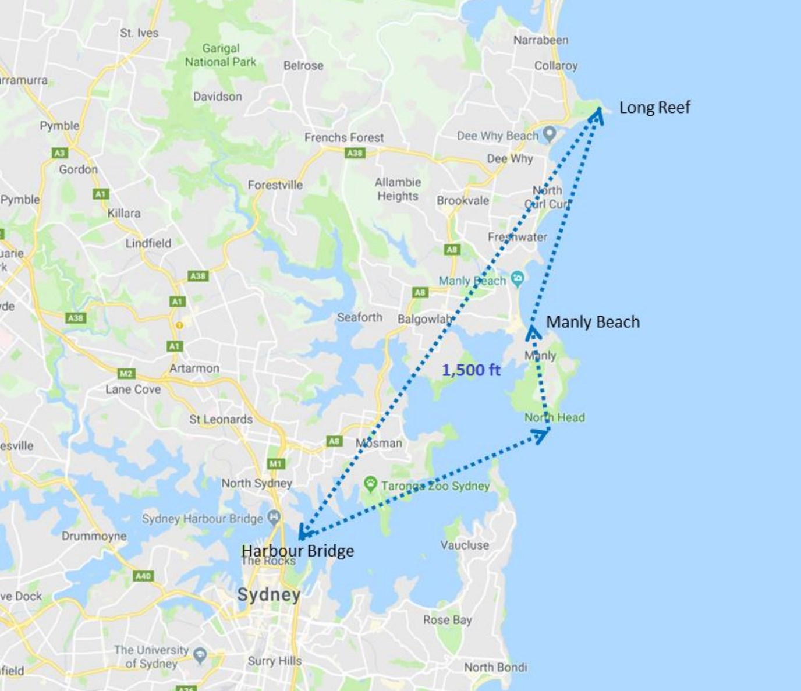
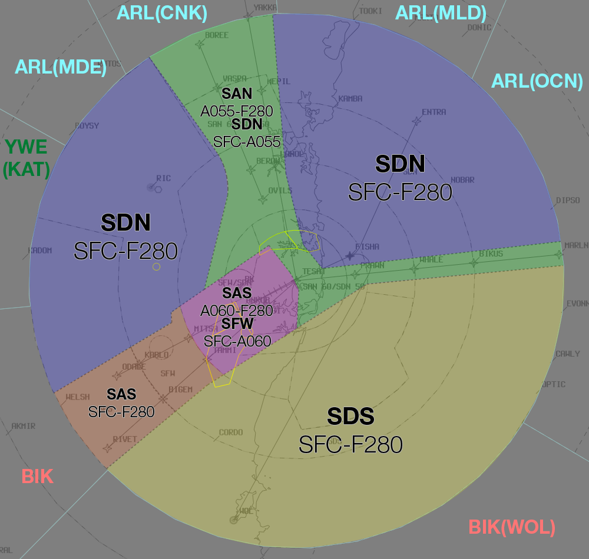
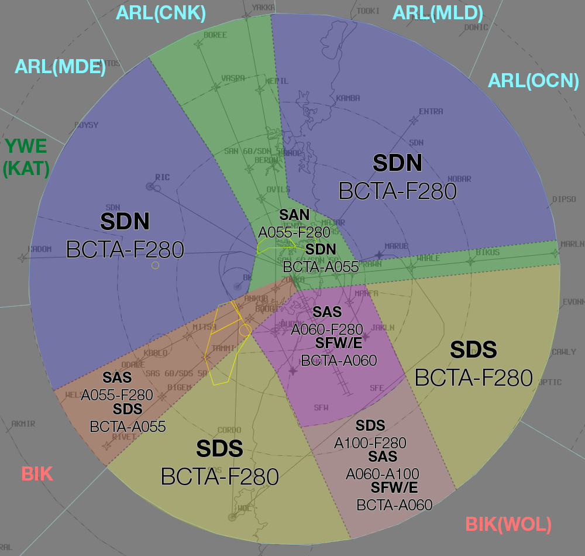

--8<-- "includes/abbreviations.md"

## Positions

| Name               | ID      | Callsign       | Frequency        | Login Identifier              |
| ------------------ | --------------| -------------- | ---------------- | --------------------------------------|
| **Sydney Approach North**    |**SAN**| **Sydney Approach**   | **124.400**         | **SY_APP**                                   |
| Sydney Approach South†   |SAS| Sydney Approach   | 128.300          | SY-S_APP                                 |
| Sydney Departures North†    |SDN| Sydney Departures  | 123.000         | SY_DEP          |
| Sydney Departures South†   |SDS| Sydney Departures | 129.700          | SY-S_DEP         |
| Sydney Director West† |SFW| Sydney Director   | 126.100          | SY-D_APP                               |
| Sydney Director East† |SFE| Sydney Director   | 125.300          | SY-DE_APP                               |
| Sydney Flow†        |SFL|                |          | SY-FLW_CTR                               |

† **Non-standard position** – may only be used in accordance with [VATPAC Ratings and Controller Positions Policy](https://cdn.vatpac.org/documents/policy/Controller+Positions+and+Ratings+Policy+v5.2.pdf){target=new}

## Airspace
The Sydney TMA spans a 45nm Radius around YSSY from SFC-FL280.  
SY TCU is responsible for the Sydney TMA, except:  
a) BK CTR when **BK TWR** is online;  
b) CN CTR when **CN TWR** is online;  
c) R470 Restricted Area, when RIC TWR is online (or as negotiated)  
d) any airspace released to an external unit (e.g. tower) either by NOTAM or as negotiated.

BK CTR reverts to Class G when **BK TWR** is offline, and is administered by the relevant SY TCU controller.    
CN CTR reverts to Class G when **CN TWR** is offline, and is administered by the relevant SY TCU controller.  
SY TCU is responsible for the provision of ADC, SMC and ACD responsibilities when **SY TWR** is offline.
### Airspace Structural Arrangements

Pursuant to Section 3 of the [VATPAC Ratings and Controller Positions Policy](https://cdn.vatpac.org/documents/policy/Controller+Positions+and+Ratings+Policy+v5.2.pdf){target=new}, the following rules apply, in the order presented, to these controller positions, except **SFL**:  
a) **“North”**/**”West”** positions shall assume the airspace of corresponding **“South”**/**”East”** positions when the latter are inactive (e.g. **SAN** assumes **SAS** airspace), and vice versa;  
b) Approach assumes Director/Departure airspace “on-side” when the latter positions are inactive (e.g. with **SAS** and **SAN** online only, **SAS** assumes **SDS** and **SFW**) 
## Arrival Procedures
### Level Assignment
Adjacent STARs do not guarantee lateral separation (particularly as aircraft get closer to TESAT), so to avoid a breakdown of separation standards, Approach should assign levels as follows: <ul><li>ODALE/MEPIL STAR: `A060`</li><li>RIVET/BOREE STAR: `A080`</li><li>MARLN STAR: `A090`</li></ul>

RIVET/BOREE aircraft should only be assigned `A070` when an adjacent ODALE/MEPIL arrival is maintaining `A060`.  These aircraft can be stepped down to `A060` once sufficient lateral separation exists (often during the downwind turn).

MARLN aircraft which require an overfly to the west should be assigned `A090` and stepped down on top of any RIVET arrivals.

!!! tip
    Be mindful of Sydney's <a href="#radar-entry-procedure-rep">REP airspace</a> arrangement and avoid leaving arrivals at `A100`.  Aircraft should be descended to `A090` or below by 20DME to prevent conflict with departing traffic.

All aircraft should be assigned no lower than `A060` until clear of the active runways' departure tracks.  This normally occurs once established on downwind (but changes based on runway config).

!!! note
    Remember that you will not receive "Next" Coordination on aircraft assigned Standard Assignable Levels (ie `A050` for Jets, `A030` for Non-Jets), meaning an aircraft could depart at any time without prior warning and climb to `A050`.

!!! example
    For an aircraft inbound from the north on the BOREE3A arrival to runway 34R, assign no lower than `A080` until any adjacent aircraft are maintaing `A060`, then `A070` until the aircraft are laterally clear.  The arrival should then be assigned `A060` until south of the field.

Be mindful of departures from YSBK which may also impact aircraft on downwind for RWY 16R at YSSY.  Do not assign lower than `A040` until the aircraft is north/east of the BK CTR and clear of any departing traffic (who are assigned `A030` by default).
## Parallel Runway Operations

### Runway Selection
Unless operationally required, aircraft shall be assigned the following runways for arrival when PROPS are in progress:

| Aircraft tracking | Runway  |
| ----------------| --------- |
| via RIVET   | 16R/34L      |
| via ODALE | 16R/34L |
| via MARLN | 16L/34R |
| via BOREE | 16L/34R |
| via MEPIL | 16L/34R |
| Other aircraft: |
| From the NORTH and EAST | 16L/34R |
| From the SOUTH and WEST | 16R/34L |

### Director East and West

Sydney Approach North (SAN) / Sydney Approach South (SAS) are required to hand-off aircraft to the appropriate Sydney Director East (SFE) / Sydney Director West (SFW) Controller on a <u>downwind heading</u>, <u>assigned</u> (or maintaining) <u>6000FT</u>.

Note - the downwind heading is not required to be entered in the label data by SAN/SAS.

SFW/SFE should provide aircraft an approximate 'miles to run' on first contact, to allow the aircraft to plan their descent path.

A typical downwind will take roughly 25 track miles from the normal point have handover from SAN/SAS to SFE/SFW.

!!! example
    "QLK402, Sydney Director, descend via STAR 4000 FT, 25 miles to run"

SFW/SFE may provide distance to touchdown, when transferring an aircraft to tower after the aircraft is established on their approach runway centreline (see below).

!!! example
    "QFA490, 8 miles to touchdown, contact tower 120.5"

### Instrument Approach

Aim to vector aircraft to the following Intercept points during instrument PROPS (GLS or ILS approach) unless sufficient separation can be established between parallel approaches:

| Runway | Distance from Threshold | Level  |
| --| ----------------| --------- |
|RWY 16R/34L| 10nm   | A030     |
|RWY 16L/34R| 15nm or further | A040 |

### Independent Visual Approach

When conducting IVAs, aircraft shall not be transferred to **SY ADC** until established on final.

!!! example
    **SFW:** “BNZ444, Turn left heading 360, join final Runway 34L, from that heading Cleared Independent Visual Approach” `AIP GEN 3.4`   
    **BNZ444:** "Left heading 360, join final Runway 34L, from that heading Cleared Independent Visual Approach, BNZ444"  
    ...  
    **SFW:** "BNZ444, Contact Sydney Tower 120.5"  
    **BNZ444:** "120.5, BNZ444" 

## Sydney Harbour Scenic Flights
Flights may be cleared for one of two standard scenic flight routes at `A015`, **Harbour Scenic ONE** or **Harbour Scenic TWO**, which are described below. Pilot preference should be accommodated where traffic permits.

Aircraft must Track via Class G airspace to Long Reef and contact SY TCU prior to reaching Long Reef requesting a ‘Harbour Scenic’ clearance. Attempt to identify the aircraft, and if a clearance cannot be given immediately, instruct the pilot to remain in Class G airspace.

!!! example
    LOI, squawk 0542, remain clear of Class C airspace”

A **‘Harbour Scenic ONE’** (or **‘TWO’**) clearance is used to authorise flight in the nominated route at `A015`. Sydney QNH must be issued with the clearance.

!!! example
    LOI, identified, cleared Harbour Scenic One, Sydney QNH 1014”

<figure markdown>
{ width="400" }
  <figcaption>Sydney Harbour Scenic One</figcaption>
</figure>

<figure markdown>
{ width="400" }
  <figcaption>Sydney Harbour Scenic Two</figcaption>
</figure>

These can be displayed on vatSys using the `SY_VFR` map.

## Helicopter Operations
### Inbound/Outbound Routes
Helicopters outbound from YSSY will make contact with the Departures controller established on a Helicopter Route.  Controllers need only identify the aircraft, as they will already be cleared to climb to a suitable level (generally not above `A010`) through their coded clearance.  Each clearance stipulates a point where identification and control services are automatically terminated, but controllers may explicitely cancel these services for new pilots who may not understand where they exit CTA.  

!!! example
    **YZD:** "Sydney Departures, helicopter YZD, passing 900ft on the Barracks 5 Outbound"  
    **SY TCU:** "YZD, Departures, identified"

Helicopters tracking inbound to YSSY will generally do so via a Helicopter Route.  Aircraft are required to contact the TCU controller for clearance along these routes, with the exception of the `CAPE BANKS 5 INBOUND` and `WANDA 5 INBOUND` for which they should contact **SY ADC** directly.  

Controllers should identify the aircraft and then provide clearance if traffic permits.

!!! example
    **HSZ:** "Sydney Departures, helicopter HSZ, Sydney Heads, A010, received Delta, request Harbour Bridge 5 Inbound"  
    **SY TCU:** "HSZ, squawk 0552"  

    **SY TCU:** "HSZ, identified, cleared Harbour Bridge 5 Inbound"

!!! note
    Some Helicopter Routes may conflict with fixed wing approach/departure paths, so use common sense to separate helicopters when required.  For example, during 34 PROPS, it may be more suitable for helicopters to track via the `CAPE BANKS 5 INBOUND` rather than taking the `MAROUBRA 5 INBOUND`, due to it's close proximity to the **MARUB SID**.  In any case, if pilots are unfamiliar with local landmarks, simplify your instructions to assist them while maintaining separation.

Helicopters should be transferred to **SY ADC** early to allow them to provide sequencing and separation with fixed-wing aircraft.

!!! tip
    You can find details of each Helicopter Route in the YSSY ERSA FAC under section 14 `HELICOPTER ROUTE OPERATIONS` and display an approximation of the route on vatSys using the `SY_HELO` map.

### Terminal Airspace Operations
#### Bondi Coded Clearances
The `BONDI 5` coded clearance is only available to helicopters, provided PRM approaches are not in use to RWY 16s at YSSY.  The clearance may not be available (or delays may be required) when RWY 25 is in use for arrivals or RWY 07 is in use for departures.  

!!! tip
    You can find details of the BONDI 5 procedure in the YSSY ERSA FAC under section 14 `HELICOPTER ROUTE OPERATIONS`.

Helicopters should be identified and then cleared for the `BONDI 5 NORTHBOUND` or `BONDI 5 SOUTHBOUND`. Traffic information must be provided on any other helicopters operating on the route or any other aircraft in the area (e.g. aircraft in Victor One).  Sydney QNH should be provided if the aircraft didn't depart from YSSY recently.

!!! example
    **YOE:** "Sydney Approach, helicopter YOE, Jibbon Point, 500ft, received Whiskey, request Bondi 5 Northbound"  
    **SY TCU:** "YOE, Sydney Approach, squawk 0451"  

    **SY TCU:** "YOE, identified, cleared Bondi 5 Northbound, Sydney QNH 1024"

Once the aircraft exits CTA at Long Bay Headland (southbound) or Sydney Heads (northbound), cancel their identification and control services.  If the helicopter is likely to request a clearance via one of Sydney's Helicopter Routes, consider instructing them to remain on their assigned squawk code to assist with identification.

!!! example
    *"YOE, clear of controlled airspace, identification and control service terminated, squawk 1200, frequency change approved"*
#### Sector Coded Clearances
To reduce frequency congestion, several commonly used geographically defined areas are designated with lateral and vertical limits and provided upon request via a coded clearance to helicopter aircraft.

| Sector Name | Lateral Limits | Vertical Limits  |
| --| ----------------| --------- |
| City East | Bounded by Rushcutters Bay, Sydney Cricket Ground, Sydney Harbour Bridge South Pylon, Fort Denison, Clark Island, Rushcutters Bay   | Not above `A020`     |
| CBD | Bounded by Rushcutters Bay, Sydney Cricket Ground, Cleveland Street, Regent Street, George Street, Sydney Harbour Bridge South Pylon, Fort Denison, Clarke Island, Rushcutters Bay | Not above `A020` |
| North Harbour | The area northeast of a line St Ives Showground, Roseville Bridge, Sydney Harbour Bridge North Pylon then via the northern shore of Sydney Harbour to Middle Head then Manly | Not above `A015` |
| Northern Beaches | The area east of a line Long Reef, Spit Bridge, Sydney Harbour Bridge North Pylon then via the northern shores of Sydney Harbour to Middle Head then Manly | Not above `A015` |
| South Harbour | The area bounded by lines joining Sydney Harbour Bridge North Pylon, Sydney Harbour Bridge South Pylon, then via the southern shoreline of Sydney Harbour to South Head then Manly to Middle Head, then via the northern shoreline of Sydney Harbour to Sydney Harbour Bridge North Pylon | Not above `A015` |
| Manly | The area North of line South Head to Middle Head to the Spit Bridge, East of a line Spit Bridge to intersection Pittwater and Warringah Roads to Curl Curl Beach, Coastal Southbound to South Head | Not above `A015` |

Helicopters should be identified and then provided the clearance where traffic permits.  Helicopters established on a Helicopter Route should be issued an onwards clearance into the requested sector.

!!! example
    **HWD:** "Sydney Departures gday, helicopter HWD, passing 800ft on the Harbour Bridge 5 outbound, request South Harbour Sector"  
    **SY TCU:** "HWD, Departures, identified, onwards clearance South Harbour Sector"  
    **HWD:** "Onwards clearance South Harbour Sector, HWD"

## BK TWR Offline
Due to the low level of CTA (`A015`) in the BK CTR when **BK TWR** is offline, it is best practice to give airways clearance to aircraft at the holding point, to ensure departing aircraft can have uninterrupted climb.

!!! example
    **LOA**: "LOA, King Air, POB 10, IFR, taxing Bankstown for Shellharbour, Runway 11C" `AIP GEN 3.4`  
    **SY TCU**: "LOA, Sydney Approach, squawk 3601, no reported IFR traffic, report ready at the holding point for airways clearance"  
    **LOA**: "Squawk 3601, wilco, LOA"  

    **ABC**: "LOA, ready Runway 11C"  
    **SY TCU**: "LOA, cleared to YSHL via ANKUB, flight planned route, Bankstown 8 Departure, climb via SID A030"  
    **LOA**: "Cleared to YSHL via ANKUB, flight planned route, Bankstown 8 Departure, climb via SID A030, LOA" 
## Airspace Division

The divisions of the airspace between **SAN**, **SAS**, **SDS**, **SDN**, **SFW** and **SFE** change based on the Runway Mode.

!!! note
    The following diagrams do not include non SY TCU areas of responsibility such as BK CTR or CN CTR

### 07
<figure markdown>
{ width="700" }
  <figcaption>07 TCU Structure</figcaption>
</figure>

### 16 PROPS
<figure markdown>
{ width="700" }
  <figcaption>16 PROPS TCU Structure</figcaption>
</figure>

### 25
<figure markdown>
{ width="700" }
  <figcaption>25 TCU Structure</figcaption>
</figure>

### 34 PROPS
<figure markdown>
{ width="700" }
  <figcaption>34 PROPS TCU Structure</figcaption>
</figure>

### SODPROPS
<figure markdown>
{ width="700" }
  <figcaption>SODPROPS TCU Structure</figcaption>
</figure>

## Coordination
### SY TCU / ENR
#### Departures
Voiceless coordination is in place from SY TCU to all surrounding ENR sectors (**ARL** (and subsectors) to the North and East, **YWE** (and subsectors) to the West, **BIK** (and subsectors) to the South) for aircraft assigned:  
- The lower of `F280` or the `RFL`, **with the exception of**:  
- Aircraft with ADES YWLM, which will be assigned the lower of `F130` or the `RFL`.  

Aircraft must be tracking from **SDN** or **SDS** airspace (see [Airspace Division](http://sops.vatpac.org/terminal/Sydney%20TCU/operations/#airspace-division){target=new}).

Any aircraft tracking from **SAS** or **SAN** airspace, or **not** assigned the standard assignable level, must be **Heads-up** Coordinated to the relevant ENR sector as soon as practical.

!!! example
    **SY TCU** -> **ARL**: "JST789, with your concurrence, will be assigned F240, for my separation with ANZ12"  
    **ARL** -> **SY TCU**: "JST789, concur F240"  

#### Arrivals
Standard assignable levels from ENR to SY TCU are as follows:  
via RIVET, BOREE, or MARLN: `A100`  
All other routes: `A090`  
### SY TCU Internal
#### APP / DIR

Voiceless coordination is in place between APP and DIR, with the following conditions:

a) Assigned `A060`  
b) Routed/vectored as per the table below:

| STAR  | 07   | 16L  | 16R   | 25   | 34L | 34R
| ------| --------------| -------------- | ----- | -----|-----|-----|
| BOREE   |H240| LOC/IVA  | LOC/IVA  | H060 | STAR | STAR|
| MEPIL   |H240| STAR  | STAR  | H060 | H150 | H150|
| MARLN   |H240| H330  | H330  | STAR | H150 | STAR|
| RIVET  |STAR| H330  | H330  | H060 | STAR | STAR|
| ODALE |LOC| H330  | H330  | H060 | H150 | H150|

!!! tip
    If strong winds are present at altitude, APP/DIR should discuss slight changes to these headings to compensate for large crosswind components.

Where an aircraft needs to cross the approach paths or overfly Sydney to join the opposite circuit, the following altitudes shall be used until radar separation is established with respect to the approach paths:  
Eastbound: `A070`  
Westbound: `A080`

Any aircraft not meeting these requirements **must** be prior coordinated to DIR.

!!! example
    **QFA421:** "QFA421, request direct SOSIJ"  
    **SAS:** "QFA421, standby"  

    **SAS** -> **SFW**: "QFA421, requesting direct SOSIJ"  
    **SFW** -> **SAS**: "QFA421, concur direct SOSIJ"  
    **SAS** -> **SFW**: "Direct SOSIJ, QFA421"  

    **SAS:** "QFA421, cancel STAR, recleared direct SOSIJ, A060"  
    **QFA421:** "Cancel STAR, recleared direct SOSIJ, A060, QFA421"  

!!! example
    **SAS** -> **SFW**: "VOZ456, with your concurrence, will be assigned A070, for my separation with UJI"  
    **SFW** -> **SAS**: "VOZ456, concur A070"   

#### APP / DEP
##### Radar Entry Procedure (REP)
Within 15 DME of SY, Departure controllers (**SDN** and **SDS**) can allow aircraft to cross airspace owned by Approach controllers (**SAN** and **SAS**) at or above `A100` without coordination.  This allows aircraft to safely depart above arriving aircraft and facilitates more direct tracking for YSBK & YSRI departures.  

!!! note
    SIDs from YSSY do not guarantee that aircraft will reach A100 by 15DME, so Departure controllers should be mindful of this and take action where necessary to expedite climb or coordinate with Approach.  

    Departure controllers should take extra caution when processing the following procedures to ensure they reach `A100` prior to entering REP airspace:  
    <ul><li>RWY 34L: WOL SID & RIC SID with RADAR transition</li><li>RWY 16R DEENA SID with RIC/KADOM transitions</li><li>YSBK departures via ENTRA/WOL</li></ul>

It is vital that Approach controllers ensure all arriving aircraft are established below `A090` no later than 20DME to avoid conflicting with departures utilising the airspace.  All STARs have height requirements which ensure this is achieved.  Aircraft inbound to YSBK or YSSY who are not cleared via a STAR should be instructed to reach `A090` by 20DME.

!!! information
    Circumstances like excessive weather deviation may make the use of REP impractical.  Controllers should coordinate with other TMA positions and suspend REP in this case.

##### MARLN Corridor
Aircraft are permitted to cross the MARLN corridor at or above `A060` without coordination with APP. DEP is responsible for separation with respect to aircraft in the corridor.
### SY TCU / SY ADC
#### Auto Release

Auto Release shall be used for aircraft that are:    
a) Departing from a runway nominated on the ATIS; and  
b) Issued a Procedural SID; and   
c) Assigned the standard assignable level.

Any aircraft that don't meet these criteria must be coordinated to SY TCU with a "Next" Call.

"Next" Coordination is a procedure where the **SY ADC** controller gives a heads-up to the SY TCU controller about an impending departure. The SY TCU controller will respond by assigning a heading to the aircraft, for the **SY ADC** controller to pass on with their takeoff clearance.

!!! example
    **SY ADC** -> **SY TCU**: "Next, ABC"  
    **SY TCU** -> **SY ADC**: "ABC, Heading 030"  
    **SY ADC** -> **SY TCU**: "Heading 030, ABC"  
    **SY ADC** -> **ABC**: "ABC, Assigned heading right 030, Runway 34R, Cleared for Takeoff"  
    **ABC** -> **SY ADC**: "Right heading 030, Runway 34R, Cleared for Takeoff, ABC"  
    `AIP GEN 3.4`

The SY TCU controller can suspend/resume Auto Release at any time, with the concurrence of **SY ADC**.
### SY TCU / BK TWR
#### Departures

Aircraft departing YSBK in to SY TCU Class C will be coordinated from **BK TWR** at Taxi. Aircraft will need to be passed airways clearances to **BK TWR** at this point, to be relayed to the aircraft.

!!! example
    **BK TWR** -> **SY TCU**: "Taxi, TFX12 for YMML via WOL"  
    **SY TCU** -> **BK TWR**: "TFX12, BK, WOL, Flight Planned Route, A030, Squawk 3601"  
    **BK TWR** -> **SY TCU**: "BK, WOL, Flight Planned Route, A030, Squawk 3601, TFX12"  
    **BK TWR** Will then pass the airways clearance to TFX12

**BK TWR** will then give a "Next" call, where the SY TCU controller shall assign a heading (usually 290, for separation from YSSY).

!!! example
    **BK TWR** -> **SY TCU**: "Next, TFX12"  
    **SY TCU** -> **BK TWR**: "TFX12, Right Heading 290, A030"  
    **BK TWR** -> **SY TCU**: "Right Heading 290, A030, TFX12"  
    **BK TWR** Will then clear the aircraft to takeoff with the assigned heading, and instruct them to contact SY TCU passing A020.

#### Arrivals

YSBK arrivals shall be coordinated to **BK TWR** from SY TCU prior to transfer of jurisdiction.

!!! tip
    Ensure the aircraft's FDR is up-to-date in order to give **BK TWR** maximum situational awareness of the traffic picture. (eg. if the aircraft is doing the RNP approach, ensure the FDR has been rerouted via the appropriate points)

!!! example
    **SY TCU** -> **BK TWR**: "ABC, via ODALE, Number 1"  
    **BK TWR** -> **SY TCU**: "ABC, Number 1"  

### SY TCU / CN TWR
#### Departures

Aircraft departing YSCN in to SY TCU Class C will be coordinated from **CN TWR** at Taxi.

!!! example
    **CN TWR** -> **SY TCU**: "Taxi, DEF for YBTH via KADOM"  
    **SY TCU** -> **CN TWR**: "DEF, Squawk 3601."  
    **CN TWR** -> **SY TCU**: "Squawk 3601, DEF"  

CN TWR will then give a "Next" call.

!!! example
    **CN TWR** -> **SY TCU**: "Next, DEF"  
    **SY TCU** -> **CN TWR**: "DEF"  
#### Arrivals

YSCN arrivals shall be coordinated to **CN TWR** from SY TCU prior to transfer of jurisdiction.

!!! example
    **SY TCU** -> **CN TWR**: "New Sequence of 2, ZYX, via TONTO, Number 1. QET, via WATLE, Number 2"  
    **CN TWR** -> **SY TCU**: "ZYX Number 1, QET Number 2"  
### SY TCU / RIC TWR

Reserved
