--8<-- "includes/abbreviations.md"

## Positions

| Name                           | ID      | Callsign                | Frequency   | Login ID      |
| ------------------------------ | ------- | ----------------------- | ----------- | ------------- |
| **Sydney Approach South**      | **SAS** | **Sydney Approach**     | **128.300** | **SY_APP**    |
| Sydney Approach North :material-information-outline:{ title="Non-standard position"}      | SAN | Sydney Approach    | 124.400 | SY-N_APP |
| Sydney Departures South :material-information-outline:{ title="Non-standard position"}    | SDS | Sydney Departures  | 129.700 | SY_DEP   |
| Sydney Departures North :material-information-outline:{ title="Non-standard position"}    | SDN | Sydney Departures  | 123.000 | SY-N_DEP |
| Sydney Director West :material-information-outline:{ title="Non-standard position"}       | SFW | Sydney Director    | 126.100 | SY-D_APP |
| Sydney Director East :material-information-outline:{ title="Non-standard position"}       | SFE | Sydney Director    | 125.300 | SY-DE_APP|
| Sydney Centre :material-information-outline:{ title="Non-standard position"}              | SYC | Sydney Centre      | 124.550 | SY-R_DEP |
| Bankstown Approach :material-information-outline:{ title="Non-standard position"}         | SBA | Bankstown Approach | 125.800 | BK_APP   |
| Richmond Approach :material-information-outline:{ title="Non-standard position"}          | SRA | Richmond Approach  | 135.900 | RI_APP   |
| Nancy-Bird Walton Approach :material-information-outline:{ title="Non-standard position"} | SWA | Walton Approach    | 118.400 | WS_APP   |
| Sydney Flow :material-information-outline:{ title="Non-standard position"}                | SFL |                    |         | SY_FMP   |

!!! abstract "Non-Standard Positions"
    :material-information-outline: Non-standard positions may only be used in accordance with [VATPAC Air Traffic Services Policy](https://vatpac.org/publications/policies){target=new}.  
    Approval must be sought from the **bolded parent position** prior to opening a Non-Standard Position, unless [NOTAMs](https://vatpac.org/publications/notam){target=new} indicate otherwise (eg, for events).

## Airspace
The vertical limits of the SY TCU are `SFC` to `F285`.

### SY ADC
**SY ADC** is responsible for the Class C Airspace within the SY CTR `SFC` to `A005`.  

### Reclassifications
=== "BK CTR"
    BK CTR reverts to Class G when **BK ADC** is offline, and is administered by SYC.

    See also: [BK ADC Offline](#bk-adc-offline).
    
=== "CN CTR"
    BK CTR reverts to Class G when **CN ADC** is offline, and is administered by SYC.

    See also: [BK ADC Offline](#bk-adc-offline).

=== "RI CTR"
	The restricted airspace around YSRI is classified as Class G by default, and is only reclassified as controlled airspace when **RI ADC** is online. When **RI ADC** is offline, the area remains Class G, and is administered by SYC.

### Airspace Division
The divisions of the airspace between **SAN**, **SAS**, **SDS**, **SDN**, **SFW**, and **SFE** change based on the Runway Mode. The airspace managed by **SBA**, **SWA**, **SRA**, and **SYC** is not runway mode dependent.

!!! note
    The following diagrams do not include non SY TCU areas of responsibility such as BK CTR or CN CTR

=== "07AD"
    <figure markdown>
    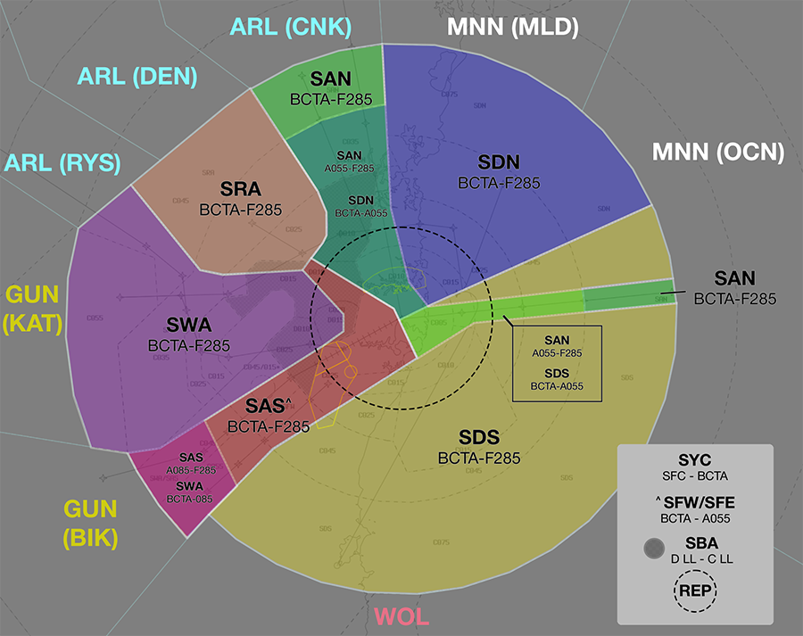{ width="700" }
      <figcaption>07 TCU Structure</figcaption>
    </figure>
    
    !!! warning "Important"
        Separation between aircraft on the TESAT-FISHA-T066 track is a **joint responsibility** of SDN and SDS. Aircraft will be assigned the appropriate departure frequency according to their direction of travel, and each controller will apply separation from the other departure controller's traffic.

=== "16 PROPS"
    <figure markdown>
    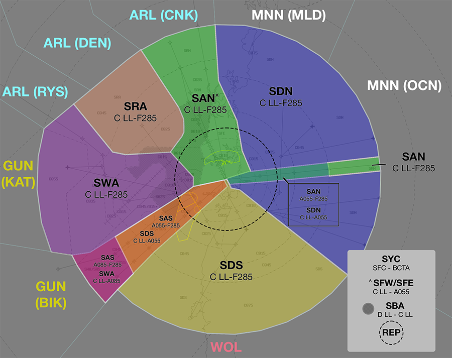{ width="700" }
      <figcaption>16 PROPS TCU Structure</figcaption>
    </figure>
    
    !!! warning "Important"
        Separation between aircraft tracking via the KEVIN SID to KEVIN is a **joint responsibility** of SDN and SDS. Aircraft will be assigned the appropriate departure frequency according to their direction of travel, and each controller will apply separation from the other departure controller's traffic.

=== "25AD"
    <figure markdown>
    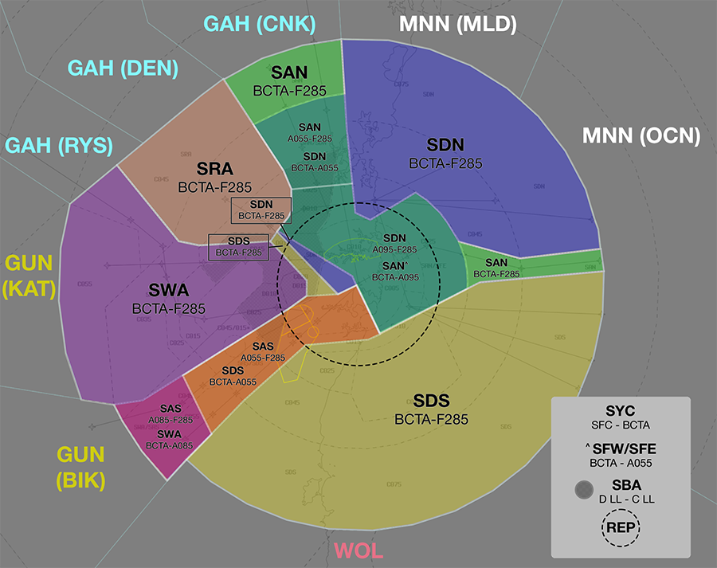{ width="700" }
      <figcaption>25 TCU Structure</figcaption>
    </figure>
    
    !!! warning "Important"
        Separation between aircraft tracking via the STUIE SID to URDOS and aircraft tracking via the AVMOV SID to SS500 is a **joint responsibility** of SDN and SDS. Aircraft will be assigned the appropriate departure frequency according to their direction of travel, and each controller will apply separation from the other departure controller's traffic.

=== "34 PROPS"
    <figure markdown>
    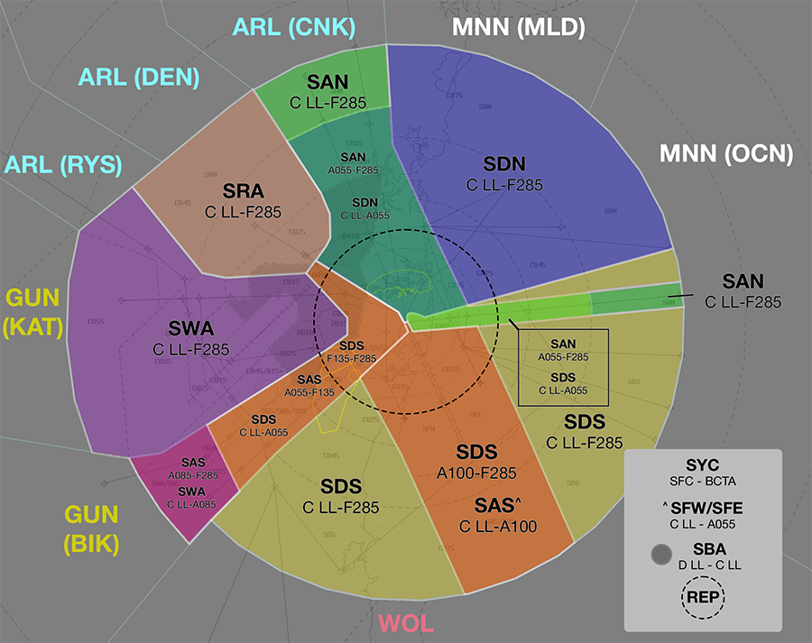{ width="700" }
      <figcaption>34 PROPS TCU Structure</figcaption>
    </figure>
    
    !!! warning "Important"
        Separation between aircraft tracking via the MARUB SID to MARUB is a **joint responsibility** of SDN and SDS. Aircraft will be assigned the appropriate departure frequency according to their direction of travel, and each controller will apply separation from the other departure controller's traffic.

=== "SODPROPS"
    <figure markdown>
    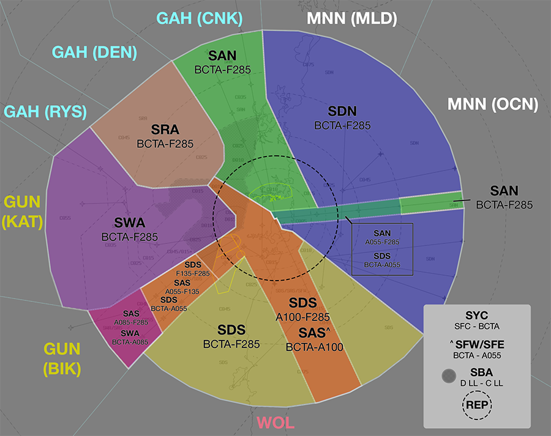{ width="700" }
      <figcaption>SODPROPS TCU Structure</figcaption>
    </figure>
    
#### Airspace Structural Arrangements
There are 10 executive controller positions within the SY TCU, plus a flow controller. Due to the large variety of traffic scenarios experienced across both day-to-day operations and busy events, controllers are encouraged to split the airspace among multiple controllers in a way which best reduces their workload.

With a controller on SAS and an additional controller offering assistance, some example splits include:

- SFW, extending SFE
- SAN, extending SDN & SFE
- SDS, extending SYC, SWA, SRA, and SBA
- SWA, extending SRA & SBA

!!! tip
    The Australia vatSys dataset includes a dedicated **Walton TCU** position with the SBA & SRA sectors extended automatically. This represents a recommended split but does not reflect the default jurisdiction of SWA.

#### Sydney Centre (SYC)
SYC is responsible for the provision of FIS in Class G airspace within the SY TMA. It is a role normally performed by DEPs but can be delegated to any TMA controller. The position is designed to reduce the workload of other TMA positions by obtaining a pilot's request, identifying them, performing any necessary coordination, then handing them to the relevant controller who will issue clearance if appropriate. [Explicit coordination requirements](#between-syc-and-tcu) exist between SYC and other TCU positions.  

!!! example
    During a busy event, Sydney Departures is experiencing a high workload and wishes to delegate the SYC role to another TMA controller who isn't as busy.  SAN's sector is quiet, so they elect to perform the role.

#### Bankstown Approach (SBA)
SBA is responsible for the provision of ATS in Class D airspace adjacent the BK CTR, `BCTA - C LL`.

<figure markdown>
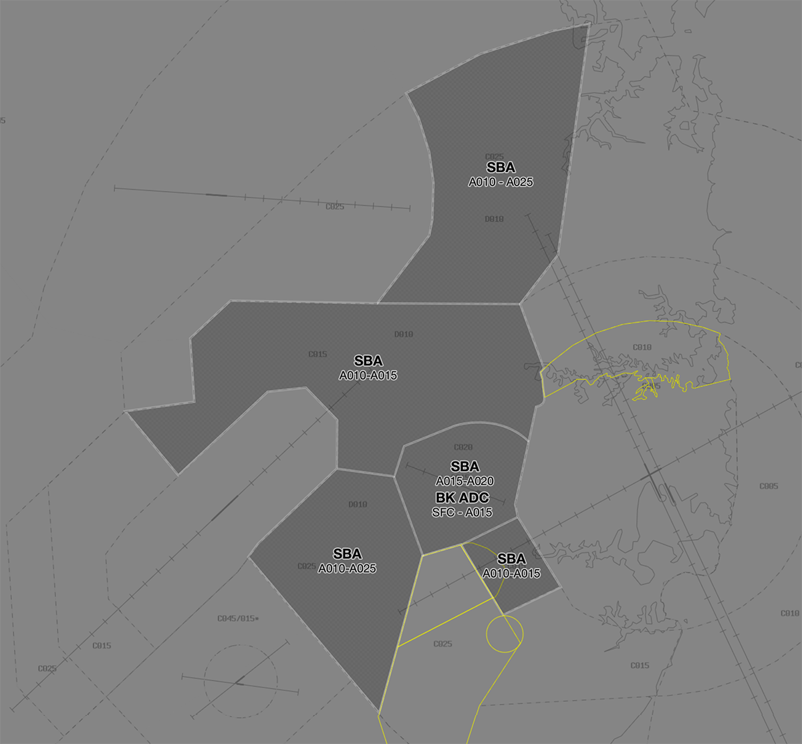{ width="700" }
  <figcaption>SBA Airspace</figcaption>
</figure>

Key responsibilities in this airspace are the issuing of [Bankstown Coded Clearances](#bankstown-coded-clearances) and handling [IFR arrivals & departures](#ysbk-operations) at YSBK.

#### Walton Approach (SWA)
SWA is responsible for the provision of ATS in the Class C airspace overhead & to the west of the WS CTR. Other than departures to the west, aircraft on a SID will need to be transferred to another TCU position prior to being transferred to enroute.

!!! tip
    The **TEEVE D SID** infringes **SRA** airspace by roughly 3nm and then re-enters **SWA** airspace. It may be beneficial for SWA to coordinate any [frequency requirements](../controller-skills/coordination.md#no-frequency-requirements-nfr) with SRA to avoid issuing a frequency change for these aircraft.

#### Sydney CTA C10 
The volume of airspace adjacent to the WS CTR overhead Camden (known as **SY CTA C10**) has a lower level that varies according to the time of day.

<figure markdown>
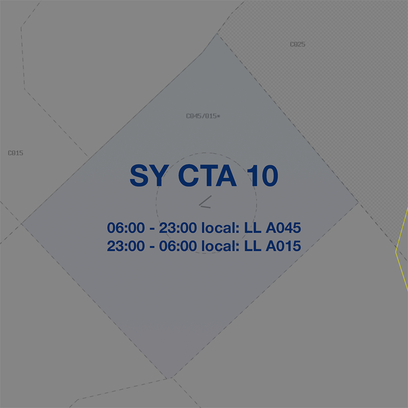{ width="400" }
  <figcaption>Sydney CTA C10 Airspace</figcaption>
</figure>

During the hours of 23:00 - 06:00 Sydney local time, the airspace within the C10 area extends to `A015`, allowing YSWS departures on the [November or Quebec SIDs](../../aerodromes/classc/walton/#sid-selection) to remain within CTA. CN ADC is **[prohibited](../../aerodromes/classd/camden/#night-operations)** from logging on during this time, regardless of whether YSWS [RRO](../../aerodromes/classc/walton/#reciprocal-runway-operations) are in use.

!!! tip
    When the base of C10 is lowered, it should be included on the YSWS, YSBK, and YSCN ATISes.

## Separation
### Parallel Runway Operations
#### Instrument Approach
Aircraft joining parallel instrument approaches must remain separated from aircraft on the adjacent approach until they are established. This usually involves keeping aircraft vertically separated and may require aircraft to intercept the localiser/final approach course and maintain their assigned level, only allowing descent on the approach once they are established.  

Two aircraft cleared for adjacent instrument approaches must maintain the following [minimum lateral separation](../separation-standards/parallelapps.md):

| Situation | Lateral Separation Standard |
| --- | --- |
| One or both aircraft **not yet established** | 3nm |
| **Both aircraft established** on final approach courses | 1nm |

!!! note
    It may be necessary to use speed control on base & final to maintain the required separation.

#### Independent Visual Approach
An aircraft is only considered independent from the adjacent final approach course if **both** aircraft have been cleared for an [IVA](#independent-visual-approach_1). If one or both pilots have not been cleared for an IVA, they must remain separated as if they were on an [instrument approach](#instrument-approach).

## Local Procedures
### Bankstown Coded Clearances
Coded Clearances are used to provide standardised routing for VFR aircraft arriving and departing YSBK while transiting SBA Class D airspace.

<figure markdown>
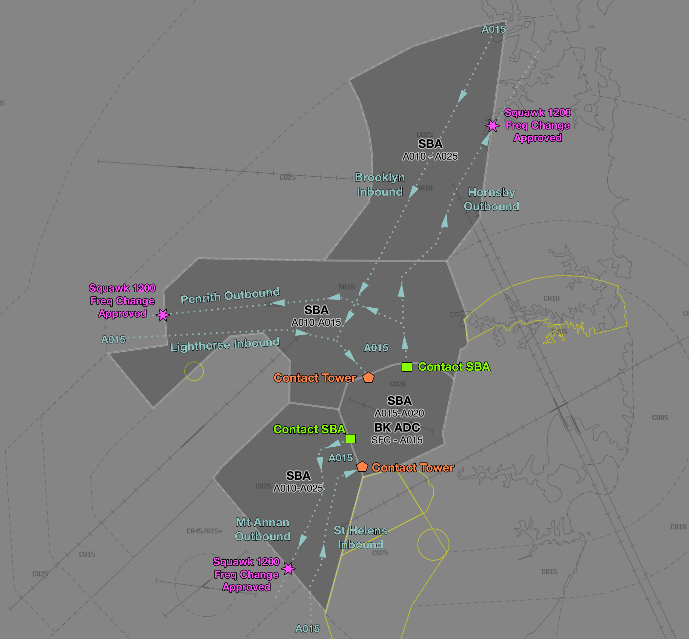{ width="700" }
  <figcaption>Bankstown Coded Clearances</figcaption>
</figure>

Each coded clearance includes tracking instructions and height requirements that ensure aircraft remain within Class D airspace. Each coded clearance also includes instructions on when to change frequencies and control service termination advice.

The routes are generally segregated, although the '*Penrith Outbound*' and '*Brooklyn Inbound*' routes intersect within SBA CTA, west of SITS. Remember that in [Class D Airspace](../../controller-skills/classofairpsace), **no separation** is provided for VFR aircraft. 

Traffic advisory statements should be given to aircraft where appropriate and, if necessary, SBA may pass an avoiding action advice to ensure aircraft do not collide.

!!! phraseology
    **SBA**: "WFE, traffic is a Kodiak 9 o'clock, same altitude, crossing left to right."   
    **WFE**: "Looking for traffic, WFE"  
    **SBA**: "WFE, avoiding action, turn left immediately heading 360."   
    **WFE**: "Turn left heading 360, WFE"   

#### Departures
Departures will be cleared for a coded clearance by **BK SMC** and will contact SBA at the CTR boundary.

| Coded Clearance      | Route               | Altitude | Notes |
| -------------------- | ------------------- | -------- | ----- |
| Hornsby Outbound     | `PRT CFCR PENH HSY` | `A015` to CFCR, thence `A018` |  |
| Mount Annan Outbound | `HXPR EMPS MAGG`    | `A015` to EMPS, thence `A025` |  |
| Penrith Outbound     | `PRT SITS VCBR`     | `A015`   |       |
| Woronora Outbound    | `REVS CASO WORC`    | `A015`   | Day Only |

!!! phraseology
    **UNY**: "Bankstown Approach, Diamond UNY, passing `A011`, climbing to `A015`"   
    **SBA**: "UNY, identified"

Each coded clearance includes a frequency transfer and control service termination instruction. No explicit instructions should be given to these aircraft.

!!! warning "Important"
    When a Super-category aircraft is arriving **Runway 07** at YSSY, there is no wake turbulence separation between aircraft on the **Woronora Outbound** coded clearance. **SBA** must take extra steps to ensure wake turbulence separation (which may involve coordinating with BK ADC to delay the aircraft on the ground).

    Alternatively, pilots may offer a wake turbulence waiver, assuming responsibility for wake turbulence avoidance.

#### Arrivals
Arrivals shall contact **SYC** for identification prior to entering CTA. SYC shall provide a squawk code and identify the aircraft, perform normal [Radar Position to TCU coordination](../../controller-skills/coordination/#radar-position-tcu-controllers) to **SBA**, then issue frequency transfer.

| Coded Clearance    | Route               | Altitude | 
| ------------------ | ------------------- | -------- | 
| Brooklyn Inbound   | `BBG BEE CAST BKHR PSP` | `A018` to BEE, thence `A015` by BKHR  |
| Lighthorse Inbound | `NPBR LIHR PSP`     | `A015`   |
| St Helens Inbound  | `SSKP CRST CRSC`    | `A025` to CRST, thence `A015` by CRSC   |

!!! phraseology
    **BJZ**: "Sydney Centre, BJZ, Seminole, 10nm north of BBG, `A015`, for Brooklyn Inbound, received A"  
    **SYC**: "BJZ, Sydney Centre, squawk 0554, remain outside Class D airspace"  
    **BJZ**: "Squawk 0554, remain outside Class D airspace, BJZ"  

    **SYC** -> **SBA**: "North of BBG, BJZ, for Brooklyn Inbound"  
    **SBA** -> **SYC**: "BJZ"  

    **SYC**: "BJZ, identified, contact Bankstown Approach on 125.8"  
    **BJZ**: "125.8, BJZ"  
    
    **BJZ**: "Bankstown Approach, BJZ, Seminole, 5nm north of BBG, `A015`, for Brooklyn Inbound, received A"   
    **SBA**: "BJZ, Bankstown Approach, cleared Brooklyn Inbound"  
    **BJZ**: "Cleared Brooklyn Inbound, BJZ"  

 Each coded clearance includes a frequency transfer instruction to BK ADC. No explicit transfer instructions should be given to these aircraft.

 !!! tip
    Whilst establishing two-way communication with a VFR aircraft constitutes a clearance to enter Class D airspace, it is generally preferred to issue an explicit airways clearance as in the examples above.

#### Class D Transits
Some aircraft may utilise the YSBK coded clearances to track from the south of the TMA to the north of the TMA, without a landing at YSBK.

These aircraft shall be cleared for an appropriate inbound coded clearance, then track to join an appropriate outbound coded clearance, passing through the top of the BK CTR at `A015`.

### Sydney Harbour Scenic Flights
A coded clearance is available over Sydney Harbour, traffic permitting. This route can be displayed on vatSys using the `SY_VFR` map.  

| Coded Clearance    | Route             | Altitude | 
| ------------------ | ----------------- | -------- | 
| Harbour Scenic     | `LRF HBB NOHD`    | `A015`   |

Aircraft will track via Class G airspace to LRF and contact SYC to request a ‘Harbour Scenic’ clearance. SYC shall provide a squawk code and identify the aircraft, then coordinate with **SDN** (or the controller responsible for the sector) to determine the availability of a clearance.

!!! warning
    The Harbour Scenic procedure is procedurally separated from the Runway 16L/R approach paths and SIDs from Runway 34L but **is not** separated from departures from Runway 34R.

!!! phraseology
    **LOI**: "Sydney Centre, LOI, Piper Cherokee, LRF, `A015`, received T, request Harbour Scenic"  
    **SYC:** "LOI, squawk 0542, remain outside class C airspace"  
    **LOI**: "Squawk 0542, remain OCTA, LOI"  

    **SYC** -> **SDN**: "LRF, LOI, for Harbour Scenic"  
    **SDN** -> **SYC**: "LOI"  
     
    **SYC:** "LOI, identified, contact Sydney Departures, 123.0"  
    **LOI**: "123.0, LOI"  
      
    **LOI**: "Sydney Departures, LOI, maintaining `A015`"  
    **SDN:** "LOI, Sydney Departures, cleared Harbour Scenic, Sydney QNH 1014"  
    **LOI:** "Cleared Harbour Scenic, QNH 1014, LOI"  

!!! note
    Remember that VFR aircraft are **not** separated from other VFR aircraft in Class C airspace.  Multiple VFR aircraft may operate on the coded clearance with traffic information passed to all applicable pilots.

#### Descent into Victor One
Pilots intending to track southbound via Victor One after completing the Harbour Scenic will request to do so approaching Manly Beach. Traffic permitting, clear these aircraft to leave CTA on descent once they are established **east of the coast**.

Pilots are required to reach `A005` prior to South Head and will report maintaining `A005`, when their control services may be terminated.

### Special Use Airspace
<figure markdown>
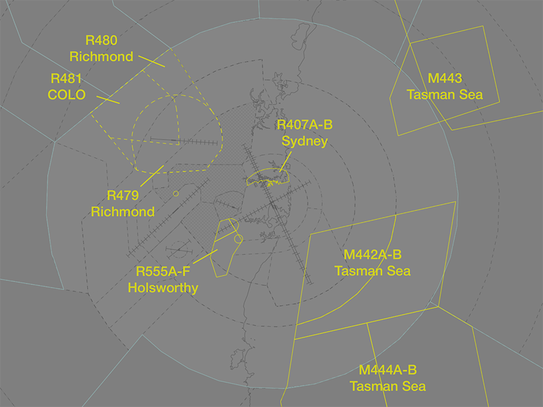{ width="700" }
  <figcaption>SUA in the SY TMA</figcaption>
</figure>

#### Richmond SUA
There are multiple [restricted areas](../../controller-skills/sua/#restricted-areas) within the TMA associated with military operations at YSRI. The restricted areas are all located within **SRA** airspace.

**RI SMC** will coordinate the [activation of these SUAs](#smc-to-tcu) with SY TCU **prior** to any activity.

##### R481 COLO
The **R481 COLO** [restricted area](../../controller-skills/sua/#restricted-areas) is used to facilitate higher-level military operations, such as [PJE](../../airwork/#parachute-operations) or local flight testing, above `A045`.

Multiple YSSY and YSWS procedures transit the R481 COLO restricted area. When the area is activated, **SRA** must be extremely vigilant to ensure separation between PJE and transiting civil aircraft. Where possible, **SRA** should coordinate with neighbouring **SY TCU** sectors to assign additional requirements to climb above the vertical limits of the activation, or have the aircraft rerouted to avoid the area.

!!! phraseology
	*UPS136 has departed YSSY on the STUIE SID, bound for the Philippines. The R481 restricted area has been activated `A045-A090`.*   
    **SDN**: "UPS136, Sydney Departures, identified. Climb via SID to `F280`, requirement to reach `A100` by 5 miles URDOS."   
    **UPS136**: "Climb via SID to `F280`, requirement to reach `A100` by 5 miles URDOS, UPS136."  

!!! warning "Important"
    When the R481 COLO airspace is activated and Runway 34L is in use for departures at YSSY, it is **strongly recommended** that **SRA** arrange to receive "heads-up" coordination from **SDN** of any aircraft departing via the **STUIE** or **AVMOV** SIDs.
    
#### R555A-F Holsworthy
The **R555A-F Holsworthy** [restricted areas](../../controller-skills/sua/#restricted-areas) are located underneath and within the SY TMA, around Holsworthy Army Barracks (YSHW).

Upon receiving a request from an aircraft at YSHW to activate the restricted airspace, **SYC** shall coordinate activation with any other affected SY TCU controller.

#### M442A-B and M444A-B Tasman Sea
The **M442A-B and M444A-B Tasman Sea** [MOAs](../../controller-skills/sua/#military-operating-areas) are located underneath and within the SY TMA, overwater east of YSSY. These SUA are generally associated with naval operations based out of Potts Point, with associated air support from YSNW.

Activation of the SUA is a responsibility of **SYC**. Upon receiving a request from an aircraft to activate the restricted airspace, controllers shall coordinate activation with **SYC**.

## Departure and Arrival Procedures
### ANKUB Non-Jet SID
The **ANKUB SID** is a unique departure that is assigned to non-jets planned via **KADOM** or **BENBU**. On this SID, **SY ADC** will give aircraft on this SID an assigned heading with their line up or takeoff clearance, in the same way as aircraft assigned the RADAR SID. The departures controller is then responsible for vectoring the aircraft to a waypoint to rejoin the procedure.

!!! phraseology
	*RXA6824 has departed YSSY Runway 16R on the ANKUB SID, KADOM transition, bound for YSDU.*  
    **SDS**: "RXA6824, Sydney Departures, identified. Turn right heading 270, climb to `A040`"   
    **RXA6824**: "Turn right heading 270, climb to `A040`, RXA6824."   
    ...   
    **SDS**: "RXA6824, resume own navigation, cleared direct ANKUB to rejoin the SID. Climb via SID to `F150`"   
    **RXA6824**: "Resume own navigation, cleared direct ANKUB to rejoin the SID. Climb via SID to `F150`, RXA6824"

### Level Assignment
Adjacent STARs do not guarantee lateral separation (particularly as aircraft get closer to TESAT), so to avoid a breakdown of separation standards, **Approach** should assign levels as follows: <ul><li>AKMIR/MEPIL STAR: `A060`</li><li>RIVET/BOREE STAR: `A080`</li><li>MARLN STAR: `A090`</li></ul>

RIVET/BOREE aircraft should only be assigned `A070` when an adjacent AKMIR/MEPIL arrival is maintaining `A060`.  These aircraft can be stepped down to `A060` once sufficient lateral separation exists (often during the downwind turn).

<iframe width="560" height="315" src="https://www.youtube.com/embed/7dOF91EIQj8?si=9Vc3-eHTN2Zqlvf4" title="YouTube video player" frameborder="0" allow="accelerometer; autoplay; clipboard-write; encrypted-media; gyroscope; picture-in-picture; web-share" referrerpolicy="strict-origin-when-cross-origin" style="display:block; margin:0 auto;" allowfullscreen></iframe>

<figcaption style="text-align: center;">Demonstration of the Adjacent STARs <small>(filmed prior to [2607 AIRAC](../../2607-update) changes, but practice remains the same)</small></figcaption>

!!! tip
    Be mindful of Sydney's [REP airspace](#radar-entry-procedure-rep) arrangement and avoid leaving arrivals at `A100`.  Aircraft should be descended to `A090` or below by 20DME to prevent conflict with departing traffic.

All aircraft should be assigned no lower than `A060` until clear of the active runways' departure tracks.  This normally occurs once established on downwind (but changes based on runway config).

!!! example
    For an aircraft inbound from the north on the BOREE STAR to runway 34R, assign no lower than `A080` until any adjacent aircraft are maintaining `A060`, then `A070` until the aircraft are laterally clear.  The arrival should then be assigned `A060` until south of the field.

Be mindful of departures from YSBK which may also impact aircraft on downwind for RWY 16R at YSSY.  Do not assign lower than `A040` until the aircraft is north/east of the BK CTR and clear of any departing traffic (who are assigned `A030` by default).

### Director East and West
SFE/SFW are responsible for vectoring aircraft onto the final approach course and clearing them for the relevant instrument or visual approach. Aircraft will be [handed off from SAN/SAS](#app-dir) assigned `A060`.

Depending on the runway configuration and inbound direction, aircraft may be handed off to SFE/SFW:

- on a downwind heading (*or intermediate heading to position for downwind*)
- established on the STAR
- tracking direct to the IAF or established on the LOC (*generally when inbound from the north for RWY 16L or 16R*)

As a general rule, handoffs should occur once the aircraft has crossed any departure tracks (if a circuit is to be flown) or prior to the aircraft reaching `A060` provided SAS/SAN has no further requirements for the aircraft (if a straight-in approach is planned).

!!! tip
    See [Independent Visual Approaches](#independent-visual-approach) for the required label annotations for use when both Director positions are online.

SFW/SFE should provide aircraft an approximate 'miles to run' on first contact, to allow the aircraft to plan their descent path.

!!! tip
    A typical downwind will take roughly 25 track miles from the normal point of handover from SAN/SAS to SFE/SFW.

!!! phraseology
    **SFE:** "QLK402, Sydney Director, descend to `A040`, 25 miles to run"

!!! warning "Important"
    Particular care should be taken not to descend aircraft on downwind for runway 16R below `A040` until they are clear of the YSBK SID & RNP paths.

    SFW has [no requirements](#between-sba-and-tcu) for aircraft tracking via a YSBK SID by default.

SFW/SFE may provide distance to touchdown, when transferring an aircraft to tower after the aircraft is established on their approach runway centreline.

!!! phraseology
    **SFE:** "QFA490, 8 miles to touchdown, contact tower 120.5"

### YSBK Operations
#### Departures
IFR departures from YSBK will be [coordinated by BK ADC](#bk-adc) to SBA. SBA must [onwards coordinate](#between-sba-and-tcu) with the most appropriate TCU controller before releasing the aircraft.

These aircraft will be assigned `A030` (unless otherwise coordinated) and should be passed from SBA directly to the controller responsible for the airspace in which the SID terminates (generally **SWA** or **SRA**).

!!! note
    With high traffic levels during day VMC, it may be more efficient to process IFR departures via a [coded clearance](#bankstown-coded-clearances).

#### Arrivals
IFR aircraft inbound to YSBK will be cleared direct to the RNP IAF and [coordinated with SBA](#between-sba-and-tcu). They should be handed to SBA not below `A030`.

SBA will [coordinate with BK ADC](#bk-adc) and clear the aircraft for the approach.

!!! note
    By day VMC, IFR aircraft should be processed via a [coded clearance](#bankstown-coded-clearances).

Aircraft inbound from the south, west, and northwest should track via the **Z97 airway** and be processed via ESGID for the **RNP-Z** approach. This helps keep them clear of the YSWS SIDs/STARs and segregated (but not separated) from the YSSY STARs.

Aircraft inbound from the east should be processed via the STAR and be vectored in SWA airspace to facilitate descent. They should then be cleared via the **RNP-Y** approach.

Aircraft inbound from the north should track via the **Z88 airway** and be processed via NIXOD for the **RNP-N** approach. This approach is only available to the circling area and may not be suitable during periods of low cloud or reduced visibility.

### YSCN Operations
#### Departures
**CN ADC** will provide [Ready coordination](#cn-adc) for IFR aircraft departing YSCN. **SYC** shall provide traffic information to CN ADC. After departure, SYC shall identify the aircraft and transfer them to the relevant TCU controller to issue clearance (if appropriate), following normal [coordination procedures](#between-syc-and-tcu). 

#### Arrivals
A single STAR exists to process aircraft inbound to YSCN from the east, terminating in vectors. IFR aircraft from other directions should be processed via the RNP-W IAF.

The RNP-W commences inside CTA (except aircraft maintaining the MSA via SC2WA). SY TCU shall clear aircraft to leave CTA via the approach and transfer them to **CN ADC** no later than SC2WI. CN ADC will issue onwards clearance into the CN CTR.

!!! warning "Important"
    Successive RNP approaches in IMC should only be authorised after the first aircraft lands at YSBK due to the conflict between the approach and published missed approach. In practice, this translates to an **8 min** sequence between arrivals.

### YSRI operations
#### Departures
When **RI ADC** is offline, **SYC** will instruct aircraft to depart via **NESSY** SID with the RADAR Transition, in lieu of a RADAR SID. This ensures appropriate terrain and CTA separation for aircraft as they transit through the uncontrolled airspace.

### YSWS Operations
#### Departures
Aircraft departing RWY 05 on the **TEEVE D SID** will pass through SRA airspace before returning to SWA. SWA should coordinate any [frequency requirements](../controller-skills/coordination.md#no-frequency-requirements-nfr) with SRA rather than performing a frequency transfer for these aircraft, where possible.

#### Arrivals
Aircraft inbound to YSWS from the north or east will pass through other SY TCU sectors prior to reaching SWA. [Voiceless coordination](#sy-ws-ri) is in place for aircraft transiting TCU sectors assigned **any sensible level**. 

!!! tip
    In practice, this is generally `A090` for aircraft inbound from the east and not below `A030` for aircraft inbound from the north, although with RWY 05 in use, descent conflicting with the standard assignable level (`A040`) should be avoided.

For aircraft inbound from the north, SRA shall endeavour to hand off aircraft inbound to YSWS **as early as possible**, to allow SWA to issue approach clearance. Additionally, SRA is assumed to have **no restrictions or requirements** for aircraft inbound to YSWS via a STAR (as some STARs clip SRA airspace).

### YWLM STARs
YWLM arrivals from the south and west will transit the SY TCU as they descend. BIK/KAT will provide these aircraft with their STAR clearance and initial descent, before conducting heads-up coordination with the relevant SY TCU controller to facilitate further descent.

IFR aircraft which depart from the SY TMA with ADES YWLM must be issued STAR clearance by SY TCU.

!!! phraseology
    **BIK** -> **SAS**: "via RIVET, JST472, will be assigned `F250`"  
    **SAS** -> **BIK**: "JST472, `F250`" 

SY TCU is then responsible for facilitating descent to these aircraft to `F130` (or an otherwise [coordinated level](#ywlm-arrivals)), before handing the aircraft to ARL(MLD).

Alternately, SY TCU may coordinate `F130` and "[no frequency requirements](../../controller-skills/coordination/#no-frequency-requirements-nfr)" with BIK/KAT, if traffic levels allow. This permits BIK/KAT to provide the aircraft with continuous descent as they transit the TMA. SAS is responsible for [onwards coordination](../../controller-skills/coordination/#onwards-coordination) to other affected sectors within SY TCU, if multiple controllers are online.

!!! phraseology
    **BIK** -> **SAS**: "via RIVET, QLK1997, will be assigned `F250`"  
    **SAS** -> **BIK**: "QLK1997, `F130` and no frequency requirements. My onwards with SDN."  
    **BIK** -> **SAS**: "QLK1997, `F130`, yours with SDN."  
    *BIK will put SAS C130 NFR in the label data, and hand the aircraft directly off to MNN(MLD).*

## Offline Towers
### BK ADC Offline
Due to the low level of CTA (`A015`) in the BK CTR when **BK ADC** is offline, it is best practice to give airways clearance to aircraft at the holding point, to ensure departing aircraft can have uninterrupted climb.

!!! phraseology
    **LOA**: "LOA, King Air, POB 10, IFR, taxing Bankstown for Shellharbour, Runway 11C"    
    **SY TCU**: "LOA, Sydney Approach, squawk 3601, no reported IFR traffic, report ready at the holding point for airways clearance"  
    **LOA**: "Squawk 3601, wilco, LOA"  

    **ABC**: "LOA, ready Runway 11C"  
    **SY TCU**: "LOA, cleared to YSHL via WOL, flight planned route, MECKO1 departure, Radar Transition, climb via SID to A030"  
    **LOA**: "Cleared to YSHL via WOL, flight planned route, MECKO1 departure, Radar Transition, climb via SID to A030, LOA"

## Runway Modes
### Parallel Runway Operations
#### Instrument Approach
During dependent instrument approaches (i.e. all instrument approaches excluding PRM operations), aircraft must remain [separated](#instrument-approach) from aircraft on the parallel approach.

#### Independent Visual Approach
To clear an aircraft for an IVA, the pilot must report their landing runway in sight, or report visual if already established on the LOC/final approach course. They must be vectored/instructed to join final inside the IVA chevron.

An aircraft's tag label shall be amended with the following annotations:

| Situation | Annotation |
| --- | --- |
| Visual | `V` |
| Landing runway in sight | `R` |

<figure markdown>
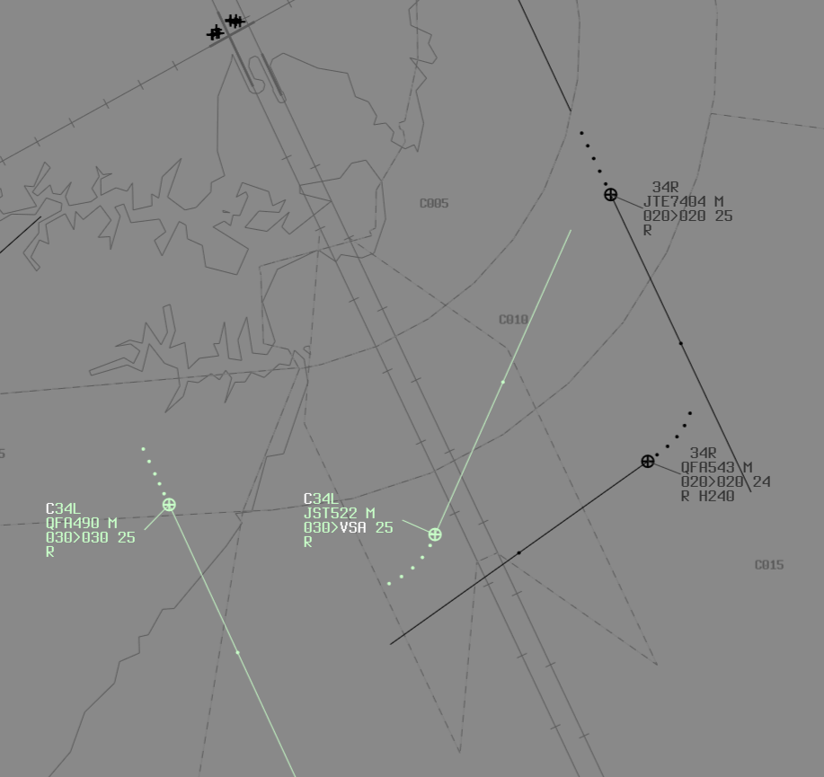{ width="600" }
</figure>

An aircraft is only considered independent from the adjacent final approach course if **both** aircraft have been cleared for an IVA. If one or both pilots have not been cleared for an IVA, they must remain separated as if they were on an [instrument approach](#instrument-approach_1) (3nm laterally until established, then 1nm lateral separation).

!!! phraseology
    **SFW:** "BNZ444, Turn left heading 360, join final runway 34L, from that heading cleared independent visual approach"    
    **BNZ444:** "Turn left heading 360, join final runway 34L, from that heading cleared independent visual approach, BNZ444"

When conducting IVAs, aircraft shall not be transferred to **SY ADC** until established on final.

##### Phraseology at Night
At night, pilots must be instructed to not descend below the relevant MVA until they are established on the PAPI or glidepath.

*"CLEARED INDEPENDENT VISUAL APPROACH, NOT BELOW (MVA) UNTIL ESTABLISHED ON THE (PAPI or GLIDEPATH)"*

!!! phraseology
    **SFE:** "ANZ361, Turn right heading 305, join final runway 34R, from that heading cleared independent visual approach, not below `A015` until established on the PAPI"    

#### SODPROPS
Arriving aircraft must be established on final and transferred to the tower frequency no later than 10nm from touchdown.

## Helicopter Operations
### Inbound/Outbound Routes
Helicopters outbound from YSSY will make contact with the Departures controller established on a Helicopter Route.  Controllers need only identify the aircraft, as they will already be cleared to climb to a suitable level (generally not above `A010`) through their coded clearance.  Each clearance stipulates a point where identification and control services are automatically terminated, but controllers may explicitly cancel these services for new pilots who may not understand where they exit CTA.  

You can find each Helicopter Route below, and full details are in the `ERSA FAC YSSY`. Additionally, the vatSys `SY_HELO` map displays an approximation of each route.

<figure markdown>
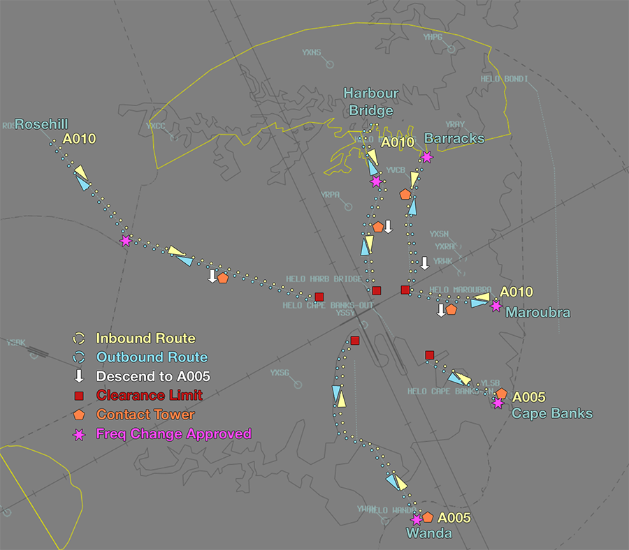{ width="700" }
</figure>

!!! phraseology
    **YZD:** "Sydney Departures, helicopter YZD, passing A009 on the Barracks 5 Outbound"  
    **SY TCU:** "YZD, Departures, identified"

Helicopters tracking inbound to YSSY will generally do so via a Helicopter Route.  Aircraft are required to contact the TCU controller for clearance along these routes, with the exception of the `CAPE BANKS 5 INBOUND` and `WANDA 5 INBOUND` for which they should contact **SY ADC** directly.  

Controllers should identify the aircraft and then provide clearance if traffic permits.

!!! phraseology
    **HSZ:** "Sydney Departures, helicopter HSZ, Sydney Heads, A010, received Delta, request Harbour Bridge 5 Inbound"  
    **SY TCU:** "HSZ, squawk 0552"  

    **SY TCU:** "HSZ, identified, cleared Harbour Bridge 5 Inbound"

The helicopter route title should be recorded in the **global ops field** and the route waypoints should be added to the FDR route, as below.

| Route | Waypoints |
| --- | --- |
| ROSEHILL 5 INBOUND | `RSH RKWC CBY` |
| HARBOUR BRIDGE 5 INBOUND | `HBB DHH REDF ERSK APST` |
| BARRACKS 5 INBOUND | `RCB MPSC` |
| MAROUBRA 5 INBOUND | `MRBR` |
| CAPE BANKS 5 INBOUND | `CAPS` |
| WANDA 5 INBOUND | `YWAN DLPT` |

!!! note
    Some Helicopter Routes may conflict with fixed wing approach/departure paths, so exercise judgement to separate helicopters when required.  For example, during 34 PROPS, it may be more suitable for helicopters to track via the `CAPE BANKS 5 INBOUND` rather than taking the `MAROUBRA 5 INBOUND`, due to its close proximity to the **MARUB SID**.  In any case, if pilots are unfamiliar with local landmarks, simplify your instructions to assist them while maintaining separation.

Inbound helicopters should transfer to **SY ADC** automatically (as per the coded clearance), however new pilots may need an explicit handoff.

### Terminal Airspace Operations
#### Bondi Coded Clearances
The `BONDI 5` coded clearance is only available to helicopters, provided PRM approaches are not in use to RWY 16s at YSSY.  The clearance may not be available (or delays may be required) when RWY 25 is in use for arrivals or RWY 07 is in use for departures.  

!!! tip
    You can find details of the BONDI 5 procedure in the YSSY ERSA FAC under section 14 `HELICOPTER ROUTE OPERATIONS`.

Helicopters should be identified and then cleared for the `BONDI 5 NORTHBOUND` or `BONDI 5 SOUTHBOUND`. Traffic information must be provided on any other helicopters operating on the route or any other aircraft in the area (e.g. aircraft in Victor One).  Sydney QNH should be provided if the aircraft didn't depart from YSSY recently.

!!! phraseology
    **YOE:** "Sydney Approach, helicopter YOE, Jibbon Point, A005, received Whiskey, request Bondi 5 Northbound"  
    **SY TCU:** "YOE, Sydney Approach, squawk 0451"  

    **SY TCU:** "YOE, identified, cleared Bondi 5 Northbound, Sydney QNH 1024"

Once the aircraft exits CTA at Long Bay Headland (southbound) or Sydney Heads (northbound), cancel their identification and control services.  If the helicopter is likely to request a clearance via one of Sydney's Helicopter Routes, consider instructing them to remain on their assigned squawk code to assist with identification.

!!! phraseology
    "YOE, clear of controlled airspace, identification and control services terminated, squawk 1200, frequency change approved"

#### Sector Coded Clearances
To reduce frequency congestion, several commonly used geographically defined areas are designated with lateral and vertical limits and provided upon request via a coded clearance to helicopter aircraft.

| Sector Name | Lateral Limits | Vertical Limits |
| ----------- | -------------- | --------------- |
| City East | Bounded by Rushcutters Bay, Sydney Cricket Ground, Sydney Harbour Bridge South Pylon, Fort Denison, Clark Island, Rushcutters Bay | Not above `A020` |
| CBD | Bounded by Rushcutters Bay, Sydney Cricket Ground, Cleveland Street, Regent Street, George Street, Sydney Harbour Bridge South Pylon, Fort Denison, Clark Island, Rushcutters Bay | Not above `A020` |
| North Harbour | The area northeast of a line Roseville Bridge, Sydney Harbour Bridge North Pylon then via the northern shore of Sydney Harbour to Middle Head, then Manly | Not above `A015` |
| Northern Beaches | The area east of a line Spit Bridge, Sydney Harbour Bridge North Pylon then via the northern shores of Sydney Harbour to Middle Head then Manly | Not above `A015` |
| South Harbour | The area bounded by lines joining Sydney Harbour Bridge North Pylon, Sydney Harbour Bridge South Pylon, then via the southern shoreline of Sydney Harbour to South Head then Manly to Middle Head, then via the northern shoreline of Sydney Harbour to Sydney Harbour Bridge North Pylon | Not above `A015` |

Helicopters should be identified and then provided the clearance where traffic permits.  Helicopters established on a Helicopter Route should be issued an onwards clearance into the requested sector.

!!! phraseology
    **HWD:** "Sydney Departures gday, helicopter HWD, passing 800ft on the Harbour Bridge 5 outbound, request South Harbour Sector"  
    **SY TCU:** "HWD, Departures, identified, onwards clearance South Harbour Sector"  
    **HWD:** "Onwards clearance South Harbour Sector, HWD"

### Hospital Helipads
The Sydney CTR contains a number of hospital helipads to the west, north, and east of YSSY.

Helicopters arriving to hospitals inside ADC's jurisdiction should be cleared for a visual approach by **SY TCU** and transferred to **SY ADC** when suitable. During times of poor weather, helicopters should be cleared for the ILS approach to the closest runway with an expectation of breaking off the approach and tracking to the hospital when they become visual. **SY TCU** should clear the helicopter for the ILS, then transfer the aircraft to **SY ADC**, who will facilitate the final tracking to the helipad. Ensure that this expectation is clearly communicated to ADC through hotline coordination.

Helicopters departing from a hospital in ADC's jurisdiction and intending to enter SY TCU CTA will be coordinated by ADC prior to receiving airways clearance. Consider any restrictions such as amended outbound tracking instructions or amended levels which will ensure separation assurance (including requesting ADC to maintain a visual separation standard with the aircraft on departure), then release the aircraft when able.

!!! example
    *RSCU209 is a VFR AW139 helicopter outbound from St George Hospital (YXSG) for Orange (YORG) at A045.*  
    **SY ADC** -> **SY TCU**: "Next, helicopter RSCU209, outbound from St George Hospital for the west"  
    **SY TCU** -> **SY ADC**: "RSCU209, A030"  
    **SY ADC** -> **SY TCU**: "A030, RSCU209" 

## Flow
### Local Knowledge
- Aircraft can be processed via the adjacent STAR for the parallel runway (e.g. jet aircraft via the AKMIR STAR for RWY 34R), to reduce overall delay where multiple aircraft approach from the same direction *(coordination required)*
- Aircraft via AKMIR (to the west) and MARLN (to the east) often make large track direction changes prior to entering the TMA. Direct tracking onto the STAR may be offered to reduce track miles
- Aircraft to YSWS may be assigned the RNP X to reduce track miles on some STARs
- Aircraft to YSWS may be tactically assigned the **GUDOK N** STAR in lieu of the REVKI N STAR by **SWA**, for track shortening or separation.

### Flow Tables
#### YSSY
The tables below give an estimated time **in minutes** from the **Feeder Fix** to the **Threshold**.

=== "Jets & DH8D"
    | STAR                             | RWY 07  | RWY 16L | RWY 16R | RWY 25  | RWY 34L | RWY 34R |
    | -------------------------------- | :-----: | :-----: | :-----: | :-----: | :-----: | :-----: |
    | **AKMIR**                        | 10      | 16      | 14      | 14      | 14      | 16      |
    | **BOREE A/P**                    | 11      | 8\^     | 7\^     | 11      | 14      | 14      |
    | **MEPIL** *Feeder Fix: YAKKA* |  12  |  8\^ |  8\^ |  11  |  14  |  14  |
    | **MARLN**                        | 12      | 13      | 13      | 8\^     | 14      | 11      |
    | **RIVET** *Feeder Fix: ENLAD* |  10  |  16  |  14  |  14  |  13  |  16  |

=== "Non-Jets"
    | STAR                             | RWY 07  | RWY 16L | RWY 16R | RWY 25  | RWY 34L | RWY 34R |
    | -------------------------------- | :-----: | :-----: | :-----: | :-----: | :-----: | :-----: |
    | **AKMIR**                        | 13      | 22      | 18      | 19      | 19      | 22      |
    | **BOREE A/P**                    | 15      | 10\^    | 10\^    | 14      | 18      | 18      |
    | **MEPIL** *Feeder Fix: YAKKA* |  14  |  11\^|  11\^|  14  |  19  |  18  |
    | **MARLN**                        | 14      | 17      | 18      | 11\^    | 19      | 15      |
    | **RIVET** *Feeder Fix: ENLAD* |  13  |  21  |  18  |  19  |  18  |  21  |

##### Corrections

| Situation | Correction |
| ----- | ----- |
| Assigned a reduced speed | +1 min, *except ^* | 
| Over 40kt of head/tailwind component | +1 min for headwind -1 min for tailwind |

##### Assumptions
- Nil wind
- The feeder fix for all STARs is the waypoint coinciding with the title of the STAR, except:
    - The feeder fix for the MEPIL STAR is **YAKKA**
    - The feeder fix for the RIVET STAR is **ENLAD**
- Aircraft for the *opposite* parallel runway (eg, AKMIR to 16L/34R) will overfly the field, then vectored to a mid-field downwind  
- All aircraft are tracking via the ILS Initial Approach fix

#### YSWS
The tables below give an estimated time **in minutes** from the **Feeder Fix** to the **Threshold**.

=== "Jets & DH8D"
    | STAR                               | RWY 05  | RWY 23  |
    | ---------------------------------- | :-----: | :-----: |
    | **BIKUS A**                        | 16      | 15      |
    | **REVKI A/N**                      | 7\^     | 11      |
    | **RIKNI N** *Feeder Fix: MARLN* |  18  |  15  |
    | **UNTAV A**                        | 14      | 7\^     |
    | **UNTAV B**                        | 12      | -       |
    | **UNTAV N**                        | 13      | -       |
    | **UNTAV Q**                        | 14      | -       |
    | **GODUK N**                        | -       | 5\^     |

=== "Non-Jets"
    | STAR                               | RWY 05  | RWY 23  |
    | ---------------------------------- | :-----: | :-----: |
    | **BIKUS A**                        | 21      | 19      |
    | **REVKI A/N**                      | 10\^    | 14      |
    | **RIKNI N** *Feeder Fix: MARLN* |  24  |  20  |
    | **UNTAV A**                        | 19      | 9\^     |
    | **UNTAV B**                        | 16      | -       |
    | **UNTAV N**                        | 17      | -       |
    | **UNTAV Q**                        | 18      | -       |
    | **GODUK N**                        | -       | 7\^     |

##### Corrections

| Situation | Correction |
| ----- | ----- |
| Assigned a reduced speed | +1 min, *except ^* | 
| Over 40kt of head/tailwind component | +1 min for headwind -1 min for tailwind |

##### Assumptions
- Nil wind
- The feeder fix for all STARs is the waypoint coinciding with the title of the STAR, except:
    - The feeder fix for the RIKNI STAR is **MARLN**
- All aircraft are tracking via the ILS

### YSSY Calculator

The following calculator will generate a landing time from a feeder fix ETA, or the reverse.

=== "Landing Time"
    

=== "Feeder Fix Time"
    

### YSWS Calculator

The following calculator will generate a landing time from a feeder fix ETA, or the reverse.

=== "Landing Time"
    

=== "Feeder Fix Time"
    

## Coordination
### Enroute
#### Departures
Voiceless to all surrounding Enroute sectors for all aircraft:

- Assigned the lower of `F280` or the `RFL`; and
- that enter Enroute airspace via any of the *Green Shaded Corridors* below, excluding [YWLM Arrivals](#ywlm-arrivals)

<figure markdown>
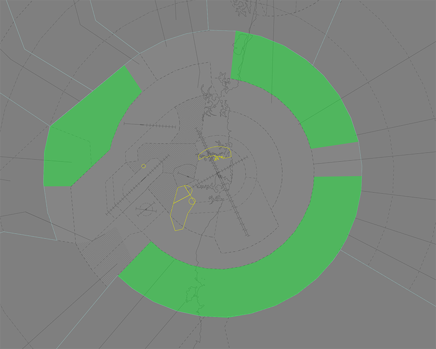{ width="700" }
  <figcaption>SY TCU Voiceless Coordination Corridors</figcaption>
</figure>

!!! note
    This means that aircraft can be tracking via **any point** along an aircraft's flight planned route (eg, **LEECE** or **BANDA**), as long as they enter Enroute airspace in the *green shaded corridor*

All other aircraft going to Enroute CTA must be **Heads-up** coordinated to the relevant sector as soon as practical.

!!! phraseology
    **SY TCU** -> **MNN**: "DAL40, with your concurrence, will be right of route, DCT GUTIV"  
    **MNN** -> **SY TCU**: "DAL40, concur right of route DCT GUTIV"

##### YWLM Arrivals
Additionally, voiceless coordination exists to MNN(All) for aircraft:

- With ADES **YWLM**; and  
- Assigned a STAR; and  
- Assigned the lower of `F130` or the `RFL`

!!! note
    YWLM arrivals are handed off to MNN(MLD), not directly to WLM TCU, unless otherwise coordinated.

#### Arrivals
Voiceless for all aircraft:

- With ADES **YSSY**:
    - Assigned a STAR; and
    - Tracking via **MARLN**, **RIVET**, or **BOREE**, assigned `A100`; or  
    - Tracking via **MEPIL** or **AKMIR**, assigned `A090`
- With ADES **YSWS**, or **YSRI**:
	- Assigned a STAR; and
    - Assigned `A090`.
- With ADES **YSBK**, **YSCN**:
    - Assigned a STAR; and
    - Assigned `A080`

All other aircraft coming from enroute CTA will be **Heads-up** coordinated to SY TCU prior to **20nm** from the boundary.

### SY TCU Internal
#### SY / WS / RI
Voiceless coordination is in place between SY APP/DEP (**SAN**, **SAS**, **SDN**, and **SDS**), **SWA** and **SRA** for aircraft that are tracking via a SID/STAR, and descending/climbing via the procedures' altitude restrictions, assigned any sensible level.

Any aircraft not meeting this requirement, including aircraft who have been issued additional altitude restrictions, **must** be prior coordinated.

Aircraft arriving **YSWS** from the east will generally not require descent below `A090` before reaching SWA airspace. As this is the voiceless coordination altitude between enroute and SY TCU, SY APP/DEP should generally not provide further descent to these aircraft.

The IAF to RWY 23 at YSWS sits inside SRA airspace. **SRA** is assumed to have **no restrictions or requirements** for aircraft inbound to YSWS via a STAR. SWA is responsible for issuing approach clearance to these aircraft.

!!! tip
    SY TCU positions (including SRA) shall hand YSWS arrivals to SWA *as early as possible*, particularly aircraft inbound from the north.
    
!!! warning "Important"
    The SIDs and STARs at YSSY and YSWS are tightly interlaced and have complex altitude restrictions designed to ensure mutual separation. Deviating aircraft from a SID/STAR, particularly in the west of the TMA, will dramatically increase controller workload and increase the likelihood of conflicts.
    
#### APP / DIR
Voiceless coordination is in place between APP and DIR for aircraft that are assigned `A060`.

Any aircraft not meeting this requirement **must** be prior coordinated to DIR.

!!! phraseology
    **SAS** -> **SFW**: "VOZ456, with your concurrence, will be assigned `A070`, for my separation with UJI"  
    **SFW** -> **SAS**: "VOZ456, concur `A070`"

#### APP / DEP
##### Radar Entry Procedure (REP)
Within 15 DME of SY, Departure controllers (**SDN** and **SDS**) can allow aircraft to cross airspace owned by Approach controllers (**SAN** and **SAS**) at or above `A100` without coordination.  This allows aircraft to safely depart above arriving aircraft and facilitates more direct tracking for YSBK & YSRI departures.  

!!! note
    SIDs from YSSY do not guarantee that aircraft will reach `A100` by 15DME, so Departure controllers should be mindful of this and take action where necessary to expedite climb or coordinate with Approach.  

    Departure controllers should take extra caution when processing YSBK departures via OLSEM/WOL to ensure they reach `A100` prior to entering REP airspace.

It is vital that Approach controllers ensure all arriving aircraft are established below `A090` no later than 20DME to avoid conflicting with departures utilising the airspace.  All STARs have height requirements which ensure this is achieved.  Aircraft inbound to YSBK or YSSY that are not cleared via a STAR should be instructed to reach `A090` by 20DME.

!!! info
    Circumstances like excessive weather deviation may make the use of REP impractical.  Controllers should coordinate with other TMA positions and suspend REP in this case.

!!! warning "Important"
    SIDs inbound to YSRI, YSBK & YSCN from the east pass through REP airspace as they transit a 15nm radius of TESAT. Controllers should be mindful of the conflict which this may create and prioritise keeping aircraft on the STAR where possible.

##### MARLN Corridor
Aircraft are permitted to cross the MARLN corridor at or above `A060` without coordination with APP. DEP is responsible for separation with any aircraft in the corridor.

#### Between SBA and TCU
##### Departures
IFR departures from YSBK will be [next coordinated by BK ADC](#bk-adc) to SBA. Before responding to BK ADC, SBA shall relay the coordination with the TCU controller responsible for the airspace in which the SID terminates and only respond to BK ADC when they have a release for the aircraft.

!!! phraseology
    **BK ADC** -> **SBA**: "Next, WHF, runway 11C"  
    **SBA** -> **BK ADC**: "Copy, I'll call you back"  

    **SBA** -> **SRA**: "Next at YSBK, WHF, runway 11C"  
    **SRA** -> **SBA**: "WHF, unrestricted"  
    
    **SBA** -> **BK ADC**: "WHF, unrestricted"

Departing aircraft shall be handed to the most relevant TCU controller (generally **SWA** or **SRA**) tracking via the SID assigned `A030`.

!!! warning "Important"
    SFW/SDS/SDN/SAS have **no restrictions or requirements** for departures from runway 11C as they make the initial turn to the west.
    
    Boundary coordination is **not required** with SY ADC/TCU for departures from Runway 11C cleared via a SID. 

There are no *standard assignable headings* for departures on the **BK (RADAR) SID**, although in almost all cases, **H310** will be suitable.

##### Arrivals
IFR arrivals will be cleared direct to the IAF and handed to SBA assigned `A030`. [Heads-up coordination](../controller-skills/coordination.md#heads-up) is required for these aircraft.

#### Between SYC and TCU
Standard [Radar to TCU](../controller-skills/coordination.md#radar-position-tcu-controllers) coordination for each aircraft transiting between Class G and CTA (or vice versa).

### SY ADC
#### Airspace
SY ADC is responsible for the Class C airspace in the SY CTR `SFC` to `A005`.

#### ACD to SY TCU
The controller assuming responsibility of **SY ACD** shall give [heads-up coordination](../../controller-skills/coordination/#airways-clearance) to the relevant SY TCU controller prior to the issue of the following clearances: 

- VFR departures, other than helicopters assigned a helicopter route coded clearance  
- Aircraft using a runway not on the ATIS

#### Auto Release
Auto Release is used for virtually all fixed-wing departures at Sydney. Unlike some other aerodromes, aircraft cleared via the **SY (RADAR) SID** or **ANKUB SID** do not need to be 'Next' coordinated, provided they are assigned the standard assignable level and a standard assignable heading from the table below.

| Runway     | Jet         | Non-Jet                                        |
| ---------- | :---------: | :--------------------------------------------: |
| **RWY 07**     | H070        | H020, H110                                     |
| **RWY 16L**    | H125        | H090 *(RWY 25 not in use)* H125 *(RWY 25 in use)* |
| **RWY 16R**    | H170        | H210                                           |
| **RWY 25**     | H300, H240  | H020, H210, H240                               |
| **RWY 34L**    | H290        | H230                                           |
| **RWY 34R**    | H030, H070  | H350                                           |

!!! tip
    If strong winds are present at altitude, TWR/DEP should discuss slight changes to these headings (+/- 5 degrees) to compensate for large crosswind components.

[Next](../../controller-skills/coordination/#next) coordination is **not** required for aircraft that are:   

- Departing from a runway nominated on the ATIS; and   
- Assigned the Standard assignable level; and  
- Assigned a **Procedural SID**, or the **Radar** SID/**ANKUB** SID with a Standard Assignable Heading; or
- A helicopter cleared via an outbound helicopter route.

All other aircraft require a 'Next' call to SY TCU.

'Next' coordination is additionally required for:  

- [After a go around](../../controller-skills/coordination/#after-a-go-around), the next departure from that runway  
- All aircraft during the Curfew Runway Mode

The standard assignable level from SY ADC to SY TCU is: 

| Aircraft | Level |
| -------- | ----- |
| Jets | `A050` |
| Non-Jets | The lower of `A030` and `RFL` |

### BK ADC
#### Airspace
BK ADC is responsible for the Class D airspace in the BK CTR `SFC` to `A015`.

Refer to [Reclassifications](#reclassifications) for operations when BK ADC is offline.

#### Departures
[Next](../../controller-skills/coordination/#next) coordination is **not** required for aircraft that are:   

- VFR aircraft departing via a [coded clearance](../../aerodromes/classd/bankstown/#vfr-outbound-procedures)

All other aircraft require a 'Next' call to SBA.

The standard assignable level from **BK ADC** to **SBA** is:

| Aircraft | Level |
| --- | -----|
| All | `A030` |

!!! warning "Important"
    In response to a Next call from BK ADC, SBA must [onwards coordinate](#between-sba-and-tcu) with the most relevant TCU controller to obtain a release for the aircraft **before responding to BK ADC**.

#### Arrivals
SBA will heads-up coordinate arrivals/overfliers from Class C to BK ADC prior to **5 mins** from the boundary.
  
IFR aircraft will be cleared for the instrument prior to handoff to BK ADC, unless BK ADC nominates a restriction.

!!! tip
    Ensure the aircraft's FDR is up-to-date in order to give **BK ADC** maximum situational awareness of the traffic picture. (eg. if the aircraft is doing the RNP approach, ensure the FDR has been rerouted via the appropriate points)

### CN ADC
#### Airspace
CN ADC is responsible for the Class D airspace in the CN CTR `SFC` to `A020`.

Refer to [Reclassifications](#reclassifications) for operations when CN ADC is offline.

#### Departures
CN ADC must advise SY TCU when the aircraft has called 'Ready'. In response to a ready call, SY TCU will issue a traffic statement.

!!! phraseology
    **CN ADC** -> **SYC**: "Ready, MHQ, Runway 06"  
    **SYC** -> **CN ADC**: "MHQ, traffic is MEH, an IFR AC50, tracking SHL RAKSO SB2WI, A035, estimate RAKSO time 35" (or "No Reported IFR Traffic")  
    **CN ADC** -> **SYC**: "Traffic is MEH tracking SHL RAKSO SB2WI A035, RAKSO at 35"  
    
    **CN ADC:** "MHQ, traffic is MEH, IFR AC50 tracking SHL RAKSO SB2WI at A035, estimating RAKSO at time 35, runway 06, cleared for takeoff"  
    **MHQ:** "Runway 06, cleared for takeoff, MHQ"
      
    **CN ADC:** "MHQ, contact Sydney Centre on 124.55"  

!!! note
    Note: Because aircraft enter Class G after departure, an airways clearance need not be issued by CN ADC. This will be done on first contact with Sydney TCU.
    Therefore, a *next* call & *departure instructions* are not required. You must however, pass the above (ready) coordination & obtain a traffic statement.

#### Arrivals
SY TCU must heads-up coordinate inbound IFR aircraft prior to **5 mins** from the boundary. CN ADC is responsible for issuing a clearance into the CN CTR and for coordination with SY TCU in the event of a missed approach (or on completion of airwork if applicable).

SY TCU will instruct to aircraft leave controlled airspace via the approach and will transfer aircraft to **CN ADC** prior to `SC2WI`.  **CN ADC** shall issue airways clearance on first contact in accordance with the table below.  

!!! phraseology
    **SYC** -> **CN ADC**: "via RNP W, HRP"  
    **CN ADC** -> **SYC**: "HRP"   

**CN ADC** must issue an airways clearance to these aircraft on first contact.

### RI ADC
'Next' coordination is required from RI ADC to SY TCU for all aircraft.

!!! example
    **RI ADC** -> **SRA**: "Next, TROJ57, runway 28"  
    **SRA** -> **RI ADC**: "TROJ57, unrestricted"  
    **RI ADC** -> **SRA**: "TROJ57"  

The standard assignable level from RI ADC to SRA is: 

| Aircraft | Level  |
| -------- | ------ |
| All Aircraft     | The lower of `A050` and `RFL` |

### SMC to TCU
The controller assuming responsibility of **SMC** shall give [heads-up coordination](../../controller-skills/coordination/#airways-clearance) to SRA (or the enroute controller responsible for the SY TCU) prior to the issue of a clearance to an aircraft intending to operate in an SUA that **has not** been activated. 

!!! phraseology
    **RI SMC** -> **SRA**: "PSSM31 requests clearance to M742"  
    **SRA** -> **RI SMC**: "PSSM31, clearance approved."  
    
### WS ADC
#### ACD to SY TCU
The controller assuming responsibility of **WS ACD** shall give [heads-up coordination](../../controller-skills/coordination/#airways-clearance) to SWA prior to the issue of the following clearances: 

- VFR departures
- Aircraft with `ADES` YSSY, YSBK, YSCN, YSRI, or YSHW
- Aircraft using a runway not on the ATIS

### Auto Release
[Next](../../controller-skills/coordination/#next) coordination is **not** required for aircraft that are:   

- Departing from a runway nominated on the ATIS; and   
- Assigned the standard assignable level; and  
- Assigned a **Procedural** SID.

All other aircraft require a 'Next' call to SWA.

'Next' coordination is additionally required for:  
 
- [After a go around](../../controller-skills/coordination/#after-a-go-around), the next departure from that runway.
- All aircraft during the [RRO](../../aerodromes/classc/walton/#reciprocal-runway-operations) runway mode.

The standard assignable level from WS ADC to SWA is: 

| Aircraft | Level  |
| -------- | ------ |
| Jets     | `A040` |
| Non-Jets | The lower of `A030` and `RFL` |

### NW TCU
All aircraft transiting between SY TCU and NW TCU require [heads-up coordination](../../controller-skills/coordination/#heads-up) prior to the boundary; however, as soon as practical (when the aircraft becomes airborne) is preferred. 
