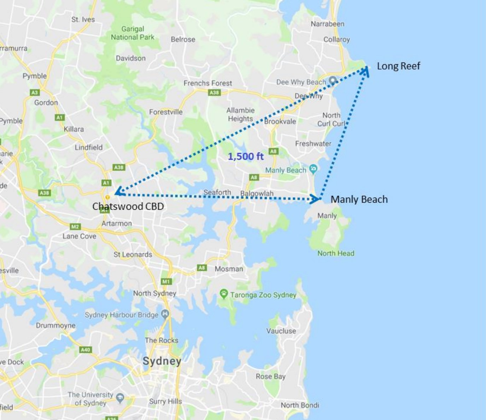

--8<-- "includes/abbreviations.md"

## Positions

| Name               | ID      | Callsign       | Frequency        | Login Identifier              |
| ------------------ | --------------| -------------- | ---------------- | --------------------------------------|
| **Sydney Approach North**    |**SAN**| **Sydney Approach**   | **124.400**         | **SY_APP**                                   |
| Sydney Approach South†   |SAS| Sydney Approach   | 128.300          | SY-S_APP                                 |
| Sydney Departures North†    |SDN| Sydney Departures  | 123.000         | SY_DEP          |
| Sydney Departures South†   |SDS| Sydney Departures | 129.700          | SY-S_DEP         |
| Sydney Director West† |SFW| Sydney Director   | 126.100          | SY-D_APP                               |
| Sydney Director East† |SFE| Sydney Director   | 125.300          | SY-DE_APP                               |
| Sydney Flow†        |SFL|                |          | SY-FLW_CTR                               |

† **Non-standard position** – may only be used in accordance with [VATPAC Ratings and Controller Positions Policy](https://cdn.vatpac.org/documents/policy/Controller+Positions+and+Ratings+Policy+v5.2.pdf){target=new}

## Airspace
The Sydney TMA spans a 45nm Radius around YSSY from SFC-FL280.  
SY TCU is responsible for the Sydney TMA, except:  
a) BK CTR when **BK TWR** is online;  
b) CN CTR when **CN TWR** is online;  
c) R470 Restricted Area, when RIC TWR is online (or as negotiated)  
d) any airspace released to an external unit (e.g. tower) either by NOTAM or as negotiated.

BK CTR reverts to Class G when **BK TWR** is offline, and is administered by the relevant SY TCU controller.    
CN CTR reverts to Class G when **CN TWR** is offline, and is administered by the relevant SY TCU controller.  
SY TCU is responsible for the provision of ADC, SMC and ACD responsibilities when **SY TWR** is offline.
### Airspace Structural Arrangements

Pursuant to Section 3 of the [VATPAC Ratings and Controller Positions Policy](https://cdn.vatpac.org/documents/policy/Controller+Positions+and+Ratings+Policy+v5.2.pdf){target=new}, the following rules apply, in the order presented, to these controller positions, except **SFL**:  
a) **“North”**/**”West”** positions shall assume the airspace of corresponding **“South”**/**”East”** positions when the latter are inactive (e.g. **SAN** assumes **SAS** airspace), and vice versa;  
b) Approach assumes Director/Departure airspace “on-side” when the latter positions are inactive (e.g. with **SAS** and **SAN** online only, **SAS** assumes **SDS** and **SFW**) 
## Arrival Procedures
### Level Assignment
When assigning levels on descent to aircraft, remember that you will not receive "Next" Coordination on aircraft assigned Standard Assignable Levels (ie `A050` for Jets, `A030` for Non-Jets), meaning an aircraft could depart at any time without prior warning and climb to `A050`. So in order to assure separation between arrivals and departures, do not assign below `A060` to aircraft until they are clear of the active runway's departure path.

!!! example
    For an aircraft inbound from the north on the BOREE3A arrival Runway 34R, assign no lower than `A060` until south of the field, then lower as required
## Parallel Runway Operations

### Runway Selection
Unless operationally required, aircraft shall be assigned the following runways for arrival when PROPS are in progress:

| Aircraft tracking | Runway  |
| ----------------| --------- |
| via RIVET   | 16R/34L      |
| via ODALE | 16R/34L |
| via MARLN | 16L/34R |
| via BOREE | 16L/34R |
| via MEPIL | 16L/34R |
| Other aircraft: |
| From the NORTH and EAST | 16L/34R |
| From the SOUTH and WEST | 16R/34L |

### Director East and West

Sydney Approach North (SAN) / Sydney Approach South (SAS) are required to hand-off aircraft to the appropriate Sydney Director East (SFE) / Sydney Director West (SFW) Controller on a <u>downwind heading</u>, <u>assigned</u> (or maintaining) <u>6000FT</u>.

Note - the downwind heading is not required to be entered in the label data by SAN/SAS.

SFW/SFE should provide aircraft an approximate 'miles to run' on first contact, to allow the aircraft to plan their descent path.

A typical downwind will take roughly 25 track miles from the normal point have handover from SAN/SAS to SFE/SFW.

!!! example
    "QLK402, Sydney Director, descend via STAR 4000 FT, 25 miles to run"

SFW/SFE may provide distance to touchdown, when transferring an aircraft to tower after the aircraft is established on their approach runway centreline (see below).

!!! example
    "QFA490, 8 miles to touchdown, contact tower 120.5"

### Instrument Approach

Aim to vector aircraft to the following Intercept points during instrument PROPS (GLS or ILS approach) unless sufficient separation can be established between parallel approaches:

| Runway | Distance from Threshold | Level  |
| --| ----------------| --------- |
|RWY 16R/34L| 10nm   | A030     |
|RWY 16L/34R| 15nm or further | A040 |

### Independent Visual Approach

When conducting IVAs, aircraft shall not be transferred to **SY ADC** until established on final.

!!! example
    **SFW:** “BNZ444, Turn left heading 360, join final Runway 34L, from that heading Cleared Independent Visual Approach” `AIP GEN 3.4`   
    **BNZ444:** "Left heading 360, join final Runway 34L, from that heading Cleared Independent Visual Approach, BNZ444"  
    ...  
    **SFW:** "BNZ444, Contact Sydney Tower 120.5"  
    **BNZ444:** "120.5, BNZ444" 

## Sydney Harbour Scenic Flights
Flights may be cleared for one of two standard scenic flight routes at `A015`, **Harbour Scenic ONE** or **Harbour Scenic TWO**, which are described below. Pilot preference should be accommodated where traffic permits.

Aircraft must Track via Class G airspace to Long Reef and contact SY TCU prior to reaching Long Reef requesting a ‘Harbour Scenic’ clearance. If a clearance cannot be given immediately, instruct the pilot to remain in Class G airspace.

!!! example
    “ABC, remain clear of Class C airspace”

A **‘Harbour Scenic ONE’** (or **‘TWO’**) clearance is used to authorise flight in the nominated route at `A015`. Sydney Airport QNH must be issued with the clearance.

!!! example
    “ABC, Cleared Harbour Scenic One, Sydney QNH 1014”

<figure markdown>
{ width="400" }
  <figcaption>Sydney Harbour Scenic One</figcaption>
</figure>

<figure markdown>
{ width="400" }
  <figcaption>Sydney Harbour Scenic Two</figcaption>
</figure>

These can be displayed on vatSys using the SY_VFR map.

## Helicopter Operations
### Inbound/Outbound Routes
Reserved

### Terminal Airspace Operations
Reserved

## BK TWR Offline
Due to the low level of CTA (A015) in the BK CTR when **BK TWR** is offline, it is best practice to give airways clearance to aircraft at the holding point, to ensure departing aircraft can have uninterrupted climb.

!!! example
    **ABC** -> **SY TCU**: "Sydney Approach, ABC, PC12, POB 8, IFR, Taxiing YSBK for YSHL, Runway 11C" `AIP GEN 3.4`  
    **SY TCU** -> **ABC**: "ABC, Sydney Approach, Squawk 3601, No Reported IFR Traffic, Call me Ready at the Holding Point for Airways Clearance"  
    **ABC** -> **SY TCU**: "Squawk 3601, Wilco, ABC"  
    **ABC** -> **SY TCU**: "ABC, Ready Runway 11C, Request clearance"  
    **SY TCU** -> **ABC**: "ABC, Cleared to YSHL via ANKUB, Flight Planned Route. Make Visual right turn DCT ANKUB, Climb to A030"  
    **ABC** -> **SY TCU**: "Cleared to YSHL via ANKUB, Flight Planned Route. Make Visual right turn DCT ANKUB, Climb to A030, ABC" 
## Airspace Division

The divisions of the airspace between **SAN**, **SAS**, **SDS**, **SDN**, **SFW** and **SFE** change based on the Runway Mode.

!!! note
    The following diagrams do not include non SY TCU areas of responsibility such as BK CTR or CN CTR

### 07
<figure markdown>
{ width="700" }
  <figcaption>07 TCU Structure</figcaption>
</figure>

### 16 PROPS
<figure markdown>
{ width="700" }
  <figcaption>16 PROPS TCU Structure</figcaption>
</figure>

### 25
<figure markdown>
{ width="700" }
  <figcaption>25 TCU Structure</figcaption>
</figure>

### 34 PROPS
<figure markdown>
{ width="700" }
  <figcaption>34 PROPS TCU Structure</figcaption>
</figure>

### SODPROPS
<figure markdown>
{ width="700" }
  <figcaption>SODPROPS TCU Structure</figcaption>
</figure>

## Coordination
### SY TCU / ENR
#### Departures
Voiceless coordination is in place from SY TCU to all surrounding ENR sectors (**ARL** (and subsectors) to the North and East, **YWE** (and subsectors) to the West, **BIK** (and subsectors) to the South) for aircraft assigned:  
The lower of `F280` or the `RFL`, **with the exception of**:  
Aircraft with ADES YWLM, which will be assigned the lower of `F130` or the `RFL`.  

Aircraft must be tracking from **SDN** or **SDS** airspace (see [Airspace Division](http://sops.vatpac.org/terminal/Sydney%20TCU/operations/#airspace-division){target=new}).

Any aircraft tracking from **SAS** or **SAN** airspace, or **not** assigned the standard assignable level, must be **Heads-up** Coordinated to the relevant ENR sector as soon as practical.

!!! example
    **SY TCU** -> **ARL**: "JST789, with your concurrence, will be assigned F240, for my separation with ANZ12"  
    **ARL** -> **SY TCU**: "JST789, concur F240"  

#### Arrivals
Standard assignable levels from ENR to SY TCU are as follows:  
via RIVET, BOREE, or MARLN: `A100`  
All other routes: `A090`  
### SY TCU Internal
#### APP / DIR

Voiceless coordination is in place between APP and DIR, with the following conditions:

a) Assigned `A060`  
b) Routed/vectored as per the table below:

| STAR  | 07   | 16L  | 16R   | 25   | 34L | 34R
| ------| --------------| -------------- | ----- | -----|-----|-----|
| BOREE   |H240| LOC/IVA  | LOC/IVA  | H060 | STAR | STAR|
| MEPIL   |H240| STAR  | STAR  | H060 | H150 | H150|
| MARLN   |H240| H330  | H330  | STAR | H150 | STAR|
| RIVET  |STAR| H330  | H330  | H060 | STAR | STAR|
| ODALE |LOC| H330  | H330  | H060 | H150 | H150|

!!! tip
    If strong winds are present at altitude, APP/DIR should discuss slight changes to these headings to compensate for large crosswind components.

Where an aircraft needs to cross the approach paths or overfly Sydney to join the opposite circuit, the following altitudes shall be used until radar separation is established with respect to the approach paths:  
Eastbound: `A070`  
Westbound: `A080`

Any aircraft not meeting these requirements **must** be prior coordinated to DIR.

!!! example
    **QFA123** -> **SAS**: "QFA123, Requesting DCT SOSIJ"  
    **SAS** -> **QFA123**: "QFA123, Standby"  
    **SAS** -> **SFW**: "QFA123, requesting DCT SOSIJ"  
    **SFW** -> **SAS**: "QFA123, concur DCT SOSIJ"  
    **SAS** -> **SFW**: "DCT SOSIJ, QFA123"  
    **SAS** -> **QFA123**: "QFA123, Cancel STAR, Recleared DCT SOSIJ, A060"  
    **QFA123** -> **SAS**: "Cancel STAR, Recleared DCT SOSIJ, A060, QFA123"  

!!! example
    **SAS** -> **SFW**: "VOZ456, with your concurrence, will be assigned A070, for my separation with ABC"  
    **SFW** -> **SAS**: "VOZ456, concur A070"   

#### APP / DEP
Aircraft are permitted cross the MARLN corridor at or above A060 without coordination with APP. DEP is responsible for separation with respect to aircraft in the corridor.
### SY TCU / SY ADC
#### Auto Release

Auto Release shall be used for aircraft that are:    
a) Departing from a runway nominated on the ATIS; and  
b) Issued a Procedural SID; and   
c) Assigned the standard assignable level.

Any aircraft that don't meet these criteria must be coordinated to SY TCU with a "Next" Call.

"Next" Coordination is a procedure where the **SY ADC** controller gives a heads-up to the SY TCU controller about an impending departure. The SY TCU controller will respond by assigning a heading to the aircraft, for the **SY ADC** controller to pass on with their takeoff clearance.

!!! example
    **SY ADC** -> **SY TCU**: "Next, ABC"  
    **SY TCU** -> **SY ADC**: "ABC, Heading 030"  
    **SY ADC** -> **SY TCU**: "Heading 030, ABC"  
    **SY ADC** -> **ABC**: "ABC, Assigned heading right 030, Runway 34R, Cleared for Takeoff"  
    **ABC** -> **SY ADC**: "Right heading 030, Runway 34R, Cleared for Takeoff, ABC"  
    `AIP GEN 3.4`

The SY TCU controller can suspend/resume Auto Release at any time, with the concurrence of **SY ADC**.
### SY TCU / BK TWR
#### Departures

Aircraft departing YSBK in to SY TCU Class C will be coordinated from **BK TWR** at Taxi. Aircraft will need to be passed airways clearances to **BK TWR** at this point, to be relayed to the aircraft.

!!! example
    **BK TWR** -> **SY TCU**: "Taxi, TFX12 for YMML via WOL"  
    **SY TCU** -> **BK TWR**: "TFX12, BK, WOL, Flight Planned Route, A030, Squawk 3601"  
    **BK TWR** -> **SY TCU**: "BK, WOL, Flight Planned Route, A030, Squawk 3601, TFX12"  
    **BK TWR** Will then pass the airways clearance to TFX12

**BK TWR** will then give a "Next" call, where the SY TCU controller shall assign a heading (usually 290, for separation from YSSY).

!!! example
    **BK TWR** -> **SY TCU**: "Next, TFX12"  
    **SY TCU** -> **BK TWR**: "TFX12, Right Heading 290, A030"  
    **BK TWR** -> **SY TCU**: "Right Heading 290, A030, TFX12"  
    **BK TWR** Will then clear the aircraft to takeoff with the assigned heading, and instruct them to contact SY TCU passing A020.

#### Arrivals

YSBK arrivals shall be coordinated to **BK TWR** from SY TCU prior to transfer of jurisdiction.

!!! tip
    Ensure the aircraft's FDR is up-to-date in order to give **BK TWR** maximum situational awareness of the traffic picture. (eg. if the aircraft is doing the RNP approach, ensure the FDR has been rerouted via the appropriate points)

!!! example
    **SY TCU** -> **BK TWR**: "ABC, via ODALE, Number 1"  
    **BK TWR** -> **SY TCU**: "ABC, Number 1"  

### SY TCU / CN TWR
#### Departures

Aircraft departing YSCN in to SY TCU Class C will be coordinated from **CN TWR** at Taxi.

!!! example
    **CN TWR** -> **SY TCU**: "Taxi, DEF for YBTH via KADOM"  
    **SY TCU** -> **CN TWR**: "DEF, Squawk 3601."  
    **CN TWR** -> **SY TCU**: "Squawk 3601, DEF"  

CN TWR will then give a "Next" call.

!!! example
    **CN TWR** -> **SY TCU**: "Next, DEF"  
    **SY TCU** -> **CN TWR**: "DEF"  
#### Arrivals

YSCN arrivals shall be coordinated to **CN TWR** from SY TCU prior to transfer of jurisdiction.

!!! example
    **SY TCU** -> **CN TWR**: "New Sequence of 2, ZYX, via TONTO, Number 1. QET, via WATLE, Number 2"  
    **CN TWR** -> **SY TCU**: "ZYX Number 1, QET Number 2"  
### SY TCU / RIC TWR

Reserved
