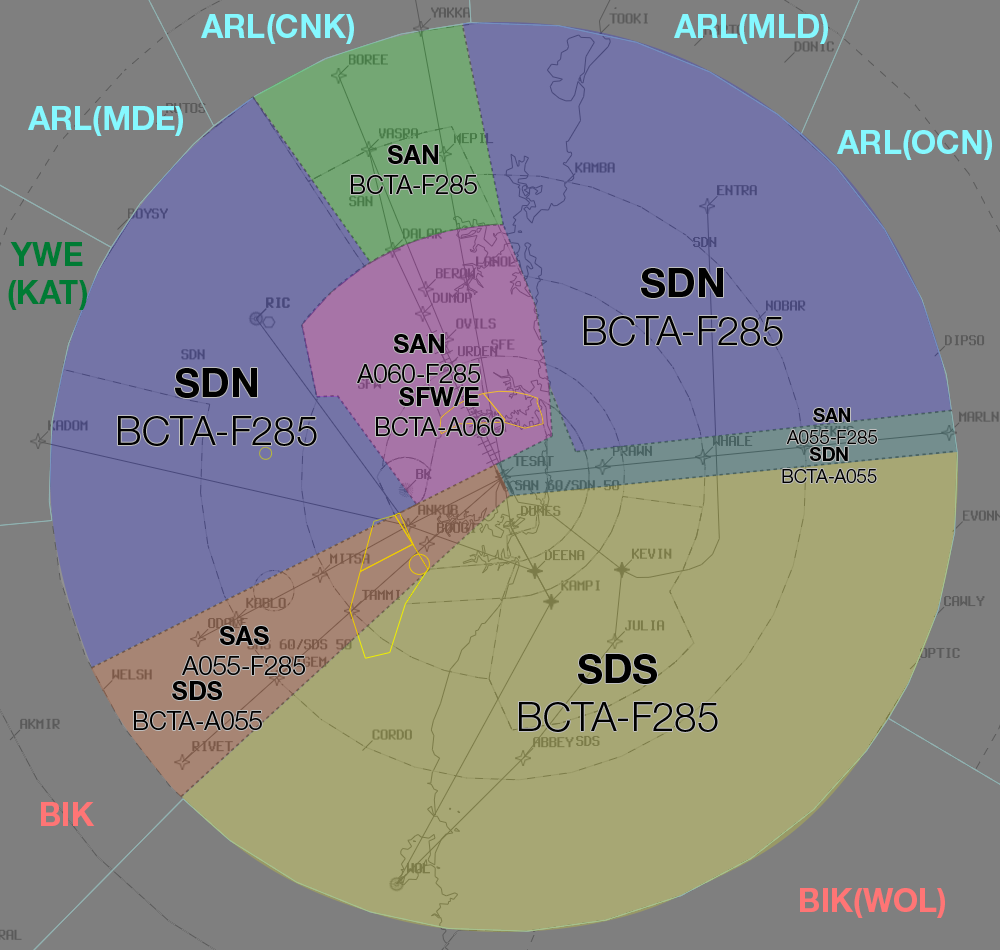
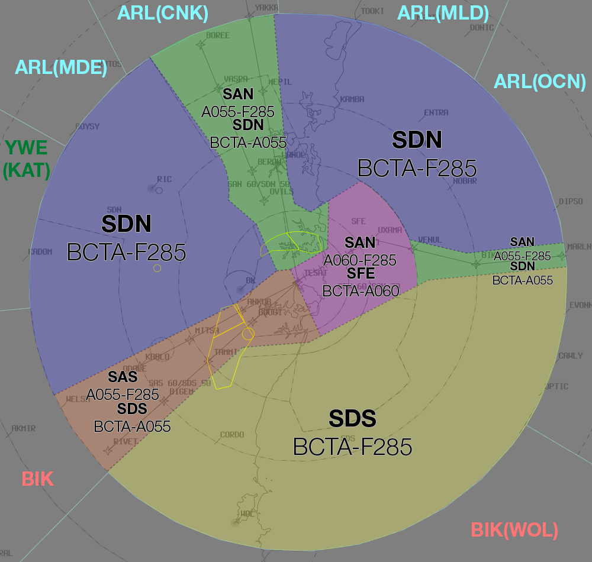
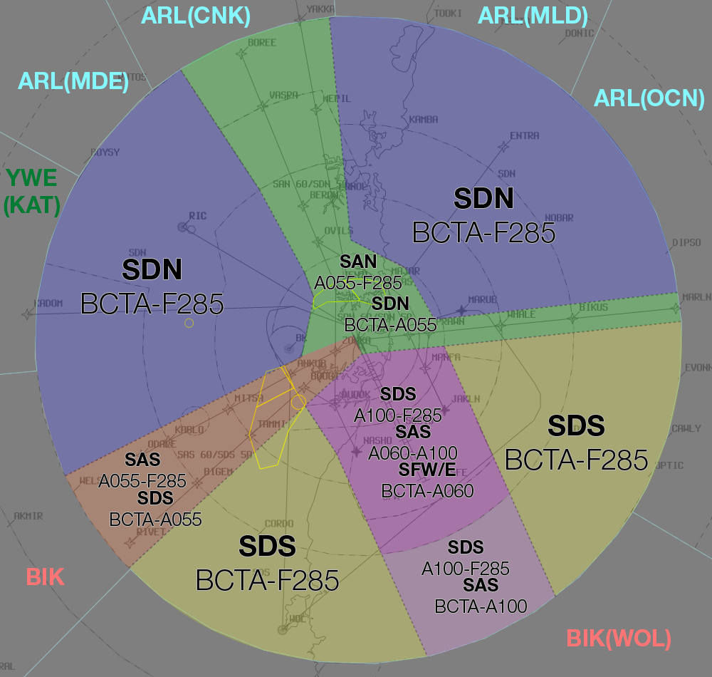
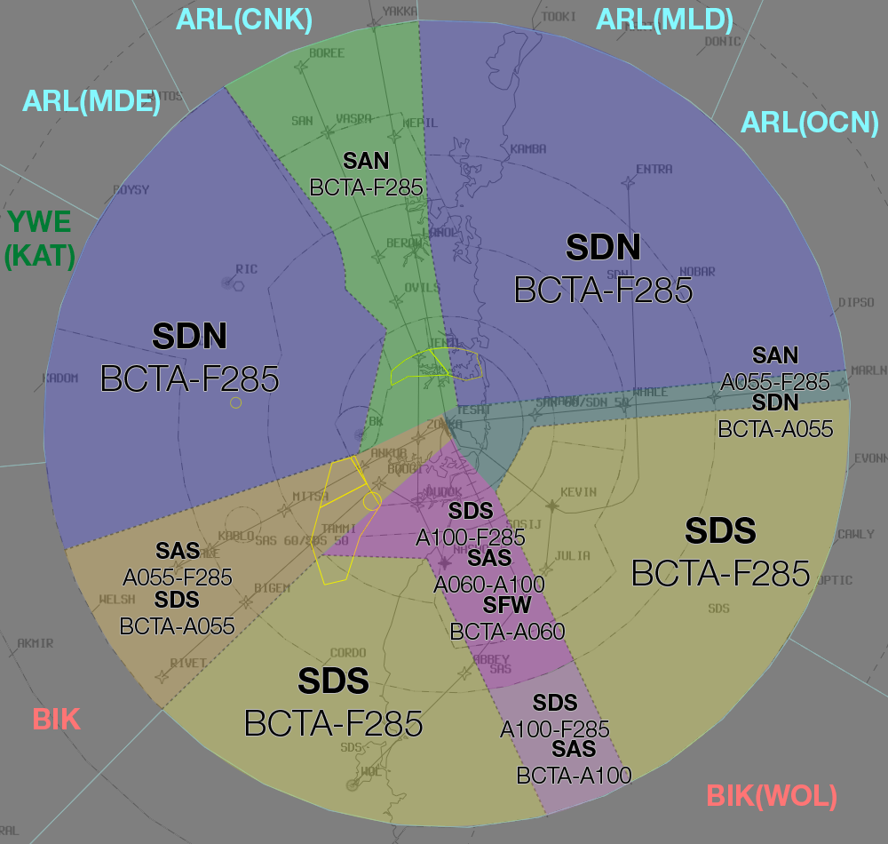
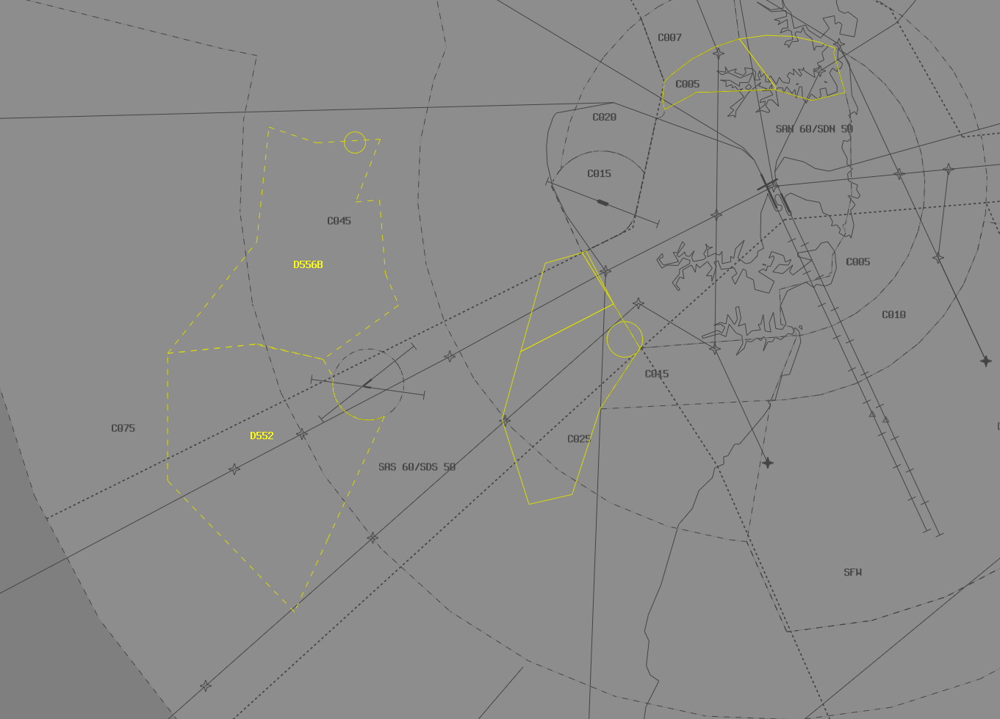

--8<-- "includes/abbreviations.md"

## Positions

| Name               | ID      | Callsign       | Frequency        | Login ID              |
| ------------------ | --------------| -------------- | ---------------- | --------------------------------------|
| **Sydney Approach South**    |**SAS**| **Sydney Approach**   | **128.300**         | **SY_APP**                                   |
| Sydney Approach North :material-information-outline:{ title="Non-standard position"}   |SAN| Sydney Approach   | 124.400          | SY-N_APP                                 |
| Sydney Departures South :material-information-outline:{ title="Non-standard position"}   |SDS| Sydney Departures | 129.700          | SY_DEP         |
| Sydney Departures North :material-information-outline:{ title="Non-standard position"}    |SDN| Sydney Departures  | 123.000         | SY-N_DEP          |
| Sydney Director West :material-information-outline:{ title="Non-standard position"} |SFW| Sydney Director   | 126.100          | SY-D_APP                               |
| Sydney Director East :material-information-outline:{ title="Non-standard position"} |SFE| Sydney Director   | 125.300          | SY-DE_APP                               |
| Sydney Radar :material-information-outline:{ title="Non-standard position"} :octicons-checklist-24:{ title="Non-standard position"} |SRI| Sydney Centre  | 124.550          | SY-C_DEP                               |
| Sydney Flow :material-information-outline:{ title="Non-standard position"}        |SFL|                |          | SY_FMP                              |

!!! abstract "Non-Standard Positions"
    :material-information-outline: Non-standard positions may only be used in accordance with [VATPAC Air Traffic Services Policy](https://vatpac.org/publications/policies){target=new}.  
    Approval must be sought from the **bolded parent position** prior to opening a Non-Standard Position, unless [NOTAMs](https://vatpac.org/publications/notam){target=new} indicate otherwise (eg, for events).

    :octicons-checklist-24: [Additional requirements](#airspace-structural-arrangements) must be met prior to opening SRI as a stand-alone position.

## Airspace
The Vertical limits of the SY TCU are `SFC` to `F285`.  
SY TCU is responsible for the Sydney TMA, except:  

- SY CTR `SFC` to `A005` as outlined [here](../../aerodromes/sydney/#airspace)
- R470 Restricted Area, when RIC ADC is online (or as negotiated)  

### Reclassifications
#### BK CTR
BK CTR reverts to Class G when **BK ADC** is offline, and is administered by the relevant SY TCU controller.

See also: [BK ADC Offline](#bk-adc-offline).

#### CN CTR
CN CTR reverts to Class G when **CN ADC** is offline, and is administered by the relevant SY TCU controller.

#### RI CTR
RI ADC being online will activate the **R470** Restricted Area, which is reclassified as **Class C** when active.

Control authority of the **R470** Restricted Area when active is as follows:

- RI ADC `SFC`-`A015`
- SY TCU (SDN) `A015`-`A045`

### Airspace Division
The divisions of the airspace between **SAN**, **SAS**, **SDS**, **SDN**, **SFW** and **SFE** change based on the Runway Mode.

<figure markdown>
{ width="700" }
  <figcaption>SY TCU Side Profile</figcaption>
</figure>

!!! note
    The following diagrams do not include non SY TCU areas of responsibility such as BK CTR or CN CTR

=== "07AD"
	<figure markdown>
	{ width="700" }
	  <figcaption>07 TCU Structure</figcaption>
	</figure>

=== "16 PROPS"
	<figure markdown>
	{ width="700" }
	  <figcaption>16 PROPS TCU Structure</figcaption>
	</figure>

=== "25AD"
	<figure markdown>
	{ width="700" }
	  <figcaption>25 TCU Structure</figcaption>
	</figure>

=== "34 PROPS"
	<figure markdown>
	{ width="700" }
	  <figcaption>34 PROPS TCU Structure</figcaption>
	</figure>

=== "SODPROPS"
	<figure markdown>
	{ width="700" }
	  <figcaption>SODPROPS TCU Structure</figcaption>
	</figure>
	
#### Airspace Structural Arrangements
Pursuant to Section 2 of the [VATPAC Air Traffic Services Policy](https://vatpac.org/publications/policies){target=new}, the following rules apply, in the order presented, to these controller positions, except **SFL**:  

a) **"South"**/**"West"** positions shall assume the airspace of corresponding **"North"**/**"East"** positions when the latter are inactive (e.g. **SAS** assumes **SAN** airspace, **SFW** assumes **SFE** airspace)  

b) Approach assumes Director/Departure airspace "on-side" when the latter positions are inactive (e.g. with **SAS** and **SAN** online only, **SAS** assumes **SDS** and **SFW**)  

c) Departures assumes **SRI** airspace when the position is inactive  

d) **SRI** is **not permitted** to be logged on to, unless there are already at least **2 other active positions** (ie, SY APP and SY DEP, or SY APP and SY DIR) in the SY TCU.

!!! note
    The default ownership of sectors within the SY TCU is merely a suggestion for starters. There are 7 executive controller positions within the SY TCU, plus a flow controller, and the ownership of these sectors can be delegated as desired based on the traffic disposition, when agreed between the controllers. For example, during a Milk Run event, if SY APP and SY DEP are online, SY APP may have a lot more work to do than SY DEP, and it would mostly be concentrated on the RIVET/ODALE corridor. In light of this, it might be wise for SY APP to take ownership of SAS, SFW and SFE airspace, whilst SY DEP take ownership of SAN, SDS, SDN, and SRI airspace.

!!! tip
    Unless there are 2 separate Director controllers online (during a Major event like Panic Stations, for example), it is **not recommended** that the SFW and SFE positions are held by 2 separate controllers, due to the tendency of some less experienced pilots to overshoot the runway centreline

#### Sydney Radar (SRI)
SRI is responsible for the provision of FIS in Class G airspace within the SY TMA.  It is a role normally performed by DEPs but can be delegated to any TMA controller.  The position is designed to reduce the workload of the other TMA positions by identifying and issuing clearance (where available) to aircraft OCTA, then transferring them to the relevant TMA controller.  [Explicit coordation requirements](#between-sri-and-appdepdir) exist between SRI and other TCU positions, and there are [certain rules](#airspace-structural-arrangements) surrounding the opening of SRI as a stand-alone position.  

!!! example
    During a busy event, Sydney Departures is experiencing a high workload and wishes to delegate the SRI role to another TMA controller who isn't as busy.  SAN's sector is quiet, so they elect to perform the role.

##### Training Areas
SRI should monitor aircraft operating in the YSBK and YSCN training areas. VFR aircraft are not required to contact SRI for entry, however should monitor the SRI frequency when operating in the training areas.

| Training Area  | Danger Area Code   |
| ------| --------------|
| YSBK   | D556B |
| YSCN   | D552 |

<figure markdown>
{ width="700" }
  <figcaption>Bankstown and Camden Training Areas</figcaption>
</figure>

If a conflict is imminent, SRI may pass safety alerts to VFR aircraft, even if prior contact has not been established and the aircraft are not in receipt of Surveillance Information Service (SIS). IFR aircraft, or VFR aircraft receiving SIS, that pass near the Training Areas may be given traffic information on known aircraft operating within the Training Areas, particularly those on the eastern side that may intend to exit tracking to Prospect Reservoir (PSP).

##### Western Sydney Airport
The under-construction Western Sydney Airport is located in Badgerys Creek, north north-west of BRY. The opening of the new aerodrome will entail significant changes to the airspace arrangement across the TCU. Until then, the airport remains uncontrolled and is OCTA. There are no instrument procedures or navigational aids established to facilitate its use.

<figure markdown>
{ width="300" }
  <figcaption>Western Sydney Airport location *(approx.)*</figcaption>
</figure>

Some pilots may choose to simulate operations to/from the airport, despite these limitations. Aircraft operating in and out of the site are processed in the same way as any other flight into an uncontrolled ALA OCTA.

## Separation
### Parallel Runway Operations
Refer to [Parallel Runway Separation Standards](../../separation-standards/parallelapps) for more information

## Local Procedures
### Sydney Harbour Scenic Flights
Flights may be cleared for one of two standard scenic flight routes at `A015`, **Harbour Scenic One** or **Harbour Scenic Two**, which are described below. Pilot preference should be accommodated where traffic permits.

Aircraft must track via Class G airspace to Long Reef and contact SY TCU prior to reaching Long Reef requesting a ‘Harbour Scenic’ clearance. Attempt to identify the aircraft, and if a clearance cannot be given immediately, instruct the pilot to remain in Class G airspace.

!!! phraseology
    "LOI, squawk 0542, remain clear of Class C airspace"

A **‘Harbour Scenic One’** (or **‘Two’**) clearance is used to authorise flight in the nominated route at `A015`. Sydney QNH must be issued with the clearance.

!!! phraseology
    "LOI, identified, cleared Harbour Scenic One, Sydney QNH 1014"

!!! warning "Caution"
    The Harbour Scenic One procedure may cause conflict with departures from Runway 34R to the north. Before issuing a Harbour Scenic One clearance, assess the traffic situation on the ground at YSSY and determine whether a departure to the north of the harbour is likely in the next few minutes. If necessary, instruct the aircraft to remain OCTA and advise of the delay, or alternatively, issue the Harbour Scenic Two clearance.

<figure markdown>
{ width="400" }
  <figcaption>Sydney Harbour Scenic One *(in pink)* and Two *(in green)*</figcaption>
</figure>

These can be displayed on vatSys using the `SY_VFR` map.  

!!! note
    Remember that VFR aircraft are **not** separated from other VFR aircraft in class C airspace.  If other VFR aircraft are operating over the harbour, you are not required to provide a separation standard between them, however you must pass traffic information to both aircraft.

## Departure and Arrival Procedures 
### STAR and Runway Assignment
Sequencing of arrivals into YSSY is a joint responsibility of ARL and GUN, with input from SY TCU.

Aircraft from the south/west are assigned 16R/34L and aircraft from the north/east assigned 16L/34R.  However, some heavy aircraft from the north/east may operationally require the longer runway. Similarly, it may be beneficial for the sequence to assign an arrival to an alternate runway to avoid unnecessary delays.

Jet aircraft for YSSY shall be assigned the **RIVET**, **BOREE**, or **MARLN** STARs.  
Non-jet aircraft for YSSY shall be assigned the **ODALE**, **MEPIL**, or **MARLN** STARs.

Whilst the preference is to keep aircraft assigned the default STAR & runway as above, there are situations where the sequence may be improved by assigning the adjacent STAR or an alternate runway. It is a joint responsibility of **SY TCU** and the surrounding enroute controllers to consider these STAR/runway changes when reviewing the inbound sequence. If a change is recommended, coordination should be conducted with the enroute controller to request that an aircraft be reassigned. Where aircraft will be passing in close proximity (even if assigned different runways), consider the use of the adjacent STAR, to maintain a separation standard during the arrival.

!!! note
    Before reassigning an aircraft to an alternate runway, consider arrivals inbound from all directions to ensure that no additional conflict is created.

Approach controllers can use the built-in separation afforded by the STAR level restrictions to process aircraft on adjacent STARs (e.g. RIVET and ODALE, or BOREE and MEPIL), allowing aircraft to pass abeam or overtake each other, as dictated by the overall sequence. See [Level Assignment](#level-assignment) below for details on maintaining separation using the STAR level restrictions.

!!! example
    During a busy [Milk Run Monday](../../events/milkrun/terminal), a large volume of traffic is approaching YSSY from the southwest, with no arrivals from the north or east. To prevent unnecessarily delaying inbound aircraft by processing them for a single runway, coordinate with **GUN** to request certain aircraft are tactically assigned runway 16L/34R, to improve the overall efficiency of the sequence.  

    Where aircraft are moved to the alternate runway, consider requesting that they are also assigned the alternate STAR to an aircraft approaching at a similar time on the main runway (i.e. a jet aircraft is moved to runway 34R and cleared the ODALE STAR for separation with a jet aircraft nearby assigned runway 34L via the RIVET STAR).

#### YWLM STARs
SY TCU is responsible for issuing STARs to aircraft inbound to YWLM via **EKIPU** and **OVLUX**. Aircraft shall be assigned the **EKIPU** or **OVLUX** STAR (as appropriate) by default, unless coordinated otherwise (eg. via the **IVTAG** STAR).

### Level Assignment
!!! note
    Inbound aircraft will be handed from Enroute to Approach assigned the [standard assignable level](#arrivals).  This section refers to further descent issued by the Approach controller.

Adjacent STARs do not guarantee lateral separation (particularly as aircraft get closer to TESAT), so to avoid a breakdown of separation standards, **Approach** should assign levels as follows: <ul><li>ODALE/MEPIL STAR: `A060`</li><li>RIVET/BOREE STAR: `A080`</li><li>MARLN STAR: `A090`</li></ul>

RIVET/BOREE aircraft should only be assigned `A070` when an adjacent ODALE/MEPIL arrival is maintaining `A060`.  These aircraft can be stepped down to `A060` once sufficient lateral separation exists (often during the downwind turn).

MARLN aircraft which require an overfly to the west should be assigned `A090` and stepped down on top of any RIVET arrivals.

!!! tip
    Be mindful of Sydney's [REP airspace](#radar-entry-procedure-rep) arrangement and avoid leaving arrivals at `A100`.  Aircraft should be descended to `A090` or below by 20DME to prevent conflict with departing traffic.

All aircraft should be assigned no lower than `A060` until clear of the active runways' departure tracks.  This normally occurs once established on downwind (but changes based on runway config).

!!! note
    Remember that you will not receive "Next" Coordination on aircraft assigned Standard Assignable Levels (ie `A050` for Jets, `A030` for Non-Jets), meaning an aircraft could depart at any time without prior warning and climb to `A050`.

!!! example
    For an aircraft inbound from the north on the BOREE STAR to runway 34R, assign no lower than `A080` until any adjacent aircraft are maintaing `A060`, then `A070` until the aircraft are laterally clear.  The arrival should then be assigned `A060` until south of the field.

Be mindful of departures from YSBK which may also impact aircraft on downwind for RWY 16R at YSSY.  Do not assign lower than `A040` until the aircraft is north/east of the BK CTR and clear of any departing traffic (who are assigned `A030` by default).

## Offline Towers
### BK ADC Offline
Due to the low level of CTA (`A015`) in the BK CTR when **BK ADC** is offline, it is best practice to give airways clearance to aircraft at the holding point, to ensure departing aircraft can have uninterrupted climb.

!!! phraseology
    **LOA**: "LOA, King Air, POB 10, IFR, taxing Bankstown for Shellharbour, Runway 11C"    
    **SY TCU**: "LOA, Sydney Approach, squawk 3601, no reported IFR traffic, report ready at the holding point for airways clearance"  
    **LOA**: "Squawk 3601, wilco, LOA"  

    **ABC**: "LOA, ready Runway 11C"  
    **SY TCU**: "LOA, cleared to YSHL via ANKUB, flight planned route, BK9 departure, climb via SID to A030"  
    **LOA**: "Cleared to YSHL via ANKUB, flight planned route, BK9 departure, climb via SID to A030, LOA"

## Runway Modes
### Parallel Runway Operations
#### Runway Selection
Unless operationally required, aircraft shall be assigned the following runways for arrival when PROPS are in progress:

| Aircraft tracking | Runway  |
| ----------------| --------- |
| via RIVET   | 16R/34L      |
| via ODALE | 16R/34L |
| via MARLN | 16L/34R |
| via BOREE | 16L/34R |
| via MEPIL | 16L/34R |
| Other aircraft: |
| From the NORTH and EAST | 16L/34R |
| From the SOUTH and WEST | 16R/34L |

#### Director East and West

Sydney Approach North (SAN) / Sydney Approach South (SAS) are required to hand-off aircraft to the appropriate Sydney Director East (SFE) / Sydney Director West (SFW) Controller on a <u>downwind heading</u>, <u>assigned</u> (or maintaining) <u>`A060`</u>.

Note - the downwind heading is not required to be entered in the label data by SAN/SAS.

SFW/SFE should provide aircraft an approximate 'miles to run' on first contact, to allow the aircraft to plan their descent path.

A typical downwind will take roughly 25 track miles from the normal point have handover from SAN/SAS to SFE/SFW.

!!! phraseology
    "QLK402, Sydney Director, descend to A040, 25 miles to run"

SFW/SFE may provide distance to touchdown, when transferring an aircraft to tower after the aircraft is established on their approach runway centreline (see below).

!!! phraseology
    "QFA490, 8 miles to touchdown, contact tower 120.5"

#### Instrument Approach
Aircraft joining parallel instrument approaches must remain separated from aircraft on the adjacent approach until they are established. This usually involves keeping aircraft vertically separated and may require aircraft to intercept the localiser/final approach course and maintain their assigned level, only allowing descent on the approach once they are established.  

Two aircraft established on adjacent parallel approaches require `1nm` lateral separation as opposed to the 3nm standard required in the TMA generally.

#### Independent Visual Approach
When conducting IVAs, aircraft shall not be transferred to **SY ADC** until established on final.

!!! phraseology
    **SFW:** "BNZ444, Turn left heading 360, join final Runway 34L, from that heading Cleared Independent Visual Approach"    
    **BNZ444:** "Left heading 360, join final Runway 34L, from that heading Cleared Independent Visual Approach, BNZ444"  
      
    **SFW:** "BNZ444, Contact Sydney Tower 120.5"  
    **BNZ444:** "120.5, BNZ444"

##### Phraseology at Night
*"CLEARED INDEPENDENT VISUAL APPROACH RUNWAY (number), NOT BELOW (MVA) UNTIL ESTABLISHED ON THE PAPI (or GLIDEPATH)"*

!!! phraseology
    **SFE:** "ANZ361, Turn right heading 305, join final Runway 34R, from that heading Cleared Independent Visual Approach Runway 34R, not below `A015` until established on the PAPI"    

#### SODPROPS
Arriving aircraft must be established on final and transferred to the tower frequency no later than 10NM from touchdown.

## Helicopter Operations
### Inbound/Outbound Routes
Helicopters outbound from YSSY will make contact with the Departures controller established on a Helicopter Route.  Controllers need only identify the aircraft, as they will already be cleared to climb to a suitable level (generally not above `A010`) through their coded clearance.  Each clearance stipulates a point where identification and control services are automatically terminated, but controllers may explicitely cancel these services for new pilots who may not understand where they exit CTA.  

You can find each Helicopter Route below, and full details are in the `ERSA FAC YSSY`. Additionally, the vatSys `SY_HELO` map displays an approximation of each route.

<figure markdown>
{ width="700" }
</figure>

!!! phraseology
    **YZD:** "Sydney Departures, helicopter YZD, passing A009 on the Barracks 5 Outbound"  
    **SY TCU:** "YZD, Departures, identified"

Helicopters tracking inbound to YSSY will generally do so via a Helicopter Route.  Aircraft are required to contact the TCU controller for clearance along these routes, with the exception of the `CAPE BANKS 5 INBOUND` and `WANDA 5 INBOUND` for which they should contact **SY ADC** directly.  

Controllers should identify the aircraft and then provide clearance if traffic permits.

!!! phraseology
    **HSZ:** "Sydney Departures, helicopter HSZ, Sydney Heads, A010, received Delta, request Harbour Bridge 5 Inbound"  
    **SY TCU:** "HSZ, squawk 0552"  

    **SY TCU:** "HSZ, identified, cleared Harbour Bridge 5 Inbound"

The helicopter route title should be recorded in the **global ops field** and the route waypoints should be added to the FDR route, as below.

| Route | Waypoints |
| --- | --- |
| ROSEHILL 5 INBOUND | `RSH RKWC` |
| ERSKINEVILLE 5 INBOUND | ` DHH REDF ERSK` |
| HARBOUR BRIDGE 5 INBOUND | `HBB DHH REDF ERSK` |
| BARRACKS 5 INBOUND | `RCB MPSC` |
| MAROUBRA 5 INBOUND | `MRBR` |
| CAPE BANKS 5 INBOUND | `CAPS` |
| WANDA 5 INBOUND | `YWAN DLPT` |
| GEORGES RIVER 5 INBOUND | `CSTH PNP GRB DLPT` |

!!! note
    Some Helicopter Routes may conflict with fixed wing approach/departure paths, so use common sense to separate helicopters when required.  For example, during 34 PROPS, it may be more suitable for helicopters to track via the `CAPE BANKS 5 INBOUND` rather than taking the `MAROUBRA 5 INBOUND`, due to it's close proximity to the **MARUB SID**.  In any case, if pilots are unfamiliar with local landmarks, simplify your instructions to assist them while maintaining separation.

Inbound helicopters should transfer to **SY ADC** automatically (as per the coded clearance), however new pilots may need an explicit handoff.

### Terminal Airspace Operations
#### Bondi Coded Clearances
The `BONDI 5` coded clearance is only available to helicopters, provided PRM approaches are not in use to RWY 16s at YSSY.  The clearance may not be available (or delays may be required) when RWY 25 is in use for arrivals or RWY 07 is in use for departures.  

!!! tip
    You can find details of the BONDI 5 procedure in the YSSY ERSA FAC under section 14 `HELICOPTER ROUTE OPERATIONS`.

Helicopters should be identified and then cleared for the `BONDI 5 NORTHBOUND` or `BONDI 5 SOUTHBOUND`. Traffic information must be provided on any other helicopters operating on the route or any other aircraft in the area (e.g. aircraft in Victor One).  Sydney QNH should be provided if the aircraft didn't depart from YSSY recently.

!!! phraseology
    **YOE:** "Sydney Approach, helicopter YOE, Jibbon Point, A005, received Whiskey, request Bondi 5 Northbound"  
    **SY TCU:** "YOE, Sydney Approach, squawk 0451"  

    **SY TCU:** "YOE, identified, cleared Bondi 5 Northbound, Sydney QNH 1024"

Once the aircraft exits CTA at Long Bay Headland (southbound) or Sydney Heads (northbound), cancel their identification and control services.  If the helicopter is likely to request a clearance via one of Sydney's Helicopter Routes, consider instructing them to remain on their assigned squawk code to assist with identification.

!!! phraseology
    "YOE, clear of controlled airspace, identification and control services terminated, squawk 1200, frequency change approved"

#### Sector Coded Clearances
To reduce frequency congestion, several commonly used geographically defined areas are designated with lateral and vertical limits and provided upon request via a coded clearance to helicopter aircraft.

| Sector Name | Lateral Limits | Vertical Limits  |
| --| ----------------| --------- |
| City East | Bounded by Rushcutters Bay, Sydney Cricket Ground, Sydney Harbour Bridge South Pylon, Fort Denison, Clark Island, Rushcutters Bay   | Not above `A020`     |
| CBD | Bounded by Rushcutters Bay, Sydney Cricket Ground, Cleveland Street, Regent Street, George Street, Sydney Harbour Bridge South Pylon, Fort Denison, Clark Island, Rushcutters Bay | Not above `A020` |
| North Harbour | The area northeast of a line St Ives Showground, Roseville Bridge, Sydney Harbour Bridge North Pylon then via the northern shore of Sydney Harbour to Middle Head then Manly | Not above `A015` |
| Northern Beaches | The area east of a line Long Reef, Spit Bridge, Sydney Harbour Bridge North Pylon then via the northern shores of Sydney Harbour to Middle Head then Manly | Not above `A015` |
| South Harbour | The area bounded by lines joining Sydney Harbour Bridge North Pylon, Sydney Harbour Bridge South Pylon, then via the southern shoreline of Sydney Harbour to South Head then Manly to Middle Head, then via the northern shoreline of Sydney Harbour to Sydney Harbour Bridge North Pylon | Not above `A015` |
| Manly | The area North of line South Head to Middle Head to the Spit Bridge, East of a line Spit Bridge to intersection Pittwater and Warringah Roads to Curl Curl Beach, Coastal Southbound to South Head | Not above `A015` |

Helicopters should be identified and then provided the clearance where traffic permits.  Helicopters established on a Helicopter Route should be issued an onwards clearance into the requested sector.

!!! phraseology
    **HWD:** "Sydney Departures gday, helicopter HWD, passing 800ft on the Harbour Bridge 5 outbound, request South Harbour Sector"  
    **SY TCU:** "HWD, Departures, identified, onwards clearance South Harbour Sector"  
    **HWD:** "Onwards clearance South Harbour Sector, HWD"

### Hospital Helipads
The Sydney CTR contains a number of hospital helipads to the west, north, and east of YSSY.

Helicopters arriving to hospitals inside ADC's jurisdiction should be cleared for a visual approach by **SY TCU** and transferred to **SY ADC** when suitable. During times of poor weather, helicopters should be cleared for the ILS approach to the closest runway with an expectation of breaking off the approach and tracking to the hospital when they become visual. **SY TCU** should clear the helicopter for the ILS, then transfer the aircraft to **SY ADC**, who will facilitate the final tracking to the helipad. Ensure that this expectation is clearly communicated to ADC through hotline coordination.

Helicopters departing from a hospital in ADC's jurisdiction and intending to enter SY TCU CTA will be coordinated by ADC prior to receiving airways clearance. Consider any restrictions such as amended outbound tracking instructions or amended levels which will ensure separation assurance (including requesting ADC to maintain a visual separation standard with the aircraft on departure), then release the aircraft when able.

!!! example
    *RSCU209 is a VFR AW139 helicopter outbound from St George Hospital (YXSG) for Orange (YORG) at A045.*  
    **SY ADC** -> **SY TCU**: "Next, helicopter RSCU209, outbound from St George Hospital for the west"  
    **SY TCU** -> **SY ADC**: "RSCU209, A030"  
    **SY ADC** -> **SY TCU**: "A030, RSCU209" 

## Flow
### Local Knowledge
- Aircraft can be processed via the adjacent STAR for the parallel runway (e.g. jet aircraft via the ODALE STAR for RWY 34R), to reduce overall delay where multiple aircraft approach from the same direction *(coordination required)*
- Aircraft via AKMIR (to the west) and MARLN (to the east) often make large track direction changes prior to entering the TMA. Direct tracking onto the STAR may be offered to reduce track miles

### Flow Tables
The tables below give an estimated time **in minutes** from the **Feeder Fix** to the **Threshold**.

=== "Jets & DH8D"
    | STAR       | RWY 07  | RWY 16L | RWY 16R | RWY 25  | RWY 34L | RWY 34R |
    | ---------- | :---: | :---: | :---: | :---: | :---: | :---: |
    | **BOREE A/P**  | 15  | 11^ | 11^ | 14  | 17  | 17  |
    | **MEPIL** *Feeder Fix: YAKKA*      |  15  |  12^ |  11^ |  15  |  18  |  18  |
    | **MARLN**      | 16  | 17  | 17  | 12^ | 18  | 15  |
    | **RIVET**      | 11^ | 18  | 15  | 16  | 15  | 18  |
    | **ODALE** *Feeder Fix: WELSH*      |  11^ |  18  |  16  |  17  |  16  |  18  |

=== "Non-Jets"
    | STAR       | RWY 07  | RWY 16L | RWY 16R | RWY 25  | RWY 34L | RWY 34R |
    | ---------- | :---: | :---: | :---: | :---: | :---: | :---: |
    | **BOREE A/P**  | 17  | 12^ | 12^ | 16  | 20  | 20  |
    | **MEPIL** *Feeder Fix: YAKKA*      |  17  |  13^ |  13^ |  16  |  20  |  20  |
    | **MARLN**      | 18  | 19  | 20  | 13^ | 20  | 17  |
    | **RIVET**      | 12^ | 20  | 17  | 18  | 17  | 20  |
    | **ODALE** *Feeder Fix: WELSH*      |  13^ |  21  |  18  |  19  |  18  |  20  |

#### Corrections

| Situation | Correction |
| ----- | ----- |
| Assigned a reduced speed | +1 min, *except ^* | 
| Over 40kt of head/tailwind component | +1 min for headwind -1 min for tailwind |

#### Assumptions
- Nil wind
- The feeder fix for all STARs is the waypoint coinciding with the title of the STAR, except:
    - The feeder fix for the MEPIL STAR is **YAKKA**
    - The feeder fix for the ODALE STAR is **WELSH**
- Aircraft for the *opposite* parallel runway (eg, ODALE to 16L/34R) will overfly the field, then join a mid-field downwind  
- All aircraft are tracking via the ILS Initial Approach fix

### Calculator

The following calculator will generate a landing time from a feeder fix ETA, or the reverse.

=== "Landing Time"
    

=== "Feeder Fix Time"
    

## Coordination
### Enroute
#### Departures
Voiceless to all surrounding Enroute sectors for all aircraft:

- Assigned the lower of `F280` or the `RFL`; and
- that enter Enroute airspace via any of the *Green Shaded Corridors* below, excluding [YWLM Arrivals](#ywlm-arrivals)

<figure markdown>
{ width="700" }
  <figcaption>SY TCU Voiceless Coordination Corridors</figcaption>
</figure>

!!! note
    This means that aircraft can be tracking via **any point** along an aircraft's flight planned route (eg, **LEECE** or **BANDA**), as long as they enter Enroute airspace in the *green shaded corridor*

All other aircraft going to Enroute CTA must be **Heads-up** Coordinated to the relevant sector as soon as practical.

!!! phraseology
    **SY TCU** -> **ARL**: "DAL40, with your concurrence, will be right of route, DCT GUTIV"  
    **ARL** -> **SY TCU**: "DAL40, concur right of route DCT GUTIV"

##### YWLM Arrivals
Additionally, Voiceless Coordination exists to ARL(All) for aircraft:

- With ADES **YWLM**; and  
- Assigned a STAR; and  
- Tracking from **SDN** or **SDS** [airspace](#airspace-division); and  
- Assigned the lower of `F130` or the `RFL`

!!! note
    YWLM arrivals are handed off to ARL(MLD), not directly to WLM TCU, unless coordinated as such

#### Arrivals
Voiceless for all aircraft:

- With ADES **YSSY**; and  
- Assigned a STAR; and  
- Tracking via **MARLN**, **RIVET**, or **BOREE**, assigned `A100`; or  
- Tracking via **MEPIL** or **ODALE**, assigned `A090`

All other aircraft coming from Enroute CTA will be **Heads-up** Coordinated to SY TCU prior to **20nm** from the boundary.

### SY TCU Internal
#### APP / DIR
Voiceless coordination is in place between APP and DIR, with the following conditions:

a) Assigned `A060`  
b) Routed/vectored as per the table below:

| STAR  | 07   | 16L  | 16R   | 25   | 34L | 34R
| ------ | :--------: | :--------: | :-----: | :-----: | :-----: | :-----: |
| BOREE   | H240 | LOC/IVA  | LOC/IVA  | H060 | STAR | STAR |
| MEPIL   | H240 | STAR  | STAR  | H060 | H150 | H150 |
| MARLN   | H240 | H330  | H330  | STAR | H150 | STAR |
| RIVET  | STAR | H330  | H330  | H060 | STAR | STAR |
| ODALE | LOC | H330  | H330  | H060 | H150 | H150 |

!!! tip
    If strong winds are present at altitude, APP/DIR should discuss slight changes to these headings to compensate for large crosswind components.

Where an aircraft needs to cross the approach paths or overfly Sydney to join the opposite circuit, the following altitudes shall be used until radar separation is established with respect to the approach paths:  
Eastbound: `A070`  
Westbound: `A080`

Any aircraft not meeting these requirements **must** be prior coordinated to DIR.

!!! phraseology
    **QFA421:** "QFA421, request direct SOSIJ"  
    **SAS:** "QFA421, standby"  

    **SAS** -> **SFW**: "QFA421, requesting direct SOSIJ"  
    **SFW** -> **SAS**: "QFA421, concur direct SOSIJ"  
    **SAS** -> **SFW**: "Direct SOSIJ, QFA421"  

    **SAS:** "QFA421, cancel STAR, recleared direct SOSIJ, A060"  
    **QFA421:** "Cancel STAR, recleared direct SOSIJ, A060, QFA421"

!!! phraseology
    **SAS** -> **SFW**: "VOZ456, with your concurrence, will be assigned A070, for my separation with UJI"  
    **SFW** -> **SAS**: "VOZ456, concur A070"

#### APP / DEP
##### Radar Entry Procedure (REP)
Within 15 DME of SY, Departure controllers (**SDN** and **SDS**) can allow aircraft to cross airspace owned by Approach controllers (**SAN** and **SAS**) at or above `A100` without coordination.  This allows aircraft to safely depart above arriving aircraft and facilitates more direct tracking for YSBK & YSRI departures.  

!!! note
    SIDs from YSSY do not guarantee that aircraft will reach A100 by 15DME, so Departure controllers should be mindful of this and take action where necessary to expedite climb or coordinate with Approach.  

    Departure controllers should take extra caution when processing the following procedures to ensure they reach `A100` prior to entering REP airspace:  
    <ul><li>RWY 34L: WOL SID, & RIC SID with RADAR transition</li><li>YSBK departures via OLSEM/WOL</li></ul>

It is vital that Approach controllers ensure all arriving aircraft are established below `A090` no later than 20DME to avoid conflicting with departures utilising the airspace.  All STARs have height requirements which ensure this is achieved.  Aircraft inbound to YSBK or YSSY who are not cleared via a STAR should be instructed to reach `A090` by 20DME.

!!! info
    Circumstances like excessive weather deviation may make the use of REP impractical.  Controllers should coordinate with other TMA positions and suspend REP in this case.

##### MARLN Corridor
Aircraft are permitted to cross the MARLN corridor at or above `A060` without coordination with APP. DEP is responsible for separation with respect to aircraft in the corridor.

#### Between SDN and SFW/SAN
If aircraft are cleared off runway 11 at YSBK into CTA, coordination is required from SDN (who will be receiving the aircraft from BK ADC) with SFW or SAN (depending on YSSY runway config) as the aircraft will pass closer than 1.5nm from the sector boundary.  
Refer to [Sydney TCU Airspace Division](#airspace-division) for more information.

!!! phraseology
    **SDN** -> **SFW**: "Request left turn out of Bankstown"  
    **SFW** -> **SDN**: "Approved" *(no callsigns need be used here)*  

#### Between SRI and APP/DEP/DIR
##### Entering CTA
Heads-up coordination is required for **all aircraft** entering SY TCU Class C from SRI Class G. Heads-up coordination must be completed prior to handoff, however, best practice is to complete the coordination as soon as possible, ie, as soon as the aircraft enters SRI airspace, or as soon as it becomes identified after departure from an aerodrome within 45nm SY.

Upon receipt of the heads-up coordination from SRI, the SY TCU controller has several options:

- Concur the requested level
- Concur an interim level
- "Remain outside Class C airspace, expect no delay"
- "Remain outside Class C airspace, expect XX minute delay" - *Useful if it's busy*
- "I'll call you back" - *Useful if the SY TCU controller hasn't had time to assess the aircraft yet*

!!! phraseology
    **SRI** -> **SDS**: "Departed YSHL, EQU"  
    **SDS** -> **SRI**: "EQU, F170"  
    **SRI** -> **SDS**: "F170, EQU"  
    
    **SRI:** "EQU, Cleared to YWLM via TESAT, flight planned route. Climb to F170"  
    **EQU:** "Cleared to YWLM via TESAT, flight planned route. Climb to F170, EQU"  
    *(Approaching SRI/SDS sector boundary)*  
    **SRI:** "EQU, Contact Sydney Departures 129.7"  
    **EQU:** "129.7, EQU" 

##### Leaving CTA
Heads-up coordination is not required from a SY TCU position to SRI for aircraft:

**Leaving CTA *vertically*:**

- Assigned 500ft above the BCTA as the CFL; and
- Handed off to SRI

!!! phraseology
    *FD214 is intending on leaving Class C airspace on descent into Bankstown.  The lower limit of CTA is `A045`.*  
    **SDS:** "FD214 descend to A050, contact Sydney Centre 124.55"  
    **FD214:** "Descend A050, 124.55, FD214"  

    **FD214:** "Sydney Centre, FD214, descending A050"  
    **SRI:** "FD214, Sydney Centre, leave controlled airspace descending, no reported IFR traffic"  
    **FD214:** "Leave controlled airspace descending, FD214"

**Leaving CTA *laterally*:**

- Handed off to SRI upon termination of control services

!!! phraseology 
    *CYF is an IFR C172 leaving CTA to the north at `A050`.*  
    **SAN:** "CYF at 30DME SY, control service terminates, contact Sydney Centre 124.55"  
    **CYF:** "124.55, CYF"  

    **CYF:** "Sydney Centre, CYF, maintaining A050"  
    **SRI:** "CYF, Sydney Centre, no reported IFR traffic, area QNH 1024"

### SY ADC
#### Airspace
SY ADC is responsible for the Class C airspace in the SY CTR `SFC` to `A005`.

#### ACD to SY TCU
The controller assuming responsibility of **SY ACD** shall give [heads-up](../controller-skills/coordination.md#airways-clearance) coordination to the relevant SY TCU controller prior to the issue of the following clearances: 

- VFR departures, other than helicopters assigned a helicopter route coded clearance  
- Aircraft using a runway not on the ATIS

#### Auto Release
Auto Release is used for virtually all fixed-wing departures at Sydney. Unlike some other aerodromes, aircraft cleared via the **SY (RADAR) SID** do not need to be 'Next' coordinated, provided they are assigned the standard assignable level and a standard assignable heading from the table below.

| Runway     | Jet         | Non-Jet                                        |
| ---------- | :---------: | :--------------------------------------------: |
| RWY 07     | H070        | H020, H110                                     |
| RWY 16L    | H125        | H125 (RWY 25 in use), H090 (RWY 25 not in use) |
| RWY 16R    | H170        | H210                                           |
| RWY 25     | H300, H240  | H020, H210, H240                               |
| RWY 34L    | H290        | H230                                           |
| RWY 34R    | H030, H070  | H350                                           |

!!! tip
    If strong winds are present at altitude, TWR/DEP should discuss slight changes to these headings (+/- 5 degrees) to compensate for large crosswind components.

[Next](../controller-skills/coordination.md#next) coordination is **not** required for aircraft that are:   

- Departing from a runway nominated on the ATIS; and   
- Assigned the Standard assignable level; and  
- Assigned a **Procedural SID** (except **ABBEY** SID); or  
- Assigned the **Radar** SID with a Standard Assignable Heading

All other aircraft require a 'Next' call to SY TCU.

'Next' coordination is additionally required for:  

- Visual departures  
- Departures to YSBK  
- After a go around, the next departure from that runway  
- Jets departing 16L via WOL  
- All aircraft during the Curfew Runway Mode

The Standard Assignable level from SY ADC to SY TCU is: 

| Aircraft | Level |
| -------- | ----- |
| Jets | `A050` |
| Non-Jets | The lower of `A030` and `RFL` |

### BK ADC
#### Airspace
BK ADC is responsible for the Class D airspace in the BK CTR `SFC` to `A015`.

Refer to [Reclassifications](#bk-ctr) for operations when BK ADC is offline.

#### Departures
[Next](../controller-skills/coordination.md#next) coordination is required from BK ADC to SY TCU for all aircraft **entering SY TCU CTA**.

The Standard Assignable level from **BK ADC** to **SY TCU** is:

| Aircraft | Level |
| --- | -----|
| All | `A030` |

#### Arrivals
SY TCU will heads-up coordinate arrivals/overfliers from Class C to BK ADC prior to **5 mins** from the boundary.  
IFR aircraft will be cleared for the coordinated approach (Instrument or Visual) prior to handoff to BK ADC, unless BK ADC nominates a restriction.  
VFR aircraft require a level readback.

!!! phraseology
    **SY TCU** -> **BK ADC**: "via GRB, UJN"  
    **BK ADC** -> **SY TCU**: "UJN, A010"

!!! tip
    Ensure the aircraft's FDR is up-to-date in order to give **BK ADC** maximum situational awareness of the traffic picture. (eg. if the aircraft is doing the RNP approach, ensure the FDR has been rerouted via the appropriate points)

### CN ADC
#### Airspace
CN ADC is responsible for the Class D airspace in the CN CTR `SFC` to `A020`.

Refer to [Reclassifications](#cn-ctr) for operations when CN ADC is offline.

#### Departures
CN ADC must advise SY TCU when the aircraft has called 'Ready'. In response to a ready call, SY TCU will issue a traffic statement.

!!! phraseology
    **CN ADC** -> **SRI**: "Ready, MHQ, Runway 06"  
    **SRI** -> **CN ADC**: "MHQ, traffic is MEH, an IFR AC50, tracking SHL RAKSO SB2WI, A035, estimate RAKSO time 35" (or "No Reported IFR Traffic")  
    **CN ADC** -> **SRI**: "Traffic is MEH tracking SHL RAKSO SB2WI A035, RAKSO at 35"  
    
    **CN ADC:** "MHQ, traffic is MEH, IFR AC50 tracking SHL RAKSO SB2WI at A035, estimating RAKSO at time 35, runway 06, cleared for takeoff"  
    **MHQ:** "Runway 06, cleared for takeoff, MHQ"
      
    **CN ADC:** "MHQ, contact Sydney Centre on 124.55"  

!!! note
    Note: Because aircraft enter Class G after departure, an airways clearance need not be issued by CN ADC. This will be done on first contact with Sydney TCU.
    Therefore, a *next* call & *departure instructions* are not required. You must however, pass the above (ready) coordination & obtain a traffic statement.

#### Arrivals
SY TCU must heads-up coordinate inbound IFR aircraft prior to **5 mins** from the boundary. CN ADC is responsible for issuing a clearance into the CN CTR and for coordination with SY TCU in the event of a missed approach (or on completion of airwork if applicable).

SY TCU will **NOT** clear the aircraft for the approach.

!!! phraseology
    **SRI** -> **CN ADC**: "via RNP W, HRP"  
    **CN ADC** -> **SRI**: "HRP"   

**CN ADC** must issue an airways clearance to these aircraft on first contact.

### RI ADC
'Next' coordination is required from RI ADC to SY TCU for all aircraft.

!!! example
    **RI ADC** -> **SDN**: "Next, TROJ57, runway 28"  
    **SDN** -> **RI ADC**: "TROJ57, unrestricted"  
    **RI ADC** -> **SDN**: "TROJ57"  

The Standard Assignable Level from **RI ADC** to **SY TCU** is the lower of `A050` or `RFL`.  
