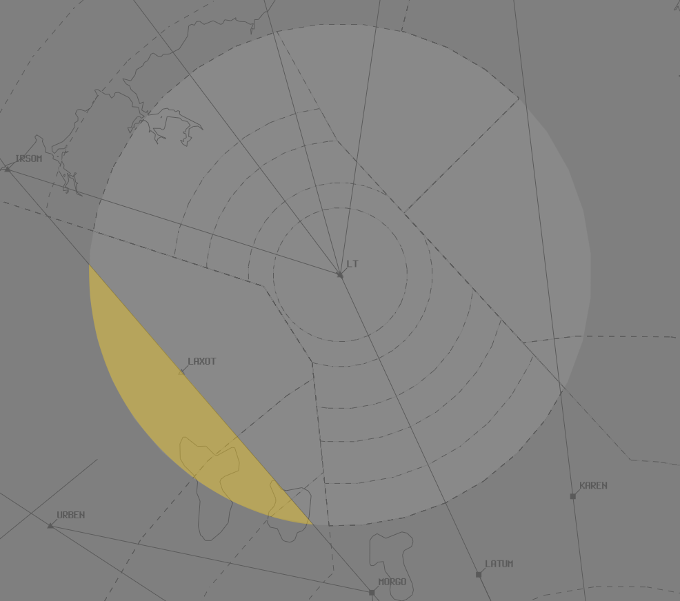

--8<-- "includes/abbreviations.md"

## Positions

| Name               | ID      | Callsign       | Frequency        | Login ID              |
| ------------------ | --------------| -------------- | ---------------- | ---------------------|
| **Hobart Approach**  | **HBA** | **Hobart Approach**  | **125.550**       | **HB_APP**    |
| **Launceston Approach**  | **LTA** | **Launy Approach**   | **123.800**        | **LT_APP**                 |

!!! Note
    HBA may elect to extend to LTA and vice versa, callsigns remain the same. See [Controller Skills](../controller-skills/extending.md) for details.

## Airspace
**LTA** owns the airspace `SFC` to `F245` within a 30nm radius of the LT VOR. LT ADC owns the Class D airspace within LT CTR `SFC` to `A015` when open.  

**HBA** owns the airspace `SFC` to `F245` within the remainder of the Tasmania TMA (shown below). HB ADC owns the Class D airspace within HB CTR `SFC` to `A015` (north of runway centreline) and `A025` (south of runway centreline) when open. 

<figure markdown>
{ width="700" }
</figure>

### LTA Release to HUO
The Airspace on and west of the IRSOM-MORGO track `F125`-`F245` is permanently released from LTA to HUO, unless coordinated otherwise.

<figure markdown>
{ width="500" }
  <figcaption>LTA Release</figcaption>
</figure>

## YMHB
All aircraft should be kept on SIDs and STARs. If due to operational requirements or routing, an aircraft is unable to accept the SID or STAR, voice coordination with HUO will be required.

## YMLT
Visual approaches are preferred into YMLT. If due to operational requirements, an aircraft is unable to accept a visual approach, coordination with **LT ADC** may be required.  

Runway 32L is regularly the duty runway due to prevailing winds. To assist traffic flow in and out of the TCU, ATC will instruct aircraft to track for runway 32L via one of the following routes:

| Via              | Routing      |
| ------------------ | --------------|
| IRSOM  | NODAS MLTSC |
| NUNPA  | ELREL MLTSA |

These routes keep arrivals within CTA and away from the departure stream(s).

!!! note
    Clearing aircraft to track via one of the above routes does **not** constitute a voiceless coordination route between LTA and LT ADC. Aircraft should still be heads-up coordinated to LT ADC prior to **5 minutes** to the boundary, unless coordinated otherwise.

## YCBG
Aircraft inbound to YCBG who will track via the HBA CTA should be issued an airways clearance by HBA, then passed to HB ADC when appropriate. HBA must coordinate any clearance limits issued to HB ADC. 

Aircraft inbound to YCBG who will track directly from Class G airspace to the CTR should contact HB ADC for clearance.

## Coordination

### Enroute
#### Departures
Voiceless for all aircraft:

- Assigned the lower of `F240` or the `RFL`; and  
- Tracking via a Procedural SID terminus

All other aircraft going to HUO CTA must be **Heads-up** Coordinated by TAS TCU prior to the boundary.

!!! phraseology
    **LTA** -> **HUO**: "via IRSOM, QFA114, with your concurrence, will be assigned F150, for my separation with ZYX"  
    **HUO** -> **LTA**: "QFA114, concur F150"

#### Arrivals
Voiceless for all aircraft:

- With ADES **YMLT** 
  - Tracking from **IRSOM** or **NUNPA** DCT **LT**; and  
  - Assigned `A090`  
- With ADES **YMHB** 
  - Assigned the **IPLET** or **MORGO** STAR; and  
  - Assigned `F130`  

All other aircraft coming from HUO CTA will be **Heads-up** Coordinated to TAS TCU.

### HBA
#### Airspace
HB ADC owns the Class D airspace in the HB CTR `SFC` to `A015` north of the runway centreline and `A025` south of the runway centreline. HBA owns the Class D and C airspace above these levels.

#### Departures
'Next' coordination is **not** required from HB ADC for aircraft that are:   
  a) Departing from a runway nominated on the ATIS; and  
  b) Assigned the standard assignable level; and  
  c) Assigned a **Procedural** SID; or  
  d) Not entering HBA CTA

The Standard Assignable level from HB ADC to HBA is:  
For IFR Aircraft: `A080`  
For VFR Aircraft: The lower of `A045` or the `RFL`.

!!! note
    All departures from YCBG who will enter the HBA CTA will be Next coordinated by ADC.

##### Airways Clearance
**HB SMC** shall give heads-up coordination to HBA controller prior to the issue of the following clearances:  
a) VFR Departures  
b) Aircraft using a runway not on the ATIS

#### Arrivals
HBA will coordinate all YMHB & YCBG arrivals to HB ADC prior to **5 mins** from the boundary. This coordination shall be as per [Standard Heads-up format](../../controller-skills/coordination/#heads-up), with the addition of:

- Runway, if other than duty runway  
- Approach type, unless specifically nominated on the ATIS  
- IFR circuit joining instructions, if not on straight-in instrument approach

!!! phraseology
    **HBA** -> **HB ADC**: "via BUSKA, QJE1789, for the ILS”  
    **HB ADC** -> **HBA**: "QJE1789, ILS"

### LTA
#### Airspace
LT ADC owns the Class D airspace in the LT CTR `SFC` to `A015`. LTA owns the Class D and C airspace above `A015`.

#### Departures
'Next' coordination is **not** required from LT ADC for aircraft that are:   
  a) Departing from a runway nominated on the ATIS; and  
  b) Assigned the standard assignable level; and  
  c) Assigned a **Procedural** SID

The Standard Assignable level from LT ADC to LTA is:  
For IFR Aircraft: `A080`  
For VFR Aircraft: The lower of `A045` or the `RFL`.

#### Arrivals
LTA will coordinate all YMLT arrivals to LT ADC prior to **5 mins** from the boundary. This coordination shall be as per [Standard Heads-up format](../../controller-skills/coordination/#heads-up), with the addition of:

- Runway, if other than duty runway  
- Approach type, unless specifically nominated on the ATIS  
- IFR Circuit joining instructions, if not on Straight-in instrument approach

!!! phraseology
    **LTA** -> **LT ADC**: "via IRSOM, JST416, for the DGA, will join left downwind 32L”  
    **LT ADC** -> **LTA**: "JST416"

### LTA/HBA Internal
All aircraft transiting between internal TAS TCU boundaries must be heads-up coordinated.

!!! phraseology
    **HBA** -> **LTA**: "via LATUM, AM773"  
    **LTA** -> **HBA**: "AM773, F130"