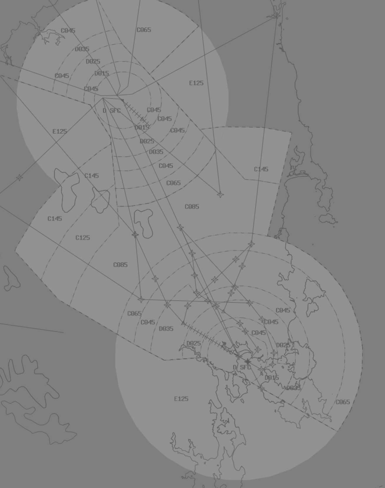

--8<-- "includes/abbreviations.md"

## Positions

| Name               | ID      | Callsign       | Frequency        | Login Identifier              |
| ------------------ | --------------| -------------- | ---------------- | ---------------------|
| Hobart Approach  | HBA | Hobart Approach  | 125.550       | HB_APP    |
| Launceston Approach  | LTA | Launy Approach   | 123.800        | LT_APP                 |

!!! Note
    Hobart Approach may extend to Launceston Approach and vice versa, callsigns remain the same.

## Airspace
The TAS TCU has an upper limit of FL245 within the following area:

<figure markdown>
{ width="700" }
</figure>

## Hobart
All aircraft should be kept on SIDs and STARs. If due to operational requirements or routing, an aircraft is unable to accept the SID or STAR, Voice Coordination with HUO will be required.

## Launceston
Visual approaches are preferred into Launceston. If due to operational requirements, an aircraft is unable to accept a visual approach, Coordination with **LT ADC** may be required.  

Runway 32L is preferred geographically. To assist traffic flow in and out of the TCU, ATC will instruct aircraft to track for 32L via IRSOM, NODAS, MLTSC which keeps the aircraft within CTA and away from the departures stream.

## Coordination

### TAS TCU / ENR
#### Departures
The Standard Assignable level from HBA/LTA to HUO is the lower of `F240` or the `RFL`, and tracking via a SID terminus.

Any aircraft not meeting the above criteria must be prior coordinated to HUO.

!!! example
    **LTA** -> **HUO**: "via IRSOM, QFA114, with your concurrence, will be assigned F150, for my separation with ZYX"  
    **HUO** -> **LTA**: "QFA114, concur F150"  

#### Arrivals
The Standard assignable level from HUO to HBA/LTA is:  
`A090` for YMLT arrivals, tracking IRSOM DCT LT, or NUNPA DCT LT.  
`F130` for YMHB arrivals, and assigned the IPLET # or MORGO # STAR.

All other aircraft must be voice coordinated to HBA/LTA.

### HB ADC / HBA
#### Auto Release

"Next" Coordination to HBA is required for all deps not assigned a SID.

"Next" Coordination is a procedure where the **HB ADC** controller gives a heads-up to the HBA controller about an impending departure not on a SID. The HBA controller will respond by assigning a visual heading to the aircraft, for the **HB ADC** controller to pass on with their takeoff clearance.

!!! example
    **HB ADC** -> **HBA**: "Next, ABC"  
    **HBA** -> **HB ADC**: "ABC, Heading 150 Visual"  
    **HB ADC** -> **HBA**: "Heading 150 Visual, ABC"  
    **HBA** -> **ABC**: "ABC, Assigned heading right 150 Visual, Runway 12, Cleared for Takeoff"  
    **ABC** -> **HBA**: "Right heading 150 Visual, Runway 12, Cleared for Takeoff, ABC"  
    `AIP GEN 3.4`

The HBA controller can suspend/resume Auto Release at any time, with the concurrence of **HB ADC**.

!!! Note
    "Next" Coordination to HBA is not required for aircraft assigned a **Procedural SID** and the Standard Assignable Level.

The controller assuming responsibility of **HB ACD** shall give heads-up coordination to HBA controller prior to the issue of the following clearances:  
a) VFR Departures  
b) Aircraft using a runway not on the ATIS

#### Arrival Coordination
HBA will coordinate all **non-STAR** arrivals 5min from IAF or 5min from CTA boundary prior to handing over to tower in the following format:

- Callsign
- Inbound Radial/Procedure
- Assigned Level
- Sequence Number (if applicable)

!!! example
    **HBA** -> **HB ADC**: "JST419, RNAV-Z 12 via HBZWG, 5000ft, number 1”  
    **HB ADC** -> **HBA**: "JST419"

### LT ADC / LTA

#### Taxi Call
A taxi call shall be made between LT ADC and LTA as an aircraft is given taxi clearance. Center will respond by acknowledging the callsign and activating FDR.

!!! example
    **LT ADC** -> **LTA**: "Taxis QFA400 for YSSY via NOLAN"  
    **LTA** -> **LT ADC**: "QFA400"  

#### Next Call
A next call is made for all aircraft when they are next to depart and will be departing within two minutes. LTA will respond by either acknowledging the callsign or offering a higher level. Any higher level issued will be passed along in the takeoff clearance. If the controller is in a high workload environment, a next call may be omitted, in favour of taxi and departure coordination.

!!! example
    **LT ADC** -> **LTA**: "Next QFA400"  
    **LTA** -> **LT ADC**: "QFA400, FL140"  
    **LT ADC** -> **LTA**: "FL320, QFA400"  

#### Arrival Coordination
LTA will coordinate all arrivals into Launceston Prior to handing over to tower in the following format:

- Callsign
- Inbound Radial/Procedure
- Assigned Level
- Sequence Number (if applicable)

!!! example
    **LTA** -> **LT ADC**: "JST416, RNAV-Z 14R via MLTNE, 5000ft, number 1”  
    **LT ADC** -> **LTA**: "JST416"