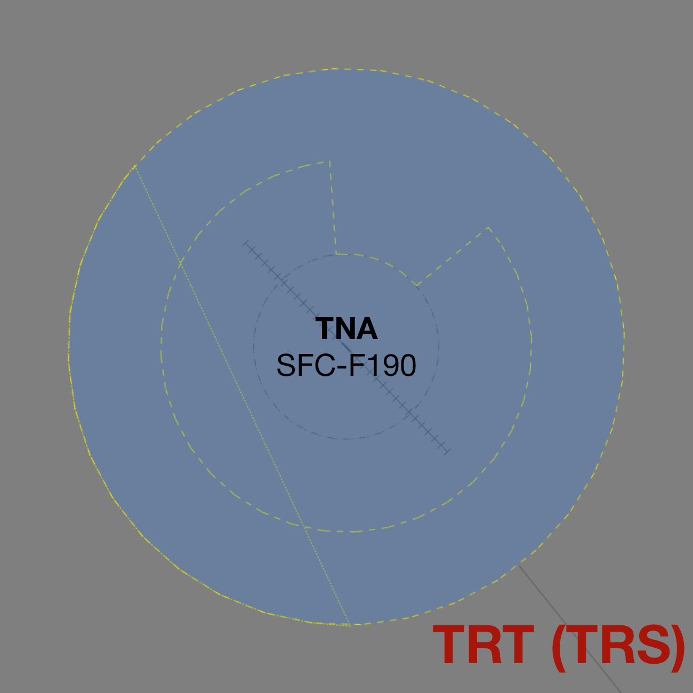
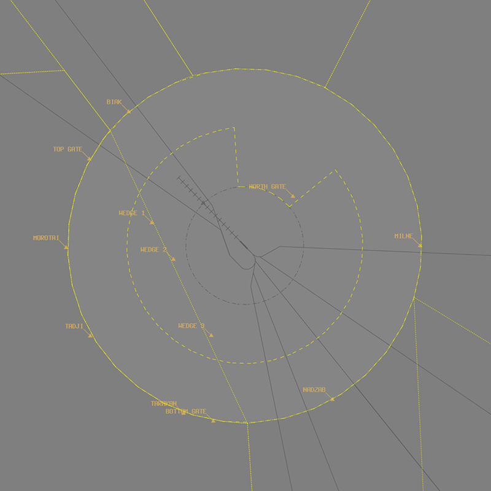
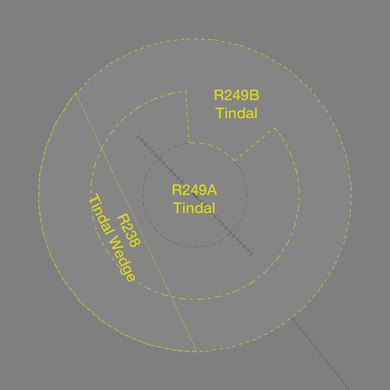
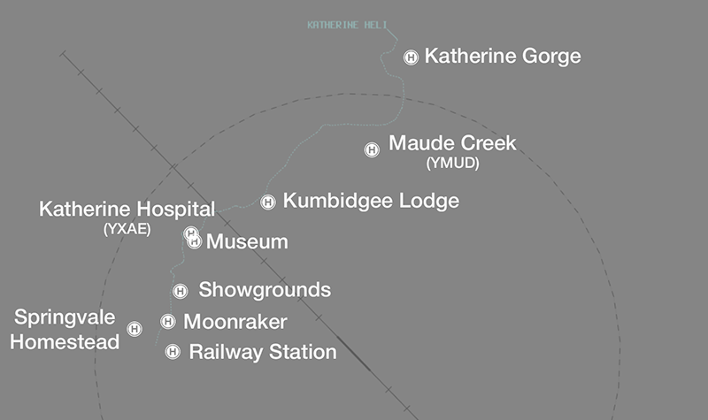

--8<-- "includes/abbreviations.md"

## Positions

| Name                          | ID      | Callsign                | Frequency   | Login ID      |
| ----------------------------- | ------- | ----------------------- | ----------- | ------------- |
| **Tindal Approach**           | **TNA** | **Tindal Approach**     | **120.950** | **TN_APP**    |

!!! note
    Tindal TCU is a [joint military/civil TCU](../../controller-skills/military/#military-aerodromes) and procedures can differ significantly to those in a civil TCU. Ensure you are familiar with the [military controller skills](../../controller-skills/military) necessary to provide a quality service.

## Airspace
TN TCU owns the Class C and G airspace within 30 DME TN from `SFC` to `F190`.

<figure markdown>
{ width="700" }
  <figcaption>TN TCU Structure</figcaption>
</figure>

### Restricted Area Activations
When **TNA** is online, the following [restricted areas](../../controller-skills/sua/#restricted-areas) are [activated](../../controller-skills/sua/#activation-of-sua) by default, and reclassified as Class C airspace.

- R249A `A015`-`A025`
- R249B `A025`-`F190`

#### SUA in Enroute Airspace
Military operations taking place in SUA in enroute airspace are outside the jurisdiction of TN TCU.

Upon receiving [airways clearance coordination from ACD](#acd-to-tn-tcu) of an aircraft intending to operate in a currently inactive SUA in enroute airspace, TN TCU must give **heads up** coordination to relevant enroute controllers.

This gives the enroute controller sufficient time to assess the request, make necessary adjustments to any aircraft in the area currently, and activate the SUA; or alternately to refuse the activation request before the aircraft is in the air.

!!! phraseology
    *CLAS35 is requesting clearance to operate in the R225D restricted area.*  
    **TN ACD** -> **TNA**: "CLAS35 requests clearance to R225D”  
    **TNA** -> **TN ACD**: "Standby, call you back."  
     
    **TNA** -> **TRS**: "On the groud YPTN, CLAS35, requests activation of R225D `A095-F600`, from 0300 until 0500.”  
    **TRS** -> **TNA**: "CLAS35, expect activation of R225D `A095-F600` at 0300 until 0500."   
    **TNA** -> **TRS**: "CLAS35."   
      
    **TNA** -> **TN ACD**: "CLAS35, clearance approved."   
    **TN ACD** -> **TNA**: "Clearance approved, CLAS35"  
	
!!! note
    The requirement to coordinate activation of an SUA is in **addition** to existing coordination requirements. [**Heads-up** coordination](#departures) is still required for these aircraft if they do not meet the voiceless coordination criteria.

##### Bradshaw/Delamere Active
When either the [Bradshaw Field Training Area](../../enroute/brisbane/TRT/#bradshaw-field-training-area-sua) or [Delamere Air Weapons Range](../../enroute/brisbane/TRT/#delamere-air-weapons-range-sua) SUAs are active, aircraft intending to operate in the [R225D restricted area](../../enroute/brisbane/TRT/#r225a-f-and-r250-tindal) must be notified when given clearance.

!!! phraseology
    *CLAS35 is has departed YPTN and is approaching MOROTAI for entry to the R225D restricted area*  
    **TNA**: "CLAS35, cleared R225D restricted area, number 2 in the area, area QNH 1013, Delamere Active. Advise ops normal time.”  

## Local Procedures
### Initial Pitch Procedures
The [intial points](../../controller-skills/military/#initial-and-pitch) are aligned with Taxiway A at the following locations.

| RWY  | Initial Point | Altitude |
| ---- | ------------- | -------- |
| 14   | 3NM downwind  | `A020`   |
| 32   | 3NM downwind  | `A020`   |

### Coded Clearances
Aircraft departing to certain defined groups of SUA may be cleared via a coded clearance.

| Coded Clearance | Restricted Areas |
| --------------- | ---------------- |
| B F M           | R225D, R238, and R250 |
| A C M           | R225B, R225D, R238, and R250 |
| Falconer        | R225D, R225F, R232, R238, and R250 |
| Western         | R225A-F, and R250 |
| Eastern         | R226A and R226B |

[Coordination](#acd-to-tn-tcu) may be required with TN TCU prior to issuing clearance to an aircraft intending to operate in an SUA.

!!! phraseology
    *CLAS21 plans to operate within R226A and R226B for military training.*  
    **TN ACD**: "CLAS21, cleared Eastern via [MILNE](#military-gates), climb to `F180`, squawk 6003, departure frequency 120.95"

### Military Gates
There are numerous [military gates](../../controller-skills/military/#military-gates) established throughout the TN TMA to facilitate entry and exit to adjoining SUA.

<figure markdown>
{ width="700" }
  <figcaption>TN SUA Gates</figcaption>
</figure>
    
If the pilot **does not** nominate a gate, or nominates a gate that does not provide access to their intended SUA, TN TMA should clear the aircraft to depart via the **appropriate gate**.

| Intended SUA    | TCU Exit Gate       |
| --------------- | ------------------- |
| R225 (and adjacent SUA) | MOROTAI TARAKAN  |
| R226            | MILNE               |
| R238            | WEDGE 1-3           |

!!! tip
    [Coordination requirements](#acd-to-tn-tcu) exist between ACD and TCU when aircraft are requesting clearance to operate in an SUA that has not been activated. Controllers performing the role of ACD should ensure they coordinate with TCU before providing clearance.

### Special Use Airspace
<figure markdown>
{ width="700" }
  <figcaption>Notable SUA in the TN TMA</figcaption>
</figure>

#### R238 Tindal Wedge
The R238 Tindal Wedge [restricted area](../../controller-skills/sua/#restricted-areas) is a minor segment in the east of the TN TMA, `A035-NOTAM`. Aircraft will generally enter and exit the restricted via a [WEDGE military gate](#military-gates).

The restricted area is rarely activated in isolation as it significantly disrupts military traffic intending depart the TN TMA via the MOROTAI or TARAKAN gates, and traffic returning to base via TOP or BOTTOM gate.

#### R249A-B Tindal
The R249A and R249B Tindal [restricted areas](../../controller-skills/sua/#restricted-areas) are contained entirely within TN TCU airspace. The areas are [activated by default](#restricted-area-activations) when TNA is online.
	
### Stereo Approaches
In times of heavy military traffic, TN TCU may choose to nominate [stereo approaches](../../controller-skills/military/#stereo-approaches) as the preferred approach method. When stereo approaches have been nominated, the ATIS [APCH EXP field must be updated](../../aerodromes/classc/Tindal/#approach-types) accordingly.

Aircraft arriving from TOP gate and BOTTOM gate will join the stereo approach at the gate; aircraft arriving from the east may be directed to join the approach via NORTH gate.

!!! phraseology
    *CLAS35 is returning from R225D via TOP gate, and has already been identified. Runway 32 is in use.*   
    **CLAS35**: "Tindal Approach, CLAS35. `F170` visual, for stereo approach with information A."  
    **TNA**: "CLAS35, Tindal Approach, cleared stereo approach. At 11 TACAN TDL contact Tower, 119.7"  
    **CLAS35**: "Cleared stereo approach, contact Tower at 11 TACAN TDL, CLAS35"

### VFR Corridor
#### Katherine Helicopter Corridor
The Katherine Helicopter Corridor facilitates helicopter movement between private helipads at:

- Katherine Railway Station
- Springvale Homestead
- Moonraker
- Katherine Showgrounds
- Katherine Hospital (YXAE)
- Katherine Museum
- Kumbidgee Lodge
- Maude Creek Airstrip (YMUD)
- Katherine Gorge Helipad

It extends 1NM either side of the Victoria Highway from the Katherine Railway Station to the Stuart Highway, then 1NM either side of the Katherine River north to Katherine Gorge.

<figure markdown>
{ width="700" }
  <figcaption>Katherine Helicopter Corridor</figcaption>
</figure>

Helicopters using the corridor to transit between the above approved helipads do not require explicit clearance; clearance is implied by approval to 'report airborne'. 

!!! phraseology
    **XYZ**: "Tindal Approach, helicopter XYZ, at Katherine Showgrounds, for Katherine Gorge."  
    **TNA**: "XYZ, Tindal Approach, report airborne."   
	**XYZ**: "Wilco, XYZ."  
	
Helicopters intending to use the corridor to access any other location need to receive explicit clearance.

!!! phraseology
    **DEF**: "Tindal Approach, helicopter DEF, at Katherine Showgrounds, for the Katherine Country Club."  
    **TNA**: "DEF, Tindal Approach, cleared via helicopter corridor, not above `A010`. Report airborne."   
	**DEF**: "Cleared helicopter corridor, not above `A010`, wilco, DEF."  

#### Victoria Highway Corridor
A VFR lane is available following the Victoria Highway, allowing aircraft to transit underneath the [R250 restricted area](../../enroute/brisbane/TRT/#r225a-f-and-r250-tindal) from north to south (or vice versa). It follows the Victoria Highway southwest of Katherine and is wholly contained within the [D209 danger area](../../controller-skills/sua/#danger-areas) `SFC-A025`. A clearance is **not** required to track via the corridor.

| Direction | Routing | Altitude |
| --- | --- | --- |
| Northbound | WAYS WILE RESC | `SFC-A025` |
| Southbound | RESC WILE WAYS | `SFC-A025` |

Aircraft intending to enter TN CTA require a clearance once clear of the lane.

!!! phraseology
    **ABC**: "Tindal Approach, ABC, Cessna 172 at RESC, `A015`, for YPTN, received A."  
    **TNA**: "ABC, Tindal Approach, squawk 0412, remain outside controlled airspace."   
	**ABC**: "Squawk 0412, remain outside controlled airspace, ABC."   
	  
	**TNA**: "ABC, identified, cleared to YPTN direct, maintain `A015`, QNH 1013."   
	**ABC**: "Cleared to YPTN direct, maintain `A015`, QNH 1013, ABC."

## Coordination
### Enroute
#### Departures
Voiceless for all aircraft:

- Tracking via a Procedural SID terminus; and  
- Assigned the lower of `F180` or the `RFL`.

!!! note
    Aircraft are *not required* to be tracking via the **SID procedure**, simply tracking via any of the terminus waypoints (regardless of *departure airport* or *assigned SID*) is sufficient to meet the criteria for **voiceless coordination**.

All other aircraft going to TRT(TRS) CTA must be **Heads-up** coordinated by TN TCU prior to the boundary.

!!! phraseology
    **TNA** -> **TRS**: "CFH29, request DCT YDLW"  
    **TRS** -> **TNA**: "CFH29, concur DCT YDLW"  

#### Arrivals/Overfliers
Voiceless for all aircraft:

- Tracking via **TN**; and  
- Assigned the lower of `F130` or the `RFL`.

All other aircraft coming from TRT(TRS) CTA will be **Heads-up** coordinated to TN TCU.

### TN ADC
[Next](../controller-skills/coordination.md#next) coordination is required from TN ADC to TN TCU for all aircraft.

The Standard Assignable level from TN ADC to TN TCU is:

| Aircraft | Level |
| ----- | ---- |
| All | The lower of `F180` and `RFL` |

#### ACD to TN TCU
The controller assuming responsibility of **ACD** shall give [heads-up](../../../controller-skills/coordination/#airways-clearance) coordination to TNA (or the enroute controller responsible for the TN TCU) prior to the issue of a clearance to an aircraft intending to operate in an SUA that **has not** been activated. 

!!! phraseology
    **TN ACD** -> **TNA**: "CLAS35 requests clearance to R225D”  
    **TNA** -> **TN ACD**: "CLAS35, clearance approved."  

## Charts
!!! abstract "Reference"
    In addition to the civilian `ERSA` and `AIP` publications, [the RAAF AIP website](https://ais-af.airforce.gov.au/australian-aip){target=new} contains the necessary charts (available in the TERMA) and description of procedures (in each airports' FIHA).
