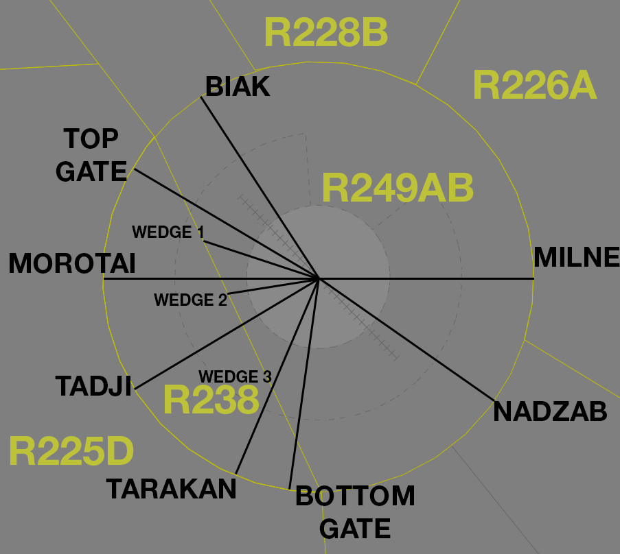

--8<-- "includes/abbreviations.md"

## Positions

| Name               | Callsign       | Frequency        | Login ID              |
| ------------------ | -------------- | ---------------- | --------------------------------------|
| **Tindal Approach**    | **Tindal Approach**   | **120.95** | **TN_APP** |

## Airspace
TN APP being online will activate the following Airspace by default:

- TN MIL CTR `SFC`-`A025`
- R249A `A015`-`A025`
- R249B `A025`-`F190`
- R238 `A035`-`F190`

All of which are reclassified as **Class C** when active, and TN APP has Control Authority of.

!!! note
    TN APP may increase the upper limit of the Restricted Areas and their airspace. This must be either published by NOTAM, or negotiated with TRT(TRS) if online.

## Charts
!!! note
    Additional charts to the AIP may be found in the RAAF TERMA document, available towards the bottom of [RAAF AIP page](https://ais-af.airforce.gov.au/australian-aip){target=new}

## Arrival/Departure Gates
There are 11 gates to facilate departues and arrivals from the TN Training Airspace, based on the TDL TACAN.  
Departing aircraft will be cleared to track direct to the gate, or allowed to intercept the outbound radial by 10 DME.  
Arrivals can be cleared via the appropriate gate for their return to YPTN.

| Gate Name | Ident | Bearing (°M) | Distance (nm) | Restricted Area |
| ------ | ----------| ----------| ----------| ----------|
| BIAK     | BIA | 320 | 30 | N/A |
| TOP GATE     | TOP | 300 | 30 | R225D |
| MOROTAI     | MOR | 270 | 30 | R225D |
| TADJI     | TAD | 240 | 30 | R225D |
| TARAKAN     | TAR | 200 | 30 | R225D |
| BOTTOM GATE     | BOM | 190 | 30 | R225D |
| NADZAB     | NAD | 150 | 30 | N/A |
| MILNE     | MIL | 090 | 30 | R226A |
| WEDGE 1     | W1 | 285 | 16 | R238 |
| WEDGE 2     | W2 | 260 | 12 | R238 |
| WEDGE 3     | W3 | 200 | 16 | R238 |

<figure markdown>
{width="700"}
  <figcaption>Tindal Gates</figcaption>
</figure>

!!! phraseology 
    CLAS35 has completed operations in R225, and is requesting return to YPTN via TARAKAN Gate.  
    **TN TCU**: "CLAS35, cleared to YPTN via TARAKAN, thence TN. When ready descend to F130"   

Place/Bearing Distance points in the FDR can be used for routing via the gates, with **TN** as the reference point, in the format PPPPBBBDDD.

!!! example 
    MOROTAI = TN270030  
    NADZAB = TN150030  

## Stereo Approaches (Fast Jet Aircraft)
Fast jet aircraft typically transit from the SUA to YPTN at `F170`. When requested, or advised via ATIS, the stereo approach may be utilised to facilitate aircraft recovery.

!!! tip
    See [Controller Skills](../controller-skills/military.md#stereo-approaches) for more details about stereo approaches.

!!! Example
**CLAS45**: "Tindal Approach, CLAS45, RTBing via BOM, runway 32"
**TN TCU**: "CLAS45, Tindal Approach, cleared stereo approach runway 32, via BOM, descend not below 'A050'"  
**CLAS45**: "Cleared stereo approach runway 32, descend not below 'A050', CLAS45"

!!! note
    Stereo approach charts are available in the [RAAF TERMA](https://ais-af.airforce.gov.au/australian-aip){target=new}.

## Coordination
### TRT(TRS)
#### Airspace
Any airspace releases from the default setup must be coordinated and agreed upon with TRT(TRS). It is also good practice to remind them of any airspace releases that may be active due to NOTAMs.

#### Departures
Voiceless for all aircraft:

- Tracking via a Procedural SID terminus; and  
- Assigned the lower of `F180` or the `RFL`

!!! note
    Aircraft are *not required* to be tracking via the **SID procedure**, simply tracking via any of the terminus waypoints (Regardless of *departure airport* or *assigned SID*) is sufficient to meet the criteria for **voiceless coordination**

All other aircraft going to TRT CTA must be **Heads-up** Coordinated by TN TCU prior to the boundary.

!!! phraseology
    **TN TCU** -> **TRS**: "DRGN48, request DCT BEBEX"  
    **TRS** -> **TN TCU**: "DRGN48, concur DCT BEBEX"  

#### Arrivals/Overfliers
Voiceless for all aircraft:

- Tracking via **TN**; and  
- Assigned the lower of `F130` or the `RFL`.

All other aircraft coming from TRT(TRS) CTA will be **Heads-up** Coordinated to TN TCU.

### TN ADC
'Next' coordination is required from TN ADC to TN TCU for all aircraft.

!!! phraseology
    **TN ADC** -> **TN TCU**: "Next, ASY01, runway 32"  
    **TN TCU** -> **TN ADC**: "ASY01, Assigned Heading Right 030, unrestricted"  
    **TN ADC** -> **TN TCU**: "Assigned Heading Heading Right 030, ASY01"  

The Standard Assignable level from TN ADC to TN TCU is the lower of `F180` or the `RFL`.