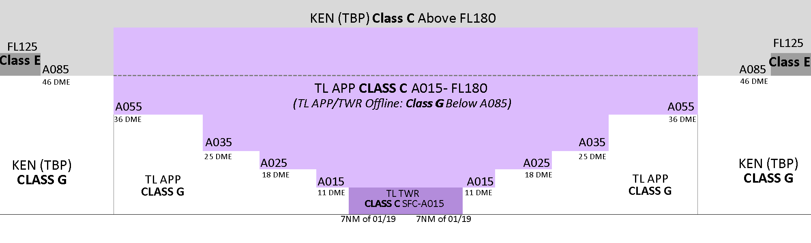

--8<-- "includes/abbreviations.md"

## Positions

| Name               | Callsign       | Frequency        | Login Identifier              |
| ------------------ | -------------- | ---------------- | --------------------------------------|
| Townsville Approach    | Townsville Approach   | 126.800         | TL_APP                                   |

## Airspace
### TCU
TL TCU owns the Class C and G airspace within 36 DME TL from `SFC` to `F180`

<figure markdown>
{ width="2000" }
  <figcaption>TL ADC/TCU Airspace Structure</figcaption>
</figure>

### ADC
TL ADC owns the Class C airspace in the TL CTR (Extends to 7NM from the thresholds of Runway 01/19) from `SFC` to `A015`. This airspace is designed to facilitate Helicopter Traffic and Ciruit Traffic.

## Charts
!!! note
    Additional charts to the AIP may be found in the RAAF TERMA document, available towards the bottom of [RAAF AIP page](https://ais-af.airforce.gov.au/australian-aip){target=new}

## Coordination
### Enroute
#### Departures
The Standard assignable level from TL TCU to TBP is the lower of `F180` or the `RFL`. All other aircraft must be voice coordinated. 

!!! example
    **TL TCU** -> **TBP**: "JST729, with your concurrence, will be assigned `F160`, for my separation with QLK327D"  
    **TBP** -> **TL TCU**: "JST729, concur `F160`"  

#### Arrivals
The Standard assignable level from TBP to TL TCU is `A100`, and assigned a STAR. All other aircraft must be voice coordinated.

### ADC
#### Airspace
TL ADC owns the Class C airspace in the TL CTR from `SFC` to `A015`.

#### Auto Release  
'Next' coordination is **not** required from TL ADC to TL TCU for aircraft that are:  
a) Departing from a runway nominated in the ATIS; and  
b) Assigned the standard assignable level;  
c) Assigned a **Procedural** SID  

!!! example
    **TL ADC** -> **TL TCU**: "Next, DNGO05, runway 19"  
    **TL TCU** -> **TL ADC**: "DNGO05, Assigned Heading Left 150, unrestricted"  
    **TL ADC** -> **TL TCU**: "Assigned Heading Left 150, DNGO05"  

The Standard Assignable level from TL ADC to TL TCU is the lower of `F180` or the RFL.