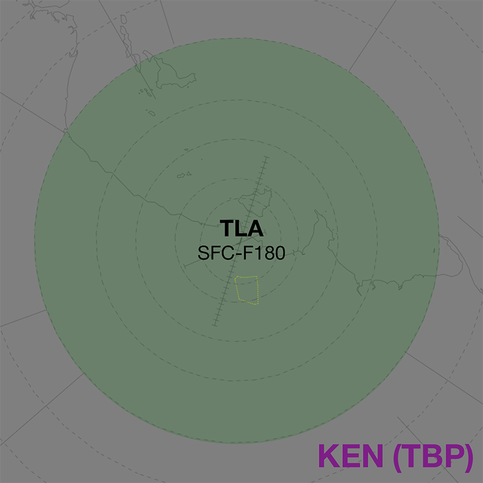
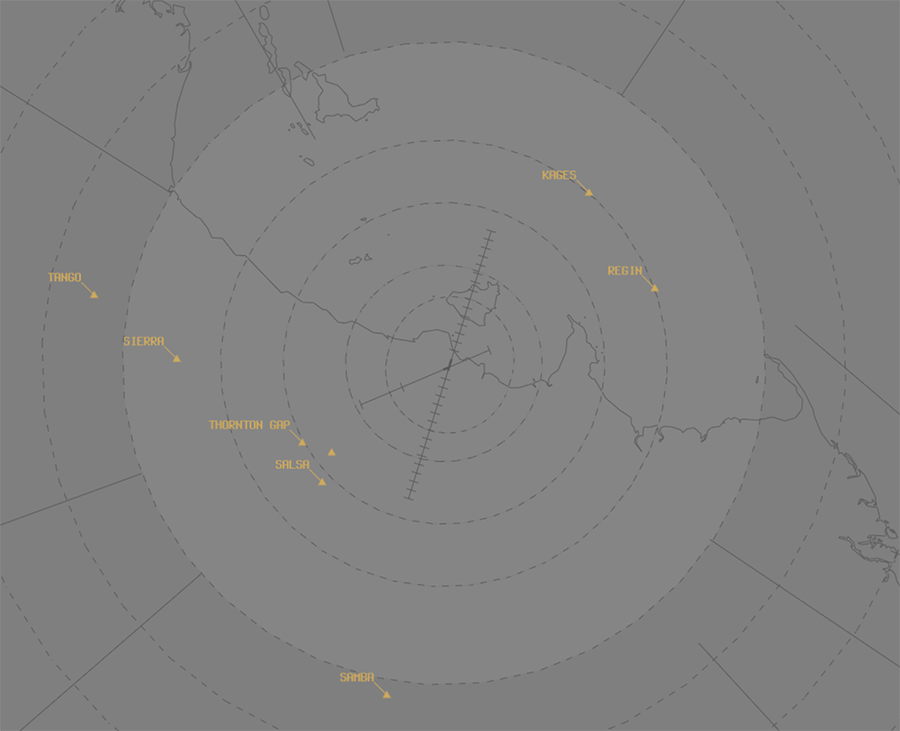
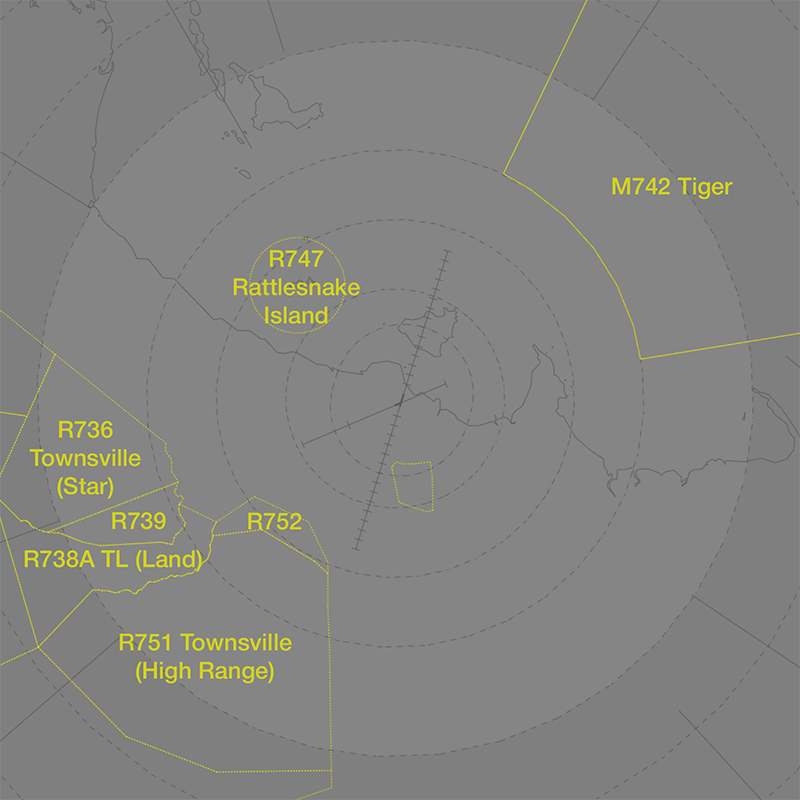

--8<-- "includes/abbreviations.md"

## Positions

| Name                          | ID      | Callsign                | Frequency   | Login ID      |
| ----------------------------- | ------- | ----------------------- | ----------- | ------------- |
| **Townsville Approach**       | **TLA** | **Townsville Approach** | **126.800** | **TL_APP**    |

!!! note
    Townsville TCU is a [joint military/civil TCU](../../controller-skills/military/#military-aerodromes) and procedures can differ significantly to those in a civil TCU. Ensure you are familiar with the [military controller skills](../../controller-skills/military) necessary to provide a quality service.

## Airspace
TL TCU owns the Class C and G airspace within 36 DME TL from `SFC` to `F180`

<figure markdown>
{ width="952" }
  <figcaption>TL TCU Structure</figcaption>
</figure>

### TL ADC
TL ADC owns the Class C airspace in the TL MIL CTR `SFC` to `A015`. 

### Restricted Area Activations
There are no [restricted areas or MOAs](../../controller-skills/sua) activated by default when TLA is online.

#### SUA in Enroute Airspace
Military operations taking place in SUA in enroute airspace are outside the jurisdiction of TL TCU.

Upon receiving [airways clearance coordination from ACD](#acd-to-tl-tcu) of an aircraft intending to operate in a currently inactive SUA in enroute airspace, TL TCU must give **heads up** coordination to relevant enroute controllers.

This gives the enroute controller sufficient time to assess the request, make necessary adjustments to any aircraft in the area currently, and activate the SUA; or alternately to refuse the activation request before the aircraft is in the air.

!!! phraseology
    *PTHR11 is requesting clearance to operate in the R560A restricted area.*  
    **TL ACD** -> **TLA**: "PSSM31 requests clearance to M742”  
    **TLA** -> **TL ACD**: "Standby, call you back."  
    
    **TLA** -> **TBP**: "On the groud YBTL, PSSM31, requests activation of M742 `A040-F240`, from 0300 until 0500.”  
    **TBP** -> **TLA**: "PSSM31, expect activation of M742 `A040-F240` at 0300 until 0500."   
    **TLA** -> **TBP**: "PSSM31."   
    
    **TLA** -> **TL ACD**: "PSSM31, clearance approved."   
    **TL ACD** -> **TLA**: "Clearance approved, PSSM31"  

!!! note
    The requirement to coordinate activation of an SUA is in **addition** to existing coordination requirements. [**Heads-up** coordination](#departures) is still required for these aircraft if they do not meet the voiceless coordination criteria.

## Local Procedures
### Initial and Pitch
The [intial points](../../controller-skills/military/#initial-and-pitch) are 5NM from the ARP, displaced 1,000 feet laterally to the dead side of the runway, `A025`.

Aircraft arriving Runway 19 should be assigned either a **left initial** or **right initial**; a straight initial is not available due to high terrain over Magnetic Island.

Aircraft arriving Runway 01 should be assigned either a **left initial**, **standard right initial**, or **close right initial**. On a close right initial aircraft will track north of Mt Stuart, as opposed to aircraft tracking on a standard right initial, who pass Mt Stuart to the south.

### Military Gates
There are numerous [military gates](../../controller-skills/military/#military-gates) established throughout the WLM TCU to facilitate entry and exit to adjoining SUA.

<figure markdown>
{ width="700" }
  <figcaption>TL SUA Gates</figcaption>
</figure>
    
If the pilot **does not** nominate a gate, or nominates a gate that does not provide access to their intended SUA, TL ACD should clear the aircraft to depart via the **appropriate gate**.

| Intended SUA    | TCU Exit Gate        | TCU Entry Gate |
| --------------- | -------------------- |
| M742            | KAGES *(RWY 01 DEP)* REGIN *(RWY 19 DEP)* | REGIN *(RWY 01 ARR)* KAGES *(RWY 19 ARR)* |
| R736            | TANGO | SIERRA |
| R738A-H         | TANGO | SIERRA |
| R738G-H         | TANGO | SIERRA |
| R732            | TANGO | SIERRA |
| R739            | TANGO | SIERRA |
| R747            | *N/A* | *N/A* |
| R751            | TANGO | SALSA (if R752 inactive) JOCKO (if R752 active) |
| R752            | TANGO | JOCKO |

!!! tip
    [Coordination requirements](#acd-to-tl-tcu) exist between ACD and TCU when aircraft are requesting clearance to operate in an SUA that has not been activated. Controllers performing the role of ACD should ensure they coordinate with TCU before providing clearance

### Special Use Airspace
<figure markdown>
{ width="700" }
  <figcaption>Notable SUA in the TL TCU</figcaption>
</figure>

#### D764 Townsville 
The D764 Townsville [danger area](../../controller-skills/sua/#danger-areas), also known as the **Bluewater Training Area**, is a commonly used training area west of YBTL.

Aircraft departing to the training area will be cleared a ['BLUEWATER' clearance](../../aerodromes/classc/Townsville/#bluewater-clearance). This clearance gives aircraft permission depart the TL MIL CTR, and transit to the D764 danger area via the appropriate track while remaining OCTA.

| Duty RWY | Direction | Tracking | Notes |
| -------- | --------- | --------------- | ----- | 
| RWY 01   | Outbound  | YBTL-via coast remaining over land-D764 | Not above `A015` until within D764 |
| RWY 01   | Inbound   | D764-YBU-YBTL   | |
| RWY 19   | Outbound  | YBTL-YBU-D764   | Not above `A015` until within D764 |
| RWY 19   | Inbound   | D764-via coast remaining over land-YBTL | |

Aircraft intending to return to YBTL from the training area will contact TAL if intending to transit above `A015` (within TCU CTA). All other aircraft will remain OCTA and request inbound clearance directly from TL ADC.

!!! phraseology
    **ABC**: "Townsville Approach, ABC within D764, for YBTL, request clearance at `A035`.”   
    **TL ACD**: "ABC, Townsville Approach, cleared BLUEWATER, maintain `A035`. Abeam MBKR contact Townsville Tower on 118.3"   
    **ABC**: "Cleared Bluewater, Maintain `A035`, abeam MBKR contact Townsville Tower 118.3, ABC."  

!!! note
    TAL shall write the coded clearance in the **global ops field** prior to issuing clearance, for the awareness of other controllers.

#### M742 Tiger
The M742 Tiger [MOA](../../controller-skills/sua/#military-operating-areas) is located off the coast, `A040-F240`, spanning both TL TCU and KEN(TBP) airspace.

Aircraft will generally enter and exit the MOA via the appropriate [military gate](#military-gates).

#### R736 & R739 Townsville (Star)
The R736 and R739 Townsville (Star) [restricted areas](../../controller-skills/sua/#restricted-areas) straddle the border of the TL TCU and KEN(TBP) airspace. 

It is predominantly used for military training operations, including operations at the Star Landing Area ALA (YSTD).

Aircraft will generally enter and exit the MOA via the appropriate [military gate](#military-gates).

##### Affected Civil Operations
When R739 is activated above `A060` it disrupts aircraft tracking via the CATEY SID. Aircraft may be given an additional requirement to climb above the vertical limits of the activation, or rerouted manually to avoid the area.

!!! phraseology
	*UTY640 has departed YBTL RWY 01 on the CATEY SID, bound for YCCY. The R739 restricted area has been activated `SFC-A085`.*   
    **TAL**: "UTY640, Townsville Approach, identified. Climb via SID to `F180`, requirement to reach `A100` by ENSOM."   
    **UTY640**: "Climb via SID to `F180`, requirement to reach `A100` by ENSOM, UTY640."  

#### R738A-H Townsville (Land)
The R738A-H Townsville (Land) [restricted areas](../../controller-skills/sua/#restricted-areas), also known  as the Townsville Field Training Area, is a series of defined airspace volumes west of YBTL, `A070-NOTAM`.

The area is used for a wide array of military training operations, including supersonic flight, air-to-air combat training, and live fire exercises. The extent of activation required will vary according to each operation, but will generally include R738A or R738B, along with an additional larger subsection.

Aircraft will generally enter and exit the MOA via the appropriate [military gate](#military-gates).

##### Affected Civil Operations
Activation of R738A disrupts aircraft tracking via the CATEY SID. Aircraft intending to depart via CATEY should [instead be cleared](../../aerodromes/classc/Townsville/#catey-departures) via CARMN (to the north) or ANRUB (to the south).
	
#### R747 Rattlesnake Island
The R747 Rattlesnake Island [restricted area](../../controller-skills/sua/#restricted-areas) is defined by a 5nm radius circle with RKI at the centre, `SFC-NOTAM`. The area is predominantly used for ground, amphibious, and helicopter gunnery training.

When activated, the restricted area prevents aircraft from tracking via the [RATTLESNAKE](../../aerodromes/classc/Townsville/#ypam-traffic) coded clearance to YPAM. These aircraft must be given alternate tracking instructions to avoid the SUA.

#### R751 & R752 Townsville (High Range)
The R751 and R752 Townsville (High Range) [restricted areas](../../controller-skills/sua/#restricted-areas) is located in the south-west of TCU, spanning both TL TCU and KEN(TBP) airspace.

Aircraft will generally enter and exit the MOA via the appropriate [military gate](#military-gates).

#### R768A Mt Stuart
The R768A Mt Stuart [restricted area](../../controller-skills/sua/#restricted-areas) is a non-flying SUA located on the south boundary of the TL MIL CTR, `SFC-A020`. It is activated daily from 2100-1200 UTC.

All instrument approaches for Runway 01 and Runway 19 SIDs are procedurally separated from the restricted area. All other aircraft should be [separated](../../controller-skills/sua/#controlled-airspace), when activated.

## Flow
### Local Knowledge
- Aircraft may be assigned the Papa STAR to reduce track miles
- During VMC by day, aircraft may be instructed to track for a visual base to either runway
- With RWY 01 in use, small non-jet aircraft may be processed to RWY 07 via either a VSA or RNP

### Flow Tables
The tables below give an estimated time **in minutes** from the **Feeder Fix** to the **Threshold**.

=== "Jets & DH8D"
    | STAR         | RWY 01 | RWY 19 |
    | ------------ | :----: | :----: |
    | **IBUXI A**  | 16     | -      |
    | **IBUXI Z**  | -      | 11^    |
    | **IGIKI A** *Feeder Fix: 36 DME TL*  |  14    |  -     |
    | **POROB A**  | 13     | -      |
    | **POROB B**  | -      | 13     |
    | **POROB P**  | 11^    | 11^    |
    | **POROB Z**  | -      | 13     |
    | **VOMPA A**  | 10^    | -      |
    | **VOMPA B**  | -      | 15     |
    | **VOMPA P**  | 10^    | 13     |
    | **VOMPA Z**  | -      | 15     |

=== "Non-Jets"
    | STAR         | RWY 01 | RWY 19 |
    | ------------ | :----: | :----: |
    | **IBUXI A**  | 19     | -      |
    | **IBUXI Z**  | -      | 12^    |
    | **IGIKI A** *Feeder Fix: 36 DME TL*  |  16     |  -     |
    | **POROB A**  | 14     | -      |
    | **POROB B**  | -      | 15     |
    | **POROB P**  | 12^    | 13^    |
    | **POROB Z**  | -      | 14     |
    | **VOMPA A**  | 11^    | -      |
    | **VOMPA B**  | -      | 17     |
    | **VOMPA P**  | 11^    | 15     |
    | **VOMPA Z**  | -      | 16     |

#### Corrections

| Situation | Correction |
| ----- | ----- |
| Assigned a reduced speed | +1 min, *except ^* | 
| Over 40kt of head/tailwind component | +1 min for headwind -1 min for tailwind |

#### Assumptions
- Nil wind
- The feeder fix for all STARs is the waypoint coinciding with the title of the STAR, except:
    - The feeder fix for the IGIKI STAR is 36 DME TL (where it intersects with the STAR track)

### Calculator

The following calculator will generate a landing time from a feeder fix ETA, or the reverse.

=== "Landing Time"
    

=== "Feeder Fix Time"
    

## Coordination
### Enroute
#### Departures
Voiceless for all aircraft:

- Tracking via a Procedural SID terminus; and  
- Assigned the lower of `F180` or the `RFL`

All other aircraft going to TBP CTA must be **Heads-up** Coordinated by TL TCU prior to the boundary.

!!! phraseology
    **TLA** -> **TBP**: "JST729, with your concurrence, will be assigned `F160`, for my separation with QLK327D"  
    **TBP** -> **TLA**: "JST729, concur `F160`"  

#### Arrivals
Voiceless for all aircraft:

- With ADES **YBTL**; and  
- Assigned a STAR; and  
- Assigned `A090`

All other aircraft coming from TBP CTA will be **Heads-up** Coordinated to TL TCU.

### TL ADC
#### Airspace
TL ADC owns the Class C airspace in the TL CTR from `SFC` to `A015`.

#### Auto Release  
[Next](../controller-skills/coordination.md#next) coordination is **not** required from TL ADC to TL TCU for aircraft that are:  

- Departing from a runway nominated in the ATIS; and  
- Assigned the standard assignable level; and 
- Assigned a **Procedural** SID 

All other aircraft require a 'Next' call to TL TCU.

The Standard Assignable level from TL ADC to TL TCU is:

| Aircraft | Level |
| ------ | ------- |
| All | The lower of `F180` and `RFL` |

#### ACD to TL TCU
The controller assuming responsibility of **ACD** shall give [heads-up](../../controller-skills/coordination/#airways-clearance) coordination to TLA (or the enroute controller responsible for the TL TCU) prior to the issue of a clearance to an aircraft intending to operate in an SUA that **has not** been activated. 

!!! phraseology
    **TL ACD** -> **TLA**: "PSSM31 requests clearance to M742”  
    **TLA** -> **TL ACD**: "PSSM31, clearance approved."
    

## Charts
!!! abstract "Reference"
     In addition to the civilian `ERSA` and `AIP` publications, [the RAAF AIP website](https://ais-af.airforce.gov.au/australian-aip){target=new} contains the necessary charts (available in the TERMA) and description of procedures (in each airports' FIHA).