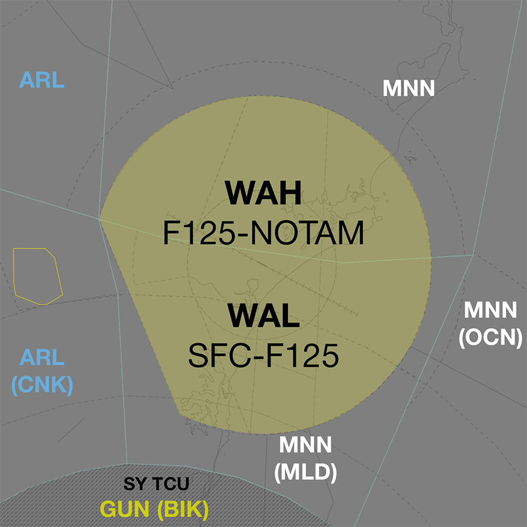
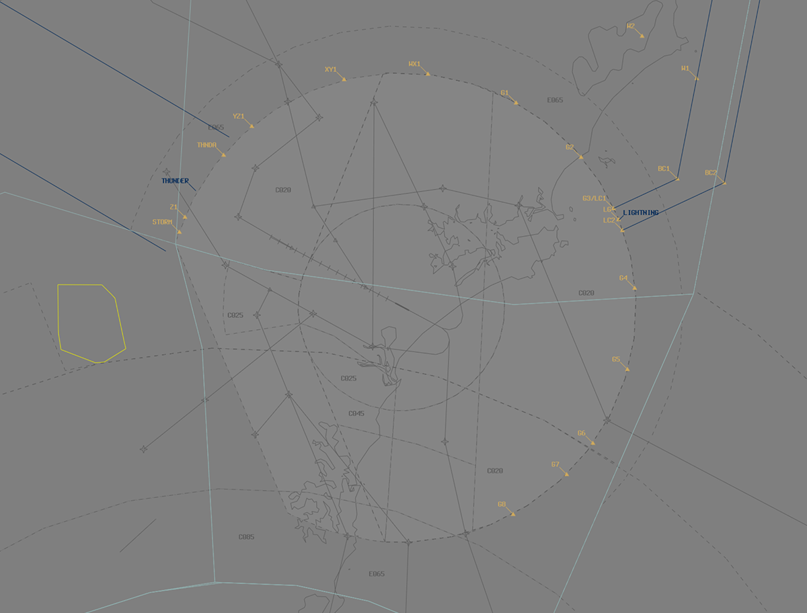
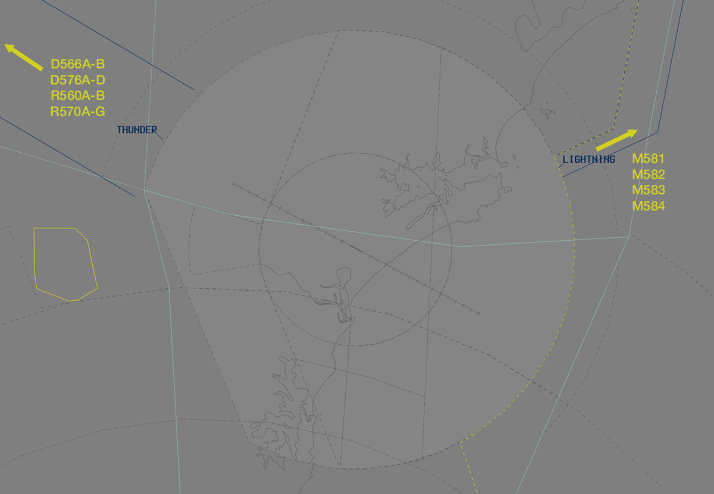
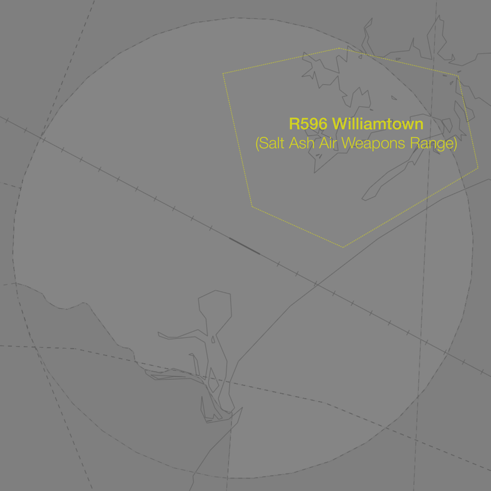

--8<-- "includes/abbreviations.md"

## Positions

| Name                          | ID      | Callsign                | Frequency   | Login ID      |
| ----------------------------- | ------- | ----------------------- | ----------- | ------------- |
| **Williamtown Approach**      | **WAL** | **Willy Approach**      | **135.700** | **WLM_APP**   |
| Williamtown Approach (High) :material-information-outline:{ title="Non-standard position"} | WAH | Willy Approach | 133.300 | WLM-H_APP |

!!! abstract "Non-Standard Positions"
    :material-information-outline: Non-standard positions may only be used in accordance with [VATPAC Air Traffic Services Policy](https://vatpac.org/publications/policies){target=new}.  
    Approval must be sought from the **bolded parent position** prior to opening a Non-Standard Position, unless [NOTAMs](https://vatpac.org/publications/notam){target=new} indicate otherwise (eg, for events).
    
!!! note
    Williamtown TCU is a [joint military/civil TCU](../../controller-skills/military/#military-aerodromes) and procedures can differ significantly to those in a civil TCU. Ensure you are familiar with the [military controller skills](../../controller-skills/military) necessary to provide a quality service.

## Airspace
WLM TCU owns the airspace within the WLM MIL CTR `SFC` to `F125`.

<figure markdown>
{ width="952" }
  <figcaption>WLM TCU Structure</figcaption>
</figure>

### WLM ADC
WLM ADC is responsible for the airspace within the WLM MIL CTR A from `SFC` to `A015`.

### Airspace Division
**WAL** owns the WLM TCU airspace `SFC` to `F125`.

**WAH** owns any airspace above `F125` activated by ad-hoc release with ARL or NOTAM.

!!! note
    The upper limit of **WAH** must be coordinated with ARL *prior* to the position logging on.

### Restricted Area Activations
There are no [restricted areas or MOAs](../../controller-skills/sua) activated by default when WAL is online.

#### SUA in Enroute Airspace
Most military operations will take place in SUA nearby the TCU in enroute airspace, outside the jurisdiction of WLM TCU.

Upon receiving [airways clearance coordination from ACD](#acd-to-wlm-tcu) of an aircraft intending to operate in a currently inactive SUA, WLM TCU must give **heads up** coordination to relevant enroute controllers.

This gives the enroute controller sufficient time to assess the request, make necessary adjustments to any aircraft in the area currently, and activate the SUA; or alternately to refuse the activation request before the aircraft is in the air.

!!! phraseology
    *PTHR11 is requesting clearance to operate in the R560A restricted area.*  
    **WLM ACD** -> **WAL**: "PTHR11 requests clearance to R560A via Thunder corridor.”  
    **WAL** -> **WLM ACD**: "Standby, call you back."  
    
    **WAL** -> **ARL**: "On the groud YWLM, PTHR11, requests activation of R560A `A085-F240`, from 0300 until 0500.”  
    **ARL** -> **WAL**: "PTHR11, expect activation of R560A `A085-F240` at 0300 until 0500."   
    **WAL** -> **ARL**: "PTHR11."   
    
    **WAL** -> **WLM ACD**: "PTHR11, clearance approved."   
    **WLM ACD** -> **WAL**: "Clearance approved, PTHR11"  

!!! note
    The requirement to coordinate activation of an SUA is in **addition** to existing coordination requirements. [**Heads-up** coordination](#departures) is still required for these aircraft if they do not meet the voiceless coordination criteria.

## Local Procedures
### Initial and Pitch
The [intial points](../../controller-skills/military/#initial-and-pitch) are aligned with Taxiway A at the following locations.

| RWY  | Initial Point | Altitude |
| ---- | ------------- | --------------------------- |
| 12   | South-western tip of Grahamstown Dam | `A025` (`A020` for PC21) |
| 30   | Intersection of the coast and extended Taxiway A centreline | `A025` (`A020` for PC21) |

### Military Gates
There are numerous [military gates](../../controller-skills/military/#military-gates) established throughout the WLM TCU to facilitate entry and exit to adjoining SUA.

<figure markdown>
{ width="700" }
  <figcaption>WLM SUA Gates</figcaption>
</figure>

If the pilot **does not** nominate a gate, or nominates a gate that does not provide access to their intended SUA, WLM ACD should clear the aircraft to depart via the **appropriate gate**.

| Intended SUA    | TCU Exit Gate       |
| --------------- | ------------------- |
| M581            | Gates 4-7           |
| M582            | Gate 6              |
| M583            | Lightning Gate (LG) |
| M584            | Lightning Gate (LG) |
| R585A           | Gate 1              |
| R585B           | Gate 9              |
| R585C           | Gate 10             |
| R585D           | Gate 11             |
| R586            | Gates 1-3           |

!!! tip
    [Coordination requirements](#acd-to-wlm-tcu) exist between ACD and TCU when aircraft are requesting clearance to operate in an SUA that has not been activated. Controllers performing the role of ACD should ensure they coordinate with TCU before providing clearance
    
### Military Corridors
There are two [military corridors](../controller-skills/military/#military-corridors) established around the WLM TCU to facilitate transit of military aircraft between the TCU and adjoining SUAs.

<figure markdown>
{ width="700" }
  <figcaption>WLM TCU Military Corridors</figcaption>
</figure>

These corridors are located **outside** the jurisdiction of the WLM TCU.

#### Thunder Corridor
The **Thunder Corridor** is used by aircraft to transit civilian enroute airspace between the WLM TCU and the R560 and R570 restricted areas.

Aircraft departing to the areas will be cleared the **STORM 1** coded clearance by ACD, aircraft returning to the airport will be cleared the **STORM 2** coded clearance by ARL.

Aircraft transiting the Thunder Corridor should be assigned the appropriate altitude to ensure separation with opposite direction traffic while transiting to their desired restricted area.

| Coded Clearance | Altitude |
| --------------- | -------- |
| STORM 1         | `F140`   |
| STORM 2         | `F130`   |

!!! note
    Aircraft tracking via the STORM coded clearance does **not** constitute a voiceless coordination route between WLM TCU and ARL. Aircraft should still be heads-up coordinated to ARL prior to **5 minutes** to the boundary, unless coordinated otherwise.

#### Lightning Corridor
The **Lightning Corridor** is used by aircraft to transit between the WLM TCU and the M581-M584 restricted areas. 
Aircraft will access the corridor through the **[Lightning Gate](#military-gates)** (LG) and transit the corridor before reaching their desired operating area.

The corridor itself is located entirely within SUA, and aircraft entering the corridor from WLM TCU airspace do not need to be handed off to ARL if the restricted areas are active. 

!!! phraseology
    **WAL**: "WGTL45 at LG cleared operating, report [ops normal](../controller-skills/airwork/#ops-normal) time 30."  
    **WGTL45**: "At LG cleared operating, ops normal time 30, WGTL45."  
    
Aircraft transiting the Thunder Corridor should be assigned the appropriate altitude to ensure separation with opposite direction traffic while transiting to their desired restricted area.

| Coded Clearance | Altitude | Notes |
| --------------- | -------- | ----- |
| Outbound        | `A100`-`A140` `A200`-`A240` | Aircraft will remain on local QNH above `A100` |
| Inbound         | `A050`-`A090` `A150`-`A190` | Aircraft will remain on local QNH above `A100` |

Aircraft returning to base via the corridor will contact WLM TCU prior to leaving their training area. Once the aircraft has been identified by WLM TCU, they will then pass details of their intended return.

!!! phraseology 
    **WGTL45**: "Willy Approach, WGTL45."  
    **WAL**: "WGTL45, Willy Approach, identified."   
    **WGTL45**: "Willy Approach, WGTL45. `A090` visual, for visual approach with information A."      

##### M581-M584 MOA Subsets
The M581-M584 MOAs are themselves divided into eighteen different subareas that are used to confine different operations within the area. These areas are arranged in a grid pattern and are identified by a grid reference.

| MOA | Subareas |
| ---- | ------- |
| M581 | A1, B1, and C1 |
| M582 | A2, B2, B3, C2, and C3 |
| M583 | D1-D3, and E1-E3 |
| M584 | F1-F3, and G |

WLM TCU is not responsible for assigning subareas, or ensuring separation between aircraft operations between areas.

When an aircraft has declared an intention to operate within a subarea, the WLM TCU may provide a traffic statement to help provide situational awareness to the departing aircraft.

!!! phraseology 
    **WAL**: "WGTL46 at LG cleared operating, number 2 in Bravo One and Charlie One, report [ops normal](../controller-skills/airwork/#ops-normal) time 30.
    
### Special Use Airspace
#### Salt Ash SUA
The Salt Ash Air Weapons Range is located within the WLM MIL CTR, and is used for air-surface gunnery and bombing practice. It is entirely contained within the R596 [restricted area](../../controller-skills/sua/#restricted-areas).

<figure markdown>
{ width="700" }
  <figcaption>The Salt Ash Air Weapons Range</figcaption>
</figure>

The restricted area can be activated in two configurations according to the requirements of the operation. Only VFR aircraft are permitted.

| Configuration Name | Vertical Limits  | Notes  | 
| ------------------ | ---------------- | ------ |
| R596 High          | `SFC` - `A130`   | Aircraft will remain on local QNH above `A100` |
| R596 Low           | `SFC` - `A050`   |        |

When the R596 restricted area is active all airspace within the SUA is managed by **WAL**, and the [ATIS should be updated](../../aerodromes/classc/Williamtown/#sua-activations) to reflect the activation.

### Stereo Approaches
In times of heavy military traffic, WLM TCU may choose to nominate [stereo approaches](../controller-skills/military/#stereo-approaches) as the preferred approach method. When stereo approaches have been nominated, the ATIS [APCH EXP field must be updated](../../aerodromes/classc/Williamtown/#approach-types) accordingly.

Aircraft arriving from Gates 1-4 and 6 will join the stereo approach at the gate; other aircraft may start the approach from overhead WLM TAC.

!!! phraseology
    *WGTL45 is returning from M581 via Gate 6, and has already been identified. Runway 30 is in use.*  
    **WGTL45**: "Willy Approach, WGTL45. `F150` visual, for stereo approach with information A."  
    **WAL**: "MAPL45, Willy Approach, cleared stereo approach. At 11 TACAN WLM contact Tower, 118.3"  
    **MAPL45**: "Cleared stereo approach, tower at 11 TACAN WLM, WGTL45"

## Flow
### Local Knowledge
- Aircraft may be assigned the Romeo or Victor STAR to reduce track miles
- During VMC by day, aircraft may be instructed to track for a visual base to either runway

### Flow Tables
The tables below give an estimated time **in minutes** from the **Feeder Fix** to the **Threshold**.

=== "Jets & DH8D"
    | STAR         | RWY 12 | RWY 30 |
    | ------------ | :----: | :----: |
    | **ASUVA**    | 15     | 7^     |
    | **EKIPU**    | 12^    | 11^    |
    | **IVTAG R/V** *EKIPU transition* *OVLUX transition* *PUDUT transition*    |  - - -     |  8\^ 8\^ 9^     |
    | **LAXUM A**  | 9^     | 15     |
    | **LAXUM B**  | 11^    | 18     |
    | **LAXUM R**  | 8^     | 11^    |
    | **LAXUM V**  | 8^     | 11^    |
    | **OVLUX**    | 11^    | 11^    |
    | **PUDUT**    | 9^     | 12^    |

=== "Non-Jets"
    | STAR         | RWY 12 | RWY 30 |
    | ------------ | :----: | :----: |
    | **ASUVA**    | 17     | 8^     |
    | **EKIPU**    | 13^    | 12^    |
    | **IVTAG R/V** *EKIPU transition* *OVLUX transition* *PUDUT transition*    |  - - -     |  9\^ 9\^ 10^     |
    | **LAXUM A**  | 10^    | 17     |
    | **LAXUM B**  | 12^    | 21     |
    | **LAXUM R**  | 9^     | 12^    |
    | **LAXUM V**  | 9^     | 13^    |
    | **OVLUX**    | 13^    | 13^    |
    | **PUDUT**    | 10^    | 13^    |

#### Corrections

| Situation | Correction |
| ----- | ----- |
| Assigned a reduced speed | +1 min, *except ^* | 
| Over 40kt of head/tailwind component | +1 min for headwind -1 min for tailwind |

#### Assumptions
- Nil wind
- The feeder fix for all STARs is the assigned STAR transition waypoint (if applicable), otherwise the waypoint coinciding with the STAR title

### Calculator

The following calculator will generate a landing time from a feeder fix ETA, or the reverse.

=== "Landing Time"
    

=== "Feeder Fix Time"
    

## Coordination
### ARL(All)
#### Departures
Voiceless for all aircraft:

- Tracking via a Procedural SID terminus; and  
- Assigned the lower of `F120` or the `RFL`

!!! note
    Aircraft are *not required* to be tracking via the **SID procedure**, simply tracking via any of the terminus waypoints (Regardless of *departure airport* or *assigned SID*) is sufficient to meet the criteria for **voiceless coordination**

All other aircraft going to ARL CTA must be **Heads-up** Coordinated by WLM TCU prior to the boundary.

!!! phraseology
    **WAH** -> **MLD**: "QJE1597, request DCT OMGAB"  
    **MLD** -> **WAH**: "QJE1597, concur DCT OMGAB"  

#### Arrivals/Overfliers
Voiceless for all aircraft:

- With ADES **YWLM**; and  
- Assigned a STAR; and  
- Assigned `A090`

All other aircraft coming from ARL CTA will be **Heads-up** Coordinated to WLM TCU.

### WLM ADC
#### Airspace
WLM ADC owns the airspace within the WLM MIL CTR A (`SFC`-`A015`).

#### Departures
[Next](../controller-skills/coordination.md#next) coordination is **not** required from WLM ADC to WLM TCU for aircraft that are:  

- Departing from a runway nominated in the ATIS; and  
- Assigned the standard assignable level; and 
- Assigned a **Procedural** SID

All other aircraft require a 'Next' call to WLM TCU.

The Standard Assignable level from WLM ADC to WLM TCU is:

| Aircraft | Level |
| -------- | ----- |
| All | The lower of `F120` and `RFL` | 
    
#### ACD to WLM TCU
The controller assuming responsibility of **ACD** shall give [heads-up](../controller-skills/coordination/#airways-clearance) coordination to WAL (or the enroute controller responsible for the WLM TCU) prior to the issue of a clearance to an aircraft intending to operate in an SUA that **has not** been activated. 

!!! phraseology
    **WLM ACD** -> **WAL**: "PTHR11 requests clearance to R570 via Thunder corridor.”  
    **WAL** -> **WLM ACD**: "PTHR11, clearance approved."

Most military operations will take place in SUA adjoining the [TCU in enroute airspace](#sua-in-enroute-airspace). WLM TCU must coordinate the activation of these SUAs with the relevant enroute controllers **prior** to approving any clearances.

## Charts
!!! abstract "Reference"
    In addition to the civilian `ERSA` and `AIP` publications, [the RAAF AIP website](https://ais-af.airforce.gov.au/australian-aip){target=new} contains the necessary charts (available in the TERMA) and description of procedures (in each airports' FIHA).