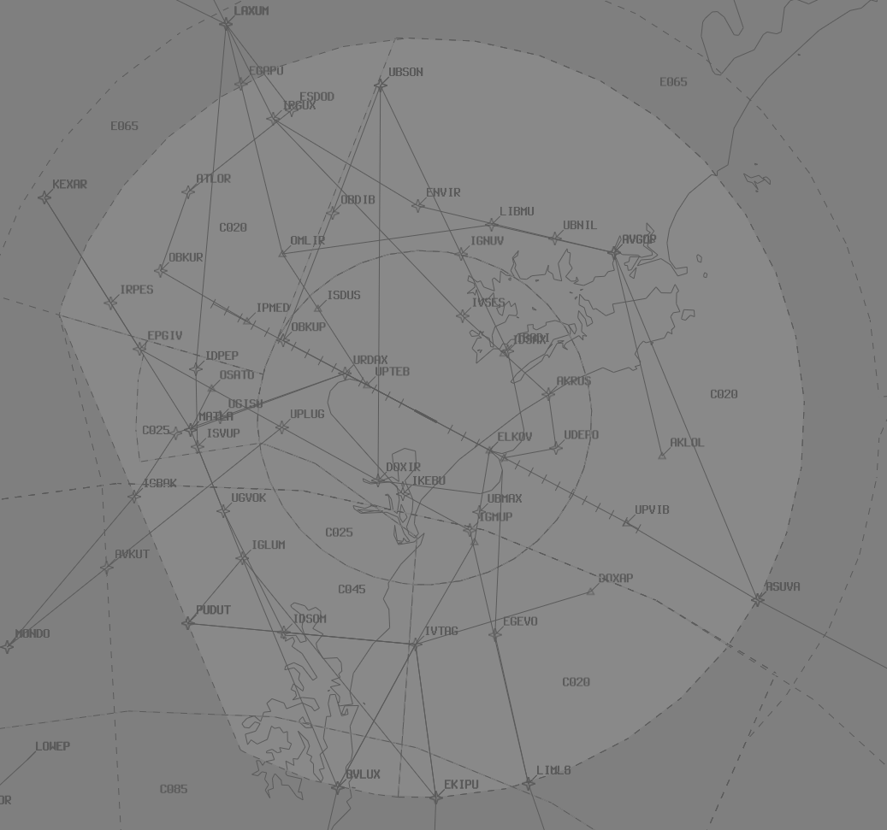

--8<-- "includes/abbreviations.md"

## Positions

| Name               | Callsign       | Frequency        | Login ID              |
| ------------------ | -------------- | ---------------- | --------------------------------------|
| **Williamtown Approach (High)**    | **Willy Approach**   | **133.300**         | **WLM_APP**                                   |
| Williamtown Approach (Low) :material-information-outline:{ title="Non-standard position"}    | Willy Approach   | 135.700         | WLM-L_APP                                   |

!!! abstract "Non-Standard Positions"
    :material-information-outline: Non-standard positions may only be used in accordance with [VATPAC Air Traffic Services Policy](https://vatpac.org/publications/policies){target=new}.  
    Approval must be sought from the **bolded parent position** prior to opening a Non-Standard Position, unless [NOTAMs](https://vatpac.org/publications/notam){target=new} indicate otherwise (eg, for events).

## Airspace
By default, WLM TCU owns the airspace from `SFC` to `F125`. In exceptional circumstances, such as specific military exercises or events, an additional TCU controller may log on, splitting the TCU vertically. In these situations, the controller should negotiate an upper limit with ARL(All) which works for both parties.
WLM TCU owns the airspace within the WLM MIL CTR `SFC` to `F125`.

When WLM TCU is active above `F125` by ad-hoc release or NOTAM, **WLM-L_APP** owns the airspace `SFC` to `F125`, while **WLM APP** owns the rest of WLM TCU airspace above `F125`. This may be adjusted as required with coordination.

When WLM TCU is active above `F125` by ad-hoc release, **WLM-L_APP** owns the airspace from `SFC` to `F125`, while **WLM_APP** owns the rest of WLM TMA above `F125`.

<figure markdown>
{ width="700" }
  <figcaption>WLM TCU Airspace</figcaption>
</figure>

!!! note
    It is the responsibility of the WLM TCU controller(s) to negotiate any airspace releases with ARL(All).

### ADC
When WLM ADC is online, they own the airspace within the WLM MIL CTR A (`SFC`-`A050`). This may be amended/released as required between **WLM ADC** and **WLM TCU**.

<figure markdown>
{ width="700" }
  <figcaption>WLM ADC Airspace</figcaption>
</figure>

## Local Procedures
### Stereo Approaches (Fast Jet Aircraft)

Fast jet aircraft typically transit from M550 to YWLM via Gate 6 at `F125`. When requested, or advised via ATIS, the stereo approach may be utilised to facilitate aircraft recovery.

!!! tip
    See [Controller Skills](../controller-skills/military.md#stereo-approaches) for more details about stereo approaches.

!!! Example
**MAPL45**: "Willy Approach, MAPL45, RTBing via G6, runway 12" 
**WLM TCU**: "MAPL45, Willy Approach, cleared stereo approach runway 12, via G6, once 9DME north of the TACAN, descend not below `A050`"  
**MAPL45**: "Cleared stereo approach runway 12, via G6, once 9DME north of the TACAN, descend not below `A050`, MAPL45"

!!! note
    Stereo approach charts are available in the [RAAF TERMA](https://ais-af.airforce.gov.au/australian-aip){target=new}.

### Initial and Pitch Procedures 
The Intial Points for RWY 12 is the SW tip of Grahamstown Dam, and RWY 30 is the coastline.

### Fast-Jet SIDs
!!! important
    These procedures are only available when the WLM TMA is extended above `F125` through NOTAM or prior coordination. ACD will ensure that the controller responsible for the WLM TMA has approved their use prior to issuing airways clearance.

The [TERMA](https://ais-af.airforce.gov.au/australian-aip) contains two SIDs for use by fast-jet aircraft, allowing them to depart via any of the nominated [SUA gates](#sua-gates).

!!! note
    These SIDs are not present in vatSys, so WLM ACD will write the name of the SID in the Global Ops Field of the FDR and amend the flight plan route to include the relevant gate, as well as any RNAV tracking points on the procedure.

Aircraft will be assigned a SID based on their cleared gate, as per below:

| Tracking Gate | SID | Initial Constraint |
| ----- | ---------| --------------- |
| G1-G2 | PEPPER  | `A080` at ERVEV |
| G3-G7 | CLASSIC | `F125` at G3-G7 |
| G9    | WLM (RADAR)    | `F125` at G9 |
| UKDIP | CLASSIC | `A090` at UKDIP |
| OLVEP | CLASSIC | `F130` at OLVEP |

See [coordination](#departures_1) for coordination requirements with ADC.

### SUA Gates
There are 8 gates to facilitate departures and arrivals into surrounding training airspace, based on the WLM TACAN. 

| Gate Name | Ident | Bearing (°M) | Distance (nm) | Restricted Area |
| ----- | ---------| --------------- | -------- | ---------------- |
| Gate 1 | G1 | 029 | 25 | R586 |
| Gate 2 | G2 | 050 | 25 | R586 | 
| Gate 3 | G3 | 068 | 25 | M550 |
| Gate 4 | G4 | 088 | 25 | M550 |
| Gate 5 | G5 | 105 | 25 | M550 |
| Gate 6 | G6 | 125 | 25 | M550 |
| Gate 7 | G7 | 135 | 25 | M550 |
| Gate 9 | G9 | 007 | 25 | R585 |
| UKDIP | UKDIP | - | - | R560 |
| OLVEP | OLVEP | - | - | R596 |

<figure markdown>
{ width="700" }
  <figcaption>WLM Gates</figcaption>
</figure>

Aircraft cleared via a gate must have their flight plan amended to reflect the new tracking point.

!!! example
    An aircraft tracking via Gate 4 would have `WLM088025` added to their route.

## Flow
### Local Knowledge
- Aircraft may be assigned the Romeo or Victor STAR to reduce track miles
- During VMC by day, aircraft may be instructed to track for a visual base to either runway

### Flow Tables
The tables below give an estimated time **in minutes** from the **Feeder Fix** to the **Threshold**.

=== "Jets & DH8D"
    | STAR         | RWY 12 | RWY 30 |
    | ------------ | :----: | :----: |
    | **ASUVA**    | 15     | 7^     |
    | **EKIPU**    | 12^    | 11^    |
    | **IVTAG R/V** *EKIPU transition* *OVLUX transition* *PUDUT transition*    |  - - -     |  8\^ 8\^ 9^     |
    | **LAXUM A**  | 9^     | 15     |
    | **LAXUM B**  | 11^    | 18     |
    | **LAXUM R**  | 8^     | 11^    |
    | **LAXUM V**  | 8^     | 11^    |
    | **OVLUX**    | 11^    | 11^    |
    | **PUDUT**    | 9^     | 12^    |

=== "Non-Jets"
    | STAR         | RWY 12 | RWY 30 |
    | ------------ | :----: | :----: |
    | **ASUVA**    | 17     | 8^     |
    | **EKIPU**    | 13^    | 12^    |
    | **IVTAG R/V** *EKIPU transition* *OVLUX transition* *PUDUT transition*    |  - - -     |  9\^ 9\^ 10^     |
    | **LAXUM A**  | 10^    | 17     |
    | **LAXUM B**  | 12^    | 21     |
    | **LAXUM R**  | 9^     | 12^    |
    | **LAXUM V**  | 9^     | 13^    |
    | **OVLUX**    | 13^    | 13^    |
    | **PUDUT**    | 10^    | 13^    |

#### Corrections

| Situation | Correction |
| ----- | ----- |
| Assigned a reduced speed | +1 min, *except ^* | 
| Over 40kt of head/tailwind component | +1 min for headwind -1 min for tailwind |

#### Assumptions
- Nil wind
- The feeder fix for all STARs is the assigned STAR transition waypoint (if applicable), otherwise the waypoint coinciding with the STAR title

### Calculator

The following calculator will generate a landing time from a feeder fix ETA, or the reverse.

=== "Landing Time"
    

=== "Feeder Fix Time"
    

## Coordination
### ARL(All)

#### Airspace
Any airspace releases from the default setup must be coordinated and agreed upon with ARL. It is also good practice to remind them of any airspace releases that may be active due to NOTAMs.

#### Departures
Voiceless for all aircraft:

- Tracking via a Procedural SID terminus; and  
- Assigned the lower of `F120` or the `RFL`

!!! note
    Aircraft are *not required* to be tracking via the **SID procedure**, simply tracking via any of the terminus waypoints (Regardless of *departure airport* or *assigned SID*) is sufficient to meet the criteria for **voiceless coordination**

All other aircraft going to ARL CTA must be **Heads-up** Coordinated by WLM TCU prior to the boundary.

!!! phraseology
    **WLM TCU** -> **MLD**: "QJE1597, request DCT OMGAB"  
    **MLD** -> **WLM TCU**: "QJE1597, concur DCT OMGAB"  

#### Arrivals/Overfliers
Voiceless for all aircraft:

- With ADES **YWLM**; and  
- Assigned a STAR; and  
- Assigned `A090`

All other aircraft coming from ARL CTA will be **Heads-up** Coordinated to WLM TCU.

### ADC
#### Airspace
WLM ADC owns the airspace within the WLM MIL CTR A (`SFC`-`A050`). This may be amended/released as required between WLM ADC and WLM TCU.

#### Departures

'Next' coordination is **not** required from WLM ADC to WLM TCU for aircraft that are:  
a) Departing from a runway nominated in the ATIS; and  
b) Assigned the standard assignable level;  
c) Assigned a **civil, procedural** SID   

[Next](../controller-skills/coordination.md#next) coordination is **not** required from WLM ADC to WLM TCU for aircraft that are:  

- Departing from a runway nominated in the ATIS; and  
- Assigned the standard assignable level; and 
- Assigned a **Procedural** SID

The Standard Assignable level from WLM ADC to WLM TCU is:

The Standard Assignable level from WLM ADC to WLM TCU is:  
a) the lower of `F120` or the `RFL`, for aircraft assigned a **civil** procedural or radar SID, or visual departure  
b) `F125`, for aircraft assigned a fast-jet SID

#### CLASSIC SID
The **CLASSIC SID** provides multiple tracking paths which pilots will take based on their departure instructions. During Next coordination with ADC, **WLM TCU** shall nominate a turn direction which will be relayed to the pilot with their takeoff clearance.
=======
| Aircraft | Level |
| ------- | ----- |
| All | The lower of `F120` and `RFL` |

#### Arrivals/Overfliers
Voiceless coordination is in place from WLM TCU to WLM ADC for arrivals cleared for an approach on to a runway nominated on the ATIS. All other aircraft and all overfliers must be heads-up coordinated as soon as practical.

!!! phraseology
    **WLM TCU** -> **WLM ADC**: "via WLM, ZULU, Close formation of 5, do you have any restrictions or requirements?"  
    **WLM ADC** -> **WLM TCU**: "ZULU, no restrictions or requirements, A040"  

## Charts
!!! abstract "Reference"
    Additional charts to the AIP may be found in the RAAF TERMA document, available towards the bottom of [RAAF AIP page](https://ais-af.airforce.gov.au/australian-aip){target=new}