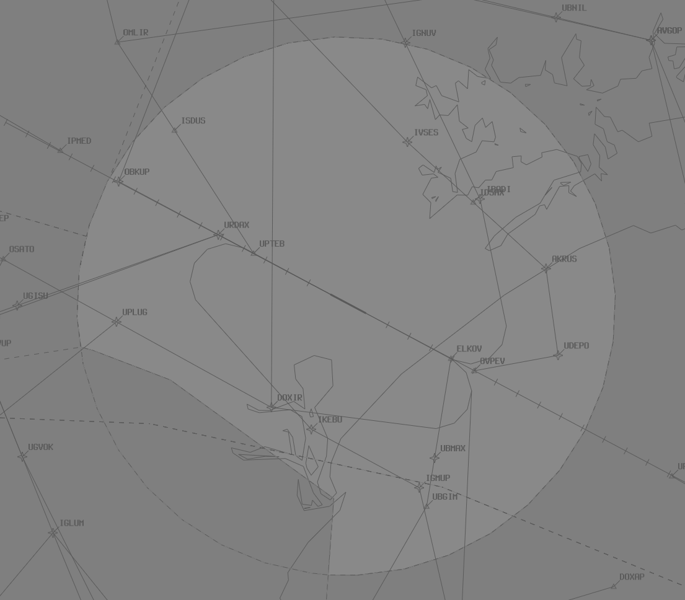

--8<-- "includes/abbreviations.md"

## Positions

| Name               | Callsign       | Frequency        | Login ID              |
| ------------------ | -------------- | ---------------- | --------------------------------------|
| **Williamtown Approach (High)**    | **Willy Approach**   | **133.300**         | **WLM_APP**                                   |
| Williamtown Approach (Low) :material-information-outline:{ title="Non-standard position"}    | Willy Approach   | 135.700         | WLM-L_APP                                   |

!!! abstract "Non-Standard Positions"
    :material-information-outline: Non-standard positions may only be used in accordance with [VATPAC Air Traffic Services Policy](https://vatpac.org/publications/policies){target=new}.  
    Approval must be sought from the **bolded parent position** prior to opening a Non-Standard Position, unless [NOTAMs](https://vatpac.org/publications/notam){target=new} indicate otherwise (eg, for events).

## Airspace
### Default
By default, the lower TMA sector is SFC to F125. The upper sector should only be activated by NOTAM or in an adhoc capacity to cater for a particular military event or exercise. In these situations, the controller should negotiate an upper limit which works for both parties.

When WLM TCU is active above F125 by ad-hoc release to cater for a military event or NOTAM, WLM-L_APP owns the airspace SFC to F125, while WLM APP owns the rest of WLM TCU airspace above F125 to a level adjusted to the needs of both parties and or required for coordination.

#### Diagram
<figure markdown>
{ width="700" }
  <figcaption>WLM TCU Airspace</figcaption>
</figure>

!!! note
    It is the responsibility of the WLM TCU controller(s) to negotiate any airspace releases with ARL(All).

### ADC
When WLM ADC is online, they own the airspace within the WLM MIL CTR A (`SFC`-`A050`). This may be amended/released as required between WLM ADC and WLM TCU.

<figure markdown>
{ width="700" }
  <figcaption>WLM ADC Airspace</figcaption>
</figure>

## Charts
!!! abstract "Reference"
    Additional charts to the AIP may be found in the RAAF TERMA document, available towards the bottom of [RAAF AIP page](https://ais-af.airforce.gov.au/australian-aip){target=new}

## Coordination
### ARL(All)

#### Airspace
Any airspace releases from the default setup must be coordinated and agreed upon with ARL. It is also good practice to remind them of any airspace releases that may be active due to NOTAMs.

#### Departures
Voiceless for all aircraft:

- Tracking via a Procedural SID terminus; and  
- Assigned the lower of `F120` or the `RFL`

!!! note
    Aircraft are *not required* to be tracking via the **SID procedure**, simply tracking via any of the terminus waypoints (Regardless of *departure airport* or *assigned SID*) is sufficient to meet the criteria for **voiceless coordination**

All other aircraft going to ARL CTA must be **Heads-up** Coordinated by WLM TCU prior to the boundary.

!!! phraseology
    **WLM TCU** -> **MLD**: "QJE1597, request DCT OMGAB"  
    **MLD** -> **WLM TCU**: "QJE1597, concur DCT OMGAB"  

#### Arrivals/Overfliers
Voiceless for all aircraft:

- With ADES **YWLM**; and  
- Assigned a STAR; and  
- Assigned `A090`

All other aircraft coming from ARL CTA will be **Heads-up** Coordinated to WLM TCU.

### ADC
#### Airspace
WLM ADC owns the airspace within the WLM MIL CTR A (`SFC`-`A050`). This may be amended/released as required between WLM ADC and WLM TCU.

#### Departures
[Next](../controller-skills/coordination.md#next) coordination is **not** required from WLM ADC to WLM TCU for aircraft that are:  

- Departing from a runway nominated in the ATIS; and  
- Assigned the standard assignable level; and 
- Assigned a **Procedural** SID

The Standard Assignable level from WLM ADC to WLM TCU is:

| Aircraft | Level |
| ------- | ----- |
| All | The lower of `F120` and `RFL` |

#### Arrivals/Overfliers
Voiceless coordination is in place from WLM TCU to WLM ADC for arrivals cleared for an approach on to a runway nominated on the ATIS. All other aircraft and all overfliers must be heads-up coordinated as soon as practical.

!!! phraseology
    **WLM TCU** -> **WLM ADC**: "via WLM, ZULU, Close formation of 5, do you have any restrictions or requirements?”  
    **WLM ADC** -> **WLM TCU**: "ZULU, no restrictions or requirements, A040"  