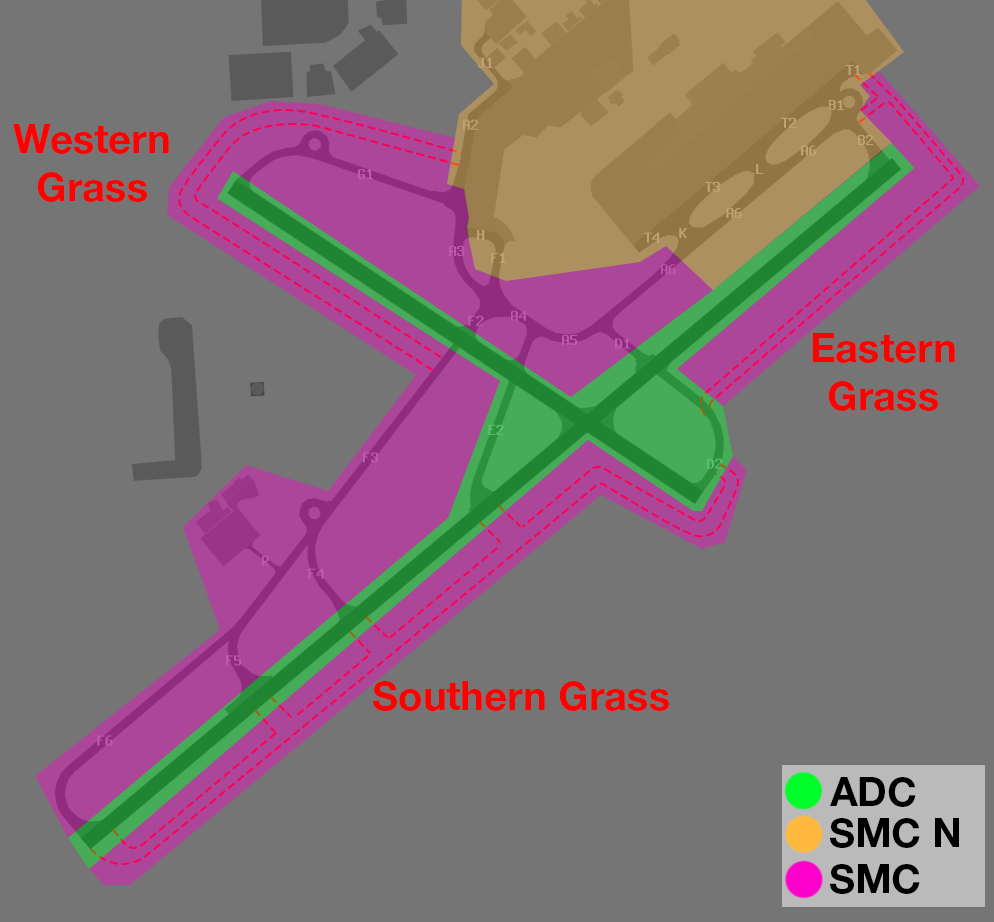

--8<-- "includes/abbreviations.md"

## Positions
An additional Non-Standard position for AD SMC will be used

| Name               | Callsign       | Frequency        | Login ID                         |
| ------------------ | -------------- | ---------------- | ---------------------------------------- |
| Adelaide SMC (North)    | Adelaide Ground  | 126.550          | **AD-N_GND**                                   |

## Runway Modes

| Priority | Mode |
| ---------- | --- |
|  1 | 23A30D |
|  2  | 05A30D |
|  3 | 05A12D |
|  4  | 23A12D |

*Single Runway* Operations shall be **avoided** at all costs.

## Airways Clearance Delivery (ACD)
### Flight Plan Compliance
Ensure **all flight plans** are checked for compliance with the approved WF Route:

`DCT AD Q33 ESP Q158 PH DCT`

### WorldFlight Teams
[WorldFlight Teams](../../#official-team-callsigns) shall have `STS/STATE` added to their remarks, and `WF TEAM` added to their Global Ops Field, to ensure they receive priority.

### Runway Selection
Aircraft that are unable to accept Runway 12/30 due to operational requirements shall be assigned Runway 05/23 (as appropriate based on Runway Mode).

### SID Selection
Runway 05/23 Departures will be assigned the standard **GILES5** SID.

Runway 12/30 Departures will be assigned the **AD4** RADAR SID, with the following Assigned Heading:

| Runway Mode | Runway 12/30 Assigned Heading |
| ---------- | --- |
| 23A30D      | Runway Heading |
| 05A30D      | H230 |
| 05A12D      | H060 |
| 23A12D      | H180 |

### PDCs
PDCs will be in use by default, to avoid frequency congestion. ACD shall send a PDC to each aircraft as they connect. Upon successful readback of the PDC, ACD shall direct the pilot to contact SMC when ready for pushback or taxi.

## Surface Movement Control (SMC)
### Areas of Responsibility
<figure markdown>
{ width="700" }
  <figcaption>YPAD SMC Areas of Responsibility</figcaption>
</figure>

### Eastern Terminal Taxi Routes
During **all** Runway Modes, aircraft shall be instructed to taxi in the following area in a **counter-clockwise** pattern. Aircraft shall be instructed to **pushback** facing **South-West** (Tail Right).

<figure markdown>
{ width="700" }
  <figcaption>Eastern Terminal Taxi Routes</figcaption>
</figure>

### Grass Taxiing
Due to limitations in the taxiway layout at YPAD, some aircraft will need to be taxied via Grass Routes, as shown below.

<figure markdown>
{ width="700" }
  <figcaption>YPAD Grass Taxi Routes</figcaption>
</figure>

### Taxi Routes

#### 23A30D
Aircraft shall taxi around the aerodrome in a **Clockwise** pattern.  
Runway 23 Arrivals will vacate **right**, and taxi via **F**, **A**, **B1** to the apron.  
Runway 30 Departures will taxi via *Eastern Grass*.  
Runway 23 Departures *(Operational Requirement)* will queue to the South West on **T**, then North East on **A**.

<figure markdown>
{ width="700" }
  <figcaption>23A30D SMC Diagram</figcaption>
</figure>

#### 05A30D
Aircraft shall taxi around the aerodrome in a **Clockwise** pattern.  
Runway 05 Arrivals will vacate **left**, and taxi via **A**, **B1** to the apron.  
Runway 30 Departures will taxi via *Eastern Grass*.  
Runway 05 Departures *(Operational Requirement)* will taxi via *Eastern Grass* and *Southern Grass*.

<figure markdown>
{ width="700" }
  <figcaption>05A30D SMC Diagram</figcaption>
</figure>

#### 05A12D
Aircraft shall taxi around the aerodrome in a **Counter-Clockwise** pattern.  
Runway 05 Arrivals will vacate **right**, and taxi via *Southern Grass* and *Eastern Grass* to join **T** at **T1**.  
Runway 12 Departures will taxi via **A** and **G1**.  
Runway 05 Departures *(Operational Requirement)* from the Eastern Terminal will taxi via **A** and **F**.  
Runway 05 Departures *(Operational Requirement)* from the Western Terminal will taxi via *Western Grass* and **F**.  

<figure markdown>
{ width="700" }
  <figcaption>05A12D SMC Diagram</figcaption>
</figure>

#### 23A12D
Aircraft shall taxi around the aerodrome in a **Counter-Clockwise** pattern.  
Runway 23 Arrivals will vacate **left**, and taxi via *Southern Grass* and *Eastern Grass* to join **T** at **T1**.  
Runway 12 Departures will taxi via **A** and **G1**.  
Runway 23 Departures *(Operational Requirement)* will queue to the South West on **T**, then North East on **A**.  
Runway 23 Departures *(Operational Requirement)* from the Western Terminal will taxi via *Western Grass* and **F3**, **F4**, Cross 23, *Southern Grass*, *Eastern Grass*, to join queue at **B2**.  

<figure markdown>
{ width="700" }
  <figcaption>23A12D SMC Diagram</figcaption>
</figure>

## Tower Control (ADC)
### Departure Spacing
Ensure that a minimum of **90 second** spacing is applied between subsequent departures from the same runway.

### Runway Vacation Directions
#### 23A30D
Landing aircraft will be instructed to vacate **right** (any exit).

#### 05A30D
Landing aircraft will be instructed to vacate **left** (any exit).

#### 05A12D
Landing aircraft will be instructed to vacate **right** via *Southern Grass* or **D2**.

#### 23A12D
Landing aircraft will be instructed to vacate **left** via *Southern Grass*.

## ATIS
When 05 is in use for Arrivals, The ATIS OPR INFO shall include:  
`EXP CLR VIA PDC. ADVISE ON FIRST CONTACT WITH DELIVERY IF YOU REQUIRE RUNWAY 05`

When 23 is in use for Arrivals, The ATIS OPR INFO shall include:  
`EXP CLR VIA PDC. ADVISE ON FIRST CONTACT WITH DELIVERY IF YOU REQUIRE RUNWAY 23`

## Coordination
### AD TCU
#### Auto Release
Standard as per [YPAD Local Instructions](../../../aerodromes/classc/Adelaide/#auto-release), with the exception of auto-release being available for **12/30 Departures** assigned the following *Standard Assignable Departure Headings*:

| Runway Mode | Runway 12/30 Assigned Heading |
| ---------- | --- |
| 23A30D      | Runway Heading |
| 05A30D      | H230 |
| 05A12D      | H060 |
| 23A12D      | H180 |