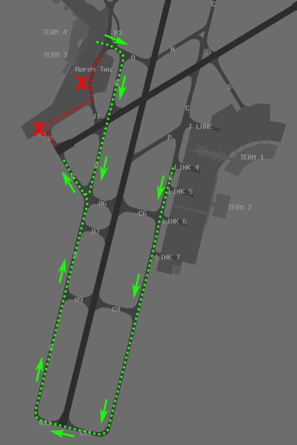

--8<-- "includes/abbreviations.md"

## Runway Modes

| Priority | Mode | Operation |
| ---------- | --- | --- |
|  1 | 24A21D | [Simultaneous Independent Crossing Runway Operations](#24a21d) |
|  2  | 03A06D | [Land and Hold Short Operations](#03a06d) |

### 24A21D
Simultaneous Independent Crossing Runway Operations will be in use, allowing aircraft to depart from Runway 21 without conflicting with Runway 24 arrivals.

Runway 21 TORA from Intersection **P** is **2000m**.  

Expect some arrivals to be landing on Runway 21 due to operational requirements.

### 03A06D
Land and Hold Short Operations (LAHSO) will be in use, allowing aircraft to land on Runway 03 without conflicting with Runway 06 departures.

Runway 03 LDA to Runway **06/24** Intersection is **2355m**.

!!! example
    **PH ADC:** "GTI1471, 737 departing on Crossing Runway. Hold Short Runway 06. Cleared to land Runway 03"  
    **GTI1471:** "Cleared to land Runway 03, GTI1471"  
    **PH ADC:** "QFA365, 747 landing on Crossing Runway will Hold Short. Runway 06, Cleared for takeoff"  
    **QFA365:** "Cleared for takeoff Runway 06, QFA365"  

Aircraft that are unable to Land and Hold Short of Runway 06 will have `XX` entered in their scratchpad by preceding controllers.

## Airways Clearance Delivery (ACD)
### Flight Plan Compliance
Ensure **all flight plans** are checked for compliance with the approved WF Route:

`DCT PH Y15 ESDEG Q587 IGLUT T58 SAPDA A585 IPKON IPKO2G`

### WorldFlight Teams
[WorldFlight Teams](../../#official-team-callsigns) shall have `STS/STATE` added to their remarks, and `WF TEAM` added to their Global Ops Field, to ensure they receive priority.

### Runway Operation Compliance
All Medium and Light aircraft are *assumed* to be compliant with both Runway Mode operations.

Heavy and Super aircraft must be **queried** if they are able to accept:

- During 03A06D, Runway 06; or
- During 24A21D, Runway 21 from Intersection **P**

Aircraft that operationally require Runway 03 shall be assigned it.

Aircraft that operationally require longer than Intersection **P** on Runway 21 shall have `FL` (Full Length) entered in their scratchpad (Can be accessed via the Flight Plan Window).

<figure markdown>
{ width="500" }
  <figcaption>Label Data Entry via Flight Plan Window</figcaption>
</figure>

### SID Selection
Non-Standard SIDs are in use for Runway 06.

| Runway | SID | Assigned Heading |
| ---------- | --- | --- |
|  03/21  | AVNEX5 | - |
|  06  | PH7 | Runway Heading |

### PDCs
PDCs will be in use by default, to avoid frequency congestion. ACD shall send a PDC to each aircraft as they connect. Upon successful readback of the PDC, ACD shall direct the pilot to contact SMC when ready for pushback or taxi.

## Surface Movement Control (SMC)

### Runway 21 Departures
By default, all aircraft will be assigned Intersection **P** for departure.

Aircraft from the Western Apron shall be taxied via **D** and **N**.

Aircraft that cannot accept Intersection **P** for departure will be assigned a **full length** departure.

### Runway 06 Departures
Ensure that all aircraft queue for Runway 06 to the South East, via **A** and **V**.

<figure markdown>
{ width="500" }
  <figcaption>Runway 06 Queue Paths</figcaption>
</figure>

This will avoid blocking up the Western Apron, and ensure aircraft have room to pushback.

### Runway 03 Arrivals
Aircraft for the Western Apron will be instructed to vacate **right**. These aircraft shall be taxied via **C**, **W** and **B** to remain clear of aircraft taxiing for departure.

## Tower Control (ADC)
### Runway 21 Full Length Departures
Full Length Departures have **equal priority** to aircraft that are compliant with Simultaneous Independent Crossing Runway Operations. However, Full Length departures may incur additional delays while being separated from Runway 24 Arrivals.

!!! tip
    Ensure the OzStrips queue bay is used actively to keep track of the queue.

### Runway 03 Arrivals
Instruct **all** Runway 03 Arrivals to vacate **right**, even if they are for the Western Apron.

### Departure Spacing
Ensure that a minimum of **90 second** spacing is applied between subsequent departures from the same runway.

## ATIS
The ATIS OPR INFO shall include:  
`EXP CLR VIA PDC`

During 24A21D, the ATIS OPR INFO shall include:  
`SIMUL INDEP CROSSING RWY OPS IN PROG`

During 03A06D, the ATIS OPR INFO shall include:  
`LAHSO IN PROG. RWY 03 LANDING DISTANCE AVBL 2355 METRES`

## Coordination
### PH ADC
#### Auto Release
Standard as per [PH TCU Local Instructions](../../../terminal/perth/#ph-adc), with the exception of auto-release being available for **06 Departures** assigned **Runway Heading** during the the [03A06D Runway Mode](#03a06d)