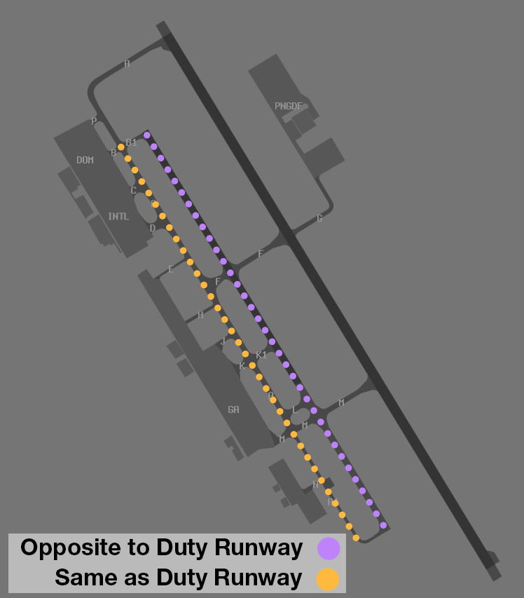

--8<-- "includes/abbreviations.md"

## Airways Clearance Delivery (ACD)
### Flight Plan Compliance
Ensure **all flight plans** are checked for compliance with the approved WF Route:

`DCT PY DCT LOTGU DCT VIPAM B220 KELPI Y89 BESBO Y177 BN DCT`

### WorldFlight Teams
[WorldFlight Teams](../../#official-team-callsigns) shall have `STS/STATE` added to their remarks, and `WF TEAM` added to their Global Ops Field, to ensure they receive priority.

### SID Selection
All aircraft shall be issued the **LOTGU1** SID.  

### PDCs
PDCs will be in use by default, to avoid frequency congestion. ACD shall send a PDC to each aircraft as they connect. Upon successful readback of the PDC, ACD shall direct the pilot to contact SMC when ready for pushback or taxi.

## Surface Movement Control (SMC)
Runway 14R/32L will be used for taxiing. The Runway is released to SMC by default.

Standard taxi directions are shown below.

<figure markdown>
{ width="700" }
  <figcaption>AYPY Standard Taxi Routes</figcaption>
</figure>

## Tower Control (ADC)
### Runway 14R/32L Release
Runway 14R/32L will be used for taxiing. The Runway is released to SMC by default.

### Departure Spacing
Ensure that a minimum of **90 second** spacing is applied between subsequent departures from the same runway.

### Wake Turbulence Separation
Due to the tight sequence, there are times that [Wake Turbulence Separation](../../../separation-standards/waketurb/#runways) cannot practically be applied.

When a following aircraft is of a *lighter* [Wake Turbulence Category](../../../separation-standards/waketurb/#categories) than the preceding aircraft, a traffic statement and wake turbulence **caution** shall be issued.

!!! example
    **AYPY ADC:** "ANG3, 747 has just landed. Caution Wake Turbulence. Runway 32L, Cleared for Takeoff"  
    **ANG3:** "Cleared for Takeoff Runway 32L, ANG3"

## Coordination
#### Auto Release
Available for aircraft assigned:

- A Runway nominated on the ATIS; and
- The **LOTGU1** SID; and
- `A080`