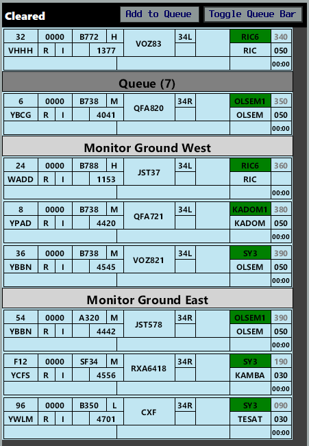

--8<-- "includes/abbreviations.md"

## Runway Modes
**16 PROPS** and **34 PROPS** are the *preferred* Runway Modes, with equal preference.

If winds dictate that 07/25 Single Runway operations are required, this is acceptable (but not preferred), as a single runway is in use for arrivals at YPAD.

## Airways Clearance Delivery (ACD)
### Flight Plan Compliance
Ensure **all flight plans** are checked for compliance with the approved WF Route:

`DCT TESAT A576 KADOM H44 BORLI W451 MIA H309 AD DCT`

### WorldFlight Teams
[WorldFlight Teams](../../#official-team-callsigns) shall have `STS/STATE` added to their remarks, and `WF TEAM` added to their Global Ops Field, to ensure they receive priority.

### Runway Selection
By default, assign aircraft the departure runway that corresponds to their departure apron (ie, **16L/34R** on *East* Apron, **16R/34L** on *West* Apron).

### SID Selection
Non-Standard SIDs are in use for Runway 16L and 34R.

| Runway | SID | Assigned Heading |
| ---------- | --- | --- |
|  16R  | GROOK1KADOM | - |
|  34L  | KADOM1 | - |
|  16L/34R  | SY3 | H120 |

### PDCs
PDCs will be in use by default, to avoid frequency congestion. ACD shall send a PDC to each aircraft as they connect. Upon successful readback of the PDC, ACD shall direct the pilot to contact Coordinator when ready for pushback or taxi.

## Coordinator
Coordinator operations shall be conducted in accordance with the Sydney Aerodrome [Coordinator](../../aerodromes/classc/Sydney.md#sydney-coordinator) procedures, using the OzStrips plugin.

!!! important
    Official WorldFlight teams should be afforded priority when requesting pushback or taxi (if no pushback required), and placed ahead of other non-official aircraft.

### OzStrips
All aerodrome controllers must be familiar with the VATPAC [recommended workflow](../../client/towerstrips.md#recommended-workflow) for OzStrips.

Coordinator must place a `MONITOR GROUND EAST` & `MONITOR GROUND WEST` bar in the **Cleared Bay Queue** and queue any aircraft who request pushback or taxi (if no pushback required) in the Cleared Bay.

<figure markdown>
{ width="500" }
</figure>

When less than **three** strips are present below a particular `MONITOR GROUND` bar, Coordinator may instruct the bottom most aircraft in the queue to monitor that SMC frequency.

<figure markdown>
{ width="500" }
    <figcaption>An example of the Coordinator layout</figcaption>
</figure>

If three strips are already present below a respective bar, any subsequent aircraft who request pushback must be instructed to remain on the Coordinator frequency, and an estimated delay given if known.

!!! example
    **QFA452**: "Sydney Coordinator, Qantas 452, bay 5, request pushback"  
    **SY COORD**: "Qantas 452, Sydney Coordinator, monitor ground 121.7"  
    ...  
    **VOZ318**: "Sydney Coordinator, Velocity 318, bay 39, request pushback"  
    **SY COORD**: "Velocity 318, Coordinator, remain this frequency, approximate 5 minute delay due traffic congestion"

!!! important
    Ensure aircraft are [squawking mode C and the correct code](../../client/towerstrips.md#strips) before instructing them to monitor ground.

## Surface Movement Control (SMC)
### Departures
With Coordinator online, aircraft will request pushback on the Coordinator frequency and be told to monitor the applicable SMC frequency when appropriate. These pilots will be waiting for you to initiate contact with them.

When workload (and holding point congestion) allows, issue pushback to the **bottom most** aircraft below the `MONITOR GROUND EAST` or `MONITOR GROUND WEST` bar (as appropriate) and move the strip to the **Pushback Bay**.

!!! important
    It is preferable to hold aircraft on the bay (where they aren't blocking taxiways or burning their holding fuel) when congestion leads to blocked holding points. Issue pushback with enough lead time to prevent large gaps in the departure sequence.

### Separation Assurance
Both SMC positions must be careful to ensure separation is assured at all times, particularly through the complex taxiway intersections at Sydney.

With runways 34L/R in use for departures, SMC East should consider instructing aircraft taxiing southbound on Charlie to initially hold short of Golf (to avoid conflict with aircraft taxiing from DOM2 and eastward). After crossing the runway, consider instructing aircraft to hold short of Bravo 10 (to avoid conflict with inbound aircraft from 34R). Inbound aircraft should be instructed to hold short of Bravo 8 (to give way to aircraft vacating 34L at the rapid exit).

During PROPS, maximum use of runway 07/25 should be utilised to enable an east/westbound split between taxiway Golf and the runway.

SMC West should protect the Alpha 2 rapid exit and utilise taxiways Yankee and Juilet as a second path for aircraft when Golf and Alpha are already occupied.

## Tower Control (ADC)

### Departure Spacing
While PROPS are in use, subsequent departures from the same runway must be spaced by **3 minutes**, to assist with arrival flow in to YPAD.

If a single runway is in use for departures, subsequent departures must be spaced by **90 seconds**.

### Runway Vacating Instructions
To avoid creating conflict for SMC, ADC shall instruct all arriving aircraft to vacate via the following exits when issued a landing clearance:

| Landing Runway | Exit |
| -------------- | ---- |
| 16R | B7 (left) or A4 (right) |
| 16L | T3 or T4 |
| 34L | A2 (left) or B9 (right) |
| 34R | T2 or U1 |

!!! example
    **SY ADC**: "JST554, vacate via B9 to the right, runway 34L, cleared to land"

## ATIS
The ATIS OPR INFO shall include:  
`EXP CLR VIA PDC, ALL ACFT EXP INTERSECTION DEPARTURE`

## Coordination
### SY ADC
#### Auto Release
Standard as per [YSSY Local Instructions](../../../aerodromes/classc/Sydney/#auto-release), with the exception of auto-release being available for the following:

- 16L/34R Departure SID: **SY3** RADAR
- 16L/34R Standard Assignable Departure Heading: **H120**