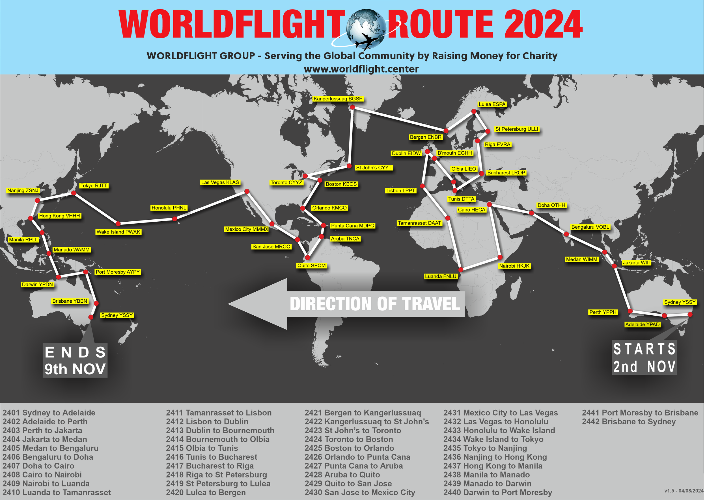

Welcome to the controller briefing material for WorldFlight! Event-specific procedures are sorted by position type and should be read in conjunction with the existing SOPs for that position/location.

# Official Team Callsigns
Official WorldFlight teams should be afforded priority at all stages of flight. **ACD** controllers should add `WF TEAM` to the Global Ops Field and `STS/STATE` to the Remarks flight plan field of any official team aircraft they issue a clearance to.

The list of callsigns is below:

| Callsign | Aircraft Type |
| -------- | ------------- |
| Qantas 25 | B744 |
| Speedbird 47C | B744 |
| Aussie 121 | A332 |
| Giant 1471 | B744 |
| New Zealand 361 | B738 |
| New Zealand 362 | B738 |
| Neptune 11W | B738 |
| Hapag-Lloyd 286 | B738 |
| United 1120 | B738 |
| United 8317 | B772 |
| JeeHell 44 | A320 |
| Covey 44N | B744 |
| Delta 1004 | B738 |
| EXS25N | B738 |
| Clipper 001 | B744 |

# Route
<figure markdown>
{ width="800" }
</figure>